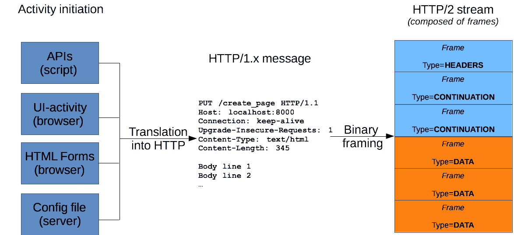
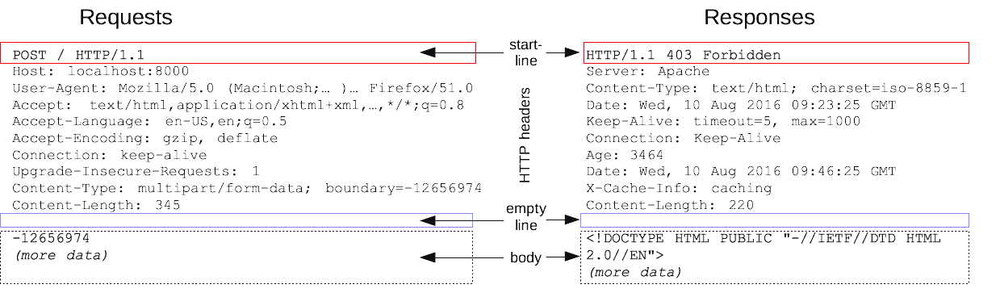
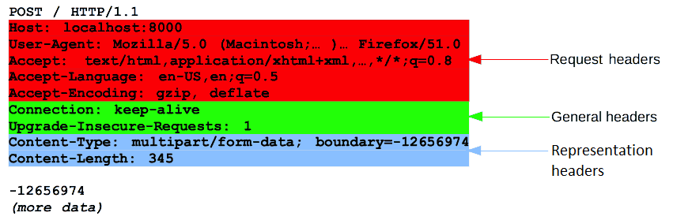
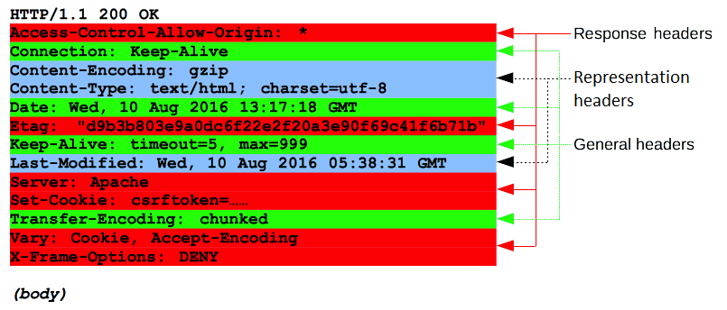
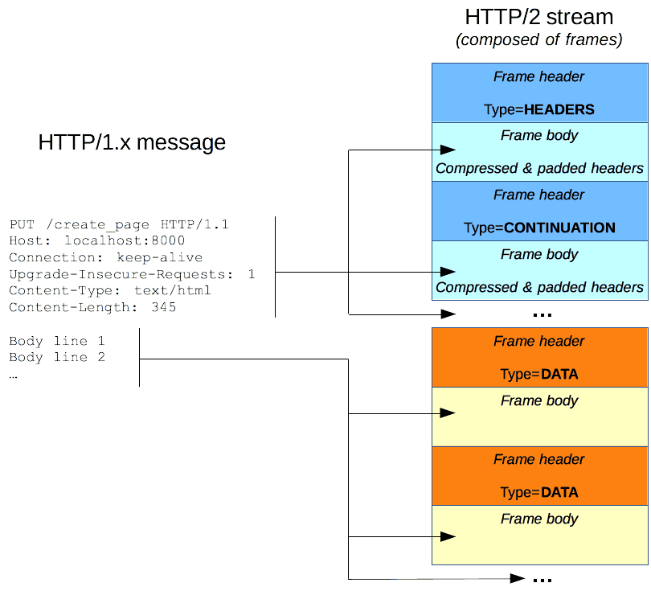

{{HTTPSidebar}}

HTTP messages are how data is exchanged between a server and a client. There are two types of messages: _requests_ sent by the client to trigger an action on the server, and _responses_, the answer from the server.

HTTP messages are composed of textual information encoded in ASCII, and span over multiple lines. In HTTP/1.1, and earlier versions of the protocol, these messages were openly sent across the connection. In HTTP/2, the once human-readable message is now divided up into HTTP frames, providing optimization and performance improvements.

Web developers, or webmasters, rarely craft these textual HTTP messages themselves: software, a Web browser, proxy, or Web server, perform this action. They provide HTTP messages through config files (for proxies or servers), APIs (for browsers), or other interfaces.

The HTTP/2 binary framing mechanism has been designed to not require any alteration of the APIs or config files applied: it is broadly transparent to the user.

HTTP requests, and responses, share similar structure and are composed of:

1. A _start-line_ describing the requests to be implemented, or its status of whether successful or a failure. This start-line is always a single line.
2. An optional set of _HTTP headers_ specifying the request, or describing the body included in the message.
3. A blank line indicating all meta-information for the request has been sent.
4. An optional _body_ containing data associated with the request (like content of an HTML form), or the document associated with a response. The presence of the body and its size is specified by the start-line and HTTP headers.

The start-line and HTTP headers of the HTTP message are collectively known as the _head_ of the requests, whereas its payload is known as the _body_.

## HTTP Requests

### Start line

HTTP requests are messages sent by the client to initiate an action on the server. Their _start-line_ contain three elements:

1. An _[HTTP method](/en-US/docs/Web/HTTP/Methods)_, a verb (like {{HTTPMethod("GET")}}, {{HTTPMethod("PUT")}} or {{HTTPMethod("POST")}}) or a noun (like {{HTTPMethod("HEAD")}} or {{HTTPMethod("OPTIONS")}}), that describes the action to be performed. For example, `GET` indicates that a resource should be fetched or `POST` means that data is pushed to the server (creating or modifying a resource, or generating a temporary document to send back).
2. The _request target_, usually a {{glossary("URL")}}, or the absolute path of the protocol, port, and domain are usually characterized by the request context. The format of this request target varies between different HTTP methods. It can be

    - An absolute path, ultimately followed by a `'?'` and query string. This is the most common form, known as the _origin form_, and is used with `GET`, `POST`, `HEAD`, and `OPTIONS` methods.
      - `POST / HTTP/1.1`
      - `GET /background.png HTTP/1.0`
      - `HEAD /test.html?query=alibaba HTTP/1.1`
      - `OPTIONS /anypage.html HTTP/1.0`
    - A complete URL, known as the _absolute form_, is mostly used with `GET` when connected to a proxy.
      `GET https://developer.mozilla.org/en-US/docs/Web/HTTP/Messages HTTP/1.1`
    - The authority component of a URL, consisting of the domain name and optionally the port (prefixed by a `':'`), is called the _authority form_. It is only used with `CONNECT` when setting up an HTTP tunnel.
      `CONNECT developer.mozilla.org:80 HTTP/1.1`
    - The _asterisk form_, a simple asterisk (`'*'`) is used with `OPTIONS`, representing the server as a whole.
      `OPTIONS * HTTP/1.1`

3. The _HTTP version_, which defines the structure of the remaining message, acting as an indicator of the expected version to use for the response.

### Headers

[HTTP headers](/en-US/docs/Web/HTTP/Headers) from a request follow the same basic structure of an HTTP header: a case-insensitive string followed by a colon (`':'`) and a value whose structure depends upon the header. The whole header, including the value, consist of one single line, which can be quite long.

Many different headers can appear in requests. They can be divided in several groups:

- {{glossary("General header", "General headers")}}, like {{HTTPHeader("Via")}}, apply to the message as a whole.
- {{glossary("Request header", "Request headers")}}, like {{HTTPHeader("User-Agent")}} or {{HTTPHeader("Accept")}}, modify the request by specifying it further (like {{HTTPHeader("Accept-Language")}}), by giving context (like {{HTTPHeader("Referer")}}), or by conditionally restricting it (like {{HTTPHeader("If-None")}}).
- {{glossary("Representation header", "Representation headers")}} like {{HTTPHeader("Content-Type")}} that describe the original format of the message data and any encoding applied (only present if the message has a body).

### Body

The final part of the request is its body. Not all requests have one: requests fetching resources, like `GET`, `HEAD`, `DELETE`, or `OPTIONS`, usually don't need one. Some requests send data to the server in order to update it: as often the case with `POST` requests (containing HTML form data).

Bodies can be broadly divided into two categories:

- Single-resource bodies, consisting of one single file, defined by the two headers: {{HTTPHeader("Content-Type")}} and {{HTTPHeader("Content-Length")}}.
- [Multiple-resource bodies](/en-US/docs/Web/HTTP/Basics_of_HTTP/MIME_types#multipartform-data), consisting of a multipart body, each containing a different bit of information. This is typically associated with [HTML Forms](/en-US/docs/Learn/Forms).

## HTTP Responses

### Status line

The start line of an HTTP response, called the _status line_, contains the following information:

1. The _protocol version_, usually `HTTP/1.1`.
2. A _status code_, indicating success or failure of the request. Common status codes are {{HTTPStatus("200")}}, {{HTTPStatus("404")}}, or {{HTTPStatus("302")}}
3. A _status text_. A brief, purely informational, textual description of the status code to help a human understand the HTTP message.

A typical status line looks like: `HTTP/1.1 404 Not Found`.

### Headers

[HTTP headers](/en-US/docs/Web/HTTP/Headers) for responses follow the same structure as any other header: a case-insensitive string followed by a colon (`':'`) and a value whose structure depends upon the type of the header. The whole header, including its value, presents as a single line.

Many different headers can appear in responses. These can be divided into several groups:

- {{glossary("General header", "General headers")}}, like {{HTTPHeader("Via")}}, apply to the whole message.
- {{glossary("Response header", "Response headers")}}, like {{HTTPHeader("Vary")}} and {{HTTPHeader("Accept-Ranges")}}, give additional information about the server which doesn't fit in the status line.
- {{glossary("Representation header", "Representation headers")}} like {{HTTPHeader("Content-Type")}} that describe the original format of the message data and any encoding applied (only present if the message has a body).

### Body

The last part of a response is the body. Not all responses have one: responses with a status code that sufficiently answers the request without the need for corresponding payload (like {{HTTPStatus("201")}} **`Created`** or {{HTTPStatus("204")}} **`No Content`**) usually don't.

Bodies can be broadly divided into three categories:

- Single-resource bodies, consisting of a single file of known length, defined by the two headers: {{HTTPHeader("Content-Type")}} and {{HTTPHeader("Content-Length")}}.
- Single-resource bodies, consisting of a single file of unknown length, encoded by chunks with {{HTTPHeader("Transfer-Encoding")}} set to `chunked`.
- [Multiple-resource bodies](/en-US/docs/Web/HTTP/Basics_of_HTTP/MIME_types#multipartform-data), consisting of a multipart body, each containing a different section of information. These are relatively rare.

## HTTP/2 Frames

HTTP/1.x messages have a few drawbacks for performance:

- Headers, unlike bodies, are uncompressed.
- Headers are often very similar from one message to the next one, yet still repeated across connections.
- No multiplexing can be done. Several connections need opening on the same server: and warm TCP connections are more efficient than cold ones.

HTTP/2 introduces an extra step: it divides HTTP/1.x messages into frames which are embedded in a stream. Data and header frames are separated, which allows header compression. Several streams can be combined together, a process called _multiplexing_, allowing more efficient use of underlying TCP connections.

HTTP frames are now transparent to Web developers. This is an additional step in HTTP/2, between HTTP/1.1 messages and the underlying transport protocol. No changes are needed in the APIs used by Web developers to utilize HTTP frames; when available in both the browser and the server, HTTP/2 is switched on and used.

## Conclusion

HTTP messages are the key in using HTTP; their structure is simple, and they are highly extensible. The HTTP/2 framing mechanism adds a new intermediate layer between the HTTP/1.x syntax and the underlying transport protocol, without fundamentally modifying it: building upon proven mechanisms.
