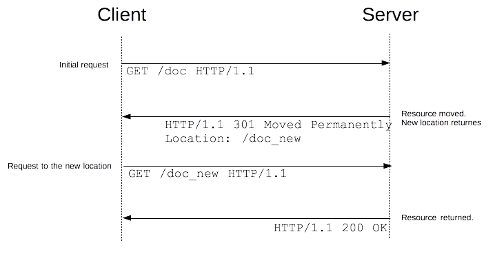

{{HTTPSidebar}}

**URL redirection**, also known as _URL forwarding_, is a technique to give more than one URL address to a page, a form, or a whole Web site/application. HTTP has a special kind of response, called a **_HTTP redirect_**, for this operation.

Redirects accomplish numerous goals:

- Temporary redirects during site maintenance or downtime
- Permanent redirects to preserve existing links/bookmarks after changing the site's URLs, progress pages when uploading a file, etc.

## Principle

In HTTP, redirection is triggered by a server sending a special _redirect_ response to a request. Redirect responses have [status codes](/en-US/docs/Web/HTTP/Status) that start with `3`, and a {{ httpheader("Location") }} header holding the URL to redirect to.

When browsers receive a redirect, they immediately load the new URL provided in the `Location` header. Besides the small performance hit of an additional round-trip, users rarely notice the redirection.



There are several types of redirects, sorted into three categories:

1. [Permanent redirections](#permanent_redirections)
2. [Temporary redirections](#temporary_redirections)
3. [Special redirections](#special_redirections)

### Permanent redirections

These redirections are meant to last forever. They imply that the original URL should no longer be used, and replaced with the new one. Search engine robots, RSS readers, and other crawlers will update the original URL for the resource.

| Code  | Text                 | Method handling                                                                                                       | Typical use case                                             |
| ----- | -------------------- | --------------------------------------------------------------------------------------------------------------------- | ------------------------------------------------------------ |
| `301` | `Moved Permanently`  | {{HTTPMethod("GET")}} methods unchanged. Others may or may not be changed to {{HTTPMethod("GET")}}. [1] | Reorganization of a Web site.                                |
| `308` | `Permanent Redirect` | Method and body not changed.                                                                                          | Reorganization of a Web site, with non-GET links/operations. |

\[1] The specification did not intend to allow method changes, but there are existing user agents that do change their method. {{HTTPStatus("308")}} was created to remove the ambiguity of the behavior when using non-`GET` methods.

### Temporary redirections

Sometimes the requested resource can't be accessed from its canonical location, but it can be accessed from another place. In this case, a temporary redirect can be used.

Search engine robots and other crawlers don't memorize the new, temporary URL. Temporary redirections are also used when creating, updating, or deleting resources, to show temporary progress pages.

| Code  | Text                 | Method handling                                                                                                       | Typical use case                                                                                                                                              |
| ----- | -------------------- | --------------------------------------------------------------------------------------------------------------------- | ------------------------------------------------------------------------------------------------------------------------------------------------------------- |
| `302` | `Found`              | {{HTTPMethod("GET")}} methods unchanged. Others may or may not be changed to {{HTTPMethod("GET")}}. [2] | The Web page is temporarily unavailable for unforeseen reasons.                                                                                               |
| `303` | `See Other`          | {{HTTPMethod("GET")}} methods unchanged. Others _changed_ to `GET` (body lost).                                | Used to redirect after a {{HTTPMethod("PUT")}} or a {{HTTPMethod("POST")}}, so that refreshing the result page doesn't re-trigger the operation. |
| `307` | `Temporary Redirect` | Method and body not changed                                                                                           | The Web page is temporarily unavailable for unforeseen reasons. Better than `302` when non-`GET` operations are available on the site.                        |

\[2] The specification did not intend to allow method changes, but there are existing user agents that do change their method. {{HTTPStatus("307")}} was created to remove the ambiguity of the behavior when using non-`GET` methods.

### Special redirections

{{HTTPStatus("304")}} (Not Modified) redirects a page to the locally cached copy (that was stale), and {{HTTPStatus("300")}} (Multiple Choice) is a manual redirection: the body, presented by the browser as a Web page, lists the possible redirections and the user clicks on one to select it.

| Code  | Text              | Typical use case                                                                                                                                                               |
| ----- | ----------------- | ------------------------------------------------------------------------------------------------------------------------------------------------------------------------------ |
| `300` | `Multiple Choice` | Not many: the choices are listed in an HTML page in the body. Machine-readable choices are encouraged to be sent as {{HTTPHeader("Link")}} headers with `rel=alternate`. |
| `304` | `Not Modified`    | Sent for revalidated conditional requests. Indicates that the cached response is still fresh and can be used.                                                                  |

## Alternative way of specifying redirections

HTTP redirects aren't the only way to define redirections. There are two others:

1. HTML redirections with the {{HTMLElement("meta")}} element
2. JavaScript redirections via the [DOM](/en-US/docs/Web/API/Document_Object_Model)

### HTML redirections

HTTP redirects are the best way to create redirections, but sometimes you don't have control over the server. In that case, try a {{HTMLElement("meta")}} element with its {{htmlattrxref("http-equiv", "meta")}} attribute set to `Refresh` in the {{HTMLElement("head")}} of the page. When displaying the page, the browser will go to the indicated URL.

```html
<head>
  <meta http-equiv="Refresh" content="0; URL=https://example.com/">
</head>
```

The {{htmlattrxref("content")}} attribute should start with a number indicating how many seconds the browser should wait before redirecting to the given URL. Always set it to `0` for accessibility compliance.

Obviously, this method only works with HTML, and cannot be used for images or other types of content.

### JavaScript redirections

Redirections in JavaScript are performed by setting a URL string to the {{domxref("window.location")}} property, loading the new page:

```js
window.location = "https://example.com/";
```

Like HTML redirections, this can't work on all resources, and obviously, this will only work on clients that execute JavaScript. On the other hand, there are more possibilities: for example, you can trigger the redirect only if some conditions are met.

### Order of precedence

With three ways to trigger redirections, several ways can be used at the same time. But which is applied first?

1. HTTP redirects always execute first — they exist when there is not even a transmitted page.
2. HTML redirects ({{HTMLElement("meta")}}) execute if there weren't any HTTP redirects.
3. JavaScript redirects execute last, and only if JavaScript is enabled.

When possible, use HTTP redirects and don't add {{HTMLElement("meta")}} element redirects. If someone changes the HTTP redirects but forgets to change the HTML redirects, the redirects will no longer be identical, which could cause an infinite loop or other nightmares.

## Use cases

There are numerous use cases for redirects, but as performance is impacted with every redirect, their use should be kept to a minimum.

### Domain aliasing

Ideally, there is one location, and therefore one URL, for each resource. But there are reasons for alternative names for a resource:

- Expanding the reach of your site
  - : A common case is when a site resides at `www.example.com`, but accessing it from `example.com` should also work. Redirections for `example.com` to `www.example.com` are thus set up. You might also redirect from common synonyms or frequent typos of your domains.
- Moving to a new domain
  - : For example, your company was renamed, but you want existing links or bookmarks to still find you under the new name.
- Forcing [HTTPS](/en-US/docs/Glossary/https)
  - : Requests to the `http://` version of your site will redirect to the `https://` version of your site.

### Keeping links alive

When you restructure Web sites, URLs change. Even if you update your site's links to match the new URLs, you have no control over the URLs used by external resources.

You don't want to break these links, as they bring valuable users and help your SEO, so you set up redirects from the old URLs to the new ones.

> **Note:** This technique does work for internal links, but try to avoid having internal redirects. A redirect has a significant performance cost (as an extra HTTP request occurs). If you can avoid it by correcting internal links, you should fix those links instead.

### Temporary responses to unsafe requests

{{Glossary("Safe/HTTP", "Unsafe")}} requests modify the state of the server and the user shouldn't resend them unintentionally.

Typically, you don't want your users to resend {{HTTPMethod("PUT")}}, {{HTTPMethod("POST")}} or {{HTTPMethod("DELETE")}} requests. If you serve the response as the result of this request, a simple press of the reload button will resend the request (possibly after a confirmation message).

In this case, the server can send back a {{HTTPStatus("303")}} (See Other) response for a URL that will contain the right information. If the reload button is pressed, only that page is redisplayed, without replaying the unsafe requests.

### Temporary responses to long requests

Some requests may need more time on the server, like {{HTTPMethod("DELETE")}} requests that are scheduled for later processing. In this case, the response is a {{HTTPStatus("303")}} (See Other) redirect that links to a page indicating that the action has been scheduled, and eventually informs about its progress, or allows to cancel it.

## Configuring redirects in common servers

### Apache

Redirects can be set either in the server config file or in the `.htaccess` of each directory.

The [`mod_alias`](https://httpd.apache.org/docs/current/mod/mod_alias.html) module has `Redirect` and `RedirectMatch` directives that set up {{HTTPStatus("302")}} redirects by default:

```html
<VirtualHost *:443>
  ServerName example.com
  Redirect / https://www.example.com
</VirtualHost>
```

The URL `https://example.com/` will be redirected to `https://www.example.com/`, as will any files or directories under it (`https://example.com/some-page` will be redirected to `https://www.example.com/some-page`)

`RedirectMatch` does the same, but takes a {{glossary("regular expression")}} to define a collection of affected URLs:

```
RedirectMatch ^/images/(.*)$ https://images.example.com/$1
```

All documents in the `images/` directory will redirect to a different domain.

If you don't want a temporary redirect, an extra parameter (either the HTTP status code to use or the `permanent` keyword) can be used to set up a different redirect:

```
Redirect permanent / https://www.example.com
# …acts the same as:
Redirect 301 / https://www.example.com
```

The [`mod_rewrite`](https://httpd.apache.org/docs/current/mod/mod_rewrite.html) module can also create redirects. It is more flexible, but a bit more complex.

### Nginx

In Nginx, you create a specific server block for the content you want to redirect:

```
server {
  listen 80;
  server_name example.com;
  return 301 $scheme://www.example.com$request_uri;
}
```

To apply a redirect to a directory or only certain pages, use the `rewrite` directive:

```
rewrite ^/images/(.*)$ https://images.example.com/$1 redirect;
rewrite ^/images/(.*)$ https://images.example.com/$1 permanent;
```

### IIS

In IIS, you use the [`<httpRedirect>`](https://docs.microsoft.com/en-us/iis/configuration/system.webServer/httpRedirect/) element to configure redirections.

## Redirection loops

Redirection loops happen when additional redirections follow the one that has already been followed. In other words, there is a loop that will never be finished and no page will ever be found.

Most of the time this is a server problem, and if the server can detect it, it will send back a {{HTTPStatus("500")}} `Internal Server Error`. If you encounter such an error soon after modifying a server configuration, this is likely a redirection loop.

Sometimes, the server won't detect it: a redirection loop can spread over several servers which each don't have the full picture. In this case, browsers will detect it and display an error message. Firefox displays:

> Firefox has detected that the server is redirecting the request for this address in a way that will never terminate.

…while Chrome displays:

> This Webpage has a redirect loop

In both cases, the user can't do much (unless corruption is happening on their side, like a mismatch of cache or cookies).

It is important to avoid redirection loops, as they completely break the user experience.
