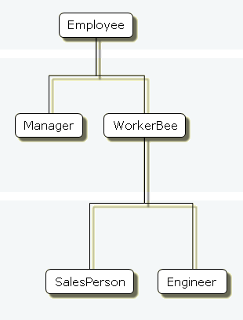
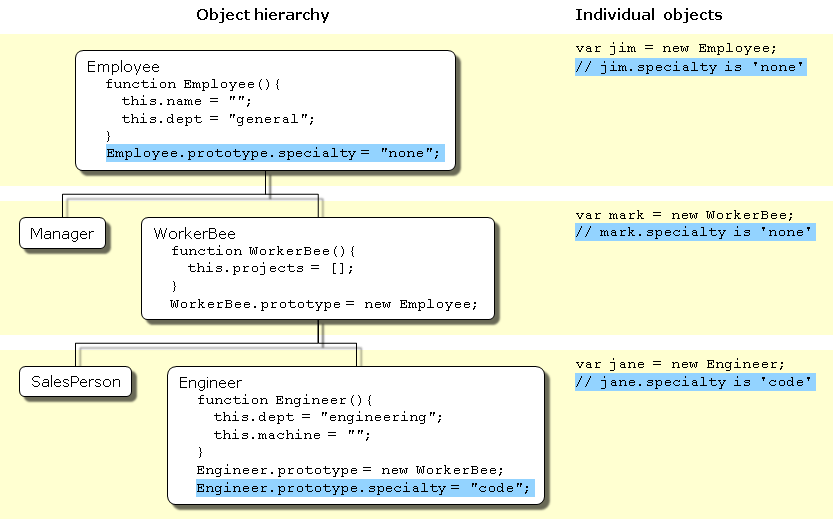
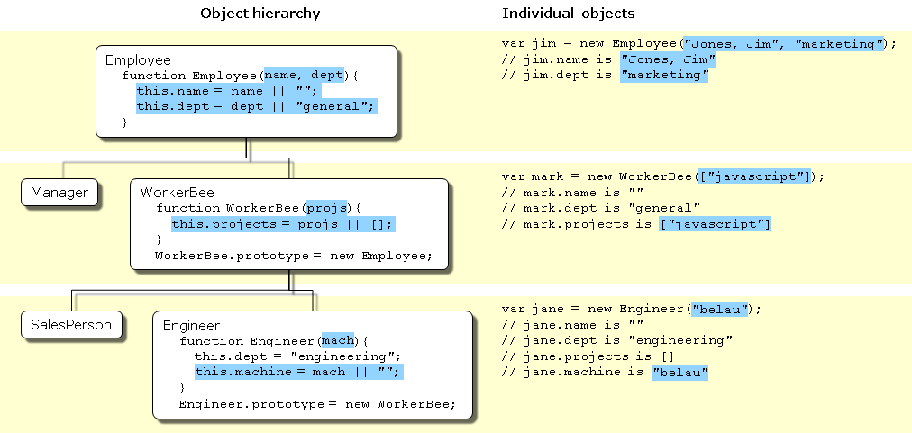
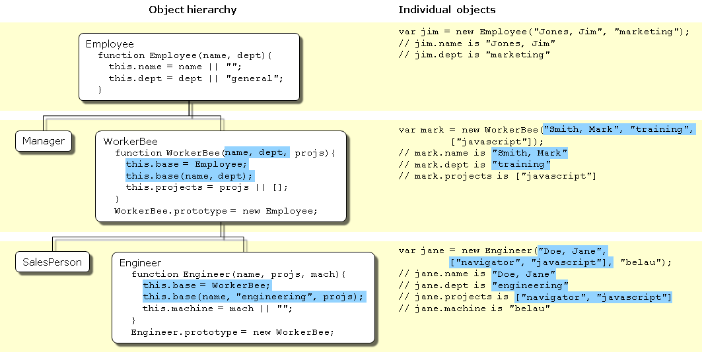

{{jsSidebar("JavaScript Guide")}} {{PreviousNext("Web/JavaScript/Guide/Working_with_Objects", "Web/JavaScript/Guide/Using_promises")}}

JavaScript is an object-based language based on prototypes, rather than being class-based. Because of this different basis, it can be less apparent how JavaScript allows you to create hierarchies of objects and to have inheritance of properties and their values. This chapter attempts to clarify the situation.

This chapter assumes that you are already somewhat familiar with JavaScript and that you have used JavaScript functions to create simple objects.

## Class-based vs. prototype-based languages

Class-based object-oriented languages, such as Java and C++, are founded on the concept of two distinct entities: classes and instances.

- A _class_ defines all of the properties that characterize a certain set of objects (considering methods and fields in Java, or members in C++, to be properties). A class is abstract rather than any particular member in a set of objects it describes. For example, the `Employee` class could represent the set of all employees.
- An _instance_, on the other hand, is the instantiation of a class; that is. For example, `Victoria` could be an instance of the `Employee` class, representing a particular individual as an employee. An instance has exactly the same properties of its parent class (no more, no less).

A prototype-based language, such as JavaScript, does not make this distinction: it has objects. A prototype-based language has the notion of a _prototypical object_, an object used as a template from which to get the initial properties for a new object. Any object can specify its own properties, either when you create it or at run time. In addition, any object can be associated as the _prototype_ for another object, allowing the second object to share the first object's properties.

### Defining a class

In class-based languages, you define a class in a separate _class definition_. In that definition you can specify special methods, called _constructors_, to create instances of the class. A constructor method can specify initial values for the instance's properties and perform other processing appropriate at creation time. You use the `new` operator in association with the constructor method to create class instances.

JavaScript follows a similar model, but does not have a class definition separate from the constructor. Instead, you define a constructor function to create objects with a particular initial set of properties and values. Any JavaScript function can be used as a constructor. You use the `new` operator with a constructor function to create a new object.

> **Note:** ECMAScript 2015 introduces a [class declaration](/en-US/docs/Web/JavaScript/Reference/Classes):
>
> > JavaScript classes, introduced in ECMAScript 2015, are primarily syntactical sugar over JavaScript's existing prototype-based inheritance. The class syntax _does not_ introduce a new object-oriented inheritance model to JavaScript.

### Subclasses and inheritance

In a class-based language, you create a hierarchy of classes through the class definitions. In a class definition, you can specify that the new class is a _subclass_ of an already existing class. The subclass inherits all the properties of the superclass and additionally can add new properties or modify the inherited ones. For example, assume the `Employee` class includes only the `name` and `dept` properties, and `Manager` is a subclass of `Employee` that adds the `reports` property. In this case, an instance of the `Manager` class would have all three properties: `name`, `dept`, and `reports`.

JavaScript implements inheritance by allowing you to associate a prototypical object with any constructor function. So, you can create exactly the `Employee` — `Manager` example, but you use slightly different terminology. First you define the `Employee` constructor function, specifying the `name` and `dept` properties. Next, you define the `Manager` constructor function, calling the `Employee` constructor and specifying the `reports` property. Finally, you assign a new object derived from `Employee.prototype` as the `prototype` for the `Manager` constructor function. Then, when you create a new `Manager`, it inherits the `name` and `dept` properties from the `Employee` object.

### Adding and removing properties

In class-based languages, you typically create a class at compile time and then you instantiate instances of the class either at compile time or at run time. You cannot change the number or the type of properties of a class after you define the class. In JavaScript, however, at run time you can add or remove properties of any object. If you add a property to an object that is used as the prototype for a set of objects, the objects for which it is the prototype also get the new property.

### Summary of differences

The following table gives a short summary of some of these differences. The rest of this chapter describes the details of using JavaScript constructors and prototypes to create an object hierarchy and compares this to how you would do it in Java.

<table class="standard-table">
  <caption>
    Comparison of class-based (Java) and prototype-based (JavaScript) object
    systems
  </caption>
  <thead>
    <tr>
      <th scope="row">Category</th>
      <th scope="col">Class-based (Java)</th>
      <th scope="col">Prototype-based (JavaScript)</th>
    </tr>
  </thead>
  <tbody>
    <tr>
      <th scope="row">Class vs. Instance</th>
      <td>Class and instance are distinct entities.</td>
      <td>All objects can inherit from another object.</td>
    </tr>
    <tr>
      <th scope="row">Definition</th>
      <td>
        Define a class with a class definition; instantiate a class with
        constructor methods.
      </td>
      <td>Define and create a set of objects with constructor functions.</td>
    </tr>
    <tr>
      <th scope="row">Creation of new object</th>
      <td>Create a single object with the <code>new</code> operator.</td>
      <td>Same.</td>
    </tr>
    <tr>
      <th scope="row">Construction of object hierarchy</th>
      <td>
        Construct an object hierarchy by using class definitions to define
        subclasses of existing classes.
      </td>
      <td>
        Construct an object hierarchy by assigning an object as the prototype
        associated with a constructor function.
      </td>
    </tr>
    <tr>
      <th scope="row">Inheritance model</th>
      <td>Inherit properties by following the class chain.</td>
      <td>Inherit properties by following the prototype chain.</td>
    </tr>
    <tr>
      <th scope="row">Extension of properties</th>
      <td>
        Class definition specifies <em>all</em> properties of all instances of a
        class. Cannot add properties dynamically at run time.
      </td>
      <td>
        Constructor function or prototype specifies an <em>initial set</em> of
        properties. Can add or remove properties dynamically to individual
        objects or to the entire set of objects.
      </td>
    </tr>
  </tbody>
</table>

## The employee example

The remainder of this chapter uses the employee hierarchy shown in the following figure.


This shows an object hierarchy with the following objects:

- `Employee` has the properties `name` (whose value defaults to the empty string) and `dept` (whose value defaults to "general").
- `Manager` is based on `Employee`. It adds the `reports` property (whose value defaults to an empty array, intended to have an array of `Employee` objects as its value).
- `WorkerBee` is also based on `Employee`. It adds the `projects` property (whose value defaults to an empty array, intended to have an array of strings as its value).
- `SalesPerson` is based on `WorkerBee`. It adds the `quota` property (whose value defaults to 100). It also overrides the `dept` property with the value "sales", indicating that all salespersons are in the same department.
- `Engineer` is based on `WorkerBee`. It adds the `machine` property (whose value defaults to the empty string) and also overrides the `dept` property with the value "engineering".

## Creating the hierarchy

There are several ways to define appropriate constructor functions to implement the Employee hierarchy. How you choose to define them depends largely on what you want to be able to do in your application.

This section shows how to use very simple (and comparatively inflexible) definitions to demonstrate how to get the inheritance to work. In these definitions, you cannot specify any property values when you create an object. The newly-created object gets the default values, which you can change at a later time.

In a real application, you would probably define constructors that allow you to provide property values at object creation time (see [More flexible constructors](#more_flexible_constructors) for information). For now, these simple definitions demonstrate how the inheritance occurs.

The following Java and JavaScript `Employee` definitions are similar. The only difference is that you need to specify the type for each property in Java but not in JavaScript (this is due to Java being a [strongly typed language](https://en.wikipedia.org/wiki/Strong_and_weak_typing) while JavaScript is a weakly typed language).

#### JavaScript (using this may cause an error for the following examples)

```js
class Employee {
  constructor() {
    this.name = '';
    this.dept = 'general';
  }
}
```

#### JavaScript \*\* (use this instead)

```js
function Employee() {
    this.name = '';
    this.dept = 'general';
}
```

#### Java

```java
public class Employee {
   public String name = "";
   public String dept = "general";
}
```

The `Manager` and `WorkerBee` definitions show the difference in how to specify the next object higher in the inheritance chain. In JavaScript, you add a prototypical instance as the value of the `prototype` property of the constructor function, then override the `prototype.constructor` to the constructor function. You can do so at any time after you define the constructor. In Java, you specify the superclass within the class definition. You cannot change the superclass outside the class definition.

#### JavaScript

```js
function Manager() {
  Employee.call(this);
  this.reports = [];
}
Manager.prototype = Object.create(Employee.prototype);
Manager.prototype.constructor = Manager;

function WorkerBee() {
  Employee.call(this);
  this.projects = [];
}
WorkerBee.prototype = Object.create(Employee.prototype);
WorkerBee.prototype.constructor = WorkerBee;
```

#### Java

```java
public class Manager extends Employee {
   public Employee[] reports =
       new Employee[0];
}

public class WorkerBee extends Employee {
   public String[] projects = new String[0];
}
```

The `Engineer` and `SalesPerson` definitions create objects that descend from `WorkerBee` and hence from `Employee`. An object of these types has properties of all the objects above it in the chain. In addition, these definitions override the inherited value of the `dept` property with new values specific to these objects.

#### JavaScript

```js
function SalesPerson() {
   WorkerBee.call(this);
   this.dept = 'sales';
   this.quota = 100;
}
SalesPerson.prototype = Object.create(WorkerBee.prototype);
SalesPerson.prototype.constructor = SalesPerson;

function Engineer() {
   WorkerBee.call(this);
   this.dept = 'engineering';
   this.machine = '';
}
Engineer.prototype = Object.create(WorkerBee.prototype)
Engineer.prototype.constructor = Engineer;
```

#### Java

```java
public class SalesPerson extends WorkerBee {
   public String dept = "sales";
   public double quota = 100.0;
}

public class Engineer extends WorkerBee {
   public String dept = "engineering";
   public String machine = "";
}
```

Using these definitions, you can create instances of these objects that get the default values for their properties. The next figure illustrates using these JavaScript definitions to create new objects and shows the property values for the new objects.

> **Note:** The term _instance_ has a specific technical meaning in class-based languages. In these languages, an instance is an individual instantiation of a class and is fundamentally different from a class. In JavaScript, "instance" does not have this technical meaning because JavaScript does not have this difference between classes and instances. However, in talking about JavaScript, "instance" can be used informally to mean an object created using a particular constructor function. So, in this example, you could informally say that `jane` is an instance of `Engineer`. Similarly, although the terms _parent_, _child_, _ancestor_, and _descendant_ do not have formal meanings in JavaScript; you can use them informally to refer to objects higher or lower in the prototype chain.

### Creating objects with simple definitions

#### Object hierarchy

The following hierarchy is created using the code on the right side.



#### Individual objects = Jim, Sally, Mark, Fred, Jane, etc.<br>"Instances" created from constructor

```js
var jim = new Employee;
// Parentheses can be omitted if the
// constructor takes no arguments.
// jim.name is ''
// jim.dept is 'general'

var sally = new Manager;
// sally.name is ''
// sally.dept is 'general'
// sally.reports is []

var mark = new WorkerBee;
// mark.name is ''
// mark.dept is 'general'
// mark.projects is []

var fred = new SalesPerson;
// fred.name is ''
// fred.dept is 'sales'
// fred.projects is []
// fred.quota is 100

var jane = new Engineer;
// jane.name is ''
// jane.dept is 'engineering'
// jane.projects is []
// jane.machine is ''
```

## Object properties

This section discusses how objects inherit properties from other objects in the prototype chain and what happens when you add a property at run time.

### Inheriting properties

Suppose you create the `mark` object as a `WorkerBee` with the following statement:

```js
var mark = new WorkerBee;
```

When JavaScript sees the `new` operator, it creates a new generic object and implicitly sets the value of the internal property \[\[Prototype]] to the value of `WorkerBee.prototype` and passes this new object as the value of the _`this`_ keyword to the `WorkerBee` constructor function. The internal \[\[Prototype]] property determines the prototype chain used to return property values. Once these properties are set, JavaScript returns the new object and the assignment statement sets the variable `mark` to that object.

This process does not explicitly put values in the `mark` object (_local_ values) for the properties that `mark` inherits from the prototype chain. When you ask for the value of a property, JavaScript first checks to see if the value exists in that object. If it does, that value is returned. If the value is not there locally, JavaScript checks the prototype chain (using the internal \[\[Prototype]] property). If an object in the prototype chain has a value for the property, that value is returned. If no such property is found, JavaScript says the object does not have the property. In this way, the `mark` object has the following properties and values:

```js
mark.name = '';
mark.dept = 'general';
mark.projects = [];
```

The `mark` object is assigned local values for the `name` and `dept` properties by the Employee constructor. It is assigned a local value for the `projects` property by the `WorkerBee` constructor. This gives you inheritance of properties and their values in JavaScript. Some subtleties of this process are discussed in [Property inheritance revisited](#property_inheritance_revisited).

Because these constructors do not let you supply instance-specific values, this information is generic. The property values are the default ones shared by all new objects created from `WorkerBee`. You can, of course, change the values of any of these properties. So, you could give specific information for `mark` as follows:

```js
mark.name = 'Doe, Mark';
mark.dept = 'admin';
mark.projects = ['navigator'];
```

### Adding properties

In JavaScript, you can add properties to any object at run time. You are not constrained to use only the properties provided by the constructor function. To add a property that is specific to a single object, you assign a value to the object, as follows:

```js
mark.bonus = 3000;
```

Now, the `mark` object has a `bonus` property, but no other `WorkerBee` has this property.

If you add a new property to an object that is being used as the prototype for a constructor function, you add that property to all objects that inherit properties from the prototype. For example, you can add a `specialty` property to all employees with the following statement:

```js
Employee.prototype.specialty = 'none';
```

As soon as JavaScript executes this statement, the `mark` object also has the `specialty` property with the value of `"none"`. The following figure shows the effect of adding this property to the `Employee` prototype and then overriding it for the `Engineer` prototype.



## More flexible constructors

The constructor functions shown so far do not let you specify property values when you create an instance. As with Java, you can provide arguments to constructors to initialize property values for instances. The following figure shows one way to do this.



The following pairs of examples show the Java and JavaScript definitions for these objects.

```js
function Employee(name, dept) {
  this.name = name || '';
  this.dept = dept || 'general';
}
```

```java
public class Employee {
   public String name;
   public String dept;
   public Employee () {
      this("", "general");
   }
   public Employee (String name) {
      this(name, "general");
   }
   public Employee (String name, String dept) {
      this.name = name;
      this.dept = dept;
   }
}
```

```js
function WorkerBee(projs) {
  this.projects = projs || [];
}
WorkerBee.prototype = new Employee;
```

```java
public class WorkerBee extends Employee {
   public String[] projects;
   public WorkerBee () {
      this(new String[0]);
   }
   public WorkerBee (String[] projs) {
      projects = projs;
   }
}
```

```js
function Engineer(mach) {
  this.dept = 'engineering';
  this.machine = mach || '';
}
Engineer.prototype = new WorkerBee;
```

```java
public class Engineer extends WorkerBee {
   public String machine;
   public Engineer () {
      dept = "engineering";
      machine = "";
   }
   public Engineer (String mach) {
      dept = "engineering";
      machine = mach;
   }
}
```

These JavaScript definitions use a special idiom for setting default values:

```js
this.name = name || '';
```

The JavaScript logical OR operator (`||`) evaluates its first argument. If that argument converts to true, the operator returns it. Otherwise, the operator returns the value of the second argument. Therefore, this line of code tests to see if `name` has a useful value for the `name` property. If it does, it sets `this.name` to that value. Otherwise, it sets `this.name` to the empty string. This chapter uses this idiom for brevity; however, it can be puzzling at first glance.

> **Note:** This may not work as expected if the constructor function is called with arguments which convert to `false` (like `0` (zero) and empty string (`""`)). In this case the default value will be chosen.

With these definitions, when you create an instance of an object, you can specify values for the locally defined properties. You can use the following statement to create a new `Engineer`:

```js
var jane = new Engineer('belau');
```

`Jane`'s properties are now:

```js
jane.name == '';
jane.dept == 'engineering';
jane.projects == [];
jane.machine == 'belau';
```

Notice that with these definitions, you cannot specify an initial value for an inherited property such as `name`. If you want to specify an initial value for inherited properties in JavaScript, you need to add more code to the constructor function.

So far, the constructor function has created a generic object and then specified local properties and values for the new object. You can have the constructor add more properties by directly calling the constructor function for an object higher in the prototype chain. The following figure shows these new definitions.



Let's look at one of these definitions in detail. Here's the new definition for the `Engineer` constructor:

```js
function Engineer(name, projs, mach) {
  this.base = WorkerBee;
  this.base(name, 'engineering', projs);
  this.machine = mach || '';
}
```

Suppose you create a new `Engineer` object as follows:

```js
var jane = new Engineer('Doe, Jane', ['navigator', 'javascript'], 'belau');
```

JavaScript follows these steps:

1. The `new` operator creates a generic object and sets its `__proto__` property to `Engineer.prototype`.
2. The `new` operator passes the new object to the `Engineer` constructor as the value of the `this` keyword.
3. The constructor creates a new property called `base` for that object and assigns the value of the `WorkerBee` constructor to the `base` property. This makes the `WorkerBee` constructor a method of the `Engineer` object. The name of the `base` property is not special. You can use any legal property name; `base` is evocative of its purpose.
4. The constructor calls the `base` method, passing as its arguments two of the arguments passed to the constructor (`"Doe, Jane"` and `["navigator", "javascript"]`) and also the string `"engineering"`. Explicitly using `"engineering"` in the constructor indicates that all `Engineer` objects have the same value for the inherited `dept` property, and this value overrides the value inherited from `Employee`.
5. Because `base` is a method of `Engineer`, within the call to `base`, JavaScript binds the `this` keyword to the object created in Step 1. Thus, the `WorkerBee` function in turn passes the `"Doe, Jane"` and `"engineering"` arguments to the `Employee` constructor function. Upon return from the `Employee` constructor function, the `WorkerBee` function uses the remaining argument to set the `projects` property.
6. Upon return from the `base` method, the `Engineer` constructor initializes the object's `machine` property to `"belau"`.
7. Upon return from the constructor, JavaScript assigns the new object to the `jane` variable.

You might think that, having called the `WorkerBee` constructor from inside the `Engineer` constructor, you have set up inheritance appropriately for `Engineer` objects. This is not the case. Calling the `WorkerBee` constructor ensures that an `Engineer` object starts out with the properties specified in all constructor functions that are called. However, if you later add properties to the `Employee` or `WorkerBee` prototypes, those properties are not inherited by the `Engineer` object. For example, assume you have the following statements:

```js
function Engineer(name, projs, mach) {
  this.base = WorkerBee;
  this.base(name, 'engineering', projs);
  this.machine = mach || '';
}
var jane = new Engineer('Doe, Jane', ['navigator', 'javascript'], 'belau');
Employee.prototype.specialty = 'none';
```

The `jane` object does not inherit the `specialty` property. You still need to explicitly set up the prototype to ensure dynamic inheritance. Assume instead you have these statements:

```js
function Engineer(name, projs, mach) {
  this.base = WorkerBee;
  this.base(name, 'engineering', projs);
  this.machine = mach || '';
}
Engineer.prototype = new WorkerBee;
var jane = new Engineer('Doe, Jane', ['navigator', 'javascript'], 'belau');
Employee.prototype.specialty = 'none';
```

Now the value of the `jane` object's `specialty` property is "none".

Another way of inheriting is by using the [`call()`](/en-US/docs/Web/JavaScript/Reference/Global_Objects/Function/call) / [`apply()`](/en-US/docs/Web/JavaScript/Reference/Global_Objects/Function/apply) methods. Below are equivalent:

```js
function Engineer(name, projs, mach) {
  this.base = WorkerBee;
  this.base(name, 'engineering', projs);
  this.machine = mach || '';
}
```

```js
function Engineer(name, projs, mach) {
  WorkerBee.call(this, name, 'engineering', projs);
  this.machine = mach || '';
}
```

Using the JavaScript `call()` method makes a cleaner implementation because the `base` is not needed anymore.

## Property inheritance revisited

The preceding sections described how JavaScript constructors and prototypes provide hierarchies and inheritance. This section discusses some subtleties that were not necessarily apparent in the earlier discussions.

### Local versus inherited values

When you access an object property, JavaScript performs these steps, as described earlier in this chapter:

1. Check to see if the value exists locally. If it does, return that value.
2. If there is not a local value, check the prototype chain (using the `__proto__` property).
3. If an object in the prototype chain has a value for the specified property, return that value.
4. If no such property is found, the object does not have the property.

The outcome of these steps depends on how you define things along the way. The original example had these definitions:

```js
function Employee() {
  this.name = '';
  this.dept = 'general';
}

function WorkerBee() {
  this.projects = [];
}
WorkerBee.prototype = new Employee;
```

With these definitions, suppose you create `amy` as an instance of `WorkerBee` with the following statement:

```js
var amy = new WorkerBee;
```

The `amy` object has one local property, `projects`. The values for the `name` and `dept` properties are not local to `amy` and so derive from the `amy` object's `__proto__` property. Thus, `amy` has these property values:

```js
amy.name == '';
amy.dept == 'general';
amy.projects == [];
```

Now suppose you change the value of the `name` property in the prototype associated with `Employee`:

```js
Employee.prototype.name = 'Unknown';
```

At first glance, you might expect that new value to propagate down to all the instances of `Employee`. However, it does not.

When you create _any_ instance of the `Employee` object, that instance gets a **local value** for the `name` property (the empty string). This means that when you set the `WorkerBee` prototype by creating a new `Employee` object, `WorkerBee.prototype` has a local value for the `name` property. Therefore, when JavaScript looks up the `name` property of the `amy` object (an instance of `WorkerBee`), JavaScript finds the local value for that property in `WorkerBee.prototype`. It therefore does not look further up the chain to `Employee.prototype`.

If you want to change the value of an object property at run time and have the new value be inherited by all descendants of the object, you cannot define the property in the object's constructor function. Instead, you add it to the constructor's associated prototype. For example, assume you change the preceding code to the following:

```js
function Employee() {
  this.dept = 'general';    // Note that this.name (a local variable) does not appear here
}
Employee.prototype.name = '';    // A single copy

function WorkerBee() {
  this.projects = [];
}
WorkerBee.prototype = new Employee;

var amy = new WorkerBee;

Employee.prototype.name = 'Unknown';
```

In this case, the `name` property of `amy` becomes "Unknown".

As these examples show, if you want to have default values for object properties and you want to be able to change the default values at run time, you should set the properties in the constructor's prototype, not in the constructor function itself.

### Determining instance relationships

Property lookup in JavaScript looks within an object's own properties and, if the property name is not found, it looks within the special object property `__proto__`. This continues recursively; the process is called "lookup in the prototype chain".

The special property `__proto__` is set when an object is constructed; it is set to the value of the constructor's `prototype` property. So the expression `new Foo()` creates an object with `__proto__ == Foo.prototype`. Consequently, changes to the properties of `Foo.prototype` alters the property lookup for all objects that were created by `new Foo()`.

Every object has a `__proto__` object property (except `Object`); every function has a `prototype` object property. So objects can be related by 'prototype inheritance' to other objects. You can test for inheritance by comparing an object's `__proto__` to a function's `prototype` object. JavaScript provides a shortcut: the `instanceof` operator tests an object against a function and returns true if the object inherits from the function prototype. For example,

```js
var f = new Foo();
var isTrue = (f instanceof Foo);
```

For a more detailed example, suppose you have the same set of definitions shown in [Inheriting properties](#inheriting_properties). Create an `Engineer` object as follows:

```js
var chris = new Engineer('Pigman, Chris', ['jsd'], 'fiji');
```

With this object, the following statements are all true:

```js
chris.__proto__ == Engineer.prototype;
chris.__proto__.__proto__ == WorkerBee.prototype;
chris.__proto__.__proto__.__proto__ == Employee.prototype;
chris.__proto__.__proto__.__proto__.__proto__ == Object.prototype;
chris.__proto__.__proto__.__proto__.__proto__.__proto__ == null;
```

Given this, you could write an `instanceOf` function as follows:

```js
function instanceOf(object, constructor) {
   object = object.__proto__;
   while (object != null) {
      if (object == constructor.prototype)
         return true;
      if (typeof object == 'xml') {
        return constructor.prototype == XML.prototype;
      }
      object = object.__proto__;
   }
   return false;
}
```

> **Note:** The implementation above checks the type of the object against "xml" in order to work around a quirk of how XML objects are represented in recent versions of JavaScript. See [bug 634150](https://bugzilla.mozilla.org/show_bug.cgi?id=634150) if you want the nitty-gritty details.

Using the instanceOf function defined above, these expressions are true:

```js
instanceOf(chris, Engineer)
instanceOf(chris, WorkerBee)
instanceOf(chris, Employee)
instanceOf(chris, Object)
```

But the following expression is false:

```js
instanceOf(chris, SalesPerson)
```

### Global information in constructors

When you create constructors, you need to be careful if you set global information in the constructor. For example, assume that you want a unique ID to be automatically assigned to each new employee. You could use the following definition for `Employee`:

```js
var idCounter = 1;

function Employee(name, dept) {
   this.name = name || '';
   this.dept = dept || 'general';
   this.id = idCounter++;
}
```

With this definition, when you create a new `Employee`, the constructor assigns it the next ID in sequence and then increments the global ID counter. So, if your next statement is the following, `victoria.id` is 1 and `harry.id` is 2:

```js
var victoria = new Employee('Pigbert, Victoria', 'pubs');
var harry = new Employee('Tschopik, Harry', 'sales');
```

At first glance that seems fine. However, `idCounter` gets incremented every time an `Employee` object is created, for whatever purpose. If you create the entire `Employee` hierarchy shown in this chapter, the `Employee` constructor is called every time you set up a prototype. Suppose you have the following code:

```js
var idCounter = 1;

function Employee(name, dept) {
   this.name = name || '';
   this.dept = dept || 'general';
   this.id = idCounter++;
}

function Manager(name, dept, reports) {...}
Manager.prototype = new Employee;

function WorkerBee(name, dept, projs) {...}
WorkerBee.prototype = new Employee;

function Engineer(name, projs, mach) {...}
Engineer.prototype = new WorkerBee;

function SalesPerson(name, projs, quota) {...}
SalesPerson.prototype = new WorkerBee;

var mac = new Engineer('Wood, Mac');
```

Further assume that the definitions omitted here have the `base` property and call the constructor above them in the prototype chain. In this case, by the time the `mac` object is created, `mac.id` is 5.

Depending on the application, it may or may not matter that the counter has been incremented these extra times. If you care about the exact value of this counter, one possible solution involves instead using the following constructor:

```js
function Employee(name, dept) {
   this.name = name || '';
   this.dept = dept || 'general';
   if (name)
      this.id = idCounter++;
}
```

When you create an instance of `Employee` to use as a prototype, you do not supply arguments to the constructor. Using this definition of the constructor, when you do not supply arguments, the constructor does not assign a value to the id and does not update the counter. Therefore, for an `Employee` to get an assigned id, you must specify a name for the employee. In this example, `mac.id` would be 1.

Alternatively, you can create a copy of Employee's prototype object to assign to WorkerBee:

```js
WorkerBee.prototype = Object.create(Employee.prototype);
// instead of WorkerBee.prototype = new Employee
```

### No multiple inheritance

Some object-oriented languages allow multiple inheritance. That is, an object can inherit the properties and values from unrelated parent objects. JavaScript does not support multiple inheritance.

Inheritance of property values occurs at run time by JavaScript searching the prototype chain of an object to find a value. Because an object has a single associated prototype, JavaScript cannot dynamically inherit from more than one prototype chain.

In JavaScript, you can have a constructor function call more than one other constructor function within it. This gives the illusion of multiple inheritance. For example, consider the following statements:

```js
function Hobbyist(hobby) {
   this.hobby = hobby || 'scuba';
}

function Engineer(name, projs, mach, hobby) {
   this.base1 = WorkerBee;
   this.base1(name, 'engineering', projs);
   this.base2 = Hobbyist;
   this.base2(hobby);
   this.machine = mach || '';
}
Engineer.prototype = new WorkerBee;

var dennis = new Engineer('Doe, Dennis', ['collabra'], 'hugo');
```

Further assume that the definition of `WorkerBee` is as used earlier in this chapter. In this case, the `dennis` object has these properties:

```js
dennis.name == 'Doe, Dennis';
dennis.dept == 'engineering';
dennis.projects == ['collabra'];
dennis.machine == 'hugo';
dennis.hobby == 'scuba';
```

So `dennis` does get the `hobby` property from the `Hobbyist` constructor. However, assume you then add a property to the `Hobbyist` constructor's prototype:

```js
Hobbyist.prototype.equipment = ['mask', 'fins', 'regulator', 'bcd'];
```

The `dennis` object does not inherit this new property.

{{PreviousNext("Web/JavaScript/Guide/Working_with_Objects", "Web/JavaScript/Guide/Using_promises")}}
