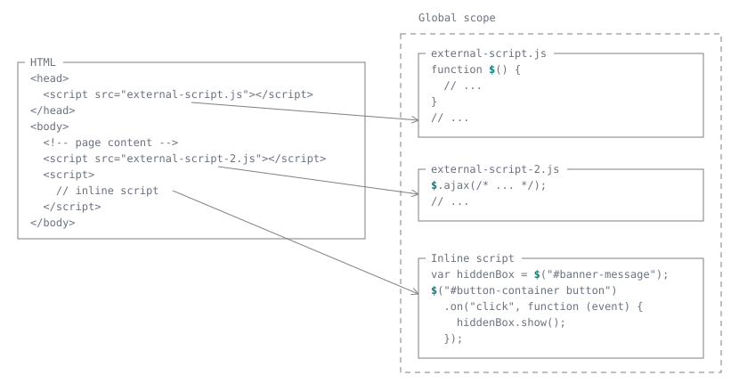
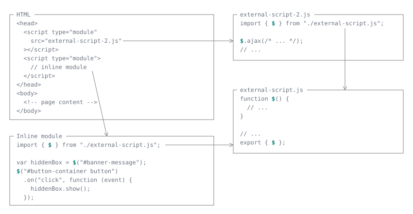

{{Previous("Web/JavaScript/Guide/Internationalization")}}

This guide gives you all you need to get started with JavaScript module syntax.

## Module philosophy

Before we look at what syntax is available inside modules, let's first talk at a high level about what modules are and how they are different from traditional scripts.

### A background on modules

JavaScript programs started off pretty small — most of its usage in the early days was to do isolated scripting tasks, providing a bit of interactivity to your web pages where needed, so large scripts were generally not needed. Fast forward a few years and we now have complete applications being run in browsers with a lot of JavaScript, as well as JavaScript being used in other contexts ([Node.js](/en-US/docs/Glossary/Node.js), for example).

Complex projects necessitate a mechanism for splitting JavaScript programs into separate modules that can be imported when needed. Node.js has had this ability for a long time, and there are a number of JavaScript libraries and tools that enable module usage (for example, [AMD](https://github.com/amdjs/amdjs-api/blob/master/AMD.md) loaders like [RequireJS](https://requirejs.org/), bundlers like [Webpack](https://webpack.js.org/), and compilers like [Babel](https://babeljs.io/)).

All modern browsers support module features natively without needing transpilation. It can only be a good thing — browsers can optimize loading of modules, without requiring a library to handle module loading. It does not obsolete bundlers like Webpack, though — bundlers still do a good job at partitioning code into reasonably sized chunks, and are able to do other optimizations like minification, dead code elimination, and tree-shaking.

### What's a module?

JavaScript code can be evaluated in two ways: as a _script_ (also called "classic script" or "traditional script") or as a _module_. There are two main differences:

1. At parsing time, modules are parsed with a slightly different syntax. Namely, they are automatically in [strict mode](/en-US/docs/Web/JavaScript/Reference/Strict_mode), and you can only use {{jsxref("Statements/import", "import")}} and {{jsxref("Statements/export", "export")}} statements in modules.
2. At runtime, modules are executed in their own scope, not in the global scope. This means that variables, functions, classes, etc. declared in a module are not visible outside the module unless they are either explicitly exported (so they can be imported in other modules), or are made available globally by attaching them to the global object (e.g., `window` in a browser).

Here is how scripts are traditionally attached to web pages:

```html
<head>
  <script src="external-script.js"></script>
</head>
<body>
  <!-- page content -->
  <script src="external-script-2.js"></script>
  <script>
    // inline script
  </script>
</body>
```



Most notably, all classic scripts attached to the webpage are executed under the same scope—the global scope. Any variables, unless they are contained within other functions or blocks, can be accessed from anywhere later in the page. This can be both convenient and dangerous. Shown in this figure is how the second and third scripts are able to access the `$` variable declared in the first script, thanks to them all being in the global scope.

Now, let us consider how this same code may look with modules. The first script, `external-script.js`, wants to share the variable `$` with the rest of the scripts. It is done above by putting the variable in the global scope. In the module version, we can export the variable and import it in the other scripts.

```html
<head>
  <script type="module" src="external-script-2.js"></script>
  <script type="module">
    import { $ } from "./external-script.js";
    // inline script
  </script>
</head>
<body>
  <!-- page content -->
</body>
```



As you can see, our code is now organized in a more sophisticated manner, forming a _dependency graph_ where each module explicitly declares the modules it relies on, and what variables it needs from those dependencies, as opposed to the script version, where everything implicitly relies on things declared globally by other scripts.

As we said, modules are parsed differently from scripts—this means that the JavaScript engine needs to know whether to apply the module or script parsing rules. Hosts commonly specify this using an [_out-of-band signaling mechanism_](https://github.com/tc39/how-we-work/blob/main/terminology.md#out-of-band), where the behavior of the code is configured by information outside of the code itself. There are many ways to give such information:

- If this module is referenced from a `<script>` tag, you can use the `type="module"` attribute. Also see [Using modules on the web](/en-US/docs/Web/JavaScript/Guide/Modules/Modules_on_the_web).
- If you are using Node.js, you can use the `.mjs` file extension, or add `"type": "module"` to the closest `package.json` file. Also see [Authoring modules cross-platform](/en-US/docs/Web/JavaScript/Guide/Modules/Cross-platform_modules).
- If this module is to be used as a worker, you can pass `type: "module"` when calling the {{domxref("Worker/Worker", "Worker()")}} constructor.

### Other differences between modules and classic scripts

- You might get different behavior from sections of script defined inside modules as opposed to in classic scripts. This is because modules use {{jsxref("Strict_mode", "strict mode", "", 1)}} automatically.
- Within the same environment, a module is only executed once, even if it has been imported multiple times or referenced in multiple `<script>` tags.
- Making this clear one more time — module features are imported into the scope of a single script — they aren't available in the global scope. Therefore, you will only be able to access imported features in the script they are imported into, and you won't be able to access them from the JavaScript console's global scope, for example. You'll still get syntax errors shown in the DevTools, but you'll not be able to use some of the debugging techniques you might have expected to use.
- There is no need to use the `defer` attribute (see [`<script>` attributes](/en-US/docs/Web/HTML/Reference/Elements/script#attributes)) when loading a module script; module scripts declared in the document without `async` are deferred automatically.
- You need to pay attention to local testing — if you try to load the HTML file locally (i.e., with a `file://` URL), you'll run into CORS errors due to JavaScript module security requirements. You need to do your testing through a server.

### Aside — .mjs versus .js

Throughout this article, we've used `.js` extensions for our module files, but in other resources you may see the `.mjs` extension used instead. [V8's documentation recommends this](https://v8.dev/features/modules#mjs), for example. The reasons given are:

- It is good for clarity, i.e., it makes it clear which files are modules, and which are regular JavaScript.
- It ensures that your module files are parsed as a module by runtimes such as [Node.js](https://nodejs.org/api/esm.html#esm_enabling), and build tools such as [Babel](https://babeljs.io/docs/options#sourcetype).

However, we decided to keep using `.js`, at least for the moment. To get modules to work correctly in a browser, you need to make sure that your server is serving them with a `Content-Type` header that contains a JavaScript MIME type such as `text/javascript`. If you don't, you'll get a strict MIME type checking error along the lines of "The server responded with a non-JavaScript MIME type" and the browser won't run your JavaScript. Most servers automatically set the correct type for `.js` files, but some don't for `.mjs` files. Servers that already serve `.mjs` files correctly include [GitHub Pages](https://pages.github.com/) and [`http-server`](https://github.com/http-party/http-server#readme) for Node.js.

This is OK if you are using such an environment already, or if you aren't but you know what you are doing and have access (i.e., you can configure your server to set the correct [`Content-Type`](/en-US/docs/Web/HTTP/Reference/Headers/Content-Type) for `.mjs` files). It could however cause confusion if you don't control the server you are serving files from, or are publishing files for public use, as we are here.

For learning and portability purposes, we decided to keep to `.js`. The file extension doesn't matter on the web—JavaScript is identified by the `Content-Type` header, and modules are identified by the `type="module"` attribute in the `<script>` tag.

If you really value the clarity of using `.mjs` for modules versus using `.js` for "normal" JavaScript files, but don't want to run into the problem described above, you could always use `.mjs` during development and convert them to `.js` during your build step.

It's worth pointing out that the file extension is used by many tools other than the HTTP server. It may be used by your editor, the operating system, static analysis tools, formatters, and more. `.mjs` may be less well-supported by toolings at large. For example, some operating systems might not recognize it, or try to replace it with something else, such as implicitly appending a `.js` extension when you try to open it.

### Modules goals and non-goals

JavaScript modules are inherently tied to the host environment. They need to adapt to different I/O conditions, different architectures, and different engineering needs. As such, the core language only defines the following:

- The syntax for module features, such as [`import`](/en-US/docs/Web/JavaScript/Reference/Statements/import) and [`export`](/en-US/docs/Web/JavaScript/Reference/Statements/export) declarations, [`import.meta`](/en-US/docs/Web/JavaScript/Reference/Operators/import.meta), and the [`import()`](/en-US/docs/Web/JavaScript/Reference/Operators/import) expression.
- Module graph building, linking, and evaluation, including cycle detection.
- The [module object](#creating_a_module_object)'s shape.

The core language does _not_ care about the following:

- The concept of "files". Although each module is conventionally a separate file, it could as well be an in-memory object, a dynamically fetched string, or anything that can be represented as a JavaScript value.
- The structure of the module specifier string. It could be a URL, a file path, or any other identifier the host recognizes.
- The properties of `import.meta`. All properties, including `import.meta.url`, are host-defined.
- The module loading process. The host environment is responsible for fetching modules, including applying any [import attributes](/en-US/docs/Web/JavaScript/Reference/Statements/import/with), subject to the language's requirements, such as those for JSON modules.

In reality, runtime environments like browsers, Node.js, and Deno often end up implementing the same set of features, so that code is more likely to work across platforms. This guide walks through an example that's run in the browser, but we focus on core concepts that are applicable to all environments. In the [using modules on the web](/en-US/docs/Web/JavaScript/Guide/Modules/Modules_on_the_web) guide, we'll cover the specifics of module loading in browsers, especially import specifiers. Then, in the [authoring modules cross-platform](/en-US/docs/Web/JavaScript/Guide/Modules/Cross-platform_modules) guide, we will go further and discuss how the module system is integrated with other environments.

## Working with examples

To demonstrate usage of modules, we've created a [simple set of examples](https://github.com/mdn/js-examples/tree/main/module-examples) that you can find on GitHub. These examples demonstrate a simple set of modules that create a [`<canvas>`](/en-US/docs/Web/HTML/Reference/Elements/canvas) element on a webpage, and then draw (and report information about) different shapes on the canvas.

These are fairly trivial, but have been kept deliberately simple to demonstrate modules clearly.

> [!NOTE]
> If you want to download the examples and run them locally, you'll need to run them through a local web server.

### Basic example structure

In our first example (see [basic-modules](https://github.com/mdn/js-examples/tree/main/module-examples/basic-modules)) we have a file structure as follows:

```plain
index.html
main.js
modules/
    canvas.js
    square.js
```

> [!NOTE]
> All of the examples in this guide have basically the same structure; the above should start getting pretty familiar.

The modules directory's two modules are described below:

- `canvas.js` — contains functions related to setting up the canvas:
  - `create()` — creates a canvas with a specified `width` and `height` inside a wrapper [`<div>`](/en-US/docs/Web/HTML/Reference/Elements/div) with a specified ID, which is itself appended inside a specified parent element. Returns an object containing the canvas's 2D context and the wrapper's ID.
  - `createReportList()` — creates an unordered list appended inside a specified wrapper element, which can be used to output report data into. Returns the list's ID.
- `square.js` — contains:
  - `name` — a constant containing the string 'square'.
  - `draw()` — draws a square on a specified canvas, with a specified size, position, and color. Returns an object containing the square's size, position, and color.
  - `reportArea()` — writes a square's area to a specific report list, given its length.
  - `reportPerimeter()` — writes a square's perimeter to a specific report list, given its length.

### Applying modules to your HTML

This section is in fact browser-specific but it is so critical for our examples that we will cover it up front.

First of all, you need to include `type="module"` in the [`<script>`](/en-US/docs/Web/HTML/Reference/Elements/script) element, to declare this script as a module. To import the `main.js` script, we use this:

```html
<script type="module" src="main.js"></script>
```

You can also embed the module's script directly into the HTML file by placing the JavaScript code within the body of the `<script>` element:

```html
<script type="module">
  /* JavaScript module code here */
</script>
```

You can only use `import` and `export` statements inside modules, not regular scripts. An error will be thrown if your `<script>` element doesn't have the `type="module"` attribute and attempts to import other modules. For example:

```html example-bad
<script>
  import _ from "lodash"; // SyntaxError: import declarations may only appear at top level of a module
  // ...
</script>
<script src="a-module-using-import-statements.js"></script>
<!-- SyntaxError: import declarations may only appear at top level of a module -->
```

You should generally define all your modules in separate files. Modules declared inline in HTML can only import other modules, but anything they export will not be accessible by other modules (because they don't have a URL).

> [!NOTE]
> Modules and their dependencies can be preloaded by specifying them in [`<link>`](/en-US/docs/Web/HTML/Reference/Elements/link) elements with [`rel="modulepreload"`](/en-US/docs/Web/HTML/Reference/Attributes/rel/modulepreload).
> This can significantly reduce load time when the modules are used.

## Exporting module features

The first thing you do to get access to module features is export them. This is done using the {{jsxref("Statements/export", "export")}} statement.

The easiest way to use it is to place it in front of any items you want exported out of the module, for example:

```js
export const name = "square";

export function draw(ctx, length, x, y, color) {
  ctx.fillStyle = color;
  ctx.fillRect(x, y, length, length);

  return { length, x, y, color };
}
```

You can export functions, `var`, `let`, `const`, and — as we'll see later — classes. They need to be top-level items: for example, you can't use `export` inside a function.

A more convenient way of exporting all the items you want to export is to use a single export statement at the end of your module file, followed by a comma-separated list of the features you want to export wrapped in curly braces. For example:

```js
export { name, draw, reportArea, reportPerimeter };
```

## Importing features

Once you've exported some features out of your module, you need to import them into your script to be able to use them. The simplest way to do this is as follows:

```js
import { name, draw, reportArea, reportPerimeter } from "./modules/square.js";
```

You use the {{jsxref("Statements/import", "import")}} statement, followed by a comma-separated list of the features you want to import wrapped in curly braces, followed by the keyword `from`, followed by the _module specifier_.

The _module specifier_ provides a string that the JavaScript environment can resolve to a path to the module file.
In a browser, this could be a path relative to the site root, which for our `basic-modules` example would be `/js-examples/module-examples/basic-modules`.
However, here we are instead using the dot (`.`) syntax to mean "the current location", followed by the relative path to the file we are trying to find. This is much better than writing out the entire absolute path each time, as relative paths are shorter and make the URL portable — the example will still work if you move it to a different location in the site hierarchy.

So for example, `/js-examples/module-examples/basic-modules/modules/square.js` becomes `./modules/square.js`.

You can see such lines in action in [`main.js`](https://github.com/mdn/js-examples/blob/main/module-examples/basic-modules/main.js).

> [!NOTE]
> In some module systems, you can use a module specifier like `modules/square` that isn't a relative or absolute path, and that doesn't have a file extension.
> This kind of specifier can be used in a browser environment if you first define an [import map](/en-US/docs/Web/JavaScript/Guide/Modules/Modules_on_the_web#importing_modules_using_import_maps).

Once you've imported the features into your script, you can use them just like they were defined inside the same file. The following is found in `main.js`, below the import lines:

```js
const myCanvas = create("myCanvas", document.body, 480, 320);
const reportList = createReportList(myCanvas.id);

const square = draw(myCanvas.ctx, 50, 50, 100, "blue");
reportArea(square.length, reportList);
reportPerimeter(square.length, reportList);
```

> [!NOTE]
> The imported values are read-only views of the features that were exported. Similar to `const` variables, you cannot re-assign the variable that was imported, but you can still modify properties of object values. The value can only be re-assigned by the module exporting it. See the [`import` reference](/en-US/docs/Web/JavaScript/Reference/Statements/import#imported_values_can_only_be_modified_by_the_exporter) for an example.

### Importing a module for its side effects

Sometimes you want to run a module's initialization code without importing any of its exports, for example, to install a polyfill. Use an import with only a module specifier:

```js
import "./modules/polyfills.js";
```

See the [`import` reference](/en-US/docs/Web/JavaScript/Reference/Statements/import#import_a_module_for_its_side_effects_only) for more information.

### Import declarations are hoisted

Import declarations are [hoisted](/en-US/docs/Glossary/Hoisting). In this case, it means that the imported values are available in the module's code even before the place that declares them, and that the imported module's side effects are produced before the rest of the module's code starts running.

So for example, in `main.js`, importing `Canvas` in the middle of the code would still work:

```js
// …
const myCanvas = new Canvas("myCanvas", document.body, 480, 320);
myCanvas.create();
import { Canvas } from "./modules/canvas.js";
myCanvas.createReportList();
// …
```

Still, it is considered good practice to put all your imports at the top of the code, which makes it easier to analyze dependencies.

## Default exports versus named exports

The functionality we've exported so far has been comprised of **named exports** — each item (be it a function, `const`, etc.) has been referred to by its name upon export, and that name has been used to refer to it on import as well.

There is also a type of export called the **default export** — this is designed to make it easy to have a default function provided by a module, and also helps JavaScript modules to interoperate with existing CommonJS and AMD module systems (as explained nicely in [ES6 In Depth: Modules](https://hacks.mozilla.org/2015/08/es6-in-depth-modules/) by Jason Orendorff; search for "Default exports").

Let's look at an example as we explain how it works. In our basic-modules `square.js` you can find a function called `randomSquare()` that creates a square with a random color, size, and position. We want to export this as our default, so at the bottom of the file we write this:

```js
export default randomSquare;
```

Note the lack of curly braces.

We could instead prepend `export default` onto the function and define it as an anonymous function, like this:

```js
export default function (ctx) {
  // …
}
```

Over in our `main.js` file, we import the default function using this line:

```js
import randomSquare from "./modules/square.js";
```

Again, note the lack of curly braces. This is because there is only one default export allowed per module, and we know that `randomSquare` is it. The above line is basically shorthand for:

```js
import { default as randomSquare } from "./modules/square.js";
```

> [!NOTE]
> The `as` syntax for renaming exported items is explained below in the [Renaming imports and exports](#renaming_imports_and_exports) section.

## Avoiding naming conflicts

So far, our canvas shape drawing modules seem to be working OK. But what happens if we try to add a module that deals with drawing another shape, like a circle or triangle? These shapes would probably have associated functions like `draw()`, `reportArea()`, etc. too; if we tried to import different functions of the same name into the same top-level module file, we'd end up with conflicts and errors.

Fortunately there are a number of ways to get around this. We'll look at these in the following sections.

### Renaming imports and exports

Inside your `import` and `export` statement's curly braces, you can use the keyword `as` along with a new feature name, to change the identifying name you will use for a feature inside the top-level module.

So for example, both of the following would do the same job, albeit in a slightly different way:

```js
// -- module.js --
export { function1 as newFunctionName, function2 as anotherNewFunctionName };

// -- main.js --
import { newFunctionName, anotherNewFunctionName } from "./modules/module.js";
```

```js
// -- module.js --
export { function1, function2 };

// -- main.js --
import {
  function1 as newFunctionName,
  function2 as anotherNewFunctionName,
} from "./modules/module.js";
```

Let's look at a real example. In our [renaming](https://github.com/mdn/js-examples/tree/main/module-examples/renaming) directory you'll see the same module system as in the previous example, except that we've added `circle.js` and `triangle.js` modules to draw and report on circles and triangles.

Inside each of these modules, we've got features with the same names being exported, and therefore each has the same `export` statement at the bottom:

```js
export { name, draw, reportArea, reportPerimeter };
```

When importing these into `main.js`, if we tried to use

```js
import { name, draw, reportArea, reportPerimeter } from "./modules/square.js";
import { name, draw, reportArea, reportPerimeter } from "./modules/circle.js";
import { name, draw, reportArea, reportPerimeter } from "./modules/triangle.js";
```

The browser would throw an error such as "SyntaxError: redeclaration of import name" (Firefox).

Instead we need to rename the imports so that they are unique:

```js
import {
  name as squareName,
  draw as drawSquare,
  reportArea as reportSquareArea,
  reportPerimeter as reportSquarePerimeter,
} from "./modules/square.js";

import {
  name as circleName,
  draw as drawCircle,
  reportArea as reportCircleArea,
  reportPerimeter as reportCirclePerimeter,
} from "./modules/circle.js";

import {
  name as triangleName,
  draw as drawTriangle,
  reportArea as reportTriangleArea,
  reportPerimeter as reportTrianglePerimeter,
} from "./modules/triangle.js";
```

Note that you could solve the problem in the module files instead, e.g.

```js
// in square.js
export {
  name as squareName,
  draw as drawSquare,
  reportArea as reportSquareArea,
  reportPerimeter as reportSquarePerimeter,
};
```

```js
// in main.js
import {
  squareName,
  drawSquare,
  reportSquareArea,
  reportSquarePerimeter,
} from "./modules/square.js";
```

And it would work just the same. What style you use is up to you, however it arguably makes more sense to leave your module code alone, and make the changes in the imports. This especially makes sense when you are importing from third party modules that you don't have any control over.

### Creating a module object

The above method works OK, but it's a little messy and long-winded. An even better solution is to import each module's features inside a module object. The following syntax form does that:

```js
import * as Module from "./modules/module.js";
```

This grabs all the exports available inside `module.js`, and makes them available as members of an object `Module`, effectively giving it its own namespace. So for example:

```js
Module.function1();
Module.function2();
```

Again, let's look at a real example. If you go to our [module-objects](https://github.com/mdn/js-examples/tree/main/module-examples/module-objects) directory, you'll see the same example again, but rewritten to take advantage of this new syntax. In the modules, the exports are all in the following simple form:

```js
export { name, draw, reportArea, reportPerimeter };
```

The imports on the other hand look like this:

```js
import * as Canvas from "./modules/canvas.js";

import * as Square from "./modules/square.js";
import * as Circle from "./modules/circle.js";
import * as Triangle from "./modules/triangle.js";
```

In each case, you can now access the module's imports underneath the specified object name, for example:

```js
const square = Square.draw(myCanvas.ctx, 50, 50, 100, "blue");
Square.reportArea(square.length, reportList);
Square.reportPerimeter(square.length, reportList);
```

So you can now write the code just the same as before (as long as you include the object names where needed), and the imports are much neater.

### Modules and classes

As we hinted at earlier, you can also export and import classes; this is another option for avoiding conflicts in your code, and is especially useful if you've already got your module code written in an object-oriented style.

You can see an example of our shape drawing module rewritten with ES classes in our [classes](https://github.com/mdn/js-examples/tree/main/module-examples/classes) directory. As an example, the [`square.js`](https://github.com/mdn/js-examples/blob/main/module-examples/classes/modules/square.js) file now contains all its functionality in a single class:

```js
class Square {
  constructor(ctx, listId, length, x, y, color) {
    // …
  }

  draw() {
    // …
  }

  // …
}
```

which we then export:

```js
export { Square };
```

Over in [`main.js`](https://github.com/mdn/js-examples/blob/main/module-examples/classes/main.js), we import it like this:

```js
import { Square } from "./modules/square.js";
```

And then use the class to draw our square:

```js
const square = new Square(myCanvas.ctx, myCanvas.listId, 50, 50, 100, "blue");
square.draw();
square.reportArea();
square.reportPerimeter();
```

## Aggregating modules

There will be times where you'll want to aggregate modules together. You might have multiple levels of dependencies, where you want to simplify things, combining several submodules into one parent module. This is possible using export syntax of the following forms in the parent module:

```js
export * from "x.js";
export { name } from "x.js";
```

For an example, see our [module-aggregation](https://github.com/mdn/js-examples/tree/main/module-examples/module-aggregation) directory. In this example (based on our earlier classes example) we've got an extra module called `shapes.js`, which aggregates all the functionality from `circle.js`, `square.js`, and `triangle.js` together. We've also moved our submodules inside a subdirectory inside the `modules` directory called `shapes`. So the module structure in this example is:

```plain
modules/
  canvas.js
  shapes.js
  shapes/
    circle.js
    square.js
    triangle.js
```

In each of the submodules, the export is of the same form, e.g.

```js
export { Square };
```

Next up comes the aggregation part. Inside [`shapes.js`](https://github.com/mdn/js-examples/blob/main/module-examples/module-aggregation/modules/shapes.js), we include the following lines:

```js
export { Square } from "./shapes/square.js";
export { Triangle } from "./shapes/triangle.js";
export { Circle } from "./shapes/circle.js";
```

These grab the exports from the individual submodules and effectively make them available from the `shapes.js` module.

> [!NOTE]
> The exports referenced in `shapes.js` basically get redirected through the file and don't really exist there, so you won't be able to write any useful related code inside the same file.

So now in the `main.js` file, we can get access to all three module classes by replacing

```js
import { Square } from "./modules/square.js";
import { Circle } from "./modules/circle.js";
import { Triangle } from "./modules/triangle.js";
```

with the following single line:

```js
import { Square, Circle, Triangle } from "./modules/shapes.js";
```

## Importing JSON modules

We have seen how to import from JavaScript modules, where data is exported with `export` statements. You can also import values from modules written in other languages, as long as the runtime environment knows how to interpret them. We will talk more about them in the [using modules on the web](/en-US/docs/Web/JavaScript/Guide/Modules/Modules_on_the_web) guide, because they may not work everywhere, but there's one type of module that is guaranteed to be universally supported: JSON modules.

A JSON module is basically a standalone JSON file. When imported, it provides a single default export containing the parsed JSON value. You import it like this:

```js
import data from "./data.json" with { type: "json" };
```

Notice the extra `with { type: "json" }` at the end. This is an [import attribute](/en-US/docs/Web/JavaScript/Reference/Statements/import/with) that tells the runtime environment to validate that the loaded file is indeed JSON. If this file turns out to be JavaScript (it is served with a `Content-Type` of `text/javascript`), the import will fail. It is optional in general, but is mandatory on the web and in other environments following web semantics (e.g., Node.js), for security reasons. Read the [import attribute](/en-US/docs/Web/JavaScript/Reference/Statements/import/with) reference for more information. It is good practice to always declare the type of the module you are importing so it can work everywhere.

## Dynamic module loading

You can also dynamically load modules only when they are needed, rather than having to load everything up front. This has some obvious performance advantages; let's read on and see how it works.

The [`import()`](/en-US/docs/Web/JavaScript/Reference/Operators/import) operator can be called with the path to the module as a parameter. It returns a {{jsxref("Promise")}}, which fulfills with a module object (see [Creating a module object](#creating_a_module_object)) giving you access to that object's exports. For example:

```js
import("./modules/myModule.js").then((module) => {
  // Do something with the module.
});
```

> [!NOTE]
> Dynamic import is permitted in the browser main thread, and in shared and dedicated workers.
> However `import()` will throw if called in a service worker or worklet.

<!-- https://whatpr.org/html/6395/webappapis.html#hostimportmoduledynamically(referencingscriptormodule,-specifier,-promisecapability) -->

Let's look at an example. In the [dynamic-module-imports](https://github.com/mdn/js-examples/tree/main/module-examples/dynamic-module-imports) directory we've got another example based on our classes example. This time however we are not drawing anything on the canvas when the example loads. Instead, we include three buttons — "Circle", "Square", and "Triangle" — that, when pressed, dynamically load the required module and then use it to draw the associated shape.

In this example we've only made changes to our [`index.html`](https://github.com/mdn/js-examples/blob/main/module-examples/dynamic-module-imports/index.html) and [`main.js`](https://github.com/mdn/js-examples/blob/main/module-examples/dynamic-module-imports/main.js) files — the module exports remain the same as before.

Over in `main.js` we've grabbed a reference to each button using a [`document.querySelector()`](/en-US/docs/Web/API/Document/querySelector) call, for example:

```js
const squareBtn = document.querySelector(".square");
```

We then attach an event listener to each button so that when pressed, the relevant module is dynamically loaded and used to draw the shape:

```js
squareBtn.addEventListener("click", () => {
  import("./modules/square.js").then((Module) => {
    const square = new Module.Square(
      myCanvas.ctx,
      myCanvas.listId,
      50,
      50,
      100,
      "blue",
    );
    square.draw();
    square.reportArea();
    square.reportPerimeter();
  });
});
```

Note that, because the promise fulfillment returns a module object, the class is then made a subfeature of the object, hence we now need to access the constructor with `Module.` prepended to it, e.g., `Module.Square( /* … */ )`.

Another advantage of dynamic imports is that they are always available, even in script environments. Therefore, if you have an existing `<script>` tag in your HTML that doesn't have `type="module"`, you can still reuse code distributed as modules by dynamically importing it.

```html
<script>
  import("./modules/square.js").then((module) => {
    // Do something with the module.
  });
  // Other code that operates on the global scope and is not
  // ready to be refactored into modules yet.
  var btn = document.querySelector(".square");
</script>
```

## Top level await

Top level await is a feature available within modules. This means the `await` keyword can be used. It allows modules to act as big [asynchronous functions](/en-US/docs/Learn/JavaScript/Asynchronous/Introducing) meaning code can be evaluated before use in parent modules, but without blocking sibling modules from loading.

Let's take a look at an example. You can find all the files and code described in this section within the [`top-level-await`](https://github.com/mdn/js-examples/tree/main/module-examples/top-level-await) directory, which extends from the previous examples.

Firstly we'll declare our color palette in a separate [`colors.json`](https://github.com/mdn/js-examples/blob/main/module-examples/top-level-await/data/colors.json) file:

```json
{
  "yellow": "#F4D03F",
  "green": "#52BE80",
  "blue": "#5499C7",
  "red": "#CD6155",
  "orange": "#F39C12"
}
```

Then we'll create a module called [`getColors.js`](https://github.com/mdn/js-examples/blob/main/module-examples/top-level-await/modules/getColors.js) which uses a fetch request to load the [`colors.json`](https://github.com/mdn/js-examples/blob/main/module-examples/top-level-await/data/colors.json) file and return the data as an object.

```js
// fetch request
const colors = fetch("../data/colors.json").then((response) => response.json());

export default await colors;
```

Notice the last export line here.

We're using the keyword `await` before specifying the constant `colors` to export. This means any other modules which include this one will wait until `colors` has been downloaded and parsed before using it.

Let's include this module in our [`main.js`](https://github.com/mdn/js-examples/blob/main/module-examples/top-level-await/main.js) file:

```js
import colors from "./modules/getColors.js";
import { Canvas } from "./modules/canvas.js";

const circleBtn = document.querySelector(".circle");

// …
```

We'll use `colors` instead of the previously used strings when calling our shape functions:

```js
const square = new Module.Square(
  myCanvas.ctx,
  myCanvas.listId,
  50,
  50,
  100,
  colors.blue,
);

const circle = new Module.Circle(
  myCanvas.ctx,
  myCanvas.listId,
  75,
  200,
  100,
  colors.green,
);

const triangle = new Module.Triangle(
  myCanvas.ctx,
  myCanvas.listId,
  100,
  75,
  190,
  colors.yellow,
);
```

This is useful because the code within [`main.js`](https://github.com/mdn/js-examples/blob/main/module-examples/top-level-await/main.js) won't execute until the code in [`getColors.js`](https://github.com/mdn/js-examples/blob/main/module-examples/top-level-await/modules/getColors.js) has run. However it won't block other modules being loaded. For instance our [`canvas.js`](https://github.com/mdn/js-examples/blob/main/module-examples/top-level-await/modules/canvas.js) module will continue to load while `colors` is being fetched.

## Module metadata

Scripts are executed in the global context, so it can get information about its environment with global variables, such as {{domxref("Window.document")}} or {{domxref("Window.location")}}. Modules get their own execution context, so how can each module retrieve information about itself? This information is provided by the [`import.meta`](/en-US/docs/Web/JavaScript/Reference/Operators/import.meta) object, which is unique to each module. Its properties are defined by the host environment. In browsers and Node.js, `import.meta.url` provides the module's URL, which you can use to locate a resource relative to the module:

```js
// modules/getColors.js
const colorsURL = new URL("../data/colors.json", import.meta.url);
```

This keeps the resource URL relative to `getColors.js` even when the module is imported from a page or module in another directory. See [Using modules on the web](/en-US/docs/Web/JavaScript/Guide/Modules/Modules_on_the_web#locating_resources_relative_to_a_module) for a browser example, and [Authoring modules cross-platform](/en-US/docs/Web/JavaScript/Guide/Modules/Cross-platform_modules#using_modules_in_node.js) for a Node.js example.

To resolve a module specifier using the host's module resolution rules, use [`import.meta.resolve()`](/en-US/docs/Web/JavaScript/Reference/Operators/import.meta/resolve). For example, in a browser with an import map that defines `"shapes"`, `import.meta.resolve("shapes")` returns its resolved URL. Unlike `import()`, this resolves the specifier without loading or evaluating the module.

## See also

- [Using modules on the web](/en-US/docs/Web/JavaScript/Guide/Modules/Modules_on_the_web)
- [Authoring modules cross-platform](/en-US/docs/Web/JavaScript/Guide/Modules/Cross-platform_modules)
- [JavaScript modules](https://v8.dev/features/modules) on v8.dev (2018)
- [ES modules: A cartoon deep-dive](https://hacks.mozilla.org/2018/03/es-modules-a-cartoon-deep-dive/) on hacks.mozilla.org (2018)
- [ES6 in Depth: Modules](https://hacks.mozilla.org/2015/08/es6-in-depth-modules/) on hacks.mozilla.org (2015)
- [Exploring JS, Ch.16: Modules](https://exploringjs.com/es6/ch_modules.html) by Dr. Axel Rauschmayer

{{Previous("Web/JavaScript/Guide/Internationalization")}}
