Through `import` and `export` declarations, JavaScript modules form a complex graph of dependencies. This guide talks about various concepts related to how modules are loaded, and how that impacts the way you structure and author your code.

## What is the module graph?

In the [JavaScript modules](/en-US/docs/Web/JavaScript/Guide/Modules) guide, we already showed a basic example of a module graph:


In this module graph, the nodes are the HTML file plus the different modules being imported (all modules here are JavaScript, but JSON, CSS, WebAssembly, etc. would all be valid). Each time you write `import ... from "module B"` (or `export ... from "module B"`) in `module A`, you create a directed edge from `module A` to `module B`. This can be any _graph_, not just a tree or a DAG (directed acyclic graph), because [cycles](#cyclic_imports) and diamond structures (where both modules import the same module, like above) are allowed.

Each module graph needs at least one entry point, from which the runtime starts discovering dependencies. In the example above, there are multiple entry points: each `<script>` element starts one. In [Node.js](/en-US/docs/Web/JavaScript/Guide/Modules/Modules_across_platforms) (or other server-side runtimes), this entry point is the file you invoked `node` with. In workers, this is the file you passed to the {{domxref("Worker/Worker", "Worker()")}} constructor. Graphs from different entry points aren't necessarily disjoint: if they import the same module (or the entry point itself is already imported), they can be merged into one larger graph.

## From module source to execution

Let's talk about how modules are loaded and evaluated, using the following example, assuming it is run in Node with `node main.js` (there's nothing Node-specific here, but modules are easier to spin up in Node).

```js
// -- main.js --
import { greet } from "./formatters.js";
import config from "./config.js";

greet("Josh", config.locale);
```

```js
// -- formatters.js --
import config from "./config.js";
import { log } from "./logger.js";

export function greet(name, localeName = config.defaultLocale) {
  const locale = new Intl.Locale(localeName);
  if (locale.language === "en") {
    log(`Hello, ${name}!`);
  } else if (locale.language === "fr") {
    log(`Bonjour, ${name} !`);
  } else {
    throw new Error(`Sorry, I don't speak ${locale}.`);
  }
}
```

```js
// -- config.js --
export default {
  locale: "en-US",
  defaultLocale: "en-US",
};
```

```js
// -- logger.js --
export function log(message) {
  console.log(`[${new Date().toISOString()}] ${message}`);
}
```

### Loading the graph

Module loading is the part that requires a close collaboration between the host (Node) and the engine (V8). Each time:

- The host receives a _module request_, containing the module specifier and import attributes, if any. The host loads the respective module's source code (such as by mapping it to a file system location and reading that file's content).
  - This step can be further broken down to two steps: [specifier resolution](/en-US/docs/Web/JavaScript/Guide/Modules/Modules_on_the_web#module_specifiers_on_the_web) and actually sending the request, which may be an HTTP request in browsers or a file system access in Node.
  - The entry point is slightly different: there's usually no specifier resolution. For example, the `main.js` command-line argument is directly read as a file path, and the `src` attribute of `<script>` elements is directly read as a URL; neither are module specifiers. The fetching process might also be slightly different.
- The host gives the engine the module source code. The engine parses the source code and collects all `import` and `export from` declarations, which create new module requests. (If the source is not JavaScript, the host may ask some other parser to process the source code instead.)
- All these module requests are given to the host and the host starts the whole process again, possibly handling multiple requests concurrently.
- If the host finds out that it has already loaded or is loading a module request (in browsers and Node.js, modules are cached by both resolved URLs and module types), it does not fetch it again and does not ask the engine to parse again. Instead, it supplies the existing module, waiting for the ongoing load to finish if necessary.

In this particular example:

- The host reads the `main.js` file and asks the engine to parse it.
- The engine finds two module requests, for `./formatters.js` and `./config.js`. It sends those module requests to the host.
- The host loads both of them by reading the corresponding files. Suppose `formatters.js` finishes loading first, so the host sends its source text to the engine first.
- Parsing `formatters.js` reveals another request for `./config.js`, as well as a new dependency, `./logger.js`. The engine sends both of them to the host.
- The host finds out that `./config.js` was already requested by `main.js` and skips it (although it's still loading), and starts loading `logger.js`.
- The loading for both `logger.js` and `config.js` finishes; neither contains further requests.

After this step, the module graph is already established, all modules have been loaded and parsed, but no JavaScript module bodies have been executed by this loading process.

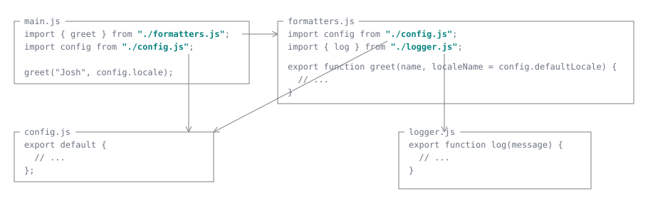

### Linking modules

After the graph has finished loading successfully, the host asks the engine to _link_ the entry module. The main goal of linking is to set up the [module environment](/en-US/docs/Glossary/Scope), i.e., the various {{glossary("binding", "bindings")}}, including the bindings to be exported. Each imported name is resolved to the place where it's actually defined and exported, potentially going through multiple layers of `export from` declarations. All modules in the graph need to be linked before they can be evaluated, so that importing a name that isn't exported on the other side can be caught early, before any code starts evaluating. It also makes subsequent evaluation easier because it avoids walking the module graph many times as each imported name gets used.

During the linking phase, the engine traverses the module graph using depth-first search. Each time:

- The engine visits a module. If the module is already linked, or is already being linked (which happens with [cyclic imports](#cyclic_imports)), the engine does not process it again. Otherwise, the engine marks the module as currently linking.
- The engine recursively links each of the module's dependencies using the same process. Unlike loading, linking is fully synchronous and deterministic: dependencies are visited in the order their module requests appear in the source.
- After all dependencies have been visited, the engine sets up the module's own environment. It creates a binding for each top-level declaration of the module. For each imported name (other than imports that resolve to a module namespace object), it resolves the name to the binding in the module that actually declares it, then creates an _indirect binding_: a name in the importing module that permanently refers to that other module's binding. Imports that resolve to a module namespace object, including named imports of `export * as ns from` exports, instead create local bindings initialized with that object. If some imported name cannot be resolved, linking fails.
- This module is marked as linked. (If there's a cycle, then they are all marked as linked together; again, we'll talk about this later.)

In our example:

- The engine starts with `main.js` and follows its first dependency, `formatters.js`. Before setting up `formatters.js`, it visits `config.js` and `logger.js` first.
- For `config.js`, the engine creates a binding for the default export, but does not yet evaluate the object literal.
- For `logger.js`, the engine creates the `log` binding and initializes it with the function object, without running the function body. Just like normal declarations (see {{glossary("hoisting")}}), `export` bindings are also created and initialized in separate steps—function declarations are initialized during linking, `var` declarations are initialized to `undefined`, while `let`, `const`, and `class` declarations remain uninitialized until evaluation reaches them.
- The engine can now set up `formatters.js`. Its imported `config` binding refers to the default export of `config.js`, and its imported `log` binding refers to the `log` binding in `logger.js`. Its own `greet` binding is initialized with the function object.
- Finally, the engine returns to `main.js`. Its other dependency, `config.js`, is already linked, so the engine reuses it. It connects `main.js`'s `greet` and `config` imports to their respective exported bindings.

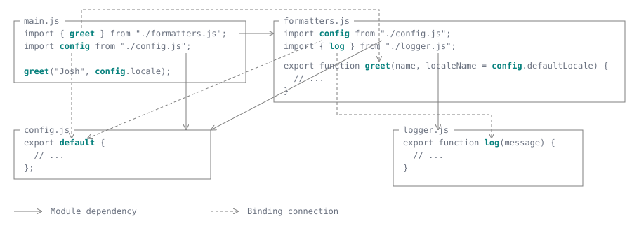

Most of the time, the imported name is declared directly in the imported module, as in the example here, so the binding connections follow the same paths as the module dependency graph. However, if you use `export from`, or export an identifier you imported, the linker will follow those layers until it finds the place where it's actually declared.

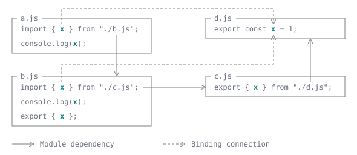

Here, although the import chain is `a.js → b.js → c.js → d.js`, every single `x` binding in this chain eventually resolves to the same `const` declaration in `d.js`, while `c.js` has no module-scoped binding. The binding connections go directly to `d.js`, while the module dependency graph still includes the entire import chain.

An `export * from` declaration re-exports all names from another module (except for `default`) as named exports of the current module. When resolving an imported name, the engine first checks for an explicit export of that name. If there is none, it follows the `export * from` declarations and recursively resolves the name in those modules.

Multiple `export * from` declarations may make the current module export the same name multiple times (again, `export * from` never collides with an explicit named export; the latter always takes priority). If these declarations eventually resolve to the same binding, then there's no ambiguity. If they resolve to different bindings, the name is ambiguous, even if those bindings happen to contain the same value. For example:

```js
// -- first.js --
export const x = 1;
```

```js
// -- second.js --
export const x = 1;
```

```js
// -- combined.js --
export * from "./first.js";
export * from "./second.js";
// Should "x" from this module resolve to first.js or second.js?
```

The star exports alone do not cause an error. However, `import { x } from "./combined.js"` or `export { x } from "./combined.js"` causes a {{jsxref("SyntaxError")}} during linking. A namespace import, `import * as combined from "./combined.js"`, succeeds, but the namespace object has no `x` property.

Adding `export { x } from "./first.js"` to `combined.js` resolves the ambiguity: explicit exports take precedence over star exports, regardless of declaration order.

### Evaluating modules

Now that all modules have their environment prepared, they are finally ready for evaluation. The host asks the engine to evaluate the entry module. The engine traverses the module graph yet again, using depth-first search. For now, assume no module uses [top-level `await`](#top-level_await_and_asynchronous_evaluation). Each time:

- The engine visits a module. If the module has already been evaluated successfully, it does not execute it again. If a previous evaluation failed, the engine propagates the recorded error instead. If the module is already being evaluated, the engine does not visit its dependencies again, avoiding infinite recursion in a cycle. Otherwise, it marks the module as currently evaluating.
- The engine recursively evaluates each dependency using the same process, in the order their module requests appear in the source.
- After visiting all dependencies, the engine executes the module body. Variable initializers run, initializing the bindings prepared during linking, and other statements execute in source order. Imported names access the bindings connected during linking. In a cycle, a dependency's body may not have executed yet, so an imported binding may still be uninitialized; we'll discuss this [later](#cyclic_imports).
- After the module body finishes successfully, the module is marked as evaluated. In a cycle, modules in the same strongly connected component are marked as evaluated together once their bodies have finished.

In our example:

- The engine starts with `main.js`, follows its dependency on `formatters.js`, and then reaches `config.js`. It evaluates the object literal and initializes the default-export binding with the resulting object.
- Next, it evaluates `logger.js`. Its `log` function was already created during linking, and the function body does not execute until the function is called.
- The engine returns to `formatters.js`. Its `greet` function was also created during linking; neither its body nor its default parameter expression runs yet.
- Finally, the engine returns to `main.js`. Its other dependency, `config.js`, has already been evaluated, so it is not executed again. The engine calls `greet("Josh", config.locale)`, which calls `log` and prints a timestamp followed by `Hello, Josh!`.

Moving the `import` declarations below the `greet()` call, while keeping their relative order, would not change this order: dependencies are evaluated before the importing module's body starts, regardless of where its import declarations appear among other statements.

If evaluation throws an uncaught error, it propagates through the dependent modules being evaluated, and the entry module's evaluation promise rejects. Effects of code that already ran are not undone, and the error is retained so subsequent evaluation attempts do not execute the failed module again.

With top-level `await`, a module can suspend execution and delay modules that depend on it while other branches continue; we'll cover this in [asynchronous evaluation](#top-level_await_and_asynchronous_evaluation).

## Errors during the module pipeline

Any point in the module pipeline—load, link, and evaluate—could fail. The errors might leave the graph in a half-processed state.

### Errors from loading

Loading errors for a module request may be for one of the following reasons (this step is performed by the host, so many reasons are host-specific):

- The specifier failed to resolve (for example, it's not a valid URL)
- The request contains invalid import attributes
- The request returned an error status or the file system generated an error
- The source code failed to parse

If a module request failed, the loading process for this graph stops immediately without processing any unprocessed module requests. Already in-progress requests may still complete normally and be used later.

For example, suppose we add an import to `config.js` in the graph above:

```js
// -- config.js --
import "./non-existent.js";

export default {
  locale: "en-US",
  defaultLocale: "en-US",
};
```

1. `main.js` starts loading both `formatters.js` and `config.js`.
2. `config.js` finishes first.
3. Its request for `non-existent.js` fails (in Node.js, resolution throws `ERR_MODULE_NOT_FOUND`) while `formatters.js` is still loading.
4. The request for `formatters.js` can still finish, but this graph's loading process no longer traverses its dependencies, so `logger.js` is never requested by this traversal.

This assumes a fresh load without preloading or another entry point requesting these modules; if `formatters.js` had finished earlier, `logger.js` might already be loading too. No modules in this example are linked or evaluated.

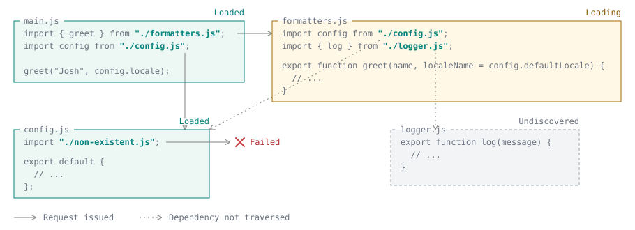

Retry behavior depends on the host and the kind of failure. In browsers, the module map is separate from the HTTP cache. The [HTML specification](https://html.spec.whatwg.org/multipage/webappapis.html#fetch-a-single-module-script) requires failed fetches, including HTTP error responses, to be removed from the module map so a later import can retry. The HTTP cache may still supply a cached error response. Parse errors, however, are retained in the module map, so retrying the same module does not fetch corrected source. Unlike module loading, {{domxref("Window/fetch", "fetch()")}} does not reject merely because the response has an HTTP error status.

Linking is only performed if _all_ modules in the graph completed loading. A graph partially loaded due to errors is never linked.

### Errors from linking

Linking errors for an import may be for one of the following reasons:

- The import points to a non-exported binding in the target module
- The import points to a binding that's cyclically exported and never actually defined (for example, `a.js` writes `export { x } from "./b.js"` and `b.js` writes `export { x } from "./a.js"`)
- The import points to a binding that's ambiguous between two `export * from` declarations

For example, starting from the original graph without the loading error, suppose we add `missing` to the import from `logger.js` in `formatters.js`:

```js
// -- formatters.js --
import config from "./config.js";
import { log, missing } from "./logger.js";

// The rest of the module is unchanged.
```

1. All four modules finish loading and are marked as unlinked.
2. Linking starts with `main.js`, then visits `formatters.js` and its dependencies.
3. `config.js` and `logger.js` are linked successfully.
4. While setting up the environment for `formatters.js`, the engine creates the imports for `config` and `log`, but cannot resolve `missing`, because `logger.js` does not export that name. It throws a {{jsxref("SyntaxError")}}.
5. `formatters.js` and `main.js`, which were still being linked, return to the unlinked state. `config.js` and `logger.js` remain linked. No module bodies are evaluated.

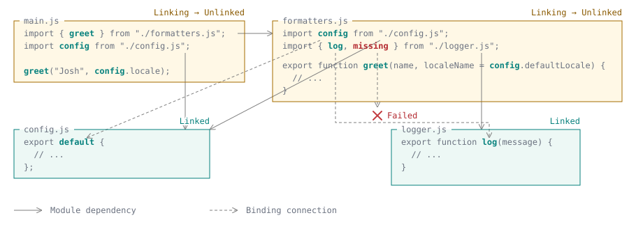

Note that linking is synchronous and side-effect-free. The host can do it after loading and before evaluation, and even retry it if it fails (although the same graph of JavaScript modules will encounter the same linking error). If a linking error occurs, this import does not start evaluation. Shared dependencies may already have been evaluated through another entry point.

### Errors from evaluation

Errors from evaluation are the normal errors you get from executing JavaScript: using `throw` statements, making invalid function calls, accessing uninitialized variables, etc. When evaluation of a module throws, it may also leave the module graph in a partially-evaluated state.

For example, starting from the original graph without the loading or linking errors, suppose we add a top-level `throw` to `config.js`:

```js
// -- config.js --
export default {
  locale: "en-US",
  defaultLocale: "en-US",
};

throw new Error("Configuration unavailable");
```

We also add one more dependency before the existing imports in `main.js`, just to show the case where a module finished evaluating successfully.

1. All five modules finish loading and linking successfully.
2. Evaluation starts with `main.js`, then visits its first dependency, `extra.js`, which finishes evaluating successfully.
3. The traversal visits `formatters.js`, then its first dependency, `config.js`, which creates the configuration object, then reaches the `throw` statement.
4. The error propagates through `formatters.js` to `main.js`. Neither module's body starts executing, so `greet("Josh", config.locale)` is never called.
5. `config.js`, `formatters.js`, and `main.js` are marked as evaluated, with the error recorded. `extra.js` remains successfully evaluated. The traversal never reaches `logger.js`, which remains linked but unevaluated.

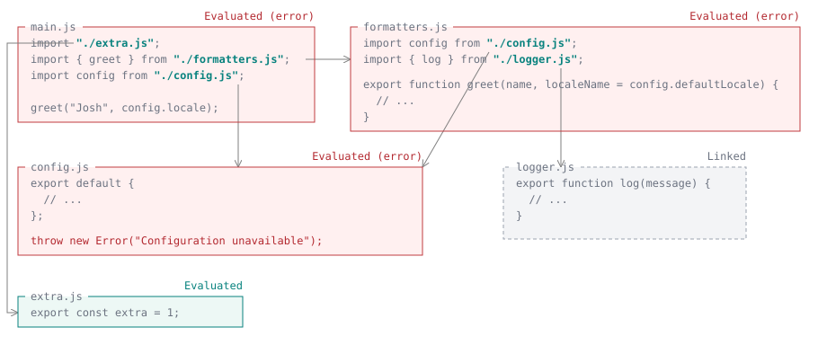

The _evaluated_ status means the evaluation attempt is finished, not necessarily that the module's body ran successfully—or at all. Because module evaluation has side effects, the engine guarantees that the same module is only ever evaluated once, whether or not it encountered an error (including when its dependency errored). Subsequent imports that reuse this module expose the same module namespace object on success, or propagate the recorded error on failure. The namespace object continues to expose live bindings. A new environment, such as a new page or worker, can load and evaluate the source again. Any effects of code that ran before the error are not undone.

## Cyclic imports

The module dependency graph is traversed using DFS twice for linking and evaluation (loading can traverse branches concurrently in a non-deterministic order, and cycles do not affect it any more than normal shared dependencies do). This strategy works well for acyclic dependency graphs, like the example presented above. Even the case where two modules import the same module is minimally problematic—there's always a well-defined "end" (`config.js` and `logger.js`) from where we can work backwards. We just need to be careful not to link or evaluate the same module twice.

However, cycles are often inevitable. Cyclic import arises if module `a` imports module `b`, but `b` directly or indirectly depends on `a`. For example, consider the simplest two-module cycle:

```js
// -- a.js --
import { b } from "./b.js";

export const a = 2;
```

```js
// -- b.js --
import { a } from "./a.js";

export const b = 1;
```

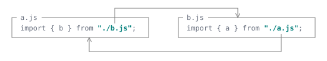

Assuming no errors are ever thrown (including errors caused by accessing uninitialized imports, which we'll talk about very soon), the naïve DFS approach actually still works. Take the linking steps as an example:

- The engine visits `a.js` and marks it as currently linking. But before actually setting up its module environment, its dependencies must be visited first.
- The engine visits `b.js` and marks it as currently linking. But before actually setting up its module environment, its dependencies must be visited first.
- The engine visits `a.js` again, and sees that it's already marked as linking. There's no other downstream dependency.
- The engine links `b.js`, pointing `a` to the `export const a` in `a.js`.
- The engine links `a.js` by pointing `b` similarly.
- No upstream dependency is waiting for `a.js` and `b.js` to link; the whole graph finishes.

As long as each import can be traced back to some concrete definition and not a cyclic re-export (for example, `a.js` writes `export { x } from "./b.js"` and `b.js` writes `export { x } from "./a.js"`), linking does not require the definition to come from an already-linked module.

Similarly, for evaluation, `b.js` evaluates first because it's a dependency of `a.js`. It also depends on `a.js`, but `a.js` is already marked as evaluating, so the engine doesn't go back to `a.js`. The `b.js` module then evaluates the `const b` initialization. Finally, the `a.js` module evaluates and initializes `a = 2`.

As this example shows, cyclic imports don't always fail. The imported variable's value is only retrieved when the variable is actually used (hence allowing [live bindings](/en-US/docs/Web/JavaScript/Reference/Statements/import#imported_values_can_only_be_modified_by_the_exporter)), and only if the variable remains uninitialized at that time will a [`ReferenceError`](/en-US/docs/Web/JavaScript/Reference/Errors/Cant_access_lexical_declaration_before_init) be thrown. So for example, even if you use the value of `a` and `b`, you can prevent errors if you make sure the initialization happens before the usage:

```js
// -- a.js --
import { b } from "./b.js";

setTimeout(() => {
  console.log(b); // 1
}, 10);

export const a = 2;
```

```js
// -- b.js --
import { a } from "./a.js";

setTimeout(() => {
  console.log(a); // 2
}, 10);

export const b = 1;
```

In this example, both `a` and `b` are used asynchronously. Therefore, at the time the module is evaluated, neither `b` nor `a` is actually read, so the rest of the code is executed as normal, and the two `export` declarations produce the values of `a` and `b`. Then, after the timeout, both `a` and `b` are available, so the two `console.log` statements also execute as normal.

If you change the code to use `a` synchronously, the module evaluation fails:

```js
// -- a.js (entry module) --
import { b } from "./b.js";

export const a = 2;
```

```js
// -- b.js --
import { a } from "./a.js";

console.log(a); // ReferenceError: Cannot access 'a' before initialization
export const b = 1;
```

This is because when JavaScript evaluates `a.js`, it needs to first evaluate `b.js`, the dependency of `a.js`. However, `b.js` uses `a`, which is not yet available.

On the other hand, if you change the code to use `b` synchronously but `a` asynchronously, the module evaluation succeeds:

```js
// -- a.js (entry module) --
import { b } from "./b.js";

console.log(b); // 1
export const a = 2;
```

```js
// -- b.js --
import { a } from "./a.js";

setTimeout(() => {
  console.log(a); // 2
}, 10);
export const b = 1;
```

This is because the evaluation of `b.js` completes normally, so the value of `b` is available when `a.js` is evaluated.

Function declarations are much more resilient in cycles, because they are initialized during [linking](#linking_modules), before any module body runs. Just like how {{glossary("hoisting")}} allows two functions to call each other regardless of their declaration order, link-time initialization allows the same to happen across module boundaries.

```js
// -- a.js (entry module) --
import { isEven } from "./b.js";

export function isOdd(n) {
  return n !== 0 && isEven(n - 1);
}
```

```js
// -- b.js --
import { isOdd } from "./a.js";

console.log(isEven(5)); // false

export function isEven(n) {
  return n === 0 || isOdd(n - 1);
}
```

Even though there's no asynchronous waiting, the `isOdd` binding in `a.js` was already initialized with its function object during linking, before `a.js`'s body has run. These modules only export function declarations, and their functions do not read any state initialized during module evaluation, so they can safely call each other. Reading an uninitialized `let`, `const`, or `class` binding would still throw, even if that binding were private to an exported function's module.

### Errors with cyclic imports

The problem becomes more complicated when there's a linking or evaluation error. Suppose we add `throw new Error("Evaluation failed");` after `export const a = 2;` in the two-module cycle above. A naïve traversal would mark `b.js` as evaluated successfully before executing `a.js`, which then throws:

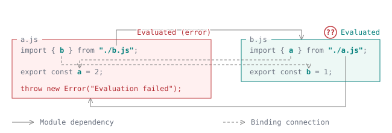

In this example, if `a.js` fails to link or evaluate, we don't want to mark `b.js` as successful even though it has finished its own linking and evaluating—because its success is contingent on the success of `a.js`, a dependency of it! Therefore, in a cycle, we must mark all modules as succeeding or failing together.

The precise term we are looking for is a _strongly connected component_ (SCC). An SCC is a maximal group of modules where every module can reach every other module. An SCC can consist of a single cycle or a union of cycles that share vertices, as long as the group is maximal:

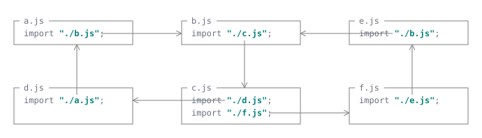

In graph theory, we know that any directed graph can be seen as an acyclic graph of SCCs (by viewing SCCs as nodes, we get a "condensation graph"). So if we process SCCs like we process single nodes (marking everything as succeeding or failing together), then we would end up with an acyclic graph, which we've established as easy to handle.

The end effect is that, in the case above, when `b.js` finishes evaluating, it is not marked as evaluated yet—it waits until `a.js` finishes.

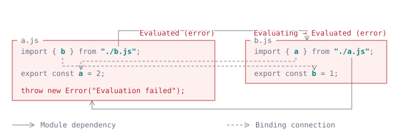

### Avoiding cyclic imports

You should usually avoid cyclic imports in your project, because they make your code more error-prone. Some common cycle-elimination techniques are:

- Merge the two modules into one.
- Move the shared code into a third module.
- Move some code from one module to the other.

However, cyclic imports can also occur if the libraries depend on each other, which is harder to fix.

## Top-level await and asynchronous evaluation

Modules can use [`await`](/en-US/docs/Web/JavaScript/Reference/Operators/await#top-level_await) at the top level, outside any function. This allows a module to finish asynchronous initialization before modules that depend on it execute. Previously, our [evaluation](#evaluating_modules) was synchronous; now, we must make it asynchronous too, which has lots of implications about side-effect ordering and errors.

For example, suppose we change `config.js` to retrieve its configuration from a server, which returns the same object as in our original example:

```js
// -- config.js --
const response = await fetch("https://example.com/config.json");
if (!response.ok) {
  throw new Error(`Failed to fetch configuration: ${response.status}`);
}
export default await response.json();
```

The other modules don't need to change: the module system automatically waits for `config.js` to finish before executing their bodies and executing their dependents like `main.js`.

Previously, a module is either evaluated, unevaluated, or in an SCC and waiting for other modules to evaluate. Now, a module can also be _in progress_. It covers both modules whose own asynchronous execution is in progress and modules waiting for asynchronous dependencies. A module can therefore have this status without containing an `await` expression.

The engine still traverses dependencies depth-first, in the order their module requests appear in the source. However, it no longer needs to finish executing one branch before visiting another. For an acyclic graph, the process is:

- The engine visits a module's dependencies, as before. If a dependency is still in progress, the engine records that this module must wait for it, but continues visiting the other dependencies.
- Once all dependencies have been visited and none is in progress, the engine starts the module's body. A module with top-level `await` executes until it reaches an `await`, then suspends until the awaited value settles. It remains in progress until its entire body finishes, including any further `await` expressions.
- A module whose dependencies are still in progress is also in progress and waits without executing any of its body, even the code before its first `await`. This also applies to modules that have no top-level `await` themselves.
- When a module finishes successfully, the engine checks which waiting importers can now execute. An importer starts only after all the dependencies it was waiting for have finished successfully. If several modules become ready together, the engine uses the evaluation order established by the depth-first traversal to decide which to start first.

> [!NOTE]
> When multiple asynchronous modules are simultaneously executing (for example if `logger.js` also contains a top-level `await`), the behavior is the same as executing two async functions concurrently: each `await` yields out the current job and allows the other module to resume. See [control flow effects of `await`](/en-US/docs/Web/JavaScript/Reference/Operators/await#control_flow_effects_of_await).

In our example, the engine reaches `config.js` through `main.js` and `formatters.js`. It starts the fetch and suspends `config.js` at the first `await`. It then visits and evaluates `logger.js`, which doesn't depend on the configuration. `formatters.js` must wait for `config.js`, and `main.js` must wait for both `formatters.js` and `config.js`. After the response body has been parsed and `config.js` finishes, `formatters.js` executes, followed by `main.js`, which calls `greet()`.

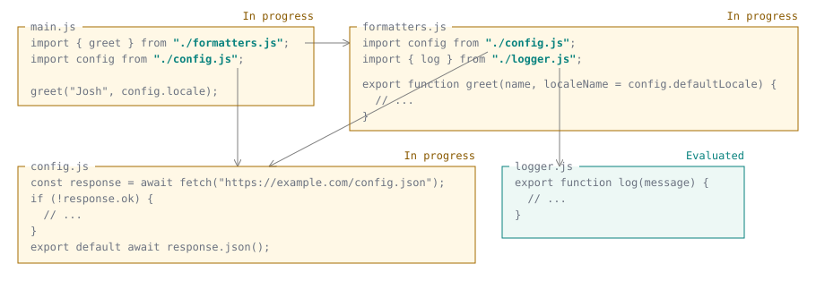

### Tainting effects of top-level await

Top-level `await` therefore affects more than the module that contains it: it makes the evaluation of every module that transitively imports it asynchronous too. In the following module graph, only `Config` and `Database` contain top-level `await`, but `Auth`, `Reports`, `Documents`, `Router`, `Dashboard`, `Editor`, and `App` all depend on their asynchronous completion. The other branches can still evaluate synchronously.


This matters when an API needs evaluation to finish synchronously. In Node.js, [`require()` can load an ES module](https://nodejs.org/api/modules.html#loading-ecmascript-modules-using-require) only if its entire dependency graph is synchronous. A module with top-level `await` "taints" every module above it (in other words, everything that imports it), so they cannot be synchronously imported with `require()`. In the graph above, `require()` can load `Help`, but it cannot load `Router`, even though `Router` itself contains no `await`.

Similarly, [`import defer`](/en-US/docs/Web/JavaScript/Reference/Statements/import/defer#top-level_await) can only defer synchronous execution, because accessing a property on its namespace must be able to finish evaluation synchronously. For `import defer`, the "tainting" happens in the other direction: anything _below_ the module with top-level `await` (in other words, everything it imports) cannot be deferred. The remaining synchronous execution can stay deferred. For example, if another module uses `import defer` to import `App` in the graph above, `Config` and `Database`, together with their dependencies `Parse` and `Codec`, evaluate before that importer's body runs. The bodies of `App` and its remaining dependencies can stay deferred. Although the ancestors of `Config` and `Database` depend on asynchronous evaluation, their own bodies do not contain top-level `await` and can execute synchronously once those dependencies have finished.

Adding top-level `await` to an existing module can be a breaking change for its importers, even if its exports remain unchanged. It delays their entire bodies, including statements written before their `import` declarations, while independent modules can continue executing. This can alter the execution order of sibling modules.

For example, these modules rely on the order of sibling imports to initialize a global variable before reading it:

```js
// -- entry.js --
import "./setup.js";
import "./display.js";
```

```js
// -- setup.js --
import { locale } from "./settings.js";

globalThis.appLocale = locale;
```

```js
// -- settings.js --
export const locale = "en-US";
```

```js
// -- display.js --
console.log(globalThis.appLocale); // "en-US"
```

Now suppose `settings.js` introduces top-level `await`:

```js
// -- settings.js --
export const locale = await Promise.resolve("en-US");
```

`setup.js` now waits for `settings.js` before executing the assignment to `globalThis.appLocale`. Meanwhile, `display.js` executes and logs `undefined`, assuming `appLocale` was not already defined. The order of imports in `entry.js` does not make `display.js` wait for `setup.js` to finish.

To preserve the required ordering, make `display.js` explicitly depend on `setup.js`. This is safe because a module is only evaluated once per application.

```js
// -- display.js --
import "./setup.js";

console.log(globalThis.appLocale); // "en-US"
```

The same issue can occur if `setup.js` and `display.js` are entry points of separate `<script type="module">` elements in that order. The explicit import ensures that `display.js` waits for setup in that case too.

### Handling cycles with top-level await

Cycles require an additional distinction between the static dependency graph and the dependencies that evaluation actually waits for. Consider the [asynchronous example in the specification](https://tc39.es/ecma262/multipage/ecmascript-language-scripts-and-modules.html#sec-example-cyclic-module-record-graphs), with `a.js` as the entry point and all five modules containing top-level `await`:

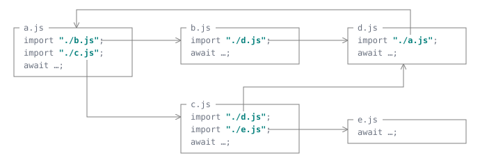

The modules `a.js`, `b.js`, `c.js`, and `d.js` form one SCC. The engine first visits `a.js`, `b.js`, and `d.js`. When it encounters `d.js`'s import of `a.js`, it breaks out of the cycle as before. At this point, `a.js` has not yet been recorded as awaiting asynchronous completion, so this edge does not make `d.js` wait for `a.js`. `d.js` starts executing. The engine then visits the other branch through `c.js`, finds that `d.js` is pending, and starts `e.js`.

Suppose the asynchronous operations finish in the following order:

- `e.js` finishes. `c.js` still waits for `d.js`, so no other module starts yet.
- `d.js` finishes. Both `b.js` and `c.js` are now ready. `b.js` starts first, following the traversal's evaluation order, but when it suspends at `await`, `c.js` can start too.
- `c.js` finishes. `a.js` still waits for `b.js`.
- `b.js` finishes. `a.js` can now start executing its body.
- `a.js` finishes. The entry point's evaluation promise fulfills.

Unlike the synchronous cycles discussed earlier, the modules in an asynchronous SCC do not necessarily transition to _evaluated_ together. Each can finish at a different time. To preserve the component's overall outcome, the engine associates its modules with a _cycle root_: the first module visited in that SCC, `a.js` in our case. Imports that encounter the component after its initial traversal use this root to wait for the component's completion and check for an evaluation error. A module's body finishing successfully does not, by itself, mean that the whole component can be imported successfully.

For example, suppose `c.js` fails while `b.js` is still awaiting. The error propagates to `a.js`, whose body never starts, and the entry point's evaluation promise rejects. `b.js` keeps executing. Nevertheless, a later dynamic import of `b.js` rejects with the error recorded on the cycle root `a.js`. The successful execution of `b.js` does not erase the component's failure.

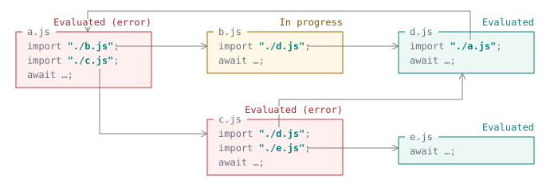

### Deadlocks

You can have deadlocks with modules containing top-level await:

```js
// -- a.js --
import { resolve } from "./b.js";

resolve();
```

```js
// -- b.js --
const { promise, resolve } = Promise.withResolvers();
export { resolve };
await promise;
```

If evaluation starts at `a.js`, it waits for `b.js` to finish before executing its body. But `b.js` awaits a promise that only the call to `resolve()` in `a.js` can fulfill. Neither evaluation can complete. The module algorithm does not automatically reject the promises to break this deadlock.

The above may look contrived. A more realistic situation is when you wait on a dynamic import of a module that depends on the current module.

```js
// -- a.js --
await import("./b.js");
```

```js
// -- b.js --
import "./a.js";
```

Similarly in this case, `b.js` waits for the dynamic import in `a.js` to complete, but the dynamic import can only complete when `b.js` finishes executing.

## Dynamic imports

Everything introduced so far uses static `import` with the entry point being the entry point to the whole application (the `node` command line, the HTML file, etc.), so the loading and linking happens before any user code is run. A [dynamic import](/en-US/docs/Web/JavaScript/Reference/Operators/import), `import()`, instead starts an import when user code execution reaches the expression, with the requested module as the entry point. This allows you to dynamically _augment_ the module graph after the initial graph is already up and running (or—with top-level `await`—_while_ the initial graph is evaluating).

For example, we can change the original `main.js` to listen for data from Node.js's [`process.stdin`](https://nodejs.org/api/process.html#processstdin), and import `formatters.js` only when the user types `Hi` and presses Enter:

```js
import config from "./config.js";

process.stdin.on("data", async (data) => {
  if (data.toString().trim() !== "Hi") return;
  const { greet } = await import("./formatters.js");
  greet("Josh", config.locale);
});
```

Initially, loading `main.js` discovers `config.js`. Registering the listener completes `main.js`'s evaluation without loading `formatters.js`. When the listener receives `Hi`, another loading process starts from `formatters.js` and discovers its imports of `config.js` and `logger.js`. In this case, `config.js` is already available and is reused, while `logger.js` needs to be loaded too, assuming nothing else has requested it. The new branch therefore joins the existing graph at `config.js`, reusing the same module.


Augmentation of the module graph can encounter existing modules in any state, and that state is preserved—loading modules keep loading, loaded modules aren't re-fetched, linked modules aren't re-linked, evaluated modules are never re-evaluated (including if the previous one had an error). In the example above, `config.js` has already evaluated, so only `logger.js` and `formatters.js` need to execute. The dynamically imported module itself may also already exist in the module graph and get reused.

Dynamic import is async, because the loading may need to fetch new modules and evaluation may need to wait for top-level `await`. The `import()` promise resolves when the requested module's evaluation finishes successfully.

The new traversal can also reach the module that called `import()` (`main.js`, for example). Because dynamic imports do not constitute dependency edges (they are only entry points), this does not create a cycle. However, if the caller uses top-level `await` to wait for that import, neither can finish, as shown in the [deadlock example](#deadlocks).

## Module caching

_Module caching_ means reusing a module's identity and state. Repeated successful requests from the same importer, with the same specifier and import attributes, must refer to the same module. Different requests can also refer to the same module, such as when two modules import the same dependency. The host determines how requests map to module identities; see [Module caching on the web](/en-US/docs/Web/JavaScript/Guide/Modules/Modules_on_the_web#module_caching) for browser-specific rules.

This means importers share the module's bindings, including changes made after evaluation. For example, this `counter.js` module keeps a count:

```js
export let count = 0;

export function increment() {
  count++;
}
```

Another module can access the same counter through both static and dynamic imports. The namespace object is shared too.

```js
import * as counter from "./counter.js";

counter.increment();

const sameCounter = await import("./counter.js");
console.log(sameCounter === counter); // true
console.log(sameCounter.count); // 1

sameCounter.increment();
console.log(counter.count); // 2
```

JavaScript provides no standard API for clearing the module cache. If callers need independent state, the module can export a function that creates it:

```js
export function createCounter() {
  let count = 0;
  return {
    increment() {
      return ++count;
    },
  };
}
```

Alternatively, you can add a useless query or fragment to your URL specifier (see [`import()`](/en-US/docs/Web/JavaScript/Reference/Operators/import#module_namespace_object)).

## Controlling import phases

Ordinary `import` declarations trigger the whole [load-link-evaluate process](#from_module_source_to_execution). _Import phase modifiers_ let the importer pause the process at a certain stage. The importer itself can continue through linking and evaluation later, when it actually needs to.

With [`import source`](/en-US/docs/Web/JavaScript/Reference/Statements/import/source), the process is stopped partway through _loading_: the requested module itself is fetched and parsed, but its dependencies are not requested. The imported value is a [_module source object_](/en-US/docs/Web/JavaScript/Reference/Global_Objects/AbstractModuleSource), which can be linked and evaluated using other mechanisms. Using JavaScript source imports as defined by the [ECMAScript Module Phase Imports proposal](https://github.com/tc39/proposal-esm-phase-imports):

```js
// -- main.js --
import source formattersSource from "./formatters.js";
import config from "./config.js";

process.stdin.on("data", async (data) => {
  if (data.toString().trim() !== "Hi") return;
  const { greet } = await import(formattersSource);
  greet("Josh", config.locale);
});
```

After `main.js` evaluates, `formatters.js` has been parsed, but its dependencies have not been traversed through the source import. `logger.js` has not been requested. `config.js` has evaluated because `main.js` imports it normally:

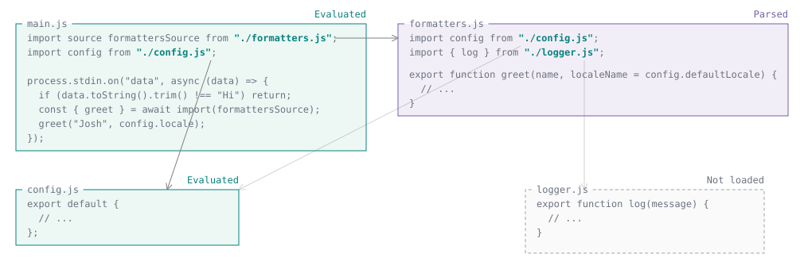

When the listener receives `Hi`, it passes the module source object to `import()`. This starts loading `formatters.js`'s dependencies, reusing `config.js` and loading `logger.js`, then links and evaluates the remaining modules. The promise fulfills with the namespace after evaluation succeeds. Repeated `Hi` inputs reuse the same module instance, without causing another evaluation.

With [`import defer`](/en-US/docs/Web/JavaScript/Reference/Statements/import/defer), the process is stopped before _evaluation_ (but asynchronous evaluation, if any, remains eager). The imported value is a [_deferred module namespace object_](/en-US/docs/Web/JavaScript/Reference/Statements/import/defer#deferred_module_namespace_object). For example:

```js
// -- main.js --
import defer * as formatters from "./formatters.js";
import config from "./config.js";

process.stdin.on("data", (data) => {
  if (data.toString().trim() !== "Hi") return;
  formatters.greet("Josh", config.locale);
});
```

Assuming the original synchronous modules and no other imports, `main.js` can finish evaluating with `formatters.js` and `logger.js` still linked but unevaluated. `config.js` evaluates because `main.js` also imports it normally:

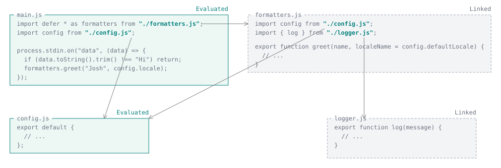

When the listener receives `Hi`, reading `formatters.greet` triggers synchronous evaluation of `logger.js` and then `formatters.js`, reusing the already evaluated `config.js`. If evaluation throws, the property access throws. Loading and linking errors, however, have already been checked before `main.js` executes.

Deferred imports can also be nested, creating a pausing boundary at each `defer`. In the following example, `a.js` defers `b.js`, which defers `c.js`, which in turn defers `d.js`. The other imports are ordinary imports. All modules are synchronous. Each timer reads a property of a deferred namespace, triggering the next stage of evaluation. Each timer has a one-second delay measured from when it is scheduled, so the stages occur roughly 1, 2, and 3 seconds after startup.

At startup, all seven modules are loaded and linked, but only `a.js` evaluates. It schedules a timer without accessing `b`'s properties:

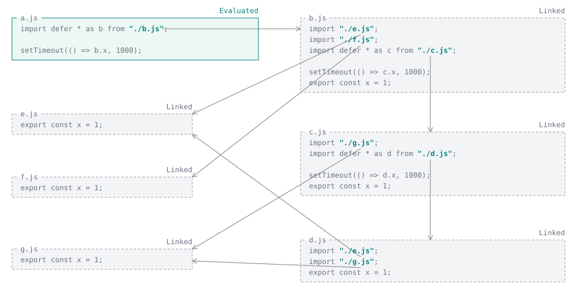

When the first timer runs, reading `b.x` evaluates `e.js`, `f.js`, and then `b.js`. Evaluating `b.js` schedules another timer. Its deferred import of `c.js` does not evaluate it, so `c.js`, `d.js`, and `g.js` remain linked:

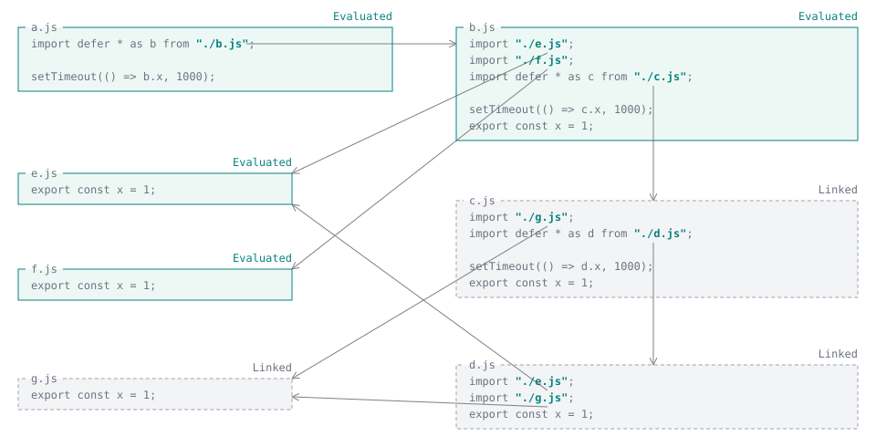

When the second timer runs, reading `c.x` evaluates `g.js` and then `c.js`. Evaluating `c.js` schedules the third timer, without accessing `d`'s properties yet:

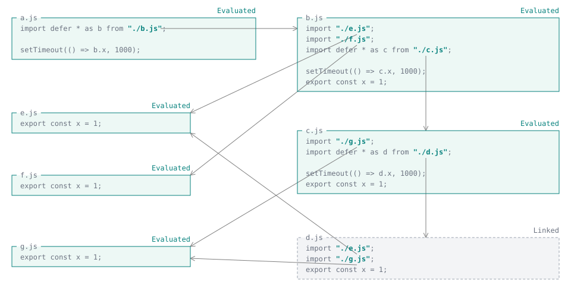

When the third timer runs, reading `d.x` evaluates `d.js`, reusing the already evaluated `e.js` and `g.js`. All modules have now evaluated:

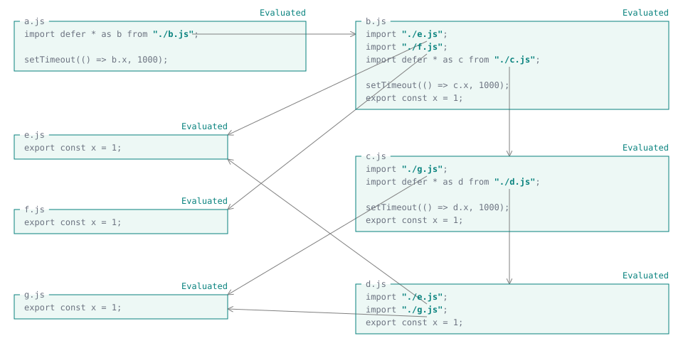

As explained in [Tainting effects of top-level await](#tainting_effects_of_top-level_await), modules containing top-level `await` and their dependencies must execute eagerly, immediately following the initial linking. Only the remaining synchronous execution can stay deferred.

For both kinds of phase modifiers, note that the modifier acts on the _import_, not on the _target module_. This means another ordinary import can cause the same module to evaluate earlier, and no separate cache entries are created for deferred and eager imports of the same module. For more information, see the caching semantics of [`import defer`](/en-US/docs/Web/JavaScript/Reference/Statements/import/defer#caching_semantics) and [`import source`](/en-US/docs/Web/JavaScript/Reference/Statements/import/source#caching_semantics).

Just like `import` is to `import()`, `import source` and `import defer` declarations also have dynamic [`import.source()`](/en-US/docs/Web/JavaScript/Reference/Operators/import/source) and [`import.defer()`](/en-US/docs/Web/JavaScript/Reference/Operators/import/defer) forms, which start their requests when the expressions evaluate.

## See also

- [JavaScript modules](/en-US/docs/Web/JavaScript/Guide/Modules)
- [Using modules on the web](/en-US/docs/Web/JavaScript/Guide/Modules/Modules_on_the_web)
- [Modules across platforms](/en-US/docs/Web/JavaScript/Guide/Modules/Modules_across_platforms)
