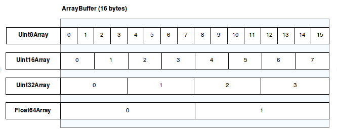

{{jsSidebar("JavaScript Guide")}} {{PreviousNext("Web/JavaScript/Guide/Using_promises", "Web/JavaScript/Guide/Iterators_and_generators")}}

JavaScript typed arrays are array-like objects that provide a mechanism for reading and writing raw binary data in memory buffers.

{{jsxref("Array")}} objects grow and shrink dynamically and can have any JavaScript value. JavaScript engines perform optimizations so that these arrays are fast. However, as web applications become more and more powerful, adding features such as audio and video manipulation, access to raw data using [WebSockets](/en-US/docs/Web/API/WebSockets_API), and so forth, it has become clear that there are times when it would be helpful for JavaScript code to be able to quickly and easily manipulate raw binary data. This is where typed arrays come in. Each entry in a JavaScript typed array is a raw binary value in one of a number of supported formats, from 8-bit integers to 64-bit floating-point numbers.

Typed array objects share many of the same methods as arrays with similar semantics. However, typed arrays are _not_ to be confused with normal arrays, as calling {{jsxref("Array.isArray()")}} on a typed array returns `false`. Moreover, not all methods available for normal arrays are supported by typed arrays (e.g. push and pop).

## Buffers and views: typed array architecture

To achieve maximum flexibility and efficiency, JavaScript typed arrays split the implementation into _buffers_ and _views_. A buffer (implemented by the {{jsxref("ArrayBuffer")}} object) is an object representing a chunk of data; it has no format to speak of, and offers no mechanism for accessing its contents. In order to access the memory contained in a buffer, you need to use a view. A view provides a _context_ — that is, a data type, starting offset, and number of elements — that turns the data into an actual typed array.



### ArrayBuffer

The {{jsxref("ArrayBuffer")}} is a data type that is used to represent a generic, fixed-length binary data buffer. You can't directly manipulate the contents of an `ArrayBuffer`; instead, you create a typed array view or a {{jsxref("DataView")}} which represents the buffer in a specific format, and use that to read and write the contents of the buffer.

### Typed array views

Typed array views have self-descriptive names and provide views for all the usual numeric types like `Int8`, `Uint32`, `Float64` and so forth. There is one special typed array view, {{jsxref("Uint8ClampedArray")}}, which clamps the values between `0` and `255`. This is useful for [Canvas data processing](/en-US/docs/Web/API/ImageData), for example.

| Type                            | Value Range                                                     | Size in bytes | Description                                                                  | Web IDL type          | Equivalent C type               |
| ------------------------------- | --------------------------------------------------------------- | ------------- | ---------------------------------------------------------------------------- | --------------------- | ------------------------------- |
| {{jsxref("Int8Array")}}         | -128 to 127                                                     | 1             | 8-bit two's complement signed integer                                        | `byte`                | `int8_t`                        |
| {{jsxref("Uint8Array")}}        | 0 to 255                                                        | 1             | 8-bit unsigned integer                                                       | `octet`               | `uint8_t`                       |
| {{jsxref("Uint8ClampedArray")}} | 0 to 255                                                        | 1             | 8-bit unsigned integer (clamped)                                             | `octet`               | `uint8_t`                       |
| {{jsxref("Int16Array")}}        | -32768 to 32767                                                 | 2             | 16-bit two's complement signed integer                                       | `short`               | `int16_t`                       |
| {{jsxref("Uint16Array")}}       | 0 to 65535                                                      | 2             | 16-bit unsigned integer                                                      | `unsigned short`      | `uint16_t`                      |
| {{jsxref("Int32Array")}}        | -2147483648 to 2147483647                                       | 4             | 32-bit two's complement signed integer                                       | `long`                | `int32_t`                       |
| {{jsxref("Uint32Array")}}       | 0 to 4294967295                                                 | 4             | 32-bit unsigned integer                                                      | `unsigned long`       | `uint32_t`                      |
| {{jsxref("Float32Array")}}      | `-3.4E38` to `3.4E38` and `1.2E-38` is the min positive number  | 4             | 32-bit IEEE floating point number (7 significant digits e.g., `1.123456`)    | `unrestricted float`  | `float`                         |
| {{jsxref("Float64Array")}}      | `-1.8E308` to `1.8E308` and `5E-324` is the min positive number | 8             | 64-bit IEEE floating point number (16 significant digits e.g., `1.123...15`) | `unrestricted double` | `double`                        |
| {{jsxref("BigInt64Array")}}     | -2<sup>63</sup> to 2<sup>63</sup> - 1                           | 8             | 64-bit two's complement signed integer                                       | `bigint`              | `int64_t (signed long long)`    |
| {{jsxref("BigUint64Array")}}    | 0 to 2<sup>64</sup> - 1                                         | 8             | 64-bit unsigned integer                                                      | `bigint`              | `uint64_t (unsigned long long)` |

### DataView

The {{jsxref("DataView")}} is a low-level interface that provides a getter/setter API to read and write arbitrary data to the buffer. This is useful when dealing with different types of data, for example. Typed array views are in the native byte-order (see [Endianness](/en-US/docs/Glossary/Endianness)) of your platform. With a `DataView` you are able to control the byte-order. It is big-endian by default and can be set to little-endian in the getter/setter methods.

## Web APIs using typed arrays

These are some examples of APIs that make use of typed arrays; there are others, and more are being added all the time.

- [`FileReader.prototype.readAsArrayBuffer()`](/en-US/docs/Web/API/FileReader/readAsArrayBuffer)
  - : The `FileReader.prototype.readAsArrayBuffer()` method starts reading the contents of the specified [`Blob`](/en-US/docs/Web/API/Blob) or [`File`](/en-US/docs/Web/API/File).
- [`XMLHttpRequest.prototype.send()`](/en-US/docs/Web/API/XMLHttpRequest/send)
  - : `XMLHttpRequest` instances' `send()` method now supports typed arrays and {{jsxref("ArrayBuffer")}} objects as argument.
- [`ImageData.data`](/en-US/docs/Web/API/ImageData)
  - : Is a {{jsxref("Uint8ClampedArray")}} representing a one-dimensional array containing the data in the RGBA order, with integer values between `0` and `255` inclusive.

## Examples

### Using views with buffers

First of all, we will need to create a buffer, here with a fixed length of 16-bytes:

```js
const buffer = new ArrayBuffer(16);
```

At this point, we have a chunk of memory whose bytes are all pre-initialized to 0. There's not a lot we can do with it, though. We can confirm that it is indeed 16 bytes long, and that's about it:

```js
if (buffer.byteLength === 16) {
  console.log("Yes, it's 16 bytes.");
} else {
  console.log("Oh no, it's the wrong size!");
}
```

Before we can really work with this buffer, we need to create a view. Let's create a view that treats the data in the buffer as an array of 32-bit signed integers:

```js
const int32View = new Int32Array(buffer);
```

Now we can access the fields in the array just like a normal array:

```js
for (let i = 0; i < int32View.length; i++) {
  int32View[i] = i * 2;
}
```

This fills out the 4 entries in the array (4 entries at 4 bytes each makes 16 total bytes) with the values `0`, `2`, `4`, and `6`.

### Multiple views on the same data

Things start to get really interesting when you consider that you can create multiple views onto the same data. For example, given the code above, we can continue like this:

```js
const int16View = new Int16Array(buffer);

for (let i = 0; i < int16View.length; i++) {
  console.log(`Entry ${i}: ${int16View[i]}`);
}
```

Here we create a 16-bit integer view that shares the same buffer as the existing 32-bit view and we output all the values in the buffer as 16-bit integers. Now we get the output `0`, `0`, `2`, `0`, `4`, `0`, `6`, `0`.

You can go a step farther, though. Consider this:

```js
int16View[0] = 32;
console.log(`Entry 0 in the 32-bit array is now ${int32View[0]}`);
```

The output from this is `"Entry 0 in the 32-bit array is now 32"`.

In other words, the two arrays are indeed viewed on the same data buffer, treating it as different formats. You can do this with any [view types](/en-US/docs/Web/JavaScript/Reference/Global_Objects/TypedArray#typedarray_objects).

### Working with complex data structures

By combining a single buffer with multiple views of different types, starting at different offsets into the buffer, you can interact with data objects containing multiple data types. This lets you, for example, interact with complex data structures from [WebGL](/en-US/docs/Web/API/WebGL_API) or data files.

Consider this C structure:

```cpp
struct someStruct {
  unsigned long id;
  char username[16];
  float amountDue;
};
```

You can access a buffer containing data in this format like this:

```js
const buffer = new ArrayBuffer(24);

// ... read the data into the buffer ...

const idView = new Uint32Array(buffer, 0, 1);
const usernameView = new Uint8Array(buffer, 4, 16);
const amountDueView = new Float32Array(buffer, 20, 1);
```

Then you can access, for example, the amount due with `amountDueView[0]`.

> **Note:** The [data structure alignment](https://en.wikipedia.org/wiki/Data_structure_alignment) in a C structure is platform-dependent. Take precautions and considerations for these padding differences.

### Conversion to normal arrays

After processing a typed array, it is sometimes useful to convert it back to a normal array in order to benefit from the {{jsxref("Array")}} prototype. This can be done using {{jsxref("Array.from()")}}

```js
const typedArray = new Uint8Array([1, 2, 3, 4]);
const normalArray = Array.from(typedArray);
```

as well as the {{jsxref("operators/spread_syntax", "spread syntax", "", 1)}}

```js
const typedArray = new Uint8Array([1, 2, 3, 4]);
const normalArray = [...typedArray];
```

or using the following code where `Array.from()` is unsupported.

```js
const typedArray = new Uint8Array([1, 2, 3, 4]);
const normalArray = Array.prototype.slice.call(typedArray);
```

## See also

- [Getting `ArrayBuffer`s or typed arrays from Base64-encoded strings](/en-US/docs/Glossary/Base64#appendix_decode_a_base64_string_to_uint8array_or_arraybuffer)
- [Faster Canvas Pixel Manipulation with Typed Arrays](https://hacks.mozilla.org/2011/12/faster-canvas-pixel-manipulation-with-typed-arrays/)
- [Typed Arrays: Binary Data in the Browser](https://web.dev/webgl-typed-arrays/)
- [Endianness](/en-US/docs/Glossary/Endianness)

{{PreviousNext("Web/JavaScript/Guide/Using_promises", "Web/JavaScript/Guide/Iterators_and_generators")}}
