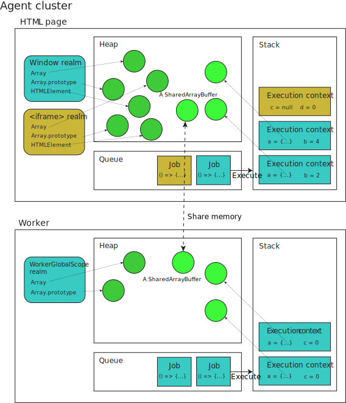

{{jsSidebar("More")}}

This page introduces the basic infrastructure of the JavaScript runtime environment. The model is largely theoretical and abstract, without any platform-specific or implementation-specific details. Modern JavaScript engines heavily optimize the described semantics.

This page is a reference. It assumes you are already familiar with the execution model of other programming languages, such as C and Java. It makes heavy references to existing concepts in operating systems and programming languages.

## The engine and the host

JavaScript execution requires the cooperation of two pieces of software: the **JavaScript engine** and the **host environment**.

The JavaScript engine implements the [ECMAScript (JavaScript) language](/en-US/docs/Web/JavaScript/Reference/JavaScript_technologies_overview#javascript_the_core_language_ecmascript), providing the core functionality. It takes source code, parses it, and executes it. However, in order to interact with the outside world, such as to produce any meaningful output, to interface with external resources, or to implement security- or performance-related mechanisms, we need additional environment-specific mechanisms provided by the host environment. For example, the HTML DOM is the host environment when JavaScript is executed in a web browser. Node.js is another host environment that allows JavaScript to be run on the server side.

While we focus primarily on the mechanisms defined in ECMAScript in this reference, we will occasionally talk about mechanisms defined in the HTML spec, which is often mimicked by other host environments like Node.js or Deno. This way, we can give a coherent picture of the JavaScript execution model as used on the web and beyond.

## Agent execution model

In the JavaScript specification, each autonomous executor of JavaScript is called an **agent**, which maintains its facilities for code execution:

- **Heap** (of objects): this is just a name to denote a large (mostly unstructured) region of memory. It gets populated as objects get created in the program. Note that in the case of shared memory, each agent has its own heap with its own version of a {{jsxref("SharedArrayBuffer")}} object, but the underlying memory represented by the buffer is shared.
- [**Queue** (of jobs)](#job_queue_and_event_loop): this is known in HTML (and also commonly) as the _event loop_ which enables asynchronous programming in JavaScript while being single-threaded. It's called a queue because it's generally first-in-first-out: earlier jobs are executed before later ones.
- [**Stack** (of execution contexts)](#stack_and_execution_contexts): this is what's known as a _call stack_ and allows transferring control flow by entering and exiting execution contexts like functions. It's called a stack because it's last-in-first-out. Every job enters by pushing a new frame onto the (empty) stack, and exits by emptying the stack.

These are three distinct data structures that keep track of different data. We will introduce the queue and the stack in more detail in the following sections. To read more about how heap memory is allocated and freed, see [memory management](/en-US/docs/Web/JavaScript/Guide/Memory_management).

Each agent is analogous to a thread (note that the underlying implementation may or may not be an actual operating system thread). Each agent can own multiple [realms](#realms) (which 1-to-1 correlate with global objects) that can synchronously access each other, and thus needs to run in a single execution thread. An agent also has a single memory model, indicating whether it's little-endian, whether it can be [synchronously blocked](#concurrency_and_ensuring_forward_progress), whether atomic operations are [lock-free](/en-US/docs/Web/JavaScript/Reference/Global_Objects/Atomics/isLockFree), etc.

An agent on the web can be one of the following:

- A _Similar-origin window agent_, which contains various {{domxref("Window")}} objects which can potentially reach each other, either directly or by using {{domxref("Document/domain", "document.domain")}}. If the window is [origin-keyed](/en-US/docs/Web/API/Window/originAgentCluster), then only same-origin windows can reach each other.
- A _Dedicated worker agent_ containing a single {{domxref("DedicatedWorkerGlobalScope")}}.
- A _Shared worker agent_ containing a single {{domxref("SharedWorkerGlobalScope")}}.
- A _Service worker agent_ containing a single {{domxref("ServiceWorkerGlobalScope")}}.
- A _Worklet agent_ containing a single {{domxref("WorkletGlobalScope")}}.

In other words, each worker creates its own agent, while one or more windows may be within the same agent—usually a main document and its similar-origin iframes. In Node.js, a similar concept called [worker threads](https://nodejs.org/api/worker_threads.html) is available.

The diagram below illustrates th execution model of agents:



## Realms

Each agent owns one or more **realms**. Each piece of JavaScript code is associated with a realm when it's loaded, which remains the same even when called from another realm. A realm consists of the follow information:

- A list of intrinsic objects like `Array`, `Array.prototype`, etc.
- Globally declared variables, the value of [`globalThis`](/en-US/docs/Web/JavaScript/Reference/Global_Objects/globalThis), and the global object
- A cache of [template literal arrays](/en-US/docs/Web/JavaScript/Reference/Template_literals#tagged_templates), because evaluation of the same tagged template literal expression always causes the tag to receive the same array object

On the web, the realm and the global object are 1-to-1 corresponded. The global object is either a {{domxref("Window")}}, a {{domxref("WorkerGlobalScope")}}, or a {{domxref("WorkletGlobalScope")}}. So for example, every `iframe` executes in a different realm, though it may be in the same agent as the parent window.

Realms are usually mentioned when talking about the identities of global objects. For example, we need methods such as {{jsxref("Array.isArray()")}} or {{jsxref("Error.isError()")}}, because an array constructed in another realm will have a different prototype object than the `Array.prototype` object in the current realm, so `instanceof Array` will wrongly return `false`.

## Stack and execution contexts

We first consider synchronous code execution. Each [job](#job_queue_and_event_loop) enters by calling its associated callback. Code inside this callback may create variables, call functions, or exit. Each function needs to keep track of its own variable environments and where to return to. To handle this, the agent needs a stack to keep track of the execution contexts. A **execution context**, also known generally as a _stack frame_, is the smallest unit of execution. It tracks the following information:

- Code evaluation state
- The module or script, the function (if applicable), and the currently executing [generator](/en-US/docs/Web/JavaScript/Reference/Global_Objects/Generator) that contains this code
- The current [realm](#realms)
- [Bindings](/en-US/docs/Glossary/Binding), including:
  - Variables defined with `var`, `let`, `const`, `function`, `class`, etc.
  - Private identifiers like `#foo` which are only valid in the current context
  - `this` reference

Imagine a program consisting of a single job defined by the following code:

```js
function foo(b) {
  const a = 10;
  return a + b + 11;
}

function bar(x) {
  const y = 3;
  return foo(x * y);
}

const baz = bar(7); // assigns 42 to baz
```

1. When the job starts, the first frame is created, where the variables `foo`, `bar`, and `baz` are defined. It calls `bar` with the argument `7`.
2. A second frame is created for the `bar` call, containing bindings for the parameter `x` and the local variable `y`. It first performs the multiplication `x * y`, then calls `foo` with the result.
3. A third frame is created for the `foo` call, containing bindings for the parameter `b` and the local variable `a`. It first performs the addition `a + b + 11`, then returns the result.
4. When `foo` returns, the top frame element is popped out of the stack, and the call expression `foo(x * y)` resolves to the return value. It then continues execution, which is just to return this result.
5. When `bar` returns, the top frame element is popped out of the stack, and the call expression `bar(7)` resolves to the return value. This initializes `baz` with the return value.
6. We reach the end of the job's source code, so the stack frame for the entrypoint is popped out of the stack. The stack is empty, so the job is considered completed.

### Generators and reentry

When a frame is popped, it's not necessarily gone forever, because sometimes we need to come back to it. For example, consider a generator function:

```js
function* gen() {
  console.log(1);
  yield;
  console.log(2);
}

const g = gen();
g.next(); // logs 1
g.next(); // logs 2
```

In this case, calling `gen()` first creates an execution context which is suspended—no code inside `gen` gets executed yet. The generator `g` saves this execution context internally. The current running execution context remains to be the entrypoint. When `g.next()` is called, the execution context for `gen` is pushed onto the stack, and the code inside `gen` is executed until the `yield` expression. Then, the generator execution context gets suspended and removed from the stack, which returns control back to the entrypoint. When `g.next()` is called again, the generator execution context is pushed back onto the stack, and the code inside `gen` resumes from where it left off.

### Tail calls

One mechanism defined in the specification is _proper tail call_ (PTC). A function call is a tail call if the caller does nothing after the call except return the value:

```js
function f() {
  return g();
}
```

In this case, the call to `g` is a tail call. If a function call is in tail position, the engine is required to discard the current execution context and replace it with the context of the tail call, instead of pushing a new frame for the `g()` call. This means that tail recursion is not subject to the stack size limits:

```js
function factorial(n, acc = 1) {
  if (n <= 1) return acc;
  return factorial(n - 1, n * acc);
}
```

In reality, discarding the current frame causes debugging problems, because if `g()` throws an error, `f` is no longer on the stack and won't appear in the stack trace. Currently, only Safari (JavaScriptCore) implements PTC, and they have invented some [specific infrastructure](https://webkit.org/blog/6240/ecmascript-6-proper-tail-calls-in-webkit/) to address the debuggability issue.

### Closures

Another interesting phenomenon related to variable scoping and function calls is [closures](/en-US/docs/Web/JavaScript/Guide/Closures). Whenever a function is created, it also memorizes internally the variable bindings of the current running execution context. Then, these variable bindings can outlive the execution context.

```js
let f;
{
  let x = 10;
  f = () => x;
}
console.log(f()); // logs 10
```

## Job queue and event loop

An agent is a thread, which means the interpreter can only process one statement at a time. When the code is all synchronous, this is fine because we can always make progress. But if the code needs to perform asynchronous action, then we cannot progress unless that action is completed. However, it would be detrimental to user experience if that halts the whole program—the nature of JavaScript as a web scripting language requires it to be [never blocking](#never_blocking). Therefore, the code that handles the completion of that asynchronous action is defined as a callback. This callback defines a **job**, which gets placed into a **job queue**—or, in HTML terminology, an event loop—once the action is completed.

Every time, the agent pulls a job from the queue and executes it. When the job is executed, it may create more jobs, which are added to the end of the queue. Jobs can also be added via the completion of asynchronous platform mechanisms, such as timers, I/O, and events. A job is considered completed when the [stack](#stack_and_execution_contexts) is empty; then, the next job is pulled from the queue. Jobs might not be pulled with uniform priority—for example, HTML event loops split jobs into two categories: _tasks_ and _microtasks_. Microtasks have higher priority and the microtask queue is drained first before the task queue is pulled. For more information, check the [HTML microtask guide](/en-US/docs/Web/API/HTML_DOM_API/Microtask_guide). If the job queue is empty, the agent waits for more jobs to be added.

### "Run-to-completion"

Each job is processed completely before any other job is processed. This offers some nice properties when reasoning about your program, including the fact that whenever a function runs, it cannot be preempted and will run entirely before any other code runs (and can modify data the function manipulates). This differs from C, for instance, where if a function runs in a thread, it may be stopped at any point by the runtime system to run some other code in another thread.

For example, consider this example:

```js
const promise = Promise.resolve();
let i = 0;
promise.then(() => {
  i += 1;
  console.log(i);
});
promise.then(() => {
  i += 1;
  console.log(i);
});
```

In this example, we create an already-resolved promise, which means any callback attached to it will be immediately scheduled as jobs. The two callbacks seem to cause a race condition, but actually, the output is fully predictable: `1` and `2` will be logged in order. This is because each job runs to completion before the next one is executed, so the overall order is always `i += 1; console.log(i); i += 1; console.log(i);` and never `i += 1; i += 1; console.log(i); console.log(i);`.

A downside of this model is that if a job takes too long to complete, the web application is unable to process user interactions like click or scroll. The browser mitigates this with the "a script is taking too long to run" dialog. A good practice to follow is to make job processing short and if possible cut down one job into several jobs.

### Never blocking

Another important guarantee offered by the event loop model is that JavaScript execution is never blocking. Handling I/O is typically performed via events and callbacks, so when the application is waiting for an [IndexedDB](/en-US/docs/Web/API/IndexedDB_API) query to return or a [`fetch()`](/en-US/docs/Web/API/Window/fetch) request to return, it can still process other things like user input. The code that executes after the completion of an asynchronous action is always provided as a callback function (for example, the promise {{jsxref("Promise/then", "then()")}} handler, the callback function in `setTimeout()`, or the event handler), which defines a job to be added to the job queue once the action completes.

Of course, the guarantee of "never-blocking" requires the platform API to be inherently asynchronous, but some legacy exceptions exist like `alert()` or synchronous XHR. It is considered good practice to avoid them to ensure the responsiveness of the application.

## Agent clusters and memory sharing

Multiple agents can communicate via memory sharing, forming an **agent cluster**. Agents are within the same cluster if and only if they can share memory. There is no built-in mechanism for two agent clusters to exchange any information, so they can be regarded as completely isolated execution models.

When creating an agent (such as by spawning a worker), there are some criteria for whether it's in the same cluster as the current agent, or a new cluster is created. For example, the following pairs of global objects are each within the same agent cluster, and thus can share memory with each other:

- A `Window` object and a dedicated worker that it created.
- A worker (of any type) and a dedicated worker it created.
- A `Window` object A and the `Window` object of a same-origin `iframe` element that A created.
- A `Window` object and a same-origin `Window` object that opened it.
- A `Window` object and a worklet that it created.

The following pairs of global objects are not within the same agent cluster, and thus cannot share memory:

- A `Window` object and a shared worker it created.
- A worker (of any type) and a shared worker it created.
- A `Window` object and a service worker it created.
- A `Window` object A and the `Window` object of an `iframe` element that A created that cannot be same origin-domain with A.
- Any two `Window` objects with no opener or ancestor relationship. This holds even if the two `Window` objects are same origin.

For the exact algorithm, check the [HTML specification](https://html.spec.whatwg.org/multipage/webappapis.html#integration-with-the-javascript-agent-cluster-formalism).

### Cross-agent communication and memory model

As aforementioned, agents communicate via memory sharing. On the web, memory is shared via the [`postMessage()`](/en-US/docs/Web/API/Window/postMessage) method. The [using web workers](/en-US/docs/Web/API/Web_Workers_API/Using_web_workers) guide provides an overview of this. Typically, data is passed by value only (via [structured cloning](/en-US/docs/Web/API/Web_Workers_API/Structured_clone_algorithm)), and therefore does not involve any concurrency complications. To share memory, one must post a {{jsxref("SharedArrayBuffer")}} object, which can be simultaneously accessed by multiple agents. Once two agents share access to the same memory via a `SharedArrayBuffer`, they can synchronize executions via the {{jsxref("Atomics")}} object.

There are two ways to access shared memory: via normal memory access (which is not atomic) and via atomic memory access. The latter is [sequentially consistent](https://en.wikipedia.org/wiki/Sequential_consistency) (which means there is a strict total ordering of events agreed upon by all agents in the cluster), while the former is unordered (which means no ordering exists); JavaScript does not provide operations with other ordering guarantees.

The spec provides the following guidelines for programmers working with shared memory:

> We recommend programs be kept data race free, i.e., make it so that it is impossible for there to be concurrent non-atomic operations on the same memory location. Data race free programs have interleaving semantics where each step in the evaluation semantics of each agent are interleaved with each other. For data race free programs, it is not necessary to understand the details of the memory model. The details are unlikely to build intuition that will help one to better write ECMAScript.
>
> More generally, even if a program is not data race free it may have predictable behavior, so long as atomic operations are not involved in any data races and the operations that race all have the same access size. The simplest way to arrange for atomics not to be involved in races is to ensure that different memory cells are used by atomic and non-atomic operations and that atomic accesses of different sizes are not used to access the same cells at the same time. Effectively, the program should treat shared memory as strongly typed as much as possible. One still cannot depend on the ordering and timing of non-atomic accesses that race, but if memory is treated as strongly typed the racing accesses will not "tear" (bits of their values will not be mixed).

### Concurrency and ensuring forward progress

When multiple agents cooperate, the [never-blocking](#never_blocking) guarantee does not always hold. An agent can become _blocked_, or paused, while waiting for another agent to perform some action. This is different from waiting on a promise in the same agent, because it halts the entire agent and does not allow any other code to run in the meantime—in other words, it cannot make _forward progress_.

To prevent deadlocks, there are some strong restrictions on when and which agents can become blocked.

- Every unblocked agent with a dedicated executing thread eventually makes forward progress.
- In a set of agents that share an executing thread, one agent eventually makes forward progress.
- An agent does not cause another agent to become blocked except via explicit APIs that provide blocking.
- Only certain agents can be blocked. On the web, this includes dedicated workers and shared workers, but not similar-origin windows or service workers.

The agent cluster ensures some level of integrity over the activeness of its agents, in the case of external pauses or terminations:

- An agent may be paused or resumed without its knowledge or cooperation. For example, navigating away from a window may suspend code execution but preserve its state. However, an agent cluster is not allowed to be partially deactivated, to avoid an agent starving because another agent has been deactivated. For example, shared workers are never in the same agent cluster as the creator window or other dedicated workers. This is because a shared worker's lifetime is independent of documents: if a document is deactivated while its dedicated worker holds a lock, the shared worker is blocked from acquiring the lock until the dedicated worker is reactivated, if ever. Meanwhile other workers trying to access the shared worker from other windows will starve.
- Similarly, an agent may be terminated by factors external to the cluster. For example, operating systems or users killing a browser process, or the browser force-terminating one agent because it's using too many resources. In this case, all the agents in the cluster get terminated. (The spec also allows a second strategy, which is an API that allows at least one remaining member of the cluster to identify the termination and the agent that was terminated, but this is not implemented on the web.)

## Specifications

{{Specifications}}

## See also

- [Event loops](https://html.spec.whatwg.org/multipage/webappapis.html#event-loops) in the HTML standard
- [What is the Event Loop?](https://nodejs.org/en/learn/asynchronous-work/event-loop-timers-and-nexttick#what-is-the-event-loop) in the Node.js docs
