{{JSRef}}

The **`prototype`** property of `GeneratorFunction.prototype` is shared by all generator functions. Its value is [`Generator.prototype`](/en-US/docs/Web/JavaScript/Reference/Global_Objects/Generator). Each generator function created with the `function*` syntax or the `GeneratorFunction()` constructor also has its own `prototype` property, whose prototype is `GeneratorFunction.prototype.prototype`. When the generator function is called, its `prototype` property becomes the prototype of the returned generator object.

## Value

The same object as [`Generator.prototype`](/en-US/docs/Web/JavaScript/Reference/Global_Objects/Generator). `GeneratorFunction.prototype.prototype` is the technically more accurate name, but `Generator.prototype` appeals to the intuition that it's the prototype of generator objects.

{{js_property_attributes(1, 0, 0)}}

The `prototype` property of each `GeneratorFunction` instance is an empty object with no properties, whose prototype is `GeneratorFunction.prototype.prototype`. It has the following property attributes:

{{js_property_attributes(0, 0, 1)}}

## Description

A generator function instance has two `prototype` properties. The first one is its own `prototype` property. The second one is the `prototype` property on its prototype, which is `GeneratorFunction.prototype`. (Remember that every generator function is an instance of `GeneratorFunction`, so it has `GeneratorFunction.prototype` as its prototype.)

```js
function* genFunc() {}
const GeneratorFunctionPrototype = Object.getPrototypeOf(genFunc);
console.log(Object.hasOwn(genFunc, "prototype")); // true
console.log(Object.hasOwn(GeneratorFunctionPrototype, "prototype")); // true
```

When a generator function is called, the generator function's `prototype` property becomes the prototype of the returned generator object.

```js
const gen = genFunc();
const proto = Object.getPrototypeOf;
console.log(proto(gen) === genFunc.prototype); // true
console.log(proto(proto(gen)) === GeneratorFunctionPrototype.prototype); // true
```

The following diagram illustrates the prototype chain of a generator function and its instances. Each hollow arrow indicates an inheritance relationship (i.e. a prototype link), and each solid arrow indicates a property relationship. Note that there's no way to access `genFunc` from `gen` — they only have an `instanceof` relationship.

<!--
# Remove all "\" in "-\-"
%%{
  init: {
    'theme': 'base',
    'themeVariables': {
      'primaryColor': 'white',
      'primaryTextColor': 'black',
      'primaryBorderColor': 'black',
      'lineColor': 'black'
    }
  }
}%%

classDiagram

`Object.prototype` <|-\- `Iterator.prototype`
`Iterator.prototype` <|-\- `GeneratorFunction.prototype.prototype`
`GeneratorFunction.prototype.prototype` <|-\- `genFunc.prototype`
`genFunc.prototype` <|-\- `genFunc()`

`Object.prototype` <|-\- `Function.prototype`
`Function.prototype` <|-\- `GeneratorFunction.prototype`
`GeneratorFunction.prototype` <|-\- genFunc

`Function.prototype` <|-\- Function
Function <|-\- GeneratorFunction

genFunc <.. `genFunc()` : instanceof
`genFunc.prototype` "prototype" <-\- genFunc
`GeneratorFunction.prototype.prototype` "prototype" <-\- `GeneratorFunction.prototype`
`GeneratorFunction.prototype.prototype` -\-> "constructor" `GeneratorFunction.prototype`
`GeneratorFunction.prototype` "prototype" <-\- GeneratorFunction
`GeneratorFunction.prototype` -\-> "constructor" GeneratorFunction
`Function.prototype` "prototype" <-\- Function
`Function.prototype` -\-> "constructor" Function

class `Object.prototype` {
  __proto__

  hasOwnProperty()
  isPrototypeOf()
  propertyIsEnumerable()
  toLocaleString()
  toString()
  valueOf()
}
class `Iterator.prototype` {
  \[@@iterator]()
}
class `GeneratorFunction.prototype.prototype` {
  <<Generator.prototype>>
  [@@toStringTag] = "Generator"
  next()
  return()
  throw()
}

class genFunc["function* genFunc() {}"] {
  length = 0
  name = "genFunc"
}
class `Function.prototype` {
  \[@@hasInstance]()
  apply()
  bind()
  call()
}
class `GeneratorFunction.prototype` {
  [@@toStringTag] = "GeneratorFunction"
}
class GeneratorFunction {
  length = 1
  name = "GeneratorFunction"
}
class Function {
  length = 1
  name = "Function"
}

link `Object.prototype` "/en-US/docs/Web/JavaScript/Reference/Global_Objects/Object"
link `Iterator.prototype` "/en-US/docs/Web/JavaScript/Reference/Global_Objects/Iterator"
link `GeneratorFunction.prototype.prototype` "/en-US/docs/Web/JavaScript/Reference/Global_Objects/Generator"
link `Function.prototype` "/en-US/docs/Web/JavaScript/Reference/Global_Objects/Function"
link `GeneratorFunction.prototype` "/en-US/docs/Web/JavaScript/Reference/Global_Objects/GeneratorFunction"
link GeneratorFunction "/en-US/docs/Web/JavaScript/Reference/Global_Objects/GeneratorFunction"
link Function "/en-US/docs/Web/JavaScript/Reference/Global_Objects/Function"
-->



## Specifications

{{Specifications}}

## Browser compatibility

{{Compat}}

## See also

- [`function*`](/en-US/docs/Web/JavaScript/Reference/Statements/function*)
- [`function*` expression](/en-US/docs/Web/JavaScript/Reference/Operators/function*)
- {{jsxref("AsyncGeneratorFunction")}}
- {{jsxref("GeneratorFunction")}}
- [Inheritance and the prototype chain](/en-US/docs/Web/JavaScript/Inheritance_and_the_prototype_chain)
- [Iterators and generators](/en-US/docs/Web/JavaScript/Guide/Iterators_and_generators)
