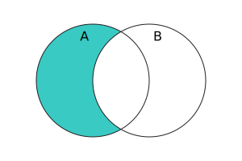

{{JSRef}}

The **`difference()`** method of {{jsxref("Set")}} instances takes a set and returns a new set containing elements in this set but not in the given set.

## Syntax

```js-nolint
difference(other)
```

### Parameters

- `other`
  - : A {{jsxref("Set")}} object, or [set-like](/en-US/docs/Web/JavaScript/Reference/Global_Objects/Set#set-like_objects) object.

### Return value

A new {{jsxref("Set")}} object containing elements in this set but not in the `other` set.

## Description

In mathematical notation, _difference_ is defined as:

<!-- Note: the {} need to be double-escaped, once for Yari -->
<!-- prettier-ignore-start -->
<math display="block">
  <semantics><mrow><mi>A</mi><mo>∖</mo><mi>B</mi><mo>=</mo><mo stretchy="false">{</mo><mi>x</mi><mo>∊</mo><mi>A</mi><mo>∣</mo><mi>x</mi><mo>∉</mo><mi>B</mi><mo stretchy="false">}</mo></mrow><annotation encoding="TeX">A\setminus B = \\{x\in A\mid x\notin B\\}</annotation></semantics>
</math>
<!-- prettier-ignore-end -->

And using Venn diagram:



`difference()` accepts [set-like](/en-US/docs/Web/JavaScript/Reference/Global_Objects/Set#set-like_objects) objects as the `other` parameter. It requires {{jsxref("Operators/this", "this")}} to be an actual {{jsxref("Set")}} instance, because it directly retrieves the underlying data stored in `this` without invoking any user code. Then, its behavior depends on the sizes of `this` and `other`:

- If there are more elements in `this` than `other.size`, then it iterates over `other` by calling its `keys()` method, and constructs a new set with all elements in `this` that are not seen in `other`.
- Otherwise, it iterates over the elements in `this`, and constructs a new set with all elements `e` in `this` that cause `other.has(e)` to return a [falsy](/en-US/docs/Glossary/Falsy) value.

The order of elements in the returned set is the same as in `this`.

## Examples

### Using difference()

The following example computes the difference between the set of odd numbers (<10) and the set of perfect squares (<10). The result is the set of odd numbers that are not perfect squares.

```js
const odds = new Set([1, 3, 5, 7, 9]);
const squares = new Set([1, 4, 9]);
console.log(odds.difference(squares)); // Set(3) { 3, 5, 7 }
```

## Specifications

{{Specifications}}

## Browser compatibility

{{Compat}}

## See also

- [Polyfill of `Set.prototype.difference` in `core-js`](https://github.com/zloirock/core-js#new-set-methods)
- {{jsxref("Set.prototype.intersection()")}}
- {{jsxref("Set.prototype.isDisjointFrom()")}}
- {{jsxref("Set.prototype.isSubsetOf()")}}
- {{jsxref("Set.prototype.isSupersetOf()")}}
- {{jsxref("Set.prototype.symmetricDifference()")}}
- {{jsxref("Set.prototype.union()")}}
