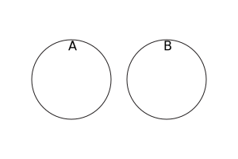

{{JSRef}}

The **`isDisjointFrom()`** method of {{jsxref("Set")}} instances takes a set and returns a boolean indicating if this set has no elements in common with the given set.

## Syntax

```js-nolint
isDisjointFrom(other)
```

### Parameters

- `other`
  - : A {{jsxref("Set")}} object, or [set-like](/en-US/docs/Web/JavaScript/Reference/Global_Objects/Set#set-like_objects) object.

### Return value

`true` if this set has no elements in common with the `other` set, and `false` otherwise.

## Description

Two sets are _disjoint_ if they have no elements in common. In mathematical notation:

<!-- prettier-ignore-start -->
<math display="block">
  <semantics><mrow><mi>A</mi><mtext>&nbsp;is disjoint from&nbsp;</mtext><mi>B</mi><mo stretchy="false">⇔</mo><mi>A</mi><mo>∩</mo><mi>B</mi><mo>=</mo><mi>∅</mi></mrow><annotation encoding="TeX">A\text{ is disjoint from }B \Leftrightarrow A\cap B = \empty</annotation></semantics>
</math>
<!-- prettier-ignore-end -->

And using Venn diagram:



`isDisjointFrom()` accepts [set-like](/en-US/docs/Web/JavaScript/Reference/Global_Objects/Set#set-like_objects) objects as the `other` parameter. It requires {{jsxref("Operators/this", "this")}} to be an actual {{jsxref("Set")}} instance, because it directly retrieves the underlying data stored in `this` without invoking any user code. Then, its behavior depends on the sizes of `this` and `other`:

- If there are more elements in `this` than `other.size`, then it iterates over `other` by calling its `keys()` method, and if any element in `other` is present in `this`, it returns `false` (and closes the `keys()` iterator by calling its `return()` method). Otherwise, it returns `true`.
- Otherwise, it iterates over the elements in `this`, and returns `false` if any element `e` in `this` causes `other.has(e)` to return a [truthy](/en-US/docs/Glossary/Truthy) value. Otherwise, it returns `true`.

Because of this implementation, the efficiency of `isDisjointFrom()` mostly depends on the size of the smaller set between `this` and `other` (assuming sets can be accessed in sublinear time).

## Examples

### Using isDisjointFrom()

The set of perfect squares (<20) is disjoint from the set of prime numbers (<20), because a perfect square is by definition decomposable into the product of two integers, while 1 is also not considered a prime number:

```js
const primes = new Set([2, 3, 5, 7, 11, 13, 17, 19]);
const squares = new Set([1, 4, 9, 16]);
console.log(primes.isDisjointFrom(squares)); // true
```

The set of perfect squares (<20) is not disjoint from the set of composite numbers (<20), because all non-1 perfect squares are by definition composite numbers:

```js
const composites = new Set([4, 6, 8, 9, 10, 12, 14, 15, 16, 18]);
const squares = new Set([1, 4, 9, 16]);
console.log(composites.isDisjointFrom(squares)); // false
```

## Specifications

{{Specifications}}

## Browser compatibility

{{Compat}}

## See also

- [Polyfill of `Set.prototype.isDisjointFrom` in `core-js`](https://github.com/zloirock/core-js#new-set-methods)
- {{jsxref("Set.prototype.difference()")}}
- {{jsxref("Set.prototype.intersection()")}}
- {{jsxref("Set.prototype.isSubsetOf()")}}
- {{jsxref("Set.prototype.isSupersetOf()")}}
- {{jsxref("Set.prototype.symmetricDifference()")}}
- {{jsxref("Set.prototype.union()")}}
