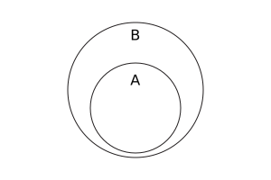

{{JSRef}}

The **`isSubsetOf()`** method of {{jsxref("Set")}} instances takes a set and returns a boolean indicating if all elements of this set are in the given set.

## Syntax

```js-nolint
isSubsetOf(other)
```

### Parameters

- `other`
  - : A {{jsxref("Set")}} object, or [set-like](/en-US/docs/Web/JavaScript/Reference/Global_Objects/Set#set-like_objects) object.

### Return value

`true` if all elements in this set are also in the `other` set, and `false` otherwise.

## Description

In mathematical notation, _subset_ is defined as:

<!-- prettier-ignore-start -->
<math display="block">
  <semantics><mrow><mi>A</mi><mo>⊆</mo><mi>B</mi><mo stretchy="false">⇔</mo><mo>∀</mo><mi>x</mi><mo>∊</mo><mi>A</mi><mo>,</mo><mspace width="0.16666666666666666em"></mspace><mi>x</mi><mo>∊</mo><mi>B</mi></mrow><annotation encoding="TeX">A\subseteq B \Leftrightarrow \forall x\in A,\,x\in B</annotation></semantics>
</math>
<!-- prettier-ignore-end -->

And using Venn diagram:



> **Note:** The _subset_ relationship is not _proper subset_, which means `isSubsetOf()` returns `true` if `this` and `other` contain the same elements.

`isSubsetOf()` accepts [set-like](/en-US/docs/Web/JavaScript/Reference/Global_Objects/Set#set-like_objects) objects as the `other` parameter. It requires {{jsxref("Operators/this", "this")}} to be an actual {{jsxref("Set")}} instance, because it directly retrieves the underlying data stored in `this` without invoking any user code. Then, its behavior depends on the sizes of `this` and `other`:

- If there are more elements in `this` than `other.size`, then it directly returns `false`.
- Otherwise, it iterates over the elements in `this`, and returns `false` if any element `e` in `this` causes `other.has(e)` to return a [falsy](/en-US/docs/Glossary/Falsy) value. Otherwise, it returns `true`.

## Examples

### Using isSubsetOf()

The set of multiples of 4 (<20) is a subset of even numbers (<20):

```js
const fours = new Set([4, 8, 12, 16]);
const evens = new Set([2, 4, 6, 8, 10, 12, 14, 16, 18]);
console.log(fours.isSubsetOf(evens)); // true
```

The set of prime numbers (<20) is not a subset of all odd numbers (<20), because 2 is prime but not odd:

```js
const primes = new Set([2, 3, 5, 7, 11, 13, 17, 19]);
const odds = new Set([3, 5, 7, 9, 11, 13, 15, 17, 19]);
console.log(primes.isSubsetOf(odds)); // false
```

Equivalent sets are subsets of each other:

```js
const set1 = new Set([1, 2, 3]);
const set2 = new Set([1, 2, 3]);
console.log(set1.isSubsetOf(set2)); // true
console.log(set2.isSubsetOf(set1)); // true
```

## Specifications

{{Specifications}}

## Browser compatibility

{{Compat}}

## See also

- [Polyfill of `Set.prototype.isSubsetOf` in `core-js`](https://github.com/zloirock/core-js#new-set-methods)
- {{jsxref("Set.prototype.difference()")}}
- {{jsxref("Set.prototype.intersection()")}}
- {{jsxref("Set.prototype.isDisjointFrom()")}}
- {{jsxref("Set.prototype.isSupersetOf()")}}
- {{jsxref("Set.prototype.symmetricDifference()")}}
- {{jsxref("Set.prototype.union()")}}
