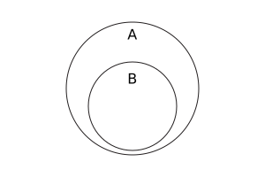

{{JSRef}}

The **`isSupersetOf()`** method of {{jsxref("Set")}} instances takes a set and returns a boolean indicating if all elements of the given set are in this set.

## Syntax

```js-nolint
isSupersetOf(other)
```

### Parameters

- `other`
  - : A {{jsxref("Set")}} object, or [set-like](/en-US/docs/Web/JavaScript/Reference/Global_Objects/Set#set-like_objects) object.

### Return value

`true` if all elements in the `other` set are also in this set, and `false` otherwise.

## Description

In mathematical notation, _superset_ is defined as:

<!-- prettier-ignore-start -->
<math display="block">
  <semantics><mrow><mi>A</mi><mo>⊇</mo><mi>B</mi><mo stretchy="false">⇔</mo><mo>∀</mo><mi>x</mi><mo>∊</mo><mi>B</mi><mo>,</mo><mspace width="0.16666666666666666em"></mspace><mi>x</mi><mo>∊</mo><mi>A</mi></mrow><annotation encoding="TeX">A\supseteq B \Leftrightarrow \forall x\in B,\,x\in A</annotation></semantics>
</math>
<!-- prettier-ignore-end -->

And using Venn diagram:



> **Note:** The _superset_ relationship is not _proper superset_, which means `isSupersetOf()` returns `true` if `this` and `other` contain the same elements.

`isSupersetOf()` accepts [set-like](/en-US/docs/Web/JavaScript/Reference/Global_Objects/Set#set-like_objects) objects as the `other` parameter. It requires {{jsxref("Operators/this", "this")}} to be an actual {{jsxref("Set")}} instance, because it directly retrieves the underlying data stored in `this` without invoking any user code. Then, its behavior depends on the sizes of `this` and `other`:

- If there are fewer elements in `this` than `other.size`, then it directly returns `false`.
- Otherwise, it iterates over `other` by calling its `keys()` method, and if any element in `other` is not present in `this`, it returns `false` (and closes the `keys()` iterator by calling its `return()` method). Otherwise, it returns `true`.

## Examples

### Using isSupersetOf()

The set of even numbers (<20) is a superset of multiples of 4 (<20):

```js
const evens = new Set([2, 4, 6, 8, 10, 12, 14, 16, 18]);
const fours = new Set([4, 8, 12, 16]);
console.log(evens.isSupersetOf(fours)); // true
```

The set of all odd numbers (<20) is not a superset of prime numbers (<20), because 2 is prime but not odd:

```js
const primes = new Set([2, 3, 5, 7, 11, 13, 17, 19]);
const odds = new Set([3, 5, 7, 9, 11, 13, 15, 17, 19]);
console.log(odds.isSupersetOf(primes)); // false
```

Equivalent sets are supersets of each other:

```js
const set1 = new Set([1, 2, 3]);
const set2 = new Set([1, 2, 3]);
console.log(set1.isSupersetOf(set2)); // true
console.log(set2.isSupersetOf(set1)); // true
```

## Specifications

{{Specifications}}

## Browser compatibility

{{Compat}}

## See also

- [Polyfill of `Set.prototype.isSupersetOf` in `core-js`](https://github.com/zloirock/core-js#new-set-methods)
- {{jsxref("Set.prototype.difference()")}}
- {{jsxref("Set.prototype.intersection()")}}
- {{jsxref("Set.prototype.isDisjointFrom()")}}
- {{jsxref("Set.prototype.isSubsetOf()")}}
- {{jsxref("Set.prototype.symmetricDifference()")}}
- {{jsxref("Set.prototype.union()")}}
