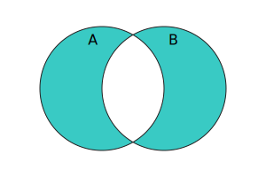

{{JSRef}}

The **`symmetricDifference()`** method of {{jsxref("Set")}} instances takes a set and returns a new set containing elements which are in either this set or the given set, but not in both.

## Syntax

```js-nolint
symmetricDifference(other)
```

### Parameters

- `other`
  - : A {{jsxref("Set")}} object, or [set-like](/en-US/docs/Web/JavaScript/Reference/Global_Objects/Set#set-like_objects) object.

### Return value

A new {{jsxref("Set")}} object containing elements which are in either this set or the `other` set, but not in both.

## Description

In mathematical notation, _symmetric difference_ is defined as:

<!-- prettier-ignore-start -->
<math display="block">
  <semantics><mrow><mi>A</mi><mo>⊖</mo><mi>B</mi><mo>=</mo><mo stretchy="false">(</mo><mi>A</mi><mo>∖</mo><mi>B</mi><mo stretchy="false">)</mo><mo>∪</mo><mo stretchy="false">(</mo><mi>B</mi><mo>∖</mo><mi>A</mi><mo stretchy="false">)</mo></mrow><annotation encoding="TeX">A\ominus B = (A\setminus B)\cup(B\setminus A)</annotation></semantics>
</math>
<!-- prettier-ignore-end -->

And using Venn diagram:



`symmetricDifference()` accepts [set-like](/en-US/docs/Web/JavaScript/Reference/Global_Objects/Set#set-like_objects) objects as the `other` parameter. It requires {{jsxref("Operators/this", "this")}} to be an actual {{jsxref("Set")}} instance, because it directly retrieves the underlying data stored in `this` without invoking any user code. Then, it iterates over `other` by calling its `keys()` method, and constructs a new set with all elements in `this` that are not seen in `other`, and all elements in `other` that are not seen in `this`.

The order of elements in the returned set is first those in `this` followed by those in `other`.

## Examples

### Using symmetricDifference()

The following example computes the symmetric difference between the set of even numbers (<10) and the set of perfect squares (<10). The result is the set of numbers that are either even or a perfect square, but not both.

```js
const evens = new Set([2, 4, 6, 8]);
const squares = new Set([1, 4, 9]);
console.log(evens.symmetricDifference(squares)); // Set(5) { 2, 6, 8, 1, 9 }
```

## Specifications

{{Specifications}}

## Browser compatibility

{{Compat}}

## See also

- [Polyfill of `Set.prototype.symmetricDifference` in `core-js`](https://github.com/zloirock/core-js#new-set-methods)
- {{jsxref("Set.prototype.difference()")}}
- {{jsxref("Set.prototype.intersection()")}}
- {{jsxref("Set.prototype.isDisjointFrom()")}}
- {{jsxref("Set.prototype.isSubsetOf()")}}
- {{jsxref("Set.prototype.isSupersetOf()")}}
- {{jsxref("Set.prototype.union()")}}
