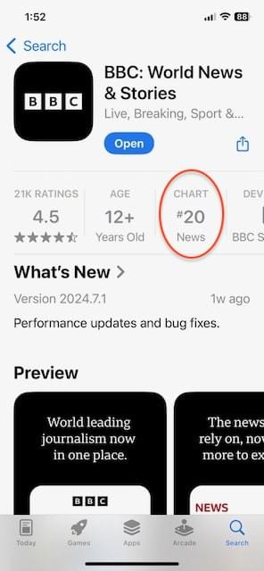
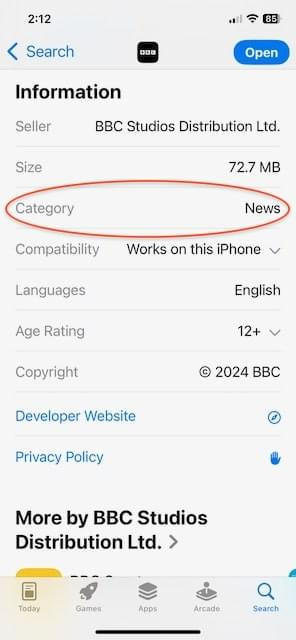
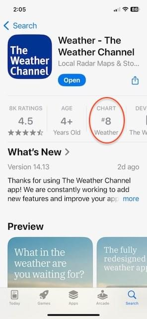
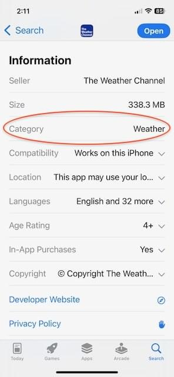

{{QuickLinksWithSubpages("/en-US/docs/Web/Manifest/Reference")}}

The `categories` manifest member lets you specify one or more classifications for your web application.
These categories help users discover your app in app stores.

> [!NOTE]
> The `categories` member is optional, and app stores may use different values when presenting your app.

## Syntax

```json-nolint
/* Single category */
"categories": ["productivity"]

/* Multiple categories */
"categories": ["productivity", "utilities", "social"]
```

### Values

- `categories`
  - : An array of comma-separated strings, where each string represents a category name.
    The strings should be in lowercase.
    W3C maintains a [list of standardized categories](https://github.com/w3c/manifest/wiki/Categories), which includes common values such as `business`, `education`, `entertainment`, `finance`, `games`, and `productivity`.

## Description

The `categories` member is supplementary metadata that does not affect the app's runtime behavior or how browsers present the app.
Its values are used only in app stores and other distribution platforms and are not visible to users in the browser or installed app.

If your app serves multiple purposes, specifying multiple relevant categories can help users discover your app across different sections of the app store.

If `categories` is not specified or the specified values are not used, app stores will categorize your web app based on their own classification system.

The images below from the Apple App Store show how categories appear in different parts of an app store.
The app overview shows the category in the "CHART" field (highlighted) along with the app's ranking in that category, and the Information section displays "Category" as a dedicated field (highlighted).

- The BBC app is categorized as "News":

  <div style="display: flex; justify-content: center;">
    
    
  </div>

- The Weather Channel app is categorized as "Weather":

  <div style="display: flex; justify-content: center;">
    
    
  </div>

## Examples

### Categorizing a meal planning web app

This example shows how to categorize a web app for planning meals based on available ingredients:

```json
{
  "name": "Meal Planner",
  "categories": ["food", "health", "lifestyle"]
}
```

## Specifications

{{Specifications}}

## Browser compatibility

The `categories` manifest member is used by app stores when publishing and listing web apps, so browser compatibility is not applicable.
While browsers may parse this member, it's optional and doesn't affect the app's functionality or presentation.
