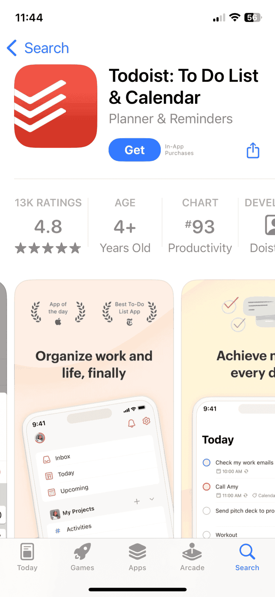
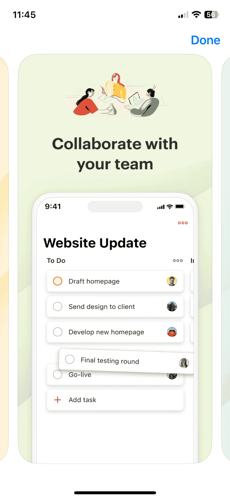
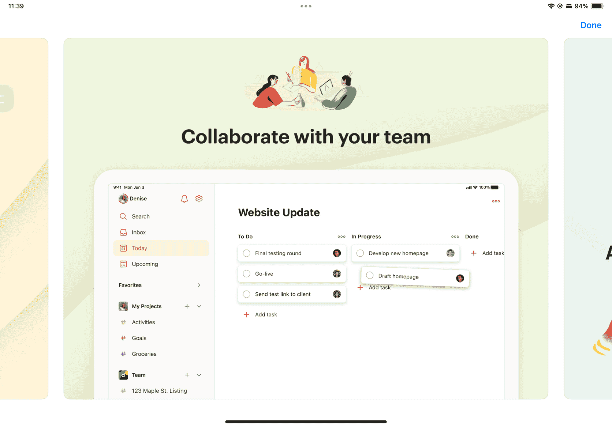

{{QuickLinksWithSubpages("/en-US/docs/Web/Manifest/Reference")}}

The `screenshots` manifest member lets you specify one or more images that showcase your web application.
These images help users preview your web app's interface and features in app stores.

> [!NOTE]
> The `screenshots` member is optional, and app stores may not display these images when presenting your app.

## Syntax

```json-nolint
/* Single screenshot */
"screenshots": [
  {
    "src": "desktop.webp",
    "sizes": "1280x720",
    "type": "image/webp"
  }
]

/* Two screenshots */
"screenshots": [
  {
    "src": "screenshots/home.webp",
    "sizes": "1280x720",
    "type": "image/webp",
    "form_factor": "wide",
    "label": "Home screen showing main navigation and featured content"
  },
  {
    "src": "screenshots/dashboard.webp",
    "sizes": "1280x720",
    "type": "image/webp",
    "platform": "ios",
    "label": "Dashboard view displaying key metrics"
  }
]
```

### Values

- `screenshots`

  - : An array of objects.
    Each object represents a screenshot of the web app in a common usage scenario.

    Each screenshot object can have one or more properties. Of these, only `src` is required. The possible properties include:

    - `src`

      - : A string that specifies the path to the image file.
        It has the same format as the `icons` member's [`src`](/en-US/docs/Web/Manifest/Reference/icons#src) property.

    - `sizes` {{Optional_Inline}}

      - : A string that specifies one or more sizes of the image.
        It has the same format as the `icons` member's [`sizes`](/en-US/docs/Web/Manifest/Reference/icons#sizes) property.

    - `type` {{Optional_Inline}}

      - : A string that specifies the {{glossary("MIME_type", "MIME type")}} of the image.
        It has the same format as the `icons` member's [`type`](/en-US/docs/Web/Manifest/Reference/icons#type) property.

    - `label` {{Optional_Inline}}

      - : A string that represents the accessible name of the screenshot object.
        Keep it descriptive because it can serve as alternative text for the rendered screenshot.
        For accessibility, it is recommended to specify this property for every screenshot.

    - `form_factor` {{Optional_Inline}}

      - : A string that represents the screen shape of a broad class of devices to which the screenshot applies.
        Specify this property only when the screenshot applies to a specific screen layout.
        If `form_factor` is not specified, the screenshot is considered suitable for all screen types.

        Valid values include:

        - `narrow`
          - : Indicates that the screenshot is applicable only to narrow screens, such as mobile devices.
        - `wide`
          - : Indicates that the screenshot is applicable only to wide screens, such as desktop computers.

    - `platform`

      - : A string that represents the platform to which the screenshot applies.
        Specify this property only when the screenshot applies to a specific device or distribution platform.
        If `platform` is not specified, the screenshot is considered suitable for all platforms.

        Valid values include:

        | Type                   | Value              | Description                          |
        | ---------------------- | ------------------ | ------------------------------------ |
        | Operating systems      | `android`          | Google Android                       |
        |                        | `chromeos`         | Google ChromeOS                      |
        |                        | `ios`              | Apple iOS                            |
        |                        | `ipados`           | Apple iPadOS                         |
        |                        | `kaios`            | KaiOS                                |
        |                        | `macos`            | Apple macOS                          |
        |                        | `windows`          | Microsoft Windows                    |
        |                        | `xbox`             | Microsoft Xbox                       |
        | Distribution platforms | `chrome_web_store` | Google Chrome Web Store              |
        |                        | `itunes`           | iTunes App Store                     |
        |                        | `microsoft-inbox`  | Pre-installed with Microsoft Windows |
        |                        | `microsoft-store`  | Microsoft Store                      |
        |                        | `play`             | Google Play Store                    |

## Description

The `screenshots` member is supplementary metadata that does not affect the app's runtime behavior or how browsers present the app.
Screenshots are used in app stores and other distribution platforms to showcase your app's features to potential users.

Distribution platforms may choose how many screenshots to display.

The images below from the Apple App Store show how screenshots appear in an iPhone app listing.
In the gallery view (image on the left), users can scroll through multiple images horizontally.
They can tap any image to view it in full screen (image on the right).

<div style="display: flex; justify-content: center; flex-wrap: wrap;">
  
  
</div>

The same full-screen image on iPad shows why different screenshots are needed for narrow (iPhone) and wide (iPad) device form factors:

<div style="display: flex; justify-content: center;">
  
</div>

## Examples

### Adding previews for a meal planning web app

This example shows how to add screenshots for a meal planning app for different devices. The screenshots show the same feature of the app in desktop and mobile views:

```json
{
  "name": "Meal Planner",
  "screenshots": [
    {
      "src": "screenshots/desktop-home.webp",
      "sizes": "1920x1080",
      "form_factor": "wide",
      "label": "Desktop view showing weekly meal calendar"
    },
    {
      "src": "screenshots/mobile-home.webp",
      "sizes": "750x1334",
      "form_factor": "narrow",
      "label": "Mobile view showing weekly meal calendar"
    }
  ]
}
```

## Specifications

{{Specifications}}

## Browser compatibility

The `screenshots` manifest member is used by app stores when publishing and listing web apps, so browser compatibility is not applicable.
While browsers may parse this member, it's optional and doesn't affect the app's functionality or presentation.
