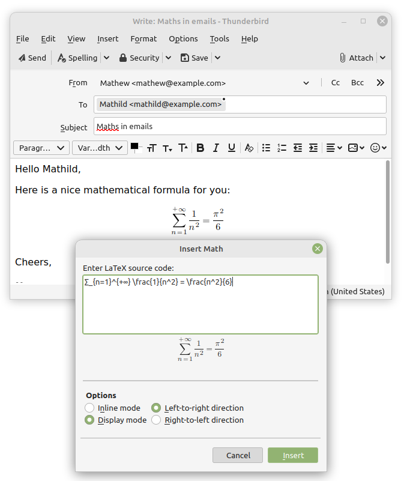
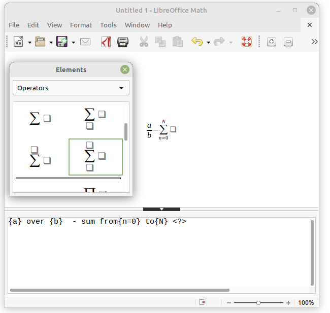
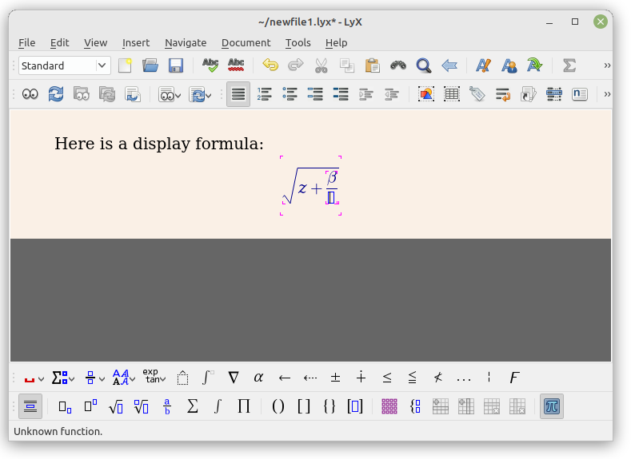
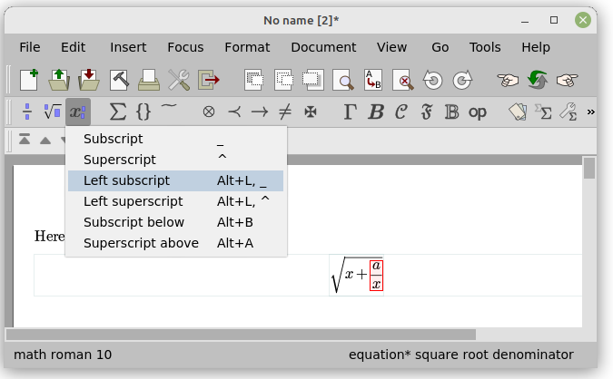
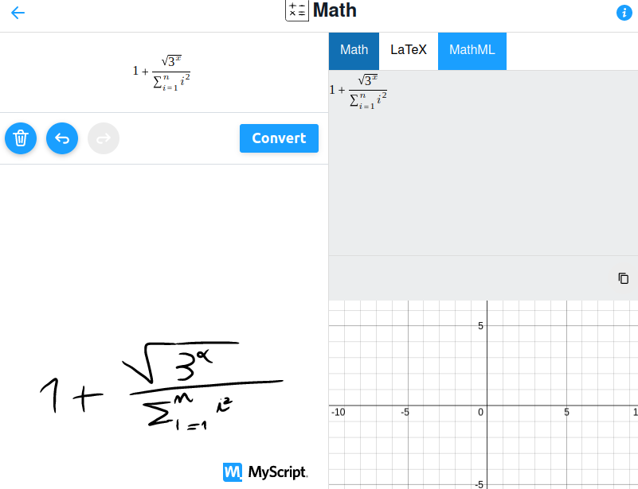

{{MathMLRef}}

This page explains how to write mathematics using the MathML language, which is described with tags and attributes in text format. Just like for HTML or SVG, this text can become very verbose for complex content and so requires [proper authoring tools](https://www.w3.org/wiki/Math_Tools#Authoring_tools) such as converters from a [lightweight markup language](https://en.wikipedia.org/wiki/Lightweight_markup_language) or [WYSIWYG](https://en.wikipedia.org/wiki/WYSIWYG) equation editors. Many such tools are available and it is impossible to provide an exhaustive list. Instead, this article focuses on common approaches and examples.

## Using MathML

Even if your MathML formulas will likely be generated by authoring tools, it is important to be aware of a few tips to properly integrate them in your document.

### MathML in HTML pages

Each MathML equation is represented by a root [`math`](/en-US/docs/Web/MathML/Element/math) element, which can be embedded directly in HTML pages. By default, the formula will be rendered inline, with extra adjustments to minimize its height. Use a `display="block"` attribute to render complex formulas normally, and in their own paragraph.

```html
<!doctype html>
<html lang="en-US">
  <head>
    <meta charset="UTF-8" />
    <title>MathML in HTML</title>
  </head>
  <body>
    <h1>MathML in HTML</h1>

    <p>
      One over square root of two (inline style):
      <math>
        <mfrac>
          <mn>1</mn>
          <msqrt>
            <mn>2</mn>
          </msqrt>
        </mfrac>
      </math>
    </p>

    <p>
      One over square root of two (display style):
      <math display="block">
        <mfrac>
          <mn>1</mn>
          <msqrt>
            <mn>2</mn>
          </msqrt>
        </mfrac>
      </math>
    </p>
  </body>
</html>
```

> **Note:** To use MathML in XML documents (e.g. XHTML, EPUB or OpenDocument) place an explicit `xmlns="http://www.w3.org/1998/Math/MathML"` attribute on each `<math>` element.

> **Note:** Some email or instant messaging clients are able to send and receive messages in the HTML format. It is thus possible to embed mathematical formulas inside such messages, as long as MathML tags are not filtered out by markup sanitizers.

#### Fallback for browsers without MathML support

It is recommended to provide a fallback mechanism for browsers without MathML support. If your document contains only basic mathematical formulas then a small [mathml.css](https://github.com/fred-wang/mathml.css) stylesheet might be enough. To load it conditionally, just insert one line in your document header:

```html
<script src="https://fred-wang.github.io/mathml.css/mspace.js"></script>
```

If you need more complex constructions, you might instead consider using the heavier [MathJax](https://www.mathjax.org) library as a MathML polyfill:

```html
<script src="https://fred-wang.github.io/mathjax.js/mpadded-min.js"></script>
```

Alternatively, you can also just display a warning at the top of the page for browsers without good MathML support and let the users choose between one of the fallback above:

```html
<script src="https://fred-wang.github.io/mathml-warning.js/mpadded-min.js"></script>
```

> **Note:** These small scripts perform feature detection (of the [mspace](/en-US/docs/Web/MathML/Element/mspace) or [mpadded](/en-US/docs/Web/MathML/Element/mpadded) elements) which is preferred over [browser sniffing](/en-US/docs/Web/HTTP/Browser_detection_using_the_user_agent). Also, they are distributed under an open source license, so feel free to copy them on your own server and adapt them to your need.

#### Mathematical fonts

As explained on the [MathML Fonts](/en-US/docs/Web/MathML/Fonts) article, mathematical fonts are instrumental to render MathML content. It's thus always a good idea to share the [installation instructions for such fonts](/en-US/docs/Web/MathML/Fonts#installation_instructions) or to provide them as [Web fonts](/en-US/docs/Learn/CSS/Styling_text/Web_fonts).

The [MathFonts page](https://fred-wang.github.io/MathFonts/) provides such Web fonts together with proper style sheets. For example, just insert the following line in your document header in order to select the Latin Modern fonts with fallback Web fonts:

```html
<link
  rel="stylesheet"
  href="https://fred-wang.github.io/MathFonts/LatinModern/mathfonts.css" />
```

Several fonts are proposed and you can just select a different style, for example STIX:

```html
<link
  rel="stylesheet"
  href="https://fred-wang.github.io/MathFonts/STIX/mathfonts.css" />
```

> **Note:** The fonts and stylesheets from that MathFonts page are distributed under open source licenses, so feel free to copy them on your own server and adapt them to your need.

## Conversion from a simple syntax

In this section, we review some tools to convert MathML from a [lightweight markup language](https://en.wikipedia.org/wiki/Lightweight_markup_language) such as the popular [LaTeX](https://en.wikipedia.org/wiki/LaTeX) language.

### Client-side conversion

With this approach, formulas are written directly in Web pages and a JavaScript library takes care of performing their conversion to MathML. This is probably the easiest option, but it also has some issues: extra JavaScript code must be loaded and executed, authors must escape reserved characters, Web crawlers won't have access to the MathML output...

A [custom element](/en-US/docs/Web/API/Web_components/Using_custom_elements) can be used to host the source code and ensure the corresponding MathML output is inserted and rendered via a [shadow subtree](/en-US/docs/Web/API/Web_components/Using_shadow_DOM). For example, using [TeXZilla](https://github.com/fred-wang/TeXZilla)'s [`<la-tex>`](https://fred-wang.github.io/TeXZilla/examples/customElement.html) element, the [MathML example above](#mathml_in_html_pages) can just be rewritten more concisely as follows:

```html
<!doctype html>
<html lang="en-US">
  <head>
    <meta charset="UTF-8" />
    <title>MathML in HTML5</title>
    <script src="https://fred-wang.github.io/TeXZilla/TeXZilla-min.js"></script>
    <script src="https://fred-wang.github.io/TeXZilla/examples/customElement.js"></script>
  </head>
  <body>
    <h1>MathML in HTML5</h1>

    <p>
      One over square root of two (inline style):
      <la-tex>\frac{1}{\sqrt{2}}</la-tex>
    </p>

    <p>
      One over square root of two (display style):
      <la-tex display="block">\frac{1}{\sqrt{2}}</la-tex>
    </p>
  </body>
</html>
```

For authors not familiar with LaTeX, alternative input methods are available such as the [ASCIIMath](http://asciimath.org/#syntax) or [jqMath](https://mathscribe.com/author/jqmath.html) syntax. Be sure to load the JavaScript libraries and use the proper delimiters:

```html
<!doctype html>
<html lang="en-US">
  <head>
    <meta charset="utf-8" />
    <meta name="viewport" content="width=device-width" />
    <title>ASCII MathML</title>
    …
    <!-- ASCIIMathML.js -->
    <script src="/path/to/ASCIIMathML.js"></script>
    …
    <!-- jqMath -->
    <script src="https://mathscribe.com/mathscribe/jquery-1.4.3.min.js"></script>
    <script src="https://mathscribe.com/mathscribe/jqmath-etc-0.4.6.min.js"></script>
    …
  </head>
  <body>
    …
    <p>One over square root of two (inline style, ASCIIMath): `1/(sqrt 2)`</p>
    …
    <p>One over square root of two (inline style, jqMath): $1/√2$</p>
    …
    <p>One over square root of two (display style, jqMath): $$1/√2$$</p>
    …
  </body>
</html>
```

### Command-line programs

Instead of generating MathML expression at page load, you can instead rely on command line tools. This will result in pages with static MathML content that will load faster. Let's consider again a page `input.html` with content from [client-side conversion](#client-side_conversion):

```html
<!doctype html>
<html lang="en-US">
  <head>
    <meta charset="UTF-8" />
    <title>MathML in HTML5</title>
  </head>
  <body>
    <h1>MathML in HTML5</h1>
    <p>One over square root of two (inline style): $\frac{1}{\sqrt{2}}$</p>
    <p>One over square root of two (display style): $$\frac{1}{\sqrt{2}}$$</p>
  </body>
</html>
```

That page does contain any [`script`](/en-US/docs/Web/HTML/Element/script) tag. Instead, conversion is executed via the following command line using [Node.js](https://nodejs.org/) and [TeXZilla](https://github.com/fred-wang/TeXZilla/wiki/Using-TeXZilla#usage-from-the-command-line):

```bash
cat input.html | node TeXZilla.js streamfilter > output.html
```

After running that command, a file `output.html` containing the following HTML output is created. The formulas delimited by dollars have been converted into MathML:

```html-nolint
<!DOCTYPE html>
<html lang="en-US">
  <head>
    <meta charset="UTF-8" />
    <title>MathML in HTML5</title>
  </head>
  <body>
    <h1>MathML in HTML5</h1>

    <p>
      One over square root of two (inline style):
      <math><semantics><mfrac><mn>1</mn><msqrt><mn>2</mn></msqrt></mfrac><annotation encoding="TeX">\frac{1}{\sqrt{2}}</annotation></semantics></math>
    </p>

    <p>
      One over square root of two (display style):
      <math display="block"><semantics><mfrac><mn>1</mn><msqrt><mn>2</mn></msqrt></mfrac><annotation encoding="TeX">\frac{1}{\sqrt{2}}</annotation></semantics></math>
    </p>
  </body>
</html>
```

There are more sophisticated tools that aim at converting an arbitrary LaTeX document into a document with MathML content. For example, using [LaTeXML](https://math.nist.gov/~BMiller/LaTeXML/) the following commands will convert `foo.tex` into an HTML or EPUB document:

```bash
latexmlc --dest foo.html foo.tex # Generate a HTML document foo.html
latexmlc --dest foo.epub foo.tex # Generate an EPUB document foo.epub
```

`latexmlc` accepts a `--javascript` parameter that you can use to include one of the [fallback scripts](#fallback_for_browsers_without_mathml_support) mentioned above:

```bash
latexmlc --dest foo.html --javascript=https://fred-wang.github.io/mathml.css/mspace.js foo.tex  # Add the CSS fallback
latexmlc --dest foo.html --javascript=https://fred-wang.github.io/mathjax.js/mpadded-min.js foo.tex # Add the MathJax fallback
```

> **Note:** Command-line tools can be used server-side e.g. [MediaWiki](https://www.mediawiki.org/wiki/MediaWiki) performs LaTeX-to-MathML conversion via [Mathoid](https://github.com/wikimedia/mathoid).

## Graphical interfaces

In this section, we review a few editing tools providing graphical interfaces.

### Input box

A simple approach is to integrate [converters from a simple syntax](#conversion_from_a_simple_syntax) as simple input boxes for mathematics. For example, [Thunderbird](https://www.thunderbird.net/en-US/) and [SeaMonkey](https://www.seamonkey-project.org/) provide an **Insert > Math** command that will open a popup window, with a LaTeX-to-MathML input field and a live MathML preview:



> **Note:** You can also use the **Insert > HTML** command to paste any MathML content.

[LibreOffice](https://www.libreoffice.org/)'s equation editor (File → New → Formula) shows a possible enhancement: its input box for the _StartMath_ syntax provides extra equation panels to insert pre-defined mathematical constructions.



> **Note:** To obtain libreoffice's MathML code, save the document as `mml` and open it with your favorite text editor.

### WYSIYWG editors

Other editors provide math editing features that are directly integrated into their WYSIYWG interface. The following screenshots are taken from [LyX](https://www.lyx.org/) and [TeXmacs](https://www.texmacs.org/tmweb/home/welcome.en.html), both of them supporting HTML export:





> **Note:** By default Lyx and TeXmacs will use images of formulas in their HTML output. To choose MathML instead, [follow these instructions](https://github.com/brucemiller/LaTeXML/wiki/Integrating-LaTeXML-into-TeX-editors#lyx) for the former and select `User preference > Convert > Export mathematical formulas as MathML` for the latter.

### Optical character and handwriting recognitions

A final option to enter mathematics is to rely on user interface for [Optical character recognition](https://en.wikipedia.org/wiki/Optical_character_recognition) or [Handwriting recognition](https://en.wikipedia.org/wiki/Handwriting_recognition). Some of these tools support mathematical formulas and can export them as MathML. The following screenshot shows a [demo from MyScript](https://webdemo.myscript.com/views/math/index.html):


