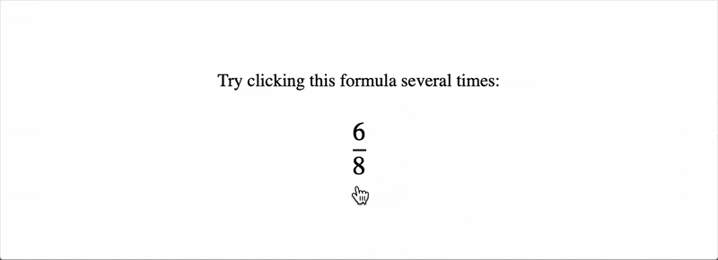

{{MathMLRef}}{{Deprecated_Header}}

The **`<maction>`** [MathML](/en-US/docs/Web/MathML) element allows to bind actions to mathematical expressions. By default, only the first child is rendered but some browsers may take into account `actiontype` and `selection` attributes to implement custom behaviors.

> [!NOTE]
> Historically, this element provided a mechanism to make MathML formulas interactive. Nowadays, it is recommended to rely on [JavaScript](/en-US/docs/Web/JavaScript) and other Web technologies to implement this use case.

## Attributes

This element's attributes include the [global MathML attributes](/en-US/docs/Web/MathML/Global_attributes) as well as the following attributes:

- `actiontype` {{Deprecated_Inline}} {{Non-standard_Inline}}

  - : The action which specifies what happens for this element. Special behavior
    for the following values were implemented by some browsers:

    - `statusline`: If there is a click on the _expression_ or the reader moves the pointer over it, the _message_ is sent to the browser's status line. The syntax is: `<maction actiontype="statusline"> expression message </maction>`.
    - `toggle`: When there is a click on the subexpression, the rendering alternates the display of selected subexpressions. Therefore each click increments the `selection` value.
      The syntax is: `<maction actiontype="toggle" selection="positive-integer" > expression1 expression2 expressionN </maction>`.

- `selection` {{Deprecated_Inline}} {{Non-standard_Inline}}
  - : The child element currently visible, only taken into account for `actiontype="toggle"` or non-standard `actiontype` values. The default value is `1`, which is the first child element.

## Examples

The following example uses the "toggle" `actiontype`:

```css hidden
html,
body {
  height: 100%;
}

body {
  display: grid;
  place-content: center;
}

math {
  font-size: 1.5em;
}

maction {
  padding: 0.5em;
  cursor: pointer;
}
```

```html
<p>Try clicking this formula several times:</p>
<math display="block">
  <maction actiontype="toggle">
    <mfrac>
      <mn>6</mn>
      <mn>8</mn>
    </mfrac>

    <mfrac>
      <mrow>
        <mn>3</mn>
        <mo>×</mo>
        <mn>2</mn>
      </mrow>
      <mrow>
        <mn>4</mn>
        <mo>×</mo>
        <mn>2</mn>
      </mrow>
    </mfrac>

    <mfrac>
      <mn>3</mn>
      <mn>4</mn>
    </mfrac>
  </maction>
</math>
```

Sample rendering:



Rendering in your browser:

{{EmbedLiveSample('Examples', 700, 200)}}

## Technical summary

<table class="properties">
  <tr>
    <th scope="row">
      <a href="/en-US/docs/Web/Accessibility/ARIA/Roles">Implicit ARIA role</a>
    </th>
    <td>
      None
    </td>
  </tr>
</table>

## Specifications

{{Specifications}}

## Browser compatibility

{{Compat}}
