{{MathMLRef}}{{Non-standard_header}}

The **`<menclose>`** [MathML](/en-US/docs/Web/MathML) element renders its content inside an enclosing notation specified by the `notation` attribute.

## Attributes

This element's attributes include the [global MathML attributes](/en-US/docs/Web/MathML/Global_attributes).

- `notation` {{Non-standard_Inline}}

  - : A list of notations, separated by white space, to apply to the child elements. The symbols are each drawn as if the others are not present, and therefore may overlap. Possible values are:

    | Value                | Sample Rendering                                            | Rendering in your browser                                                                                                                    | Description                                                                                                         |
    | -------------------- | ----------------------------------------------------------- | -------------------------------------------------------------------------------------------------------------------------------------------- | ------------------------------------------------------------------------------------------------------------------- |
    | `longdiv` (default)  | 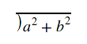                                     | <math><menclose notation="longdiv"><msup><mi>a</mi><mn>2</mn></msup><mo>+</mo><msup><mi>b</mi><mn>2</mn></msup></menclose></math>            | long division symbol                                                                                                |
    | `actuarial`          | 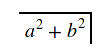                                 | <math><menclose notation="actuarial"><msup><mi>a</mi><mn>2</mn></msup><mo>+</mo><msup><mi>b</mi><mn>2</mn></msup></menclose></math>          | [actuarial symbol](https://en.wikipedia.org/wiki/Actuarial_notation)                                                |
    | `box`                | 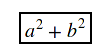                                             | <math><menclose notation="box"><msup><mi>a</mi><mn>2</mn></msup><mo>+</mo><msup><mi>b</mi><mn>2</mn></msup></menclose></math>                | box                                                                                                                 |
    | `roundedbox`         | 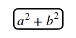                               | <math><menclose notation="roundedbox"><msup><mi>a</mi><mn>2</mn></msup><mo>+</mo><msup><mi>b</mi><mn>2</mn></msup></menclose></math>         | rounded box                                                                                                         |
    | `circle`             | 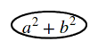                                       | <math><menclose notation="circle"><msup><mi>a</mi><mn>2</mn></msup><mo>+</mo><msup><mi>b</mi><mn>2</mn></msup></menclose></math>             | circle                                                                                                              |
    | `left`               | 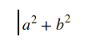                                           | <math><menclose notation="left"><msup><mi>a</mi><mn>2</mn></msup><mo>+</mo><msup><mi>b</mi><mn>2</mn></msup></menclose></math>               | line to the left of the contents                                                                                    |
    | `right`              | 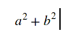                                         | <math><menclose notation="right"><msup><mi>a</mi><mn>2</mn></msup><mo>+</mo><msup><mi>b</mi><mn>2</mn></msup></menclose></math>              | line to the right of the contents                                                                                   |
    | `top`                | 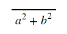                                             | <math><menclose notation="top"><msup><mi>a</mi><mn>2</mn></msup><mo>+</mo><msup><mi>b</mi><mn>2</mn></msup></menclose></math>                | line above of the contents                                                                                          |
    | `bottom`             | 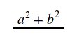                                       | <math><menclose notation="bottom"><msup><mi>a</mi><mn>2</mn></msup><mo>+</mo><msup><mi>b</mi><mn>2</mn></msup></menclose></math>             | line below of the contents                                                                                          |
    | `updiagonalstrike`   | 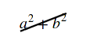                   | <math><menclose notation="updiagonalstrike"><msup><mi>a</mi><mn>2</mn></msup><mo>+</mo><msup><mi>b</mi><mn>2</mn></msup></menclose></math>   | strikeout line through contents from lower left to upper right                                                      |
    | `downdiagonalstrike` | 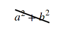               | <math><menclose notation="downdiagonalstrike"><msup><mi>a</mi><mn>2</mn></msup><mo>+</mo><msup><mi>b</mi><mn>2</mn></msup></menclose></math> | strikeout line through contents from upper left to lower right                                                      |
    | `verticalstrike`     | 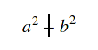                       | <math><menclose notation="verticalstrike"><msup><mi>a</mi><mn>2</mn></msup><mo>+</mo><msup><mi>b</mi><mn>2</mn></msup></menclose></math>     | vertical strikeout line through contents                                                                            |
    | `horizontalstrike`   | 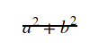                   | <math><menclose notation="horizontalstrike"><msup><mi>a</mi><mn>2</mn></msup><mo>+</mo><msup><mi>b</mi><mn>2</mn></msup></menclose></math>   | horizontal strikeout line through contents                                                                          |
    | `madruwb`            | 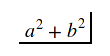                                     | <math><menclose notation="madruwb"><msup><mi>a</mi><mn>2</mn></msup><mo>+</mo><msup><mi>b</mi><mn>2</mn></msup></menclose></math>            | [Arabic factorial symbol](https://en.wikipedia.org/wiki/Modern_Arabic_mathematical_notation#Arithmetic_and_algebra) |
    | `updiagonalarrow`    | 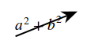 | <math><menclose notation="updiagonalarrow"><msup><mi>a</mi><mn>2</mn></msup><mo>+</mo><msup><mi>b</mi><mn>2</mn></msup></menclose></math>    | diagonal arrow                                                                                                      |
    | `phasorangle`        | 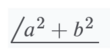  | <math><menclose notation="phasorangle"><msup><mi>a</mi><mn>2</mn></msup><mo>+</mo><msup><mi>b</mi><mn>2</mn></msup></menclose></math>        | phasor angle                                                                                                        |

## Examples

```html
<math display="block">
  <menclose notation="circle box">
    <mi>x</mi>
    <mo>+</mo>
    <mi>y</mi>
  </menclose>
</math>
```

{{ EmbedLiveSample('menclose_example', 700, 200, "", "") }}

## Specifications

The `<menclose>` element is not defined in any browser-oriented specification but you can find a description in [MathML 4](https://w3c.github.io/mathml/#presm_menclose).

## Browser compatibility

{{Compat}}
