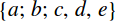

{{MathMLRef}}{{Deprecated_Header}}{{Non-standard_Header}}

The **`<mfenced>`** [MathML](/en-US/docs/Web/MathML) element provides the possibility to add custom opening and closing parentheses (such as brackets) and separators (such as commas or semicolons) to an expression.

> **Note:** Historically, the `<mfenced>` element was defined as a shorthand for writing fenced expressions and equivalent to an expanded form involving {{MathMLElement("mrow")}} and {{MathMLElement("mo")}} elements. Nowadays, it is recommended to use that equivalent form instead.

## Attributes

This element's attributes include the [global MathML attributes](/en-US/docs/Web/MathML/Global_attributes).

- `close`
  - : A string for the closing delimiter. The default value is `")`" and any white space is trimmed.
- `open`
  - : A string for the opening delimiter. The default value is `"("` and any white space is trimmed.
- `separators`
  - : A sequence of zero or more characters to be used for different separators, optionally divided by white space, which is ignored. The default value is ",". By specifying more than one character, it is possible to set different separators for each argument in the expression. If there are too many separators, all excess is ignored. If there are too few separators in the expression, the last specified separator is repeated.

## Examples

### The last separator is repeated (`,`)

```html
<math display="block">
  <mfenced open="{" close="}" separators=";;,">
    <mi>a</mi>
    <mi>b</mi>
    <mi>c</mi>
    <mi>d</mi>
    <mi>e</mi>
  </mfenced>
</math>
```

Sample rendering: 

Rendering in your browser:

{{ EmbedLiveSample('mfenced_example1', 700, 200, "", "") }}

### All excess is ignored (`,`)

```html
<math display="block">
  <mfenced open="[" close="]" separators="||||,">
    <mi>a</mi>
    <mi>b</mi>
    <mi>c</mi>
    <mi>d</mi>
    <mi>e</mi>
  </mfenced>
</math>
```

Sample rendering: ![[a|b|c|d|e]](mfenced02.png)

Rendering in your browser:

{{ EmbedLiveSample('mfenced_example1', 700, 200, "", "") }}

## Specifications

The `<mfenced>` element is not defined in any browser-oriented specification but you can find a description in [MathML 4](https://w3c.github.io/mathml/#presm_mfenced).

## Browser compatibility

{{Compat}}
