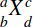
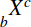

{{MathMLRef}}

The MathML `<mmultiscripts>` element allows you to create tensor-like objects. In a descriptive way [tensors](https://en.wikipedia.org/wiki/Tensor) are multidimensional matrices (mathematical imprecise but exemplified). The degree of a tensor depends on the dimensionality of a representative array. For example, a number is a 0-dimensional array, or a 0th-order tensor. A 1-dimensional array (e.g. vectors) is a 1st-order tensor and so 2nd-order tensors are needed to represent square matrices. To learn more about the mathematical background of tensors refer to the [entry on Wikipedia](https://en.wikipedia.org/wiki/Tensor).

MathML uses a special syntax to describe subscripts and superscripts for both, postscripts and prescripts, attached to a base expression:

```html
<mmultiscripts>
    base
     (subscript superscript)*
     [ <mprescripts/> (presubscript presuperscript)* ]
</mmultiscripts>
```

After the base expression you can specify a postsubscript and a postsuperscript. Prescripts are optional and are separated by the empty tag `<mprescripts/>` (only one \<mprescripts /> element is allowed, otherwise you will get an `DuplicateMprescripts` error in the [Error Console](/en-US/docs/Error_Console) and "invalid-markup" in your rendering). In addition you are able to use `<none/>` as a placeholder for empty scripts (not for the base). See the examples section for a correct usage.

## Attributes

This element's attributes include the [global MathML attributes](/en-US/docs/Web/MathML/Global_attributes).

- `subscriptshift` {{deprecated_inline}}
  - : The minimum space by which to shift the subscript below the baseline of the expression, as a [CSS length](/en-US/docs/Web/CSS/length).
    This property is deprecated and will be removed in the future.
- `superscriptshift` {{deprecated_inline}}
  - : The minimum space by which to shift the superscript above the baseline of the expression, as a [CSS length](/en-US/docs/Web/CSS/length).
    This property is deprecated and will be removed in the future.

## Examples

### Using `<mprescripts/>`

Sample rendering: 

Rendering in your browser: <math><mmultiscripts><mi>X</mi> <mi>d</mi> <mi>c</mi> <mprescripts></mprescripts><mi>b</mi> <mi>a</mi></mmultiscripts></math>

```html
<math>

    <mmultiscripts>

        <mi>X</mi>      <!-- base expression -->

        <mi>d</mi>      <!-- postsubscript -->
        <mi>c</mi>      <!-- postsuperscript -->

        <mprescripts />
        <mi>b</mi>      <!-- presubscript -->
        <mi>a</mi>      <!-- presuperscript -->

    </mmultiscripts>

</math>
```

### Using `<none/>`

Sample rendering: 

Rendering in your browser: <math><mmultiscripts><mi>X</mi>
<none></none><mi>c</mi>
<mprescripts></mprescripts><mi>b</mi><none></none></mmultiscripts></math>

```html
<math>

    <mmultiscripts>

        <mi>X</mi>      <!-- base expression -->

        <none />        <!-- postsubscript -->
        <mi>c</mi>      <!-- postsuperscript -->

        <mprescripts />
        <mi>b</mi>      <!-- presubscript -->
        <none />        <!-- presuperscript -->

    </mmultiscripts>

</math>
```

## Specifications

{{Specifications}}

## Browser compatibility

{{Compat}}

## See also

- {{ MathMLElement("msub") }} (Subscript)
- {{ MathMLElement("msup") }} (Superscript)
- {{ MathMLElement("msubsup") }} (Subscript-superscript pair)
