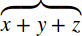

{{MathMLRef}}

The MathML `<mover>` element is used to attach an accent or a limit over an expression. Use the following syntax: `<mover> base overscript </mover>`

## Attributes

This element's attributes include the [global MathML attributes](/en-US/docs/Web/MathML/Global_attributes).

- `accent`
  - : If `true` the over-script is an _accent_, which is drawn closer to the base expression.
    If `false` (default value) the over-script is a _limit_ over the base expression.

## Examples

Sample rendering: 

Rendering in your browser: <math><mover accent="true"><mrow><mi>x</mi><mo>+</mo><mi>y</mi><mo>+</mo><mi>z</mi></mrow><mo>⏞</mo></mover></math>

```html
<math>

<mover accent="true">
  <mrow>
    <mi>x</mi>
    <mo>+</mo>
    <mi>y</mi>
    <mo>+</mo>
    <mi>z</mi>
  </mrow>
  <mo>&#x23DE;<!--TOP CURLY BRACKET--></mo>
</mover>

</math>
```

## Specifications

{{Specifications}}

## Browser compatibility

{{Compat}}

## See also

- {{ MathMLElement("munder") }} (Underscript)
- {{ MathMLElement("munderover") }} (Underscript-overscript pair)
