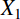

{{MathMLRef}}

The MathML `<msub>` element is used to attach a subscript to an expression.

It uses the following syntax: `<msub> base subscript </msub>`.

## Attributes

This element's attributes include the [global MathML attributes](/en-US/docs/Web/MathML/Global_attributes).

## Examples

Sample rendering: 

Rendering in your browser: <math><msub><mi>X</mi> <mn>1</mn></msub></math>

```html
<math>

  <msub>
    <mi>X</mi>
    <mn>1</mn>
  </msub>

</math>
```

## Specifications

{{Specifications}}

## Browser compatibility

{{Compat}}

## See also

- {{ MathMLElement("msup") }} (Superscript)
- {{ MathMLElement("msubsup") }} (Subscript-superscript pair)
- {{ MathMLElement("mmultiscripts") }} (Prescripts and tensor indices)
