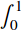

{{MathMLRef}}

The MathML `<msubsup>` element is used to attach both a subscript and a superscript, together, to an expression.

It uses the following syntax: `<msubsup> base subscript superscript </msubsup>`.

## Attributes

This element's attributes include the [global MathML attributes](/en-US/docs/Web/MathML/Global_attributes).

## Examples

Sample rendering: 

Rendering in your browser: <math><msubsup><mo>∫</mo><mn>0</mn><mn>1</mn></msubsup></math>

```html
<math displaystyle="true">

  <msubsup>
    <mo>&#x222B;<!--Integral --></mo>
    <mn>0</mn>
    <mn>1</mn>
  </msubsup>

</math>
```

## Specifications

{{Specifications}}

## Browser compatibility

{{Compat}}

## See also

- {{ MathMLElement("msub") }} (Subscript)
- {{ MathMLElement("msup") }} (Superscript)
- {{ MathMLElement("mmultiscripts") }} (Prescripts and tensor indices)
