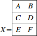

{{MathMLRef}}

The MathML `<mtable>` element allows you to create tables or matrices. Inside a `<mtable>` only {{ MathMLElement("mtr") }} and {{ MathMLElement("mtd") }} elements may appear. These elements are similar to {{ HTMLElement("table") }} , {{ HTMLElement("tr") }} and {{ HTMLElement("td") }} elements of [HTML](/en-US/docs/Web/HTML).

> **Note:** The `<mtable>` element resets the `displaystyle` attribute to `false`. If you want to use this element as an inline-block, you might want to set `<mtable displaystyle="true">...</mtable>`.

## Attributes

This element's attributes include the [global MathML attributes](/en-US/docs/Web/MathML/Global_attributes).

- `align`

  - : Specifies the **vertical** alignment of the table with respect to its environment.
    Possible values are:

    - `axis` (default): The vertical center of the table aligns on the environment's axis (typically the minus sign).
    - `baseline`: The vertical center of the table aligns on the environment's baseline.
    - `bottom`: The bottom of the table aligns on the environments baseline.
    - `center`: See baseline.
    - `top`: The top of the table aligns on the environments baseline.

    In addition, values of the `align` attribute can end with a _rownumber_ (e.g. `align="center 3"`). This allows you to align the specified row of the table rather than the whole table. A negative Integer value counts rows from the bottom of the table.

- `columnalign`
  - : Specifies the horizontal alignment of the cells. Multiple values separated by space are allowed and apply to the corresponding columns (e.g. `columnalign="left right center"`). Possible values are: `left`, `center` (default) and `right`.
- `columnlines`
  - : Specifies column borders. Multiple values separated by space are allowed and apply to the corresponding columns (e.g. `columnlines="none none solid"`). Possible values are: `none` (default), `solid` and `dashed`.
- `columnspacing`
  - : Specifies the space between table columns.
- `frame`
  - : Specifies borders of the entire table. Possible values are: `none` (default), `solid` and `dashed`.
- `framespacing`
  - : Specifies additional space added between the table and frame.
- `rowalign`
  - : Specifies the vertical alignment of the cells. Multiple values separated by space are allowed and apply to the corresponding rows (e.g. `rowalign="top bottom axis"`). Possible values are: `axis`, `baseline` (default), `bottom`, `center` and `top`.
- `rowlines`
  - : Specifies row borders. Multiple values separated by space are allowed and apply to the corresponding rows (e.g. `rowlines="none none solid"`). Possible values are: `none` (default), `solid` and `dashed`.
- {{ unimplemented_inline() }} rowspacing
  - : Specifies the space between table rows.
- `width`
  - : Specifies the width of the entire table. Accepts [length values](/en-US/docs/Web/MathML/Attribute/Values#lengths).

## Examples

### Alignment with row number

Rendering: 

```html
<math>

    <mi>X</mi>
    <mo>=</mo>
    <mtable frame="solid" rowlines="solid" align="axis 3">
        <mtr>
             <mtd><mi>A</mi></mtd>
             <mtd><mi>B</mi></mtd>
        </mtr>
        <mtr>
             <mtd><mi>C</mi></mtd>
             <mtd><mi>D</mi></mtd>
        </mtr>
        <mtr>
             <mtd><mi>E</mi></mtd>
             <mtd><mi>F</mi></mtd>
        </mtr>
    </mtable>

</math>
```

## Specifications

{{Specifications}}

## Browser compatibility

{{Compat}}

## See also

- {{ MathMLElement("mtd") }} (Table cell)
- {{ MathMLElement("mtr") }} (Table row)
