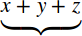

{{MathMLRef}}

The MathML `<munder>` element is used to attach an accent or a limit under an expression. It uses the following syntax: `<munder> base underscript </munder>`

## Attributes

This element's attributes include the [global MathML attributes](/en-US/docs/Web/MathML/Global_attributes).

- `accentunder`
  - : If `true`, the element is an _accent_, which is drawn closer to the base expression.
    If `false` (default value), the element is a _limit_ under the base expression.

## Examples

Sample rendering: 

Rendering in your browser: <math><munder accentunder="true"><mrow><mi>x</mi><mo>+</mo><mi>y</mi><mo>+</mo><mi>z</mi></mrow><mo>⏟</mo></munder></math>

```html
<math>

<munder accentunder="true">
  <mrow>
    <mi>x</mi>
    <mo>+</mo>
    <mi>y</mi>
    <mo>+</mo>
    <mi>z</mi>
  </mrow>
  <mo>&#x23DF;<!--BOTTOM CURLY BRACKET--></mo>
</munder>

</math>
```

## Specifications

{{Specifications}}

## Browser compatibility

{{Compat}}

## See also

- {{ MathMLElement("mover") }} (Overscript)
- {{ MathMLElement("munderover") }} (Underscript-overscript pair)
