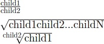

{{MathMLRef}}

{{PreviousMenuNext("Web/MathML/Guides/Text_containers", "Web/MathML/Guides/Scripts", "Web/MathML/Guides")}}

Relying on text containers, this article describes how to build more complex MathML expressions by nesting fractions and roots.

## Subtrees of \<mfrac>, \<msqrt> and \<mroot>

In the [getting started with MathML](/en-US/docs/Web/MathML/Guides/Getting_started) article, we've already met the `<mfrac>` element to describe a fraction. Let's consider a basic example which adds new elements for roots (`<msqrt>` and `<mroot>`):

```html
<math>
  <mfrac>
    <mtext>child1</mtext>
    <mtext>child2</mtext>
  </mfrac>
</math>
<br />
<math>
  <msqrt>
    <mtext>child1</mtext>
    <mtext>child2</mtext>
    <mtext>...</mtext>
    <mtext>childN</mtext>
  </msqrt>
</math>
<br />
<math>
  <mroot>
    <mtext>child1</mtext>
    <mtext>child2</mtext>
  </mroot>
</math>
```

Below is a screenshot of how it is rendered by a browser:



- We already know that the `<mfrac>` element is rendered as a fraction: The first child (the numerator) is drawn above the second child (the denominator) separated by a horizontal bar.
- The `<msqrt>` is rendered as a square root: its children are laid out like an [`<mrow>`](/en-US/docs/Web/MathML/Guides/Getting_started#grouping_with_the_mrow_element), prefixed by a root symbol √ and completely covered by an overbar.
- Finally, the `<mroot>` element is rendered as an nth root: The first element is covered by the radical symbol while the second element is used as the degree of the root and rendered as a prefix superscript.

### Active learning: nesting different elements

Here is an exercise to verify whether you understood the relation between a MathML subtree and its visual rendering. The document contains a MathML formula and you must check all subtrees corresponding to a subtree in that MathML formula. Once you are done, you can inspect the source of the MathML formula and verify if it matches your expectation.

```html hidden
<!doctype html>
<html lang="en-US">
  <head>
    <meta charset="utf-8" />
    <title>My page with math characters</title>
    <link
      rel="stylesheet"
      href="https://fred-wang.github.io/MathFonts/LatinModern/mathfonts.css" />
  </head>
  <body>
    <p>
      <math>
        <mfrac id="mfrac1">
          <msqrt id="msqrt1">
            <mn>2</mn>
          </msqrt>
          <mroot id="mroot1">
            <mn>4</mn>
            <mn>3</mn>
          </mroot>
        </mfrac>
        <mo>+</mo>
        <mroot id="mroot2">
          <mn>5</mn>
          <mfrac id="mfrac2">
            <mn>6</mn>
            <mn>7</mn>
          </mfrac>
        </mroot>
        <mo>+</mo>
        <msqrt id="msqrt2">
          <mn>8</mn>
          <mo>−</mo>
          <mn>9</mn>
        </msqrt>
      </math>
    </p>

    <ol id="options">
      <li>
        <input
          type="checkbox"
          data-comment="Verify the order of children in an mfrac!" />
        An mfrac with an mroot as its first child and an msqrt as its second
        child.
      </li>
      <li>
        <input
          type="checkbox"
          data-highlight="mroot2"
          data-comment="The '6 over 7'-th root of five." />
        An mroot with an mn as its first child and mfrac as its second child.
      </li>
      <li>
        <input
          type="checkbox"
          data-comment="This formula does not contain any fraction inside a square root!" />
        An msqrt containing an mfrac element.
      </li>
      <li>
        <input
          type="checkbox"
          data-comment="The square root of two."
          data-highlight="msqrt1" />
        An msqrt with one mn child.
      </li>
      <li>
        <input
          type="checkbox"
          data-comment="Verify the order of children in an mroot!" />
        An mroot with an mfrac as its first child and mn as its second child.
      </li>
      <li>
        <input
          type="checkbox"
          data-comment="The square root of 'eight minus nine'."
          data-highlight="msqrt2" />
        An msqrt with the following list of children: mn, mo, mn.
      </li>
      <li>
        <input
          type="checkbox"
          data-comment="The square root of two over the cubic root of four."
          data-highlight="mfrac1" />
        An mfrac with an msqrt as its first child and an mroot as its second
        child.
      </li>
      <li>
        <input
          type="checkbox"
          data-comment="mfrac must have exactly two children!" />
        An mfrac with the following list of children: msqrt, mn, msqrt.
      </li>
      <li>
        <input
          type="checkbox"
          data-comment="mroot must have exactly two children!" />
        An mroot with one mn child.
      </li>
      <li>
        <input
          type="checkbox"
          data-comment="The fraction six over seven."
          data-highlight="mfrac2" />
        An mfrac with two mn children.
      </li>
      <li>
        <input
          type="checkbox"
          data-comment="This formula does not contain any square root with more than two numbers!" />
        An msqrt with five mn children.
      </li>
      <li>
        <input
          type="checkbox"
          data-highlight="mroot1"
          data-comment="The cubic root of four." />
        An mroot with two mn children.
      </li>
    </ol>
    <p>
      <strong id="comment"></strong>
    </p>
    <p>
      <strong id="status"></strong>
    </p>
  </body>
</html>
```

```css hidden
math {
  font-family:
    Latin Modern Math,
    STIX Two Math;
  font-size: 200%;
}
math .highlight {
  background: pink;
}
math [id] .highlight {
  background: lightblue;
}
p {
  padding: 0.5em;
}
```

```js hidden
const options = document.getElementById("options");
const comment = document.getElementById("comment");
const checkboxes = Array.from(options.getElementsByTagName("input"));
const status = document.getElementById("status");
function verifyOption(checkbox) {
  let mathml = checkbox.dataset.highlight;
  if (mathml) {
    mathml = document.getElementById(mathml);
  }
  if (checkbox.checked) {
    comment.textContent = checkbox.dataset.comment;
    if (mathml) {
      mathml.classList.add("highlight");
    } else {
      checkbox.checked = false;
    }
  } else {
    comment.textContent = "";
    if (mathml) {
      mathml.classList.remove("highlight");
    }
  }
  const finished = checkboxes.every(
    (checkbox) => !!checkbox.checked === !!checkbox.dataset.highlight,
  );
  status.textContent = finished
    ? "Congratulations, you checked all the correct answers!"
    : "";
}
checkboxes.forEach((checkbox) => {
  checkbox.addEventListener("change", () => {
    verifyOption(checkbox);
  });
});
```

{{ EmbedLiveSample('Active_learning_nesting_different_elements', 700, 600, "", "") }}

## Stretchy radical symbols

As previously seen, the overbar of the `<msqrt>` and `<mroot>` elements stretches horizontally to cover their content. But actually the root symbol √ also stretches to be as tall as their content.

```html hidden
<link
  rel="stylesheet"
  href="https://fred-wang.github.io/MathFonts/LatinModern/mathfonts.css" />
```

```html
<math display="block">
  <mroot>
    <msqrt>
      <mfrac>
        <mn>1</mn>
        <mn>2</mn>
      </mfrac>
    </msqrt>
    <mn>3</mn>
  </mroot>
</math>
```

{{ EmbedLiveSample('Stretchy_radical_symbols', 700, 200, "", "") }}

> [!WARNING]
> Special [math fonts](/en-US/docs/Web/MathML/Fonts) are generally required to make that stretching possible, the previous example relies on [web fonts](/en-US/docs/Learn_web_development/Core/Text_styling/Web_fonts).

## Fractions without bar

Some mathematical concepts are sometimes written using fraction-like notations such [binomial coefficients](https://en.wikipedia.org/wiki/Combination) or [Legendre symbols](https://en.wikipedia.org/wiki/Legendre_symbol). It is appropriate to use an `<mfrac>` element to markup such notations. For fraction-like notations that don't draw a horizontal bar, attach a `linethickness="0"` attribute to the `<mfrac>` element:

```html hidden
<link
  rel="stylesheet"
  href="https://fred-wang.github.io/MathFonts/LatinModern/mathfonts.css" />
```

```html
<math display="block">
  <mrow>
    <mo>(</mo>
    <mfrac linethickness="0">
      <mn>3</mn>
      <mn>2</mn>
    </mfrac>
    <mo>)</mo>
  </mrow>
  <mo>=</mo>
  <mn>3</mn>
  <mo>≠</mo>
  <mfrac>
    <mn>3</mn>
    <mn>2</mn>
  </mfrac>
</math>
```

{{ EmbedLiveSample('Fraction_without_bar', 700, 200, "", "") }}

> [!NOTE]
> Although the `linethickness` attribute can be used to specify an arbitrary thickness, it is better to keep the default value, which is calculated from parameters specified in the math font.

## Summary

In this lesson, we've seen how to build fractions and roots using the `<mfrac>`, `<msqrt>` and `<mroot>` elements. We noticed some special feature of these elements, namely the fraction and radical symbol. We've seen how to use the `linethickness` attribute to draw fractions without bars. In the next article, we will continue with basic math notations and consider [scripts](/en-US/docs/Web/MathML/Guides/Scripts).

## See also

- [The `<mfrac>` element](/en-US/docs/Web/MathML/Element/mfrac)
- [The `<msqrt>` element](/en-US/docs/Web/MathML/Element/msqrt)
- [The `<mroot>` element](/en-US/docs/Web/MathML/Element/mroot)

{{PreviousMenuNext("Web/MathML/Guides/Text_containers", "Web/MathML/Guides/Scripts", "Web/MathML/Guides")}}
