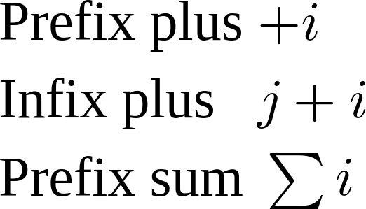

{{MathMLRef}}

{{PreviousMenuNext("Web/MathML/Guides/Getting_started", "Web/MathML/Guides/Fractions_and_roots", "Web/MathML/Guides")}}

Now that you have a better idea of MathML, we move focus on text containers (variables, numbers, operators, ...) which are used as building blocks of MathML formulas.

## Unicode characters for mathematics

Mathematical formulas involve many special characters, for example greek letters (e.g. Δ), fraktur letters (e.g. 𝔄), double-struck letter (e.g. ℂ), binary operators (e.g. ≠), arrows (e.g. ⇒), integral symbols (e.g. ∮), summation symbols (e.g. ∑), logical symbols (e.g. ∀), fences (e.g. ⌊) and many more. Wikipedia's article [Mathematical operators and symbols in Unicode](https://en.wikipedia.org/wiki/Mathematical_operators_and_symbols_in_Unicode) provides a good overview of the characters used.

Since most of these characters are not part of Basic Latin Unicode block, it is recommended to specify your [document's character encoding](/en-US/docs/Learn_web_development/Core/Structuring_content/Webpage_metadata#specifying_your_documents_character_encoding) and to serve it with appropriate [web fonts](/en-US/docs/Learn_web_development/Core/Text_styling/Web_fonts). Here is a basic template to use UTF-8 encoding and the [Latin Modern Math](/en-US/docs/Web/MathML/Fonts#fonts_with_a_math_table) font:

```html
<!doctype html>
<html lang="en-US">
  <head>
    <meta charset="utf-8" />
    <title>My page with math characters</title>
    <link
      rel="stylesheet"
      href="https://fred-wang.github.io/MathFonts/LatinModern/mathfonts.css" />
  </head>
  <body>
    <p style="font-family: Latin Modern Math">∀A∊𝔰𝔩(n,𝔽),TrA=0</p>
  </body>
</html>
```

{{ EmbedLiveSample('Unicode_characters_for_mathematics', 700, 100, "", "") }}

## A bit of semantics

We noticed in the [getting started with MathML](/en-US/docs/Web/MathML/Guides/Getting_started) article that the text in MathML formulas are wrapped in specific container elements such as the `<mn>` or `<mo>`. More generally, every text in MathML formulas must be included inside such container elements, called _token_ elements. In addition, MathML provides multiple token elements in order to distinguish different meanings of the text content:

- The `<mi>` element, which represents an "identifier" which could be a symbolic name or arbitrary text. Examples: `<mi>x</mi>` (variable), `<mi>cos</mi>` (function name) and `<mi>π</mi>` (symbolic constant).
- The `<mn>` element represents a "numeric literal" or other data that should be rendered as a numeric literal. Examples: `<mn>2</mn>` (integer), `<mn>0.123</mn>` (decimal number) or `<mn>0xFFEF</mn>` (hexadecimal value).
- The `<mo>` element represents an operator or anything that should be rendered as an operator. For example `<mo>+</mo>` (binary operation), `<mo>≤</mo>` (binary relation), `<mo>∑</mo>` (summation symbol) or `<mo>[</mo>` (fence).
- The `<mtext>` element is used to represent arbitrary text. For example short words in formulas such as `<mtext>if<mtext>` or `<mtext>maps to</mtext>`.

### Active learning: recognize token elements

Below is a more complex example, which says that the absolute value of a real number is equal to that number if and only if it is nonnegative. Spot the different token elements and what they are used for. Each time you click the corresponding text, it is highlighted and a confirmation message is displayed.

```html hidden
<!doctype html>
<html lang="en-US">
  <head>
    <meta charset="utf-8" />
    <title>My page with math characters</title>
    <link
      rel="stylesheet"
      href="https://fred-wang.github.io/MathFonts/LatinModern/mathfonts.css" />
  </head>
  <body>
    <math display="block">
      <mrow>
        <mrow>
          <mo>|</mo>
          <mi>x</mi>
          <mo>|</mo>
        </mrow>
        <mo>=</mo>
        <mi>x</mi>
      </mrow>
      <mtext>&nbsp;iff&nbsp;</mtext>
      <mrow>
        <mi>x</mi>
        <mo>≥</mo>
        <mn>0</mn>
      </mrow>
    </math>
    <input type="button" id="clearOutput" value="Reset" />
    <div id="output"></div>
  </body>
</html>
```

```css hidden
.highlight {
  color: red;
}
math {
  font-size: 200%;
}
```

```js hidden
const tokenElements = Array.from(
  document.querySelectorAll("mi, mo, mn, mtext"),
);
const outputDiv = document.getElementById("output");
function clearHighlight() {
  tokenElements.forEach((token) => {
    token.classList.remove("highlight");
  });
}
tokenElements.forEach((token) => {
  token.addEventListener("click", () => {
    clearHighlight();
    token.classList.add("highlight");
    outputDiv.insertAdjacentHTML(
      "beforeend",
      `<p><strong>You clicked an <code>&lt;${token.tagName}&gt;</code> element.</strong></p>`,
    );
  });
});
document.getElementById("clearOutput").addEventListener("click", () => {
  clearHighlight();
  outputDiv.textContent = "";
});
```

{{ EmbedLiveSample('Active_learning_recognize_token_elements', 700, 400, "", "") }}

Finally, read the MathML source to verify whether that corresponds to your expectation:

```xml
<math display="block">
  <mrow>
    <mrow>
      <mo>|</mo>
      <mi>x</mi>
      <mo>|</mo>
    </mrow>
    <mo>=</mo>
    <mi>x</mi>
  </mrow>
  <mtext>&nbsp;iff&nbsp;</mtext>
  <mrow>
    <mi>x</mi>
    <mo>≥</mo>
    <mn>0</mn>
  </mrow>
</math>
```

> [!NOTE]
> It is sometimes difficult to decide the token element to use for a given text content. In practice, choosing the wrong element should not cause major issues because all token elements are generally rendered the same by browser implementations (for visual display and for assistive technologies). However, the `<mi>` and `<mo>` elements have special distinguishing features that one should be aware of. They are explained in the following sections.

## Automatic italicization of \<mi>

One typographic convention in mathematics is to use italic letters for variables. In order to help with that, `<mi>` elements with a single character may be automatically rendered as italic. This is the case for all the letters from the latin and greek alphabets. Compare the rendering of the two `<mi>` elements in the following formula:

```html
<math>
  <mi>sin</mi>
  <mi>x</mi>
</math>
```

{{ EmbedLiveSample('Automatic italicization of <mi>', 700, 50) }}

> **Note:** [This table from MathML Core](https://w3c.github.io/mathml-core/#italic-mappings) provide the exhaustive list of characters that are subject to italicization, together with the corresponding italic characters.

## Reverting automatic italicization of \<mi>

In order to revert this default italic transformation you can attach a `mathvariant="normal"` attribute on the `<mi>` element.
Compare the rendering of the uppercase gamma letters in the following formula:

```html
<math>
  <mi>Γ</mi>
  <mi mathvariant="normal">Γ</mi>
</math>
```

{{ EmbedLiveSample('Reverting automatic italicization of <mi>', 700, 50) }}

> [!NOTE]
> Although you can apply this transformation, normally you'd just use the desired [Mathematical Alphanumeric Symbols](https://en.wikipedia.org/wiki/Mathematical_Alphanumeric_Symbols).

## Operator properties of \<mo>

MathML contains an [operator dictionary](https://w3c.github.io/mathml-core/#operator-dictionary-human) that defines default properties of `<mo>` elements depending on their content and the position within its container (prefix, infix or postfix). Let's consider a concrete example:

```html
<table>
  <tr>
    <td>Prefix plus</td>
    <td>
      <math>
        <mo>+</mo>
        <mi>i</mi>
      </math>
    </td>
  </tr>
  <tr>
    <td>Infix plus</td>
    <td>
      <math>
        <mi>j</mi>
        <mo>+</mo>
        <mi>i</mi>
      </math>
    </td>
  </tr>
  <tr>
    <td>Prefix sum</td>
    <td>
      <math>
        <mo>∑</mo>
        <mi>i</mi>
      </math>
    </td>
  </tr>
</table>
```

This example should render similarly to the screenshot below. Observe the spacing between the `<mi>i</mi>` elements and its preceding `<mo>`: no spacing for the prefix plus, some spacing for the infix plus and some smaller spacing for the prefix summation symbol.



Operators have many other properties that we will see in more details later. For now, remember to use an `<mo>` container for characters in the operator dictionary and to properly group subexpressions with `<mrow>` elements in order to help MathML renderers.

### Active learning: spot the difference

Now that you are a bit familiar with special features of `<mi>` and `<mo>`, let's rewrite the `<p>` element in the [example at the top of the page](#unicode_characters_for_mathematics) with some actual MathML. Compare the visual rendering in your browser and explain the differences with the text-only version.

```html
<!doctype html>
<html lang="en-US">
  <head>
    <meta charset="utf-8" />
    <title>My page with math characters</title>
    <link
      rel="stylesheet"
      href="https://fred-wang.github.io/MathFonts/LatinModern/mathfonts.css" />
  </head>
  <body>
    <p style="font-family: Latin Modern Math">∀A∊𝔰𝔩(n,𝔽),TrA=0</p>
    <p>
      <math>
        <mo>∀</mo>
        <mrow>
          <mi>A</mi>
          <mo>∊</mo>
          <mrow>
            <mi>𝔰𝔩</mi>
            <mrow>
              <mo>(</mo>
              <mi>n</mi>
              <mo>,</mo>
              <mi>𝔽</mi>
              <mo>)</mo>
            </mrow>
          </mrow>
        </mrow>
        <mo>,</mo>
        <mrow>
          <mrow>
            <mi>Tr</mi>
            <mi>A</mi>
          </mrow>
          <mo>=</mo>
          <mn>0</mn>
        </mrow>
      </math>
    </p>
    <input id="showSolution" type="button" value="Show solution" />
    <div id="solution"></div>
  </body>
</html>
```

```css hidden
div {
  padding: 0.5em;
}
```

```js hidden
document.getElementById("showSolution").addEventListener(
  "click",
  () => {
    document.getElementById("solution").insertAdjacentHTML(
      "beforeEnd",
      `<ul>
      <li><strong>The <code>&lt;mi&gt;</code> elements containing the "A" and "n" variables are rendered in italic</strong>. However, the <code>&lt;mi&gt;</code> elements with multiple characters "𝔰𝔩" or whose character is "𝔽" are still rendered upright.</li>
      <li><strong>Spacing is automatically added around the <code>&lt;mo&gt;</code> elements whose text is "∀", "∊", "=" or a comma</strong>. However, some of them have no spacing added before while the parentheses still have no spacing around them.</li>
    </ul>`,
    );
  },
  { once: true },
);
```

{{ EmbedLiveSample('active_learning_spot_the_difference', 700, 500, "", "") }}

> [!NOTE]
> An obvious difference is that the source code became much more verbose with MathML. Recall that this tutorial is about learning the language but in practice MathML content is generally not written manually. See the [Authoring MathML](/en-US/docs/Web/MathML/Authoring) page for more information.

### Active learning: stretchy operators

The operator dictionary defines a default _stretchy_ property as well as corresponding _stretch axis_ for some operators. For example, an operator can stretch vertically by default to cover the maximum height of non-stretchy siblings within its `<mrow>` container. By tweaking a bit the [previous exercise](#active_learning_recognize_token_elements), one can make operators stretch vertically. Can you find them?

```html hidden
<!doctype html>
<html lang="en-US">
  <head>
    <meta charset="utf-8" />
    <title>My page with stretchy operators</title>
    <link
      rel="stylesheet"
      href="https://fred-wang.github.io/MathFonts/LatinModern/mathfonts.css" />
  </head>
  <body>
    <math display="block">
      <mrow>
        <mrow>
          <mo>|</mo>
          <mfrac>
            <mn>1</mn>
            <mi>x</mi>
          </mfrac>
          <mo>|</mo>
        </mrow>
        <mo>=</mo>
        <mfrac>
          <mn>1</mn>
          <mrow>
            <mo>|</mo>
            <mi>x</mi>
            <mo>|</mo>
          </mrow>
        </mfrac>
        <mo>=</mo>
        <mfrac>
          <mn>1</mn>
          <mi>x</mi>
        </mfrac>
      </mrow>
      <mtext>&nbsp;iff&nbsp;</mtext>
      <mrow>
        <mi>x</mi>
        <mo>≥</mo>
        <mn>0</mn>
      </mrow>
    </math>
    <input type="button" id="clearOutput" value="Reset" />
    <div id="output"></div>
  </body>
</html>
```

```css hidden
.highlight {
  color: red;
}
math {
  font-size: 200%;
}
```

```js hidden
const tokenElements = Array.from(
  document.querySelectorAll("mi, mo, mn, mtext"),
);
const stretchyMoElements = Array.from(
  document.getElementsByTagName("mo"),
).slice(0, 2);
const outputDiv = document.getElementById("output");
function clearHighlight() {
  tokenElements.forEach((token) => {
    token.classList.remove("highlight");
  });
}
tokenElements.forEach((token) => {
  token.addEventListener("click", () => {
    clearHighlight();
    token.classList.add("highlight");
    let message = "";
    let tagName = `<code>&lt;${token.tagName}&gt;</code>`;
    if (token.tagName !== "mo") message = `No, this is an ${tagName} element!`;
    else if (!stretchyMoElements.includes(token))
      message = `No, this is an ${tagName} element, but it's not vertically stretched.`;
    else
      message = `Correct, this ${tagName} element is indeed stretched to the height of its <code>&lt;mfrac&gt;</code> sibling.`;
    outputDiv.insertAdjacentHTML(
      "beforeend",
      `<p><strong>${message}</strong></p>`,
    );
  });
});
document.getElementById("clearOutput").addEventListener("click", () => {
  clearHighlight();
  outputDiv.textContent = "";
});
```

{{ EmbedLiveSample('Active_learning_stretchy_fences', 700, 400, "", "") }}

As usual, you are invited to read the source code when you are done:

```xml
<math display="block">
  <mrow>
    <mrow>
      <mo>|</mo>
      <mfrac>
        <mn>1</mn>
        <mi>x</mi>
      </mfrac>
      <mo>|</mo>
    </mrow>
    <mo>=</mo>
    <mfrac>
      <mn>1</mn>
      <mrow>
        <mo>|</mo>
        <mi>x</mi>
        <mo>|</mo>
      </mrow>
    </mfrac>
    <mo>=</mo>
    <mfrac>
      <mn>1</mn>
      <mi>x</mi>
    </mfrac>
  </mrow>
  <mtext>&nbsp;iff&nbsp;</mtext>
  <mrow>
    <mi>x</mi>
    <mo>≥</mo>
    <mn>0</mn>
  </mrow>
</math>
```

> [!WARNING]
> Special [math fonts](/en-US/docs/Web/MathML/Fonts) are generally required to make that stretching possible, the previous example relies on [web fonts](/en-US/docs/Learn_web_development/Core/Text_styling/Web_fonts).

## Summary

In this article, we have learnt about a few _token_ elements that are used as text containers as well as their different semantics, namely `<mi>` (identifier), `<mn>` (numbers), `<mo>` (operators), `<mtext>` (generic text). We have seen special Unicode characters that are commonly found in math formulas and given an overview of some observable behaviors of the `<mi>` and `<mo>` elements. In the next article, we will see how to rely on _token_ elements to build much complex expressions such as [fractions and roots](/en-US/docs/Web/MathML/Guides/Fractions_and_roots).

## See also

- [The `<mi>` element](/en-US/docs/Web/MathML/Element/mi)
- [The `<mn>` element](/en-US/docs/Web/MathML/Element/mn)
- [The `<mo>` element](/en-US/docs/Web/MathML/Element/mo)
- [The `<mtext>` element](/en-US/docs/Web/MathML/Element/mtext)

{{PreviousMenuNext("Web/MathML/Guides/Getting_started", "Web/MathML/Guides/Fractions_and_roots", "Web/MathML/Guides")}}
