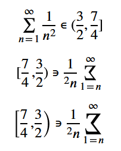

The **`dir`** [global attribute](/en-US/docs/Web/MathML/Reference/Global_attributes) is an [enumerated](/en-US/docs/Glossary/Enumerated) attribute that indicates the directionality of the MathML element.

## Syntax

```html-nolint
<math dir="ltr">
<math dir="rtl">
```

### Values

- `ltr`
  - : Left to the right rendering of mathematical expressions (e.g., in English or Moroccan).
- `rtl`
  - : Right to the left rendering of mathematical expressions (e.g., in Maghreb or Machrek).

## Description

The directionality controls whether math formulas are rendered left-to-right or right-to-left.

### Mirroring and stretching MathML formulas in RTL mode

When rendering a written language that displayed right-to-left, the symbols in a MathML formula may need to be mirrored/flipped around the vertical axis, and potentially also stretched vertically.

Mirroring may be achieved using different approaches to find a "base glyph":

- _Character-level mirroring_: replacing a character with the equivalent mirrored Unicode code point as defined by Unicode's `Bidi_Mirrored` property (for example, replacing `>` with `<`, or `]` with `[`).
- _Glyph-level mirroring_: replacing a character with a glyph that can represent it in a mirrored content (if no direct replacement exists).
  This requires that the font used supports the [Right to left mirror forms (`rtlm`) font feature](https://en.wikipedia.org/wiki/List_of_typographic_features#Features_depending_on_writing_direction).

The base glyph may then be used as a key in the OpenType MathVariant table to get either a larger glyph or a glyph assembly.

Note that effective mirroring and stretching requires a font that includes both a OpenType MathVariant table and support for the `rtlm` font feature, such as XITS.

### Prefer `dir` to the CSS `direction` property

This attribute can be overridden by the CSS property {{ cssxref("direction") }}, if a CSS page is active and the element supports these properties.
As the directionality of mathematics is semantically related to its content and not to its presentation, it is recommended that web developers use this attribute instead of the related CSS properties when possible.
That way, the formulas will display correctly even on a browser that doesn't support CSS or has the CSS deactivated.

> [!NOTE]
> The `dir` attribute is often set to `rtl` in the Arabic-speaking world.
> However, languages written from right to left often embed mathematical content written from left to right.
> Consequently, the `auto` keyword from the HTML `dir` attribute is not recognized and by default the [user agent stylesheet](/en-US/docs/Web/CSS/Guides/Cascade/Introduction#user-agent_stylesheets) resets the direction property on the [`math`](/en-US/docs/Web/MathML/Reference/Element/math) element.

## Examples

### Basic usage

```css hidden
html,
body {
  height: 100%;
}

body {
  display: grid;
  place-items: center;
  font-size: 1.5rem;
}
```

```html
<!-- Moroccan style -->
<math display="block" dir="ltr">
  <msqrt>
    <mi>س</mi>
  </msqrt>
  <mo>=</mo>
  <msup>
    <mn>3</mn>
    <mi>ب</mi>
  </msup>
</math>

<!-- Maghreb/Machrek style -->
<math display="block" dir="rtl">
  <msqrt>
    <mi>س</mi>
  </msqrt>
  <mo>=</mo>
  <msup>
    <mn>٣</mn>
    <mi>ب</mi>
  </msup>
</math>
```

{{ EmbedLiveSample("Basic usage", "", 150) }}

### Mirroring and stretching

This example demonstrates the effects of `ltr` and `rtl` direction for a more complicated MathML formula, including the effects of setting `largeop` and `stretchy` on the [`<mo>`](/en-US/docs/Web/MathML/Reference/Element/mo) element.

#### MathML

```css hidden
html,
body {
  height: 100%;
}

body {
  display: grid;
  font-size: 1.5rem;
}
```

First we link a stylesheet for the XITS font, which supports the `rtlm` font feature and MathVariant table needed to properly mirror and stretch glyphs.

```html
<link
  rel="stylesheet"
  href="https://fred-wang.github.io/MathFonts/XITS/mathfonts.css" />
```

The first two formulas set `largeop` and `stretchy` to false for the respective elements, and are displayed `ltr` and `rtl`.

```html
<math dir="ltr" display="block">
  <mrow>
    <munderover>
      <mo largeop="false">∑</mo>
      <mrow>
        <mi>n</mi>
        <mo>=</mo>
        <mn>1</mn>
      </mrow>
      <mn>∞</mn>
    </munderover>
    <mfrac>
      <mn>1</mn>
      <msup>
        <mi>n</mi>
        <mn>2</mn>
      </msup>
    </mfrac>
  </mrow>
  <mo>∊</mo>
  <mrow>
    <mo stretchy="false">(</mo>
    <mfrac>
      <mn>3</mn>
      <mn>2</mn>
    </mfrac>
    <mo>,</mo>
    <mfrac>
      <mn>7</mn>
      <mn>4</mn>
    </mfrac>
    <mo stretchy="false">]</mo>
  </mrow>
</math>
```

```html
<math dir="rtl" display="block">
  <mrow>
    <munderover>
      <mo largeop="false">∑</mo>
      <mrow>
        <mi>n</mi>
        <mo>=</mo>
        <mn>1</mn>
      </mrow>
      <mn>∞</mn>
    </munderover>
    <mfrac>
      <mn>1</mn>
      <msup>
        <mi>n</mi>
        <mn>2</mn>
      </msup>
    </mfrac>
  </mrow>
  <mo>∊</mo>
  <mrow>
    <mo stretchy="false">(</mo>
    <mfrac>
      <mn>3</mn>
      <mn>2</mn>
    </mfrac>
    <mo>,</mo>
    <mfrac>
      <mn>7</mn>
      <mn>4</mn>
    </mfrac>
    <mo stretchy="false">]</mo>
  </mrow>
</math>
```

This formula is also `rtl`, but sets `largeop` to true for the `∑` operator, which renders it larger.
It also sets `stretchy` to `true` for the braces, which makes them stretch to the height of the contained fraction on supporting browsers.

```html
<math dir="rtl" display="block">
  <mrow>
    <munderover>
      <mo largeop="true">∑</mo>
      <mrow>
        <mi>n</mi>
        <mo>=</mo>
        <mn>1</mn>
      </mrow>
      <mn>∞</mn>
    </munderover>
    <mfrac>
      <mn>1</mn>
      <msup>
        <mi>n</mi>
        <mn>2</mn>
      </msup>
    </mfrac>
  </mrow>
  <mo>∊</mo>
  <mrow>
    <mo stretchy="true">(</mo>
    <mfrac>
      <mn>3</mn>
      <mn>2</mn>
    </mfrac>
    <mo>,</mo>
    <mfrac>
      <mn>7</mn>
      <mn>4</mn>
    </mfrac>
    <mo stretchy="true">]</mo>
  </mrow>
</math>
```

#### Results

On a browser that supports RTL mirroring and stretching the output for the three formulas should appear as shown below.
The first two show the formula left-to-right, and right-to-left without any stretching.
The final formula uses `rtl` with `stretching`, and `largeop` for the sum symbol.



On this browser, it looks like this:

{{ EmbedLiveSample("Mirroring and stretching", "", 250) }}

## Specifications

{{Specifications}}

## Browser compatibility

{{Compat}}

## See also

- All [global attributes](/en-US/docs/Web/MathML/Reference/Global_attributes).
- {{cssxref("direction")}}
- The HTML [`dir`](/en-US/docs/Web/HTML/Reference/Global_attributes/dir) global attribute
