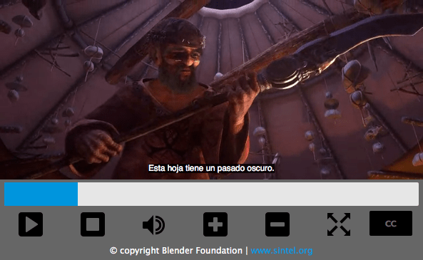

In other articles we looked at how to [build a cross browser video player](/en-US/docs/Web/Media/Guides/Audio_and_video_delivery/cross_browser_video_player) using the {{ domxref("HTMLMediaElement") }} and {{ domxref("Window.fullScreen") }} APIs, and also at how to [style the player](/en-US/docs/Web/Media/Guides/Audio_and_video_delivery/Video_player_styling_basics). This article will take the same player and show how to add captions and subtitles to it, using [the WebVTT format](/en-US/docs/Web/API/WebVTT_API/Web_Video_Text_Tracks_Format) and the {{ htmlelement("track") }} element.

## Captioned video example

In this article, we will refer to the Video player with captions example. This example uses an excerpt from the [Sintel open movie](https://durian.blender.org/), created by the [Blender Foundation](https://www.blender.org/about/foundation/).



> [!NOTE]
> You can find the [source on GitHub](https://github.com/iandevlin/iandevlin.github.io/tree/master/mdn/video-player-with-captions), and also [view the example live](https://iandevlin.github.io/mdn/video-player-with-captions/).

## HTML and Video Captions

Before diving into how to add captions to the video player, there are a number of things that we will first mention, which you should be aware of before we start.

### Captions versus subtitles

[Captions and subtitles are not the same thing](https://web.archive.org/web/20160117160743/http://screenfont.ca/learn/): they have significantly different audiences, and convey different information, and it is recommended that you read up on the differences if you are not sure what they are. They are however implemented in the same way technically, so the material in this article will apply to both.

For this article we will refer to the text tracks displayed as subtitles, as their content is aimed at hearing people who have difficulty understanding the language of the film, rather than deaf or hard-of-hearing people.

### The `<track>` element

HTML allows us to specify subtitles for a video using the {{ htmlelement("track") }} element. The various attributes of this element allow us to specify such things as the type of content that we're adding, the language it's in, and of course a reference to the text file that contains the actual subtitle information.

### WebVTT

The files that contain the actual subtitle data are simple text files that follow a specified format, in this case the [Web Video Text Tracks](/en-US/docs/Web/API/WebVTT_API) (WebVTT) format. The [WebVTT specification](https://w3c.github.io/webvtt/) is still being worked on, but major parts of it are stable so we can use it today.

Video providers (such as the [Blender Foundation](https://www.blender.org/about/foundation/)) provide captions and subtitles in a text format with their videos, but they're usually in the SubRip Text (SRT) format. These can be easily converted to WebVTT using an online converter.

## Modifications to the HTML and CSS

This section summarizes the modifications made to the previous article's code in order to facilitate the addition of subtitles to the video. If you are not interested in this, and just want to get straight into the JavaScript and more relevant CSS, skip to the [Subtitle implementation](#subtitle_implementation) section.

In this example we are using a different video, [Sintel](https://durian.blender.org/), as it actually has some speech in it and therefore is better for illustrating how subtitles work!

### HTML Markup

As mentioned above, we need to make use of the new HTML `<track>` element to add our subtitle files to the HTML video. We actually have our subtitles in three different languages — English, German, and Spanish — so we will reference all three of the relevant VTT files by adding `<track>` elements inside our HTML `<video>` element:

```html
<video id="video" controls preload="metadata">
  <source src="video/sintel-short.mp4" type="video/mp4" />
  <source src="video/sintel-short.webm" type="video/webm" />
  <track
    label="English"
    kind="subtitles"
    srclang="en"
    src="captions/vtt/sintel-en.vtt"
    default />
  <track
    label="Deutsch"
    kind="subtitles"
    srclang="de"
    src="captions/vtt/sintel-de.vtt" />
  <track
    label="Español"
    kind="subtitles"
    srclang="es"
    src="captions/vtt/sintel-es.vtt" />
</video>
```

As you can see, each `<track>` element has the following attributes set:

- `kind` is given a value of `subtitles`, indicating the type of content the files contain
- `label` is given a value indicating which language that subtitle set is for — for example `English` or `Deutsch` — these labels will appear in the user interface to allow the user to easily select which subtitle language they want to see.
- `src` is assigned a valid URL pointing to the relevant WebVTT subtitle file in each case.
- `srclang` indicates what language each subtitle files' contents are in.
- The `default` attribute is set on the English `<track>` element, indicating to the browser that this is the default subtitle file definition to use when subtitles have been turned on and the user has not made a specific selection.

In addition to adding the `<track>` elements, we have also added a new button to control the subtitles menu that we will build. As a consequence, the video controls now look as follows:

```html
<div id="video-controls" class="controls" data-state="hidden">
  <button id="play-pause" type="button" data-state="play">Play/Pause</button>
  <button id="stop" type="button" data-state="stop">Stop</button>
  <div class="progress">
    <progress id="progress" value="0" min="0">
      <span id="progress-bar"></span>
    </progress>
  </div>
  <button id="mute" type="button" data-state="mute">Mute/Unmute</button>
  <button id="vol-inc" type="button" data-state="vol-up">Vol+</button>
  <button id="vol-dec" type="button" data-state="vol-down">Vol-</button>
  <button id="fs" type="button" data-state="go-fullscreen">Fullscreen</button>
  <button id="subtitles" type="button" data-state="subtitles">CC</button>
</div>
```

### CSS Changes

The video controls have undergone some minor changes in order to make space for the extra button, but these are relatively straightforward.

No image is used for the captions button, so it is styled as:

```css
.controls button[data-state="subtitles"] {
  height: 85%;
  text-indent: 0;
  font-size: 16px;
  font-size: 1rem;
  font-weight: bold;
  color: #666;
  background: #000;
  border-radius: 2px;
}
```

There are also other CSS changes that are specific to some extra JavaScript implementation, but these will be mentioned at the appropriate place below.

## Subtitle implementation

A lot of what we do to access the video subtitles revolves around JavaScript. Similar to the video controls, if a browser supports HTML video subtitles, there will be a button provided within the native control set to access them. However, since we have defined our own video controls, this button is hidden, and we need to define our own.

Browsers do vary as to what they support, so we will be attempting to bring a more unified UI to each browser where possible. There's more on browser compatibility issues later on.

### Initial setup

As with all the other buttons, one of the first things we need to do is store a handle to the subtitles' button:

```js
const subtitles = document.getElementById("subtitles");
```

We also initially turn off all subtitles, in case the browser turns any of them on by default:

```js
for (let i = 0; i < video.textTracks.length; i++) {
  video.textTracks[i].mode = "hidden";
}
```

The `video.textTracks` property contains an array of all the text tracks attached to the video. We loop through each one and set its `mode` to `hidden`.

Note: The [WebVTT API](https://w3c.github.io/webvtt/#api) gives us access to all the text tracks that are defined for an HTML video using the `<track>` element.

### Building a caption menu

Our aim is to use the `subtitles` button we added earlier to display a menu that allows users to choose which language they want the subtitles displayed in, or to turn them off entirely.

We have added the button, but before we make it do anything, we need to build the menu that goes with it. This menu is built dynamically, so that languages can be added or removed later by editing the `<track>` elements within the video's markup.

All we need to do is to go through the video's `textTracks`, reading their properties and building the menu up from there:

```js
let subtitlesMenu;
if (video.textTracks) {
  const df = document.createDocumentFragment();
  subtitlesMenu = df.appendChild(document.createElement("ul"));
  subtitlesMenu.className = "subtitles-menu";
  subtitlesMenu.appendChild(createMenuItem("subtitles-off", "", "Off"));
  for (let i = 0; i < video.textTracks.length; i++) {
    subtitlesMenu.appendChild(
      createMenuItem(
        `subtitles-${video.textTracks[i].language}`,
        video.textTracks[i].language,
        video.textTracks[i].label,
      ),
    );
  }
  videoContainer.appendChild(subtitlesMenu);
}
```

This code creates a {{ domxref("documentFragment") }}, which is used to hold an unordered list containing our subtitles menu. First of all an option is added to allow the user to switch all subtitles off, and then buttons are added for each text track, reading the language and label from each one.

The creation of each list item and button is done by the `createMenuItem()` function, which is defined as follows:

```js
const subtitleMenuButtons = [];
function createMenuItem(id, lang, label) {
  const listItem = document.createElement("li");
  const button = listItem.appendChild(document.createElement("button"));
  button.setAttribute("id", id);
  button.className = "subtitles-button";
  if (lang.length > 0) button.setAttribute("lang", lang);
  button.value = label;
  button.setAttribute("data-state", "inactive");
  button.appendChild(document.createTextNode(label));
  button.addEventListener("click", (e) => {
    // Set all buttons to inactive
    subtitleMenuButtons.forEach((button) => {
      button.setAttribute("data-state", "inactive");
    });

    // Find the language to activate
    const lang = button.getAttribute("lang");
    for (let i = 0; i < video.textTracks.length; i++) {
      // For the 'subtitles-off' button, the first condition will never match so all will subtitles be turned off
      if (video.textTracks[i].language === lang) {
        video.textTracks[i].mode = "showing";
        button.setAttribute("data-state", "active");
      } else {
        video.textTracks[i].mode = "hidden";
      }
    }
    subtitlesMenu.style.display = "none";
  });
  subtitleMenuButtons.push(button);
  return listItem;
}
```

This function builds the required {{ htmlelement("li") }} and {{ htmlelement("button") }} elements, and returns them so they can be added to the subtitles menu list. It also sets up the required event listeners on the button to toggle the relevant subtitle set on or off. This is done by setting the required subtitle's `mode` attribute to `showing`, and setting the others to `hidden`.

Once the menu is built, it is then inserted into the DOM at the bottom of the videoContainer.

Initially the menu is hidden by default, so an event listener needs to be added to our subtitles button to toggle it:

```js
subtitles.addEventListener("click", (e) => {
  if (subtitlesMenu) {
    subtitlesMenu.style.display =
      subtitlesMenu.style.display === "block" ? "none" : "block";
  }
});
```

### Subtitle menu CSS

We also added some rudimentary styling for the newly created subtitles menu:

```css
.subtitles-menu {
  display: none;
  position: absolute;
  bottom: 14.8%;
  right: 20px;
  background: #666;
  list-style-type: none;
  margin: 0;
  width: 100px;
  padding: 10px;
}

.subtitles-menu li {
  padding: 0;
  text-align: center;
}

.subtitles-menu li button {
  border: none;
  background: #000;
  color: #fff;
  cursor: pointer;
  width: 90%;
  padding: 2px 5px;
  border-radius: 2px;
}
```

## Styling the displayed subtitles

One of the less well known about and supported features of WebVTT is the ability to style the individual subtitles (something called text cues) via [CSS Extensions](https://w3c.github.io/webvtt/#css-extensions).

The `::cue` pseudo-element is the key to targeting individual text track cues for styling, as it matches any defined cue. There are only a handful of CSS properties that can be applied to a text cue:

- {{ cssxref("color") }}
- {{ cssxref("opacity") }}
- {{ cssxref("visibility") }}
- {{ cssxref("text-decoration") }}
- {{ cssxref("text-shadow") }}
- {{ cssxref("background") }} shorthand properties
- {{ cssxref("outline") }} shorthand properties
- {{ cssxref("font") }} shorthand properties, including {{ cssxref("line-height") }}
- {{ cssxref("white-space") }}

For example, to change the text color of the text track cues you can write:

```css
::cue {
  color: #ccc;
}
```

If the WebVTT file uses [voice spans](https://w3c.github.io/webvtt/#dfn-webvtt-cue-voice-span), which allow cues to be defined as having a particular "voice":

```plain
0
00:00:00.000 --> 00:00:12.000
<v Test>[Test]</v>
```

Then this specific 'voice' will be stylable like so:

```css
::cue(v[voice="Test"]) {
  color: #fff;
  background: #0095dd;
}
```

> [!NOTE]
> Some of the styling of cues with ::cue currently works on Chrome, Opera, and Safari, but not yet on Firefox.

## Browser compatibility

[Browser support for WebVTT and the `<track>` element](https://caniuse.com/webvtt) is fairly good, although some browsers differ slightly in their implementation.

### Safari

In Safari 6.1+, subtitles are enabled by default, and the default controls contain a button and a menu that offers the same functionality as the menu we just built, along with an "Auto" option which allows the browser to choose. The `default` attribute is also supported.

### Chrome and Opera

These browsers have similar implementations again: subtitles are enabled by default and the default control set contains a 'cc' button that turns subtitles on and off. Chrome and Opera ignore the `default` attribute on the `<track>` element and will instead try to match the browser's language to the subtitle's language.

## Plugins

There are also many open-source and commercial HTML video-player plugins that offer caption and subtitle support that you can use instead of rolling your own.
You can search for those on the web using search terms like _"HTML video player plugin"_.
