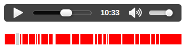

Sometimes it's useful to know how much {{htmlelement("audio") }} or {{htmlelement("video") }} has downloaded or is playable without delay — a good example of this is the buffered progress bar of an audio or video player. This article discusses how to build a buffer/seek bar using [TimeRanges](/en-US/docs/Web/API/TimeRanges), and other features of the media API.

## Buffered

The `buffered` attribute will tell us which parts of the media has been downloaded. It returns a {{ domxref("TimeRanges") }} object, which will tell us which chunks of media have been downloaded. This is usually contiguous but if the user jumps about while media is buffering, it may contain holes.

This will work with {{htmlelement("audio") }} or {{htmlelement("video") }}; for now let's consider an audio example:

```html
<audio id="my-audio" controls src="music.mp3"></audio>
```

We can access these attributes like so:

```js
const audio = document.getElementById("my-audio");
const bufferedTimeRanges = audio.buffered;
```

## TimeRanges Object

TimeRanges are a series of non-overlapping ranges of time, with start and stop times. ([learn more about TimeRanges](/en-US/docs/Web/API/TimeRanges)).

A {{ domxref("TimeRanges") }} Object consists of the following properties:

- `length`: The number of time ranges in the object.
- `start(index)`: The start time, in seconds, of a time range.
- `end(index)`: The end time, in seconds, of a time range.

Without any user interaction there is usually only one time range, but if you jump about in the media more than one time range can appear, as illustrated by the below visualization. This represents two buffered time ranges — one spanning 0 to 5 seconds and the second spanning 15 to 19 seconds.

```plain
------------------------------------------------------
|=============|                    |===========|     |
------------------------------------------------------
0             5                    15          19    21
```

For this audio instance, the associated {{ domxref("TimeRanges") }} object would have the following available properties:

```js
audio.buffered.length; // returns 2
audio.buffered.start(0); // returns 0
audio.buffered.end(0); // returns 5
audio.buffered.start(1); // returns 15
audio.buffered.end(1); // returns 19
```

To try out and visualize buffered time ranges we can write a bit of HTML:

```html
<p>
  <audio id="my-audio" controls>
    <source src="music.mp3" type="audio/mpeg" />
  </audio>
</p>
<p>
  <canvas id="my-canvas" width="300" height="20"> </canvas>
</p>
```

and a bit of JavaScript:

```js
window.onload = () => {
  const audio = document.getElementById("my-audio");
  const canvas = document.getElementById("my-canvas");
  const context = canvas.getContext("2d");

  context.fillStyle = "lightgray";
  context.fillRect(0, 0, canvas.width, canvas.height);
  context.fillStyle = "red";
  context.strokeStyle = "white";

  const inc = canvas.width / audio.duration;

  // Display TimeRanges

  audio.addEventListener("seeked", () => {
    for (let i = 0; i < audio.buffered.length; i++) {
      const startX = audio.buffered.start(i) * inc;
      const endX = audio.buffered.end(i) * inc;
      const width = endX - startX;

      context.fillRect(startX, 0, width, canvas.height);
      context.rect(startX, 0, width, canvas.height);
      context.stroke();
    }
  });
};
```

This works better with longer pieces of audio or video, but press play and click about the player progress bar and you should get something like this. Each red filled white rectangle represents a time range.



> [!NOTE]
> You can see the [timerange code running live on JS Bin](https://jsbin.com/memazaro/1/edit).

## Seekable

The `seekable` attribute returns a {{ domxref("TimeRanges") }} object and tells us which parts of the media can be played without delay; this is irrespective of whether that part has been downloaded or not. Some parts of the media may be seekable but not buffered if byte-range requests are enabled on the server. Byte range requests allow parts of the media file to be delivered from the server and so can be ready to play almost immediately — thus they are seekable.
For more information on byte range requests see [HTTP range requests](/en-US/docs/Web/HTTP/Range_requests).

```js
const seekableTimeRanges = audio.seekable;
```

## Creating our own Buffering Feedback

If we wish to create our own custom player, we may want to provide feedback on how much of the media is ready to be played. In practice a good way to do this is use the `seekable` attribute, although as we have seen above seekable parts of the media are not necessarily contiguous — they often are however and we can safely approximate this information to give the user an indication of which parts of the media can be played directly. We can find this point in the media using the following line of code:

```js
const seekableEnd = audio.seekable.end(audio.seekable.length - 1);
```

> **Note:** `audio.seekable.end(audio.seekable.length - 1)` actually tells us the end point of the last time range that is seekable (not all seekable media). In practice this is good enough as the browser either enables range requests or it doesn't. If it doesn't then `audio.seekable` will be equivalent to `audio.buffered`, which will give a valid indication of the end of seekable media. If range requests are enabled this value usually becomes the duration of the media almost instantly.

It is better perhaps to give an indication of how much media has actually downloaded — this what the browser's native players seem to display.

So let's build this. The HTML for our player looks like this:

```html
<audio id="my-audio" preload controls>
  <source src="music.mp3" type="audio/mpeg" />
</audio>
<div class="buffered">
  <span id="buffered-amount"></span>
</div>
<div class="progress">
  <span id="progress-amount"></span>
</div>
```

We'll use the following CSS to style the buffering display:

```css
.buffered {
  height: 20px;
  position: relative;
  background: #555;
  width: 300px;
}

#buffered-amount {
  display: block;
  height: 100%;
  background-color: #777;
  width: 0;
}

.progress {
  margin-top: -20px;
  height: 20px;
  position: relative;
  width: 300px;
}

#progress-amount {
  display: block;
  height: 100%;
  background-color: #595;
  width: 0;
}
```

And the following JavaScript provides our functionality:

```js
window.onload = () => {
  const audio = document.getElementById("my-audio");

  audio.addEventListener("progress", () => {
    const duration = audio.duration;
    if (duration > 0) {
      for (let i = 0; i < audio.buffered.length; i++) {
        if (
          audio.buffered.start(audio.buffered.length - 1 - i) <
          audio.currentTime
        ) {
          document.getElementById("buffered-amount").style.width = `${
            (audio.buffered.end(audio.buffered.length - 1 - i) * 100) / duration
          }%`;
          break;
        }
      }
    }
  });

  audio.addEventListener("timeupdate", () => {
    const duration = audio.duration;
    if (duration > 0) {
      document.getElementById("progress-amount").style.width = `${
        (audio.currentTime / duration) * 100
      }%`;
    }
  });
};
```

The progress event is fired as data is downloaded, this is a good event to react to if we want to display download or buffering progress.

The timeupdate event is fired 4 times a second as the media plays and that's where we increment our playing progress bar.

This should give you results similar to the following, where the light grey bar represents the buffered progress and green bar shows the played progress:


> [!NOTE]
> You can see the [buffering code running live on JS Bin](https://jsbin.com/badimipi/1/edit).

## A quick word about Played

It's worth mentioning the `played` property — this tells us which time ranges have been played within the media. For example:

```js
const played = audio.played; // returns a TimeRanges object
```

This could be useful for establishing the parts of your media that are most listened to or watched.
