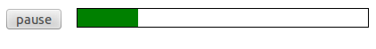

This article provides:

- a basic guide to creating a cross-browser HTML audio player with all the associated attributes, properties, and events explained
- a guide to custom controls created using the Media API

## Basic audio example

The code below is an example of a basic audio implementation using HTML5:

```html
<audio controls>
  <source src="audio-file.mp3" type="audio/mpeg" />
  <source src="audio-file.ogg" type="audio/ogg" />
  <!-- fallback for non-supporting browsers goes here -->
  <p>
    Your browser does not support HTML audio, but you can still
    <a href="audio-file.mp3">download the music</a>.
  </p>
</audio>
```

> [!NOTE]
> You can also use an MP4 file instead of MP3. MP4 files typically contain [AAC](https://en.wikipedia.org/wiki/Advanced_Audio_Coding) encoded audio. You can use `type="audio/mp4"`. (Currently, browsers that support mp3 also support mp4 audio).

- Here we define an {{ htmlelement("audio") }} element with multiple sources — we do this as not all browsers support the same audio formats. To ensure reasonable coverage, we should specify at least two different formats. The two formats that will give maximum coverage are mp3 and ogg vorbis.
- We do this using the {{ htmlelement("source") }} element, which takes the attributes `src` and `type`.

  - `src` contains the path to the audio file to be loaded (relative or absolute).
  - `type` is used to inform the browser of the file type. If omitted, most browsers will attempt to guess this from the file extension.

- If the {{ htmlelement("audio") }} element is not supported then {{ htmlelement("audio") }} and {{ htmlelement("source") }} will be ignored. However, any supported text or elements that you define within {{ htmlelement("audio") }} will be displayed or acted upon. So the ideal place to create a fallback or inform of incompatibility is before the closing `</audio>` tag. In this case, we've provided a paragraph including a link to download the audio directly.
- The `controls` attribute on the {{ htmlelement("audio") }} element is specified when we require the browser to provide us with default playback controls. If you don't specify this attribute, no controls will appear — and you will instead have to create your own controls and program their functionality using the Media API (see below). However, that can be a good approach, because the default controls look different among various browsers. So creating your own controls ensures a consistent look for the controls across all browsers.

## HTML audio in detail

Now we've looked at a basic example, let's now explore the different aspects of HTML audio in more detail.

### Audio HTML attributes

We can specify a number of attributes with the audio element to further determine the way audio is initialized.

#### autoplay

Specifying `autoplay` will cause the audio to start playing as soon as possible and without any user interaction — in short, the audio will autoplay.

```html
<audio autoplay>…</audio>
```

> [!NOTE]
> This value is often ignored on mobile platforms, and its use is not recommended unless really necessary. Autoplaying audio (and video) is usually really annoying. Plus browsers have policies that will block autoplay entirely in many situations. See the [Autoplay guide for media and Web Audio APIs](/en-US/docs/Web/Media/Guides/Autoplay) for details.

#### loop

The `loop` attribute will ensure that upon getting to the end of the audio clip, the audio clip will loop back to the beginning and start playing again.

```html
<audio loop>…</audio>
```

#### muted

If you want the audio to start muted (no volume), add the `muted` attribute.

```html
<audio muted>…</audio>
```

> [!NOTE]
> This value is often ignored on mobile platforms.

#### preload

The `preload` attribute allows you to specify a preference for how the browser preloads the audio, in other words, which part of the file it downloads when the {{ htmlelement("audio") }} element is initialized, and before the play button is pressed.

`preload` can take 3 different values:

1. `none`: Don't download anything before the play button is pressed.
2. `metadata`: Download the audio metadata; this is usually the best option, as it allows you to access and display information such as audio length, and allow the browser to work out which audio file it should use.
3. `auto`: Download the whole audio file as soon as possible. This is generally not a good option unless you can guarantee your users will have a fast network connection.

> [!NOTE]
> This value is often ignored on mobile platforms.

```html
<audio preload="auto">…</audio>
```

#### controls

We specify the `controls` attribute when we require the browser to provide us with its default playback controls.

```html
<audio controls>…</audio>
```

#### src

As mentioned above, you can use the {{ htmlelement("source") }} element to specify one or more source audio files. Alternatively, you can include the `src` attribute directly on the {{ htmlelement("audio") }} element to specify a single source file.

```html
<audio src="audio-file.mp3">…</audio>
```

#### type

As mentioned above, to be sure that the browser knows what type of file is being specified, it's good practice to specify a `type` attribute alongside the `src` attribute. The `type` attribute specifies the MIME type or Internet Media Type of the file.

```html
<audio src="audio-file.mp3" type="audio/mpeg">…</audio>
```

### Manipulating the Audio Element with JavaScript

In addition to being able to specify various attributes in HTML, the {{ htmlelement("audio") }} element comes complete with several properties and methods that you can manipulate via JavaScript.

Given the following HTML:

```html
<audio id="my-audio" src="audio-file.mp3">…</audio>
```

You can grab the {{htmlelement("audio") }} element like this:

```js
const audio = document.getElementById("my-audio");
```

Alternatively, you can create a new element. Here's an example of creating an {{ htmlelement("audio") }} element, setting the media to play, playing and pausing, and then playing from 5 seconds into the audio:

```js
const audio = document.createElement("audio");

if (audio.canPlayType("audio/mpeg")) {
  audio.setAttribute("src", "audio-file.mp3");
}

if (audio.canPlayType("audio/ogg")) {
  audio.setAttribute("src", "audio-file.ogg");
}

alert("play");

audio.play();

alert("stop");

audio.pause();

alert("play from 5 seconds in");

audio.currentTime = 5;
audio.play();
```

Let's explore the available properties and methods in more detail.

#### play

The `play()` method is used to tell the audio to play. It takes no parameters.

```js
audio.play();
```

#### pause

The `pause()` method is used to tell the audio to pause. It takes no parameters.

```js
audio.pause();
```

> [!NOTE]
> There is no stop method — to implement a stop function, you'd have to pause the media then set the [`currentTime`](#currenttime) property value to 0.

#### canPlayType

The `canPlayType()` method asks the browser whether a certain audio file type is supported. It takes the mime type of the type to check as a parameter.

```js
if (audio.canPlayType("audio/mpeg")) {
  // It's supported.
  // Do something here!
}
```

`canPlayType()` returns one of three values:

1. `probably`
2. `maybe`
3. "" (an empty string)

In practice, we usually check if the result is true or false. Non-empty strings are true.

> [!NOTE]
> A very early spec specified that the browser should return `no` instead of an empty string, but thankfully the number of people using older browsers that implement this version of the spec are few and far between.

#### currentTime

The `currentTime` property gets or sets the current time the audio should play at. This is useful in many ways, for example since `play()` does not take a parameter we need to set the point to play from separately if we don't want it to be 0.

The value of `currentTime` is a number which represents the time in seconds.

```js
if (audio.currentTime > 5) {
  audio.currentTime = 3;
}
```

#### volume

The `volume` property allows us to set the audio volume, as a number between 0 and 1.

```js
// set the volume at 50%
audio.volume = 0.5;
```

## Creating your own custom audio player

The JavaScript media API allows you to create your own custom player. Let's take a look at a very minimal example. We can combine HTML and JavaScript to create a player with a play and a pause button. First, we'll set up the audio in the HTML, without the `controls` attribute, since we are creating our own controls:

```html
<audio id="my-audio">
  <source src="audio-file.mp3" type="audio/mpeg" />
  <source src="audio-file.ogg" type="audio/ogg" />
  <!-- place fallback here as <audio> supporting browsers will ignore it -->
  <p>Download<a href="audio-file.mp3">audio-file.mp3</a></p>
</audio>

<!-- custom play and pause buttons -->
<button id="play">play</button>
<button id="pause">pause</button>
```

Next, we attach some functionality to the player using JavaScript:

```js
window.onload = () => {
  const audio = document.getElementById("my-audio");
  const play = document.getElementById("play");
  const pause = document.getElementById("pause");

  // associate functions with the 'onclick' events
  play.onclick = playAudio;
  pause.onclick = pauseAudio;

  function playAudio() {
    audio.play();
  }

  function pauseAudio() {
    audio.pause();
  }
};
```

## Media loading events

Above we have shown how you can create an audio player, but what if we want to show progress, buffering and only activate the buttons when the media is ready to play? Fortunately, there are a number of events we can use to let our player know exactly what is happening.

First, let's take a look at the media loading process in order:

### loadstart

The `loadstart` event tells us that load process has started and the browser is connecting to the media.

```js
audio.addEventListener("loadstart", () => {
  // Grabbing the file
});
```

### durationchange

If you just want to know as soon as the duration of your media is established, this is the event for you. This can be useful because the initial value for duration is `NaN` (Not a Number), which you probably don't want to display to your users.

```js
audio.addEventListener("durationchange", () => {
  // You can display the duration now
});
```

### loadedmetadata

Metadata can consist of more than just duration — if you want to wait for all the metadata to download before doing something, you can detect the `loadedmetadata` event.

```js
audio.addEventListener("loadedmetadata", () => {
  // You can display the duration now
});
```

### loadeddata

The `loadeddata` event is fired when the first bit of media arrives. The playhead is in position but not quite ready to play.

```js
audio.addEventListener("loadeddata", () => {
  // You could display the playhead now
});
```

### progress

The `progress` event indicates that the download of media is still in progress. It is good practice to display some kind of 'loader' at this point.

```js
audio.addEventListener("progress", () => {
  // you could let the user know the media is downloading
});
```

### canplay

`canplay` is a useful event to detect should you want to determine whether the media is ready to play. You could, for example, disable custom controls until this event occurs.

```js
audio.addEventListener("canplay", () => {
  // Audio is ready to play
});
```

### canplaythrough

`canplaythrough` is similar to `canplay` but it lets you know that the media is ready to be played all the way through (that is to say that the file has completely downloaded, or it is estimated that it will download in time so that buffering stops do not occur).

```js
audio.addEventListener("canplaythrough", () => {
  // Audio is ready to play all the way through
});
```

### Media loading event order

To recap, the order of the media loading events are:

`loadstart` > `durationchange` > `loadedmetadata` > `loadeddata` > `progress` > `canplay` > `canplaythrough`

### Loading interruption events

We also have a few events available that will fire when there is some kind of interruption to the media loading process.

- suspend
  - : Media data is no longer being fetched even though the file has not been entirely downloaded.
- abort
  - : Media data download has been aborted but not due to an error.
- error
  - : An error is encountered while media data is being downloaded.
- emptied
  - : The media buffer has been emptied, possibly due to an error or because the load() method was invoked to reload it.
- stalled
  - : Media data is unexpectedly no longer available.

## Media Playing Events

We also have another set of events that are useful for reacting to the state of the media playback.

### timeupdate

The `timeupdate` event is triggered every time the `currentTime` property changes. In practice, this occurs every 250 milliseconds. This event can be used to trigger the displaying of playback progress.

```js
audio.addEventListener("timeupdate", () => {
  // Update something related to playback progress
});
```

### playing

The `playing` event is initiated when playback is ready to start after having being paused due to lack of media data.

### waiting

The `waiting` event is triggered when playback has stopped due to lack of media data, although it is expected to resume once data becomes available.

### play

The `play` event is initiated after the `play()` method is returned or when the `autoplay` attribute has caused playback to begin. This is when the state of the media switches from paused to playing.

### pause

The `pause` event is triggered after the `pause()` method is returned. This is when the states switch from playing to paused.

### ended

The `ended` event is initiated when the end of the media is reached.

```js
audio.addEventListener("ended", () => {
  // Do something once audio track has finished playing
});
```

### volumechange

The `volumechange` event signifies that the volume has changed; that includes being muted.

## An Audio Player with Feedback

Consider this snippet of HTML:

```html
<audio id="my-audio">
  <source
    src="http://jPlayer.org/audio/mp3/Miaow-07-Bubble.mp3"
    type="audio/mpeg" />
  <source
    src="http://jPlayer.org/audio/ogg/Miaow-07-Bubble.ogg"
    type="audio/ogg" />
  <!-- place fallback here as <audio> supporting browsers will ignore it -->
  <a href="audio-file.mp3">audio-file.mp3</a>
</audio>

<div id="controls">
  <span id="loading">loading</span>
  <button id="play" style="display:none">play</button>
  <button id="pause" style="display:none">pause</button>
</div>
<div id="progress">
  <div id="bar"></div>
</div>
```

Styled like so:

```css
#controls {
  width: 80px;
  float: left;
}

#progress {
  margin-left: 80px;
  border: 1px solid black;
}

#bar {
  height: 20px;
  background-color: green;
  width: 0;
}
```

Now let's wire this thing up with JavaScript:

```js
window.onload = () => {
  const audio = document.getElementById("my-audio");
  const play = document.getElementById("play");
  const pause = document.getElementById("pause");
  const loading = document.getElementById("loading");
  const bar = document.getElementById("bar");

  function displayControls() {
    loading.style.display = "none";
    play.style.display = "block";
  }

  // Check that the media is ready before displaying the controls
  if (audio.paused) {
    displayControls();
  } else {
    // not ready yet - wait for canplay event
    audio.addEventListener("canplay", () => {
      displayControls();
    });
  }

  play.addEventListener("click", () => {
    audio.play();
    play.style.display = "none";
    pause.style.display = "block";
  });

  pause.addEventListener("click", () => {
    audio.pause();
    pause.style.display = "none";
    play.style.display = "block";
  });

  // Display progress
  audio.addEventListener("timeupdate", () => {
    // Sets the percentage
    bar.style.width = `${Math.floor(
      (audio.currentTime / audio.duration) * 100,
    )}%`;
  });
};
```

You should end up with something like this:



### Seeking using the seek bar

This is a good start, but it would be nice to be able to navigate the audio using the progress bar. Fortunately this isn't too difficult to implement.

First of all, we apply a quick update to the progress bar CSS to display the hand pointer on hover:

```css
#progress {
  margin-left: 80px;
  border: 1px solid black;
  cursor: pointer;
}
```

Then we add the code that detects the click and moves the 'playhead' to the correct position:

```js
const progress = document.getElementById("progress");

progress.addEventListener("click", (e) => {
  // Calculate the normalized position clicked
  const clickPosition = (e.pageX - progress.offsetLeft) / progress.offsetWidth;
  const clickTime = clickPosition * audio.duration;

  // Move the playhead to the correct position
  audio.currentTime = clickTime;
});
```

### Buffering

Ok, we're getting there, but there is another piece of useful information we can display: the amount of audio has been buffered or downloaded in advance.

There are a couple of properties we haven't looked at yet, `buffered` and `seekable`.

#### buffered

This property lets us know which parts of the audio has been buffered (downloaded in advance). It returns something called a `TimeRanges` object.

```js
bufferedTimeRanges = audio.buffered;
```

#### seekable

The seekable property informs you of whether you can jump directly to that part of the media without further buffering.

```js
seekableTimeRanges = audio.seekable;
```

#### Buffering events

There are also a couple of events related to buffering:

- `seeking`
  - : The `seeking` event is fired when media is being sought.
- `seeked`
  - : `seeked` occurs when the `seeking` attribute changes to `false`.

> [!NOTE]
> You can read more on [Buffering, Seeking and Time Ranges](/en-US/docs/Web/Media/Guides/Audio_and_video_delivery/buffering_seeking_time_ranges) elsewhere.

## See also

- [Buffering, Seeking and Time Ranges](/en-US/docs/Web/Media/Guides/Audio_and_video_delivery/buffering_seeking_time_ranges)
- [HTMLMediaElement events](/en-US/docs/Web/API/HTMLMediaElement#events)
- [Event reference > Media](/en-US/docs/Web/Events#media)
- [HTML video and audio](/en-US/docs/Learn_web_development/Core/Structuring_content/HTML_video_and_audio)
- [Creating a cross-browser video player](/en-US/docs/Web/Media/Guides/Audio_and_video_delivery/cross_browser_video_player)
- [jPlayer](https://jplayer.org/): An open source audio and video library for jQuery and Zepto.
