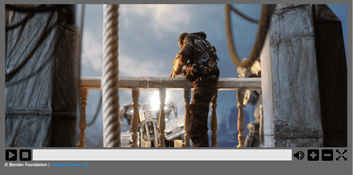

In the previous [Cross browser video player article](/en-US/docs/Web/Media/Guides/Audio_and_video_delivery/cross_browser_video_player) we described how to build a cross-browser HTML video player using the Media and Fullscreen APIs. This follow-up article looks at how to style this custom player, including making it responsive.

## The example in action



You can find the code for the [updated, styled example](https://github.com/iandevlin/iandevlin.github.io/tree/master/mdn/video-player-styled) on GitHub, and [view it live](https://iandevlin.github.io/mdn/video-player-styled/).

## Preliminary modifications from the original example

This section summarizes the modifications that were made to the [original video player example](https://github.com/iandevlin/iandevlin.github.io/tree/master/mdn/video-player) to make the styling task easier, before the bulk of the work was started.

### HTML Markup

There are a few changes that were made to the HTML markup shown in the previous article. The custom video controls and {{htmlelement("progress")}} element are now contained within {{htmlelement("div") }} elements, rather than residing inside unordered list items.

The markup for the custom controls now looks as follows:

```html
<div id="video-controls" class="controls" data-state="hidden">
  <button id="play-pause" type="button" data-state="play">Play/Pause</button>
  <button id="stop" type="button" data-state="stop">Stop</button>
  <div class="progress">
    <progress id="progress" value="0" min="0">
      <span id="progress-bar"></span>
    </progress>
  </div>
  <button id="mute" type="button" data-state="mute">Mute/Unmute</button>
  <button id="vol-inc" type="button" data-state="vol-up">Vol+</button>
  <button id="vol-dec" type="button" data-state="vol-down">Vol-</button>
  <button id="fs" type="button" data-state="go-fullscreen">Fullscreen</button>
</div>
```

### Related CSS alteration

The previous article set the `display` property of the video controls to `block` in order to display them. This has now been changed to use a [`data-state` attribute](https://ultimatecourses.com/blog/stop-toggling-classes-with-js-use-behaviour-driven-dom-manipulation-with-data-states), which this code already uses to handle its [fullscreen implementation](/en-US/docs/Web/Media/Guides/Audio_and_video_delivery/cross_browser_video_player#fullscreen).

This "data-state" idea is also used for setting the current state of buttons within the video control set, which allows specific state styling.

### JavaScript

As mentioned above, a `data-state` attribute is used in various places for styling purposes and these are set using JavaScript. Specific implementations will be mentioned at appropriate places below.

## Styling

The resultant video player style used here is rather basic — this is intentional, as the purpose is to show how such a video player could be styled and be made responsive.

> [!NOTE]
> In some cases some basic CSS is omitted from the code examples here as its use is either obvious or not specifically relevant to styling the video player.

### Basic styling

The HTML video and its controls are all contained within a {{htmlelement("figure") }} element, which is given a maximum width and height (based on the dimensions of the video used) and centered within the page:

```css
figure {
  max-width: 64rem;
  width: 100%;
  max-height: 30.875rem;
  height: 100%;
  margin: 1.25rem auto;
  padding: 1.051%;
  background-color: #666;
}
```

The video controls container itself also needs some styling so that it is set up the correct way:

```css
.controls {
  width: 100%;
  height: 8.0971659919028340080971659919028%; /* of figure's height */
  position: relative;
}
```

The height of the `.controls` class is set to be (a very precise!) percentage of the enclosing {{htmlelement("figure") }} element (this was worked out with experimentation based on the required button height). Its position is also specifically set to `relative`, which is required for its responsiveness (more on that later).

As mentioned earlier, a `data-state` attribute is now used to indicate whether the video controls are visible or not and these also need to be styled:

```css
.controls[data-state="hidden"] {
  display: none;
}

.controls[data-state="visible"] {
  display: block;
}
```

There are a number of properties that also need to be set for all elements within the video controls:

```css
.controls > * {
  float: left;
  width: 3.90625%;
  height: 100%;
  margin-left: 0.1953125%;
  display: block;
}

.controls > *:first-child {
  margin-left: 0;
}
```

All elements are floated left, as they are to be aligned next to one another, and each element is set to have a `width` of nearly 4% (again the actual value was calculated based on the required dimensions of the buttons), and a `height` of 100%. A value for `margin-left` is also set, but the first element (in this case the play/pause button) has this property overridden by the value 0.

The {{htmlelement("div") }} container for the {{htmlelement("progress") }} element also requires some specific settings; it is set to be much wider than the other child elements and its cursor value is set to be pointer:

```css
.controls .progress {
  cursor: pointer;
  width: 75.390625%;
}
```

### Buttons

The first major styling task to tackle is to make the video control's buttons actually look like and act like real buttons.

Each button has some basic styling:

```css
.controls button {
  border: none;
  cursor: pointer;
  background: transparent;
  background-size: contain;
  background-repeat: no-repeat;
}
```

By default, all {{htmlelement("button") }} elements have a border, so this is removed. Since background images will be used to display appropriate icons, the background color of the button is set to be transparent, non-repeated, and the element should fully contain the image.

Simple `:hover` and `:focus` states are then set for each button that alters the opacity of the button:

```css
.controls button:hover,
.controls button:focus {
  opacity: 0.5;
}
```

To obtain appropriate button images, a set of free common control set icons was downloaded from the web. Each image was then converted to a base64 encoded string (using an online [base64 image encoder](https://www.base64-image.de/)), since the images are quite small, the resultant encoded strings are quite short.

Since some buttons have dual functionality, e.g. play/pause, and mute/unmute, these buttons have different states that need to be styled. As mentioned earlier, a `data-state` variable is used to indicate which state such buttons are currently in.

For example, the play/pause button has the following background image definitions (the full base64 strings have been omitted for brevity):

```css
.controls button[data-state="play"] {
  background-image: url("data:image/png;base64,iVBORw0KGgoAAA…");
}

.controls button[data-state="pause"] {
  background-image: url("data:image/png;base64,iVBORw0KGgoAAA…");
}
```

When the `data-state` of the button is changed, the appropriate image will also be changed. All the other buttons are treated in a similar way.

### Progress bar

The {{htmlelement("progress") }} element has the following basic style set up:

```css
.controls progress {
  display: block;
  width: 100%;
  height: 81%;
  margin-top: 0.125rem;
  border: none;
  color: #0095dd;
  -moz-border-radius: 2px;
  -webkit-border-radius: 2px;
  border-radius: 2px;
}
```

Like the {{htmlelement("button") }} elements, {{htmlelement("progress") }} also has a default border, which is removed here. It is also given a slight rounded corner for aesthetic reasons.

As mentioned in the [previous article](/en-US/docs/Web/Media/Guides/Audio_and_video_delivery/cross_browser_video_player), there is a fallback provided for browsers that do not support the {{htmlelement("progress") }} element; this also needs to be styled appropriately:

```css
.controls progress[data-state="fake"] {
  background: #e6e6e6;
  height: 65%;
}
.controls progress span {
  width: 0%;
  height: 100%;
  display: inline-block;
  background-color: #2a84cd;
}
```

A `.data-state` class is also used here when a {{ htmlelement("progress") }} element is being "faked"; when it's in this state the background color needs to be set. The internal {{htmlelement("span") }} element used as the actual progressing part of the faked progress bar has its width initially set to 0% (it is updated via JavaScript) and it also has its background color set.

There are some browser-specific properties that need to be set to ensure that Firefox and Chrome use the required color for the progress bar:

```css
.controls progress::-moz-progress-bar {
  background-color: #0095dd;
}

.controls progress::-webkit-progress-value {
  background-color: #0095dd;
}
```

Although the same properties are set to the same value, these rules need to be defined separately, otherwise Chrome ignores it.

## JavaScript

That's really it for the immediate styling; the next task is making a number of JavaScript changes to ensure that everything works as expected.

### Control visibility

The first change is simple: the `data-state` for showing the video controls when JavaScript is available to the browser now needs to be set:

```js
// Display the user defined video controls
videoControls.setAttribute("data-state", "visible");
```

### Progress bar support

A check also needs to be made to set up the "fake" progress bar if the browser doesn't support the {{htmlelement("progress") }} element:

```js
const supportsProgress = document.createElement("progress").max !== undefined;
if (!supportsProgress) progress.setAttribute("data-state", "fake");
```

### Button functionality

This section looks at the JavaScript required for implementing the button functionality.

#### Play/Pause and Mute

Now that the buttons actually look like buttons and have images that indicate what they do, some changes need to be made so that the "dual functionality" buttons (such as the play/pause button) are in the correct "state" and display the correct image. In order to facilitate this, a new function is defined called `changeButtonState()`, which accepts a type variable indicating the button's functionality:

```js
function changeButtonState(type) {
  if (type === "play-pause") {
    // Play/Pause button
    if (video.paused || video.ended) {
      playPause.setAttribute("data-state", "play");
    } else {
      playPause.setAttribute("data-state", "pause");
    }
  } else if (type === "mute") {
    // Mute button
    mute.setAttribute("data-state", video.muted ? "unmute" : "mute");
  }
}
```

This function is then called by the relevant event handlers:

```js
video.addEventListener(
  "play",
  () => {
    changeButtonState("play-pause");
  },
  false,
);

video.addEventListener(
  "pause",
  () => {
    changeButtonState("play-pause");
  },
  false,
);

stop.addEventListener("click", (e) => {
  video.pause();
  video.currentTime = 0;
  progress.value = 0;

  // Update the play/pause button's 'data-state' which allows the correct button image to be set via CSS
  changeButtonState("play-pause");
});

mute.addEventListener("click", (e) => {
  video.muted = !video.muted;
  changeButtonState("mute");
});
```

You might have noticed that there are new handlers where the `play` and `pause` events are reacted to on the video. There is a reason for this! Even though the browser's default video control set has been turned off, many browsers make them accessible by right-clicking on the HTML video. This means that a user could play/pause the video from these controls, which would then leave the custom control set's buttons out of sync. If a user uses the default controls, the defined Media API events — such as `play` and `pause` — are raised so this can be taken advantage of to ensure that the custom control buttons are kept in sync. To ensure this, a new click handler needs to be defined for the play/pause button so that it too raises the `play` and `pause` events:

```js
playPause.addEventListener("click", (e) => {
  if (video.paused || video.ended) {
    video.play();
  } else {
    video.pause();
  }
});
```

#### Volume

The `alterVolume()` function, called when the player's volume buttons are clicked, also changes — it now calls a new function called `checkVolume()`:

```js
function checkVolume(dir) {
  if (dir) {
    const currentVolume = Math.floor(video.volume * 10) / 10;
    if (dir === "+" && currentVolume < 1) {
      video.volume += 0.1;
    } else if (dir === "-" && currentVolume > 0) {
      video.volume -= 0.1;
    }

    // If the volume has been turned off, also set it as muted
    // Note: can only do this with the custom control set as when the 'volumechange' event is raised,
    // there is no way to know if it was via a volume or a mute change
    video.muted = currentVolume <= 0;
  }
  changeButtonState("mute");
}

const alterVolume = (dir) => {
  checkVolume(dir);
};
```

This new `checkVolume()` function does the same thing as the `alterVolume()` but it also sets the state of the mute button depending on the video's current volume setting. `checkVolume()` is also called when the `volumechange` event is raised:

```js
video.addEventListener(
  "volumechange",
  () => {
    checkVolume();
  },
  false,
);
```

#### Progress bar

A small change also needs to be made to the click handler for the {{ htmlelement("progress") }} element. Since the enclosing {{htmlelement("figure") }} element now has `position:relative` set on it, the calculations made by this click handler are incorrect. It now also needs to take into account the offset position of the parent element:

```js
progress.addEventListener("click", (e) => {
  const pos =
    (e.pageX - progress.offsetLeft - progress.offsetParent.offsetLeft) /
    progress.offsetWidth;
  video.currentTime = pos * video.duration;
});
```

#### Fullscreen

The [FullScreen implementation](/en-US/docs/Web/Media/Guides/Audio_and_video_delivery/cross_browser_video_player#fullscreen) hasn't changed.

## Responsive styling

Now that the player has its basic look and feel taken care of, some other styling changes — involving media queries — need to be made in order to make it responsive.

The player currently works fairly well until displayed on a "medium" screen (e.g. 1024px/64em) or smaller. In this case, the margins and padding on the {{ htmlelement("figure") }} element need to be removed so that all the available space is taken advantage of, and the buttons are a bit too small so this needs to be altered by setting a new height on the element that has the `.controls` class set on it:

```css
@media screen and (max-width: 64em) {
  figure {
    padding-left: 0;
    padding-right: 0;
    height: auto;
  }

  .controls {
    height: 1.876rem;
  }
}
```

This works well enough until it is viewed on a smaller screen (680px/42.5em), so another breakpoint is made here. Since the height of the `.controls` class element will now vary, a fixed height is no longer required — it is therefore set to `auto`. The definitions for the elements within the `.controls` element now also need to be changed:

```css
@media screen and (max-width: 42.5em) {
  .controls {
    height: auto;
  }

  .controls > * {
    display: block;
    width: 16.6667%;
    margin-left: 0;
    height: 2.5rem;
    margin-top: 2.5rem;
  }

  .controls .progress {
    position: absolute;
    top: 0;
    width: 100%;
    float: none;
    margin-top: 0;
  }

  .controls .progress progress {
    width: 98%;
    margin: 0 auto;
  }

  .controls button {
    background-position: center center;
  }
}
```

The `.progress` container is now moved to the top of the control set via `position:absolute`, so it and all the buttons need to be wider. In addition, the buttons need to be pushed below the progress container so that they are visible.
