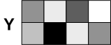

In this article, we explore important concepts that are useful to understand in order to fully grasp how to work with video on the web.

## Encoding color

Representing the colors in an image or video requires several values for each pixel. What those values are depends on how you "split up" the color when converting it to numeric form. There are several color models, and video codec makes use of one or more of these to represent their pixels during the encoding process as well as after decoding the video frames.

### RGB

Most computer graphics models use the RGB color system, wherein some number of bits of data are used to represent each of the red, green, and blue components of the color of an individual pixel, and an image is comprised of a two-dimensional array of these pixels. There are two primary methods used to represent RGB samples: using integer components and using floating-point components. When using integer components, RGB color uses 8 bits each of red, green, and blue, as well as potentially 8 bits of alpha (the amount of transparency).

### YUV

Unlike RGB, the **YUV** (or **Y'UV**) color encoding system is based around how humans perceive a color image. Doing so allows color data to be represented using fewer total bits of space in a video stream.

The name "YUV" is generally used today to describe this color system, even though the term was originally used specifically for analog coding of color, while **YCbCr** was used for digital color. However, today both terms are used for digital color. The prime symbol, `'`, indicates that gamma compression is being used.

#### Contemplating human vision

We're able to represent an image this way because the human eye sees far more detail in greyscale than in color, thanks to biology. The human eye contains two kinds of [photoreceptor](https://en.wikipedia.org/wiki/Photoreceptor_cell) (light-sensing) cells. The **rods** are highly-sensitive light intensity sensors. The **cones** are less sensitive but are able to detect color.

Because the eye has vastly more rods than cones (about 120 million rods to around 6 or 7 million cones), we see detail in greyscale, with color being far less detailed. In essence, our eyes are like a camera with two image sensor chips: one greyscale and one color. The greyscale sensor is 120 megapixels, while the color sensor is only about 7 megapixels. These sensors physically occupy the same surface, called the **[retina](https://en.wikipedia.org/wiki/Visual_system#Retina)**, at the back of the eye.

There are three types of cones, each of which responds to a particular wavelength band of incoming light, but also to the intensity of the light at that wavelength. Each type of cone, then, captures the relative response peaks at various wavelengths, and the brain uses this data to figure out the intensity and hue of the color of the light arriving at that part of the retina.

As our eyes capture a scene, they essentially take two photos at once: a finely-detailed greyscale image and a somewhat fuzzy, lower-resolution map of the colors of light received across the retina at the same time. The final color image is created by the brain, which essentially layers the colors onto the greyscale pixels.

#### YUV concepts

YUV works by defining a color space with three components:

- Luma (Y')
  - : The brightness of the pixel. Without the other two components, the luma of each pixel in the frame produces a greyscale representation of the image. In BT.709 (used for HDTV), for example, the luma value is the weighted sum of the gamma-corrected red, green, and blue components of the pixel, using the formula `Y' = 0.2126R' + 0.7152G' + 0.0722B'`. This weighting is performed because of the previously-mentioned ratio of green, red, and blue cones in the eye.
- Blue-difference (U or Cb)
  - : The blue-difference component of the chroma, or color, of the color sample. This value is computed by subtracting the luma from the gamma corrected blue value; that is, `U = B' - Y'`.
- Red-difference (V or Cr)
  - : The red-difference component of the chroma of the color sample. Computed by subtracting luma from the gamma corrected red value: `V = R' - Y'`.

#### Chroma subsampling

**Chroma subsampling** is the process of converting the color pixels into a greyscale image and a matrix of U and V values indicating the colors to map to those pixels.

Since the color data is being encoded at a lower resolution than the luma, when decoding the video to draw it to the screen each pixel's color is computed by calculating an appropriate color given the U and V values for the 4x2 block of 8 pixels in which the pixel resides. This decoding operation must mirror the method used during encoding, which is represented by three numbers separated by colons (":").

- The first number specifies the number of luminance samples per row encoded from the 4x2 pixel block. This value is essentially always 4, meaning "Use all of the luminance samples."
- The second number specifies how many chroma samples are used to represent the colors of the pixels in the first row.
- The third number indicates how many chroma samples are used to represent the colors of the pixels in the second row.

The table below shows examples of three chroma subsampling models.

<table class="standard-table" style="max-width: 46em">
  <thead>
    <tr>
      <th scope="col" style="width: 144px"></th>
      <th scope="col" style="width: 144px">4:2:0</th>
      <th scope="col" style="width: 144px">4:2:2</th>
      <th scope="col" style="width: 144px">4:4:4</th>
    </tr>
  </thead>
  <tbody>
    <tr>
      <th scope="col" style="width: 144px">Luminance</th>
      <td style="width: 144px; text-align: right">
        
      </td>
      <td style="width: 144px; text-align: right">
        
      </td>
      <td style="width: 144px; text-align: right">
        
      </td>
    </tr>
    <tr>
      <th scope="col" style="width: 144px">Chroma (U and V)</th>
      <td style="width: 144px; text-align: right">
        
      </td>
      <td style="width: 144px; text-align: right">
        
      </td>
      <td style="width: 144px; text-align: right">
        
      </td>
    </tr>
    <tr>
      <th scope="col" style="width: 144px">Decoded pixels</th>
      <td style="width: 144px; text-align: right">
        
      </td>
      <td style="width: 144px; text-align: right">
        
      </td>
      <td style="width: 144px; text-align: right">
        
      </td>
    </tr>
  </tbody>
</table>

In all of these, all four pixels of each row in the block of luminance data are used in the decoded image. Looking at 4:2:0 chroma subsampling, in the first column, the value 2 indicates that the first row of chroma data has two samples in it; the 0 indicates that the second row has no chroma samples of its own, and that the first row's samples should be duplicated to the second row. In other words, we're taking color information from every other row of pixels in the source image and applying them to the greyscale image represented by the luma.

The second column shows 4:2:2 subsampling. The top row of four luma samples has two chroma samples applied to it, and the bottom row of luma has two samples applied to it as well. The eight pixels represented by this block, then, have four chroma samples shared among them.

The final example demonstrates 4:4:4 subsampling. There are four luma samples in each row and four chroma samples in each row as well, so that every pixel represented by the block is individually colored.

What if the chroma subsampling model is 4:0:0? That says to use every pixel of luma data, but that each row has 0 chroma samples applied to it. The resulting image, then, is comprised solely of the luminance data—a greyscale image.

#### YUV data representation

Because the image is represented using more detail in greyscale than in color, the values of Y', U, and V are not typically stored together, one sample per pixel, the way RGB images are stored in memory.

- Each frame of video is represented by a matrix of luma values, Y, with each pixel's color computed using the values in the U and V matrices. For example, in the AV1 codec, a record stores the encoded luma for a tile, and a second record contains the chroma data in the form of the U and V values.
- In broadcast television, the luma signal is the primary signal, while the chrominance data is sent on a subcarrier.
- The {{Glossary("JPEG")}} file type's compression works by first converting the image to the Y'UV color system, then compressing that data. Each of Y', Cb, and Cr are able to have values from 0 to 255.
