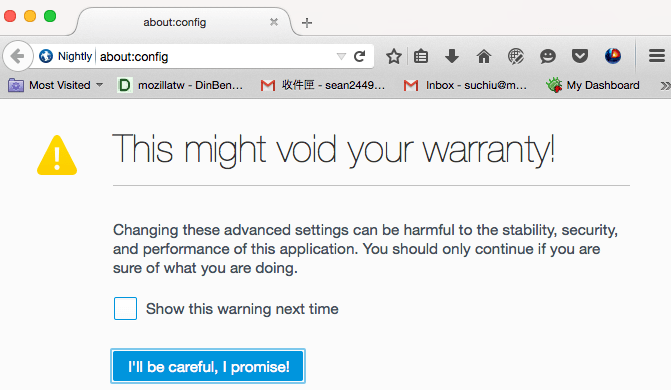
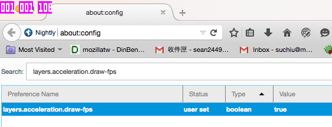
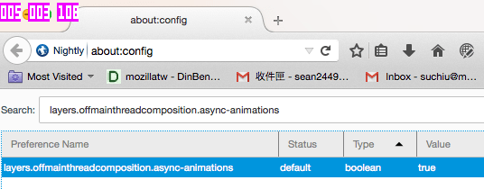

{{QuickLinksWithSubPages("Web/Performance")}}

Animations are critical for a pleasurable user experience on many applications. There are many ways to implement web animations, such as CSS {{cssxref("transition","transitions")}}/{{cssxref("animation","animations")}} or JavaScript-based animations (using {{domxref("Window.requestAnimationFrame","requestAnimationFrame()")}}). In this article, we analyze the performance differences between CSS-based and JavaScript-based animation.

## CSS transitions and animations

Both CSS transitions and animations can be used to write animation. They each have their own user scenarios:

- CSS {{cssxref("transition","transitions")}} provide an easy way to make animations occur between the current style and an end CSS state, e.g., a resting button state and a hover state. Even if an element is in the middle of a transition, the new transition starts from the current style immediately instead of jumping to the end CSS state. See [Using CSS transitions](/en-US/docs/Web/CSS/CSS_transitions/Using_CSS_transitions) for more details.
- CSS {{cssxref("animation","animations")}}, on the other hand, allow developers to make animations between a set of starting property values and a final set rather than between two states. CSS animations consist of two components: a style describing the CSS animation, and a set of key frames that indicate the start and end states of the animation's style, as well as possible intermediate points. See [Using CSS animations](/en-US/docs/Web/CSS/CSS_animations/Using_CSS_animations) for more details.

In terms of performance, there is no difference between implementing an animation with CSS transitions or animations. Both of them are classified under the same CSS-based umbrella in this article.

## requestAnimationFrame

The {{domxref("Window.requestAnimationFrame", "requestAnimationFrame()")}} API provides an efficient way to make animations in JavaScript. The callback function of the method is called by the browser before the next repaint on each frame. Compared to {{domxref("Window.setTimeout", "setTimeout()")}}/{{domxref("Window.setInterval", "setInterval()")}}, which need a specific delay parameter, `requestAnimationFrame()` is much more efficient. Developers can create an animation by changing an element's style each time the loop is called (or updating the Canvas draw, or whatever.)

> [!NOTE]
> Like CSS transitions and animations, `requestAnimationFrame()` pauses when the current tab is pushed into the background.

For more details read [animating with JavaScript from setInterval to requestAnimationFrame](https://hacks.mozilla.org/2011/08/animating-with-javascript-from-setinterval-to-requestanimationframe/).

## Performance comparison:<br>transitions vs. requestAnimationFrame

The fact is that, in most cases, the performance of CSS-based animations is almost the same as JavaScripted animations — in Firefox at least. Some JavaScript-based animation libraries, like [GSAP](https://gsap.com/) and [Velocity.JS](http://velocityjs.org/), even claim that they are able to achieve better performance than [native CSS transitions/animations](https://css-tricks.com/myth-busting-css-animations-vs-javascript/). This can occur because CSS transitions/animations are resampling element styles in the main UI thread before each repaint event happens, which is almost the same as resampling element styles via a `requestAnimationFrame()` callback, also triggered before the next repaint. If both animations are made in the main UI thread, there is no difference performance-wise.

In this section we'll walk you through a performance test, using Firefox, to see what animation method seems better overall.

### Enabling FPS tools

Before going through the example, please enable FPS tools first to see the current frame rate:

1. In the URL bar, enter _about:config_; click the `I'll be careful, I promise!` button to enter the config screen.
   
2. In the search bar, search for the `layers.acceleration.draw-fps` preference.
3. Double-click the entry to set the value to `true`. Now you will be able to see three little purple boxes in the upper left corner of the Firefox window. The first box represents FPS.
   

### Running the performance test

Initially in the test seen below, a total of 1000 {{htmlelement("div")}} elements are transformed by CSS animation.

```js
const boxes = [];
const button = document.getElementById("toggle-button");
const boxContainer = document.getElementById("box-container");
const animationType = document.getElementById("type");

// create boxes
for (let i = 0; i < 1000; i++) {
  const div = document.createElement("div");
  div.classList.add("css-animation");
  div.classList.add("box");
  boxContainer.appendChild(div);
  boxes.push(div.style);
}

let toggleStatus = true;
let rafId;
button.addEventListener("click", () => {
  if (toggleStatus) {
    animationType.textContent = " requestAnimationFrame";
    for (const child of boxContainer.children) {
      child.classList.remove("css-animation");
    }
    rafId = window.requestAnimationFrame(animate);
  } else {
    window.cancelAnimationFrame(rafId);
    animationType.textContent = " CSS animation";
    for (const child of boxContainer.children) {
      child.classList.add("css-animation");
    }
  }
  toggleStatus = !toggleStatus;
});

const duration = 6000;
const translateX = 500;
const rotate = 360;
const scale = 1.4 - 0.6;
let start;
function animate(time) {
  if (!start) {
    start = time;
    rafId = window.requestAnimationFrame(animate);
    return;
  }

  const progress = (time - start) / duration;
  if (progress < 2) {
    let x = progress * translateX;
    let transform;
    if (progress >= 1) {
      x = (2 - progress) * translateX;
      transform = `translateX(${x}px) rotate(${
        (2 - progress) * rotate
      }deg) scale(${0.6 + (2 - progress) * scale})`;
    } else {
      transform = `translateX(${x}px) rotate(${progress * rotate}deg) scale(${
        0.6 + progress * scale
      })`;
    }

    for (const box of boxes) {
      box.transform = transform;
    }
  } else {
    start = null;
  }
  rafId = window.requestAnimationFrame(animate);
}
```

```html hidden
<div id="header">
  <button id="toggle-button">Toggle</button>
  <span id="type">CSS Animation</span>
</div>
<div id="box-container"></div>
```

```css hidden
#header {
  position: sticky;
  top: 0.5rem;
  margin: 0 0.5rem;
  z-index: 100;
  background-color: lightgreen;
}

#box-container {
  margin-top: 1.5rem;
  display: grid;
  grid-template-columns: repeat(40, 1fr);
  gap: 15px;
}

.box {
  width: 30px;
  height: 30px;
  background-color: red;
}

.css-animation {
  animation: animate 6s linear 0s infinite alternate;
}

@keyframes animate {
  0% {
    transform: translateX(0) rotate(0deg) scale(0.6);
  }
  100% {
    transform: translateX(500px) rotate(360deg) scale(1.4);
  }
}
```

{{ EmbedLiveSample("Running the performance test", "100%", "480") }}

The animation can be switched to `requestAnimationFrame()` by clicking the toggle button.

Try running them both now, comparing the FPS for each (the first purple box.) You should see that the performance of CSS animations and `requestAnimationFrame()` are very close.

### Off main thread animation

Even given the test results above, we'd argue that CSS animations are the better choice. But how? The key is that as long as the properties we want to animate do not trigger reflow/repaint (read [CSS triggers](https://csstriggers.com/) for more information), we can move those sampling operations out of the main thread. The most common property is the CSS transform. If an element is promoted as a [layer](https://wiki.mozilla.org/Gecko:Overview#Graphics), animating transform properties can be done in the GPU, meaning better performance/efficiency, especially on mobile. Find out more details in [OffMainThreadCompositing](https://wiki.mozilla.org/Platform/GFX/OffMainThreadCompositing).

To enable the OMTA (Off Main Thread Animation) in Firefox, you can go to _about:config_ and search for the `layers.offmainthreadcomposition.async-animations`. Toggle its value to `true`.



After enabling OMTA, try running the above test again. You should see that the FPS of the CSS animations will now be significantly higher.

> [!NOTE]
> In Nightly/Developer Edition, you should see that OMTA is enabled by default, so you might have to do the tests the other way around (test with it enabled first, then disable to test without OMTA.)

## Summary

Browsers are able to optimize rendering flows. In summary, we should always try to create our animations using CSS transitions/animations where possible. If your animations are really complex, you may have to rely on JavaScript-based animations instead.
