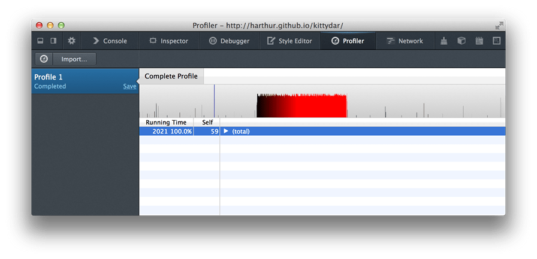
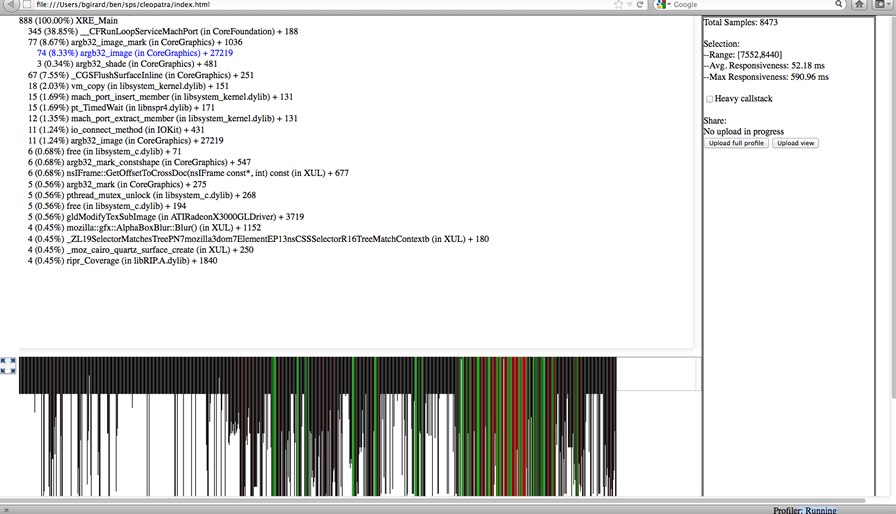

{{QuickLinksWithSubPages("Web/Performance")}}

Performance means efficiency. In the context of Open Web Apps, this document explains in general what performance is, how the browser platform helps improve it, and what tools and processes you can use to test and improve it.

## What is performance?

Ultimately, user-perceived performance is the only performance that matters. Users provide inputs to the system through touch, movement, and speech. In return, they perceive outputs through sight, touch, and hearing. Performance is the quality of system outputs in response to user inputs.

All other things being equal, code optimized for some target besides user-perceived performance (hereafter UPP) loses when competing against code optimized for UPP. Users prefer, say, a responsive, smooth app that only processes 1,000 database transactions per second, over a choppy, unresponsive app that processes 100,000,000 per second. Of course, it's by no means pointless to optimize other metrics, but real UPP targets come first.

The next few subsections point out and discuss essential performance metrics.

### Responsiveness

Responsiveness means how fast the system provides outputs (possibly multiple ones) in response to user inputs. For example, when a user taps the screen, they expect the pixels to change in a certain way. For this interaction, the responsiveness metric is the time elapsed between the tap and the pixel change.

Responsiveness sometimes involves multiple stages of feedback. Application launch is one particularly important case discussed in more detail below.

Responsiveness is important because people get frustrated and angry when they're ignored. Your app is ignoring the user every second that it fails to respond to the user's input.

### Frame rate

Frame rate is the rate at which the system changes pixels displayed to the user. This is a familiar concept: everyone prefers, say, games that display 60 frames per second over ones that display 10 frames per second, even if they can't explain why.

Frame rate is important as a "quality of service" metric. Computer displays are designed to "fool" user's eyes, by delivering photons to them that mimic reality. For example, paper covered with printed text reflects photons to the user's eyes in some pattern. By manipulating pixels, a reader app emits photons in a similar pattern to "fool" the user's eyes.

As your brain infers, motion is not jerky and discrete, but rather "updates" smoothly and continuously. (Strobe lights are fun because they turn that upside down, starving your brain of inputs to create the illusion of discrete reality). On a computer display, a higher frame rate makes for a more faithful imitation of reality.

> **Note:** Humans usually cannot perceive differences in frame rate above 60Hz. That's why most modern electronic displays are designed to refresh at that rate. A television probably looks choppy and unrealistic to a hummingbird, for example.

### Memory usage

**Memory usage** is another key metric. Unlike responsiveness and frame rate, users don't directly perceive memory usage, but memory usage closely approximates "user state". An ideal system would maintain 100% of user state at all times: all applications in the system would run simultaneously, and all applications would retain the state created by the user the last time the user interacted with the application (application state is stored in computer memory, which is why the approximation is close).

From this comes an important but counter-intuitive corollary: a well-designed system does not maximize the amount of **free** memory. Memory is a resource, and free memory is an unused resource. Rather, a well-designed system has been optimized to **use** as much memory as possible to maintain user state, while meeting other UPP goals.

That doesn't mean the system should **waste** memory. When a system uses more memory than necessary to maintain some particular user state, the system is wasting a resource it could use to retain some other user state. In practice, no system can maintain all user states. Intelligently allocating memory to user state is an important concern that we go over in more detail below.

### Power usage

The final metric discussed here is **power usage**. Like memory usage, users perceive power usage only indirectly, by how long their devices can maintain all other UPP goals. In service of meeting UPP goals, the system must use only the minimum power required.

The remainder of this document will discuss performance in terms of these metrics.

## Platform performance optimizations

This section provides a brief overview of how Firefox/Gecko contributes to performance generally, below the level of all applications. From a developer's or user's perspective, this answers the question, "What does the platform do for you?"

### Web technologies

The Web platform provides many tools, some better suited for particular jobs than others. All application logic is written in JavaScript. To display graphics, developers can use HTML or CSS (i.e. high-level declarative languages), or use low-level imperative interfaces offered by the {{ htmlelement("canvas") }} element (which includes [WebGL](/en-US/docs/Web/API/WebGL_API)). Somewhere "in between" HTML/CSS and Canvas is [SVG](/en-US/docs/Web/SVG), which offers some benefits of both.

HTML and CSS greatly increase productivity, sometimes at the expense of frame rate or pixel-level control over rendering. Text and images reflow automatically, UI elements automatically receive the system theme, and the system provides "built-in" support for some use cases developers may not think of initially, like different-resolution displays or right-to-left languages.

The `canvas` element offers a pixel buffer directly for developers to draw on. This gives developers pixel-level control over rendering and precise control of frame rate, but now the developers need to deal with multiple resolutions and orientations, right-to-left languages, and so forth. Developers draw to canvases using either a familiar 2D drawing API, or WebGL, a "close to the metal" binding that mostly follows OpenGL ES 2.0.

### Gecko rendering

The Gecko JavaScript engine supports just-in-time (JIT) compilation. This enables application logic to perform comparably to other virtual machines — such as Java virtual machines — and in some cases even close to "native code".

The graphics pipeline in Gecko that underpins HTML, CSS, and Canvas is optimized in several ways. The HTML/CSS layout and graphics code in Gecko reduces invalidation and repainting for common cases like scrolling; developers get this support "for free". Pixel buffers painted by both Gecko "automatically" and applications to `canvas` "manually" minimize copies when being drawn to the display framebuffer. This is done by avoiding intermediate surfaces where they would create overhead (such as per-application "back buffers" in many other operating systems), and by using special memory for graphics buffers that can be directly accessed by the compositor hardware. Complex scenes are rendered using the device's GPU for maximum performance. To improve power usage, simple scenes are rendered using special dedicated composition hardware, while the GPU idles or turns off.

Fully static content is the exception rather than the rule for rich applications. Rich applications use dynamic content with {{ cssxref("animation") }} and {{ cssxref ("transition") }} effects. Transitions and animations are particularly important to applications: developers can use CSS to declare complicated behavior with a simple, high-level syntax. In turn, Gecko's graphics pipeline is highly optimized to render common animations efficiently. Common-case animations are "offloaded" to the system compositor, which can render them in a performant, power-efficient fashion.

An app's startup performance matters just as much as its runtime performance. Gecko is optimized to load a wide variety of content efficiently: the entire Web! Many years of improvements targeting this content, like parallel HTML parsing, intelligent scheduling of reflows and image decoding, clever layout algorithms, etc., translate just as well to improving Web applications on Firefox.

## Application performance

This section is intended for developers asking the question: "How can I make my app fast"?

### Startup performance

Application startup is punctuated by three user-perceived events, generally speaking:

- The first is the application **first paint** — the point at which sufficient application resources have been loaded to paint an initial frame
- The second is when the application becomes **interactive** — for example, users are able to tap a button and the application responds
- The final event is **full load** — for example when all the user's albums have been listed in a music player

The key to fast startup is to keep two things in mind: UPP is all that matters, and there's a "critical path" to each user-perceived event above. The critical path is exactly and only the code that must run to produce the event.

For example, to paint an application's first frame that comprises visually some HTML and CSS to style that HTML:

1. The HTML must be parsed
2. The DOM for that HTML must be constructed
3. Resources like images in that part of the DOM have to be loaded and decoded
4. The CSS styles must be applied to that DOM
5. The styled document has to be reflowed

Nowhere in that list is "load the JS file needed for an uncommon menu"; "fetch and decode the image for the High Scores list", etc. Those work items are not on the critical path to painting the first frame.

It seems obvious, but to reach a user-perceived startup event more quickly, the main "trick" is run _only the code on the critical path._ Shorten the critical path by simplifying the scene.

The Web platform is highly dynamic. JavaScript is a dynamically-typed language, and the Web platform allows loading code, HTML, CSS, images, and other resources dynamically. These features can be used to defer work that's off the critical path by loading unnecessary content "lazily" some time after startup.

Another problem that can delay startup is idle time, caused by waiting for responses to requests (like database loads). To avoid this problem, applications should issue requests as early as possible in startup (this is called "front-loading"). Then when the data is needed later, hopefully it's already available and the application doesn't have to wait.

> **Note:** For much more information on improving startup performance, read [Optimizing startup performance](/en-US/docs/Web/Performance/Optimizing_startup_performance).

On the same note, notice that locally-cached, static resources can be loaded much faster than dynamic data fetched over high-latency, low-bandwidth mobile networks. Network requests should never be on the critical path to early application startup. Local caching/offline apps can be achieved via [Service Workers](/en-US/docs/Web/API/Service_Worker_API). See [Offline and background operation](/en-US/docs/Web/Progressive_web_apps/Guides/Offline_and_background_operation) for a guide about using service workers for offline and background sync capabilities.

### Frame rate

The first important thing for high frame rate is to choose the right tool. Use HTML and CSS to implement content that's mostly static, scrolled, and infrequently animated. Use Canvas to implement highly dynamic content, like games that need tight control over rendering and don't need theming.

For content drawn using Canvas, it's up to the developer to hit frame rate targets: they have direct control over what's drawn.

For HTML and CSS content, the path to high frame rate is to use the right primitives. Firefox is highly optimized to scroll arbitrary content; this is usually not a concern. But often trading some generality and quality for speed, such as using a static rendering instead of a CSS radial gradient, can push scrolling frame rate over a target. CSS [media queries](/en-US/docs/Web/CSS/CSS_media_queries/Using_media_queries) allow these compromises to be restricted only to devices that need them.

Many applications use transitions or animations through "pages", or "panels". For example, the user taps a "Settings" button to transition into an application configuration screen, or a settings menu "pops up". Firefox is highly optimized to transition and animate scenes that:

- use pages/panels approximately the size of the device screen or smaller
- transition/animate the CSS `transform` and `opacity` properties

Transitions and animations that adhere to these guidelines can be offloaded to the system compositor and run maximally efficiently.

### Memory and power usage

Improving memory and power usage is a similar problem to speeding up startup: don't do unneeded work or lazily load uncommonly-used UI resources. Do use efficient data structures and ensure resources like images are optimized well.

Modern CPUs can enter a lower-power mode when mostly idle. Applications that constantly fire timers or keep unnecessary animations running prevent CPUs from entering low-power mode. Power-efficient applications shouldn't do that.

When applications are sent to the background, a {{domxref("document.visibilitychange_event", "visibilitychange")}} event is fired on their documents. This event is a developer's friend; applications should listen for it.

### Specific coding tips for application performance

The following practical tips will help improve one or more of the Application performance factors discussed above.

#### Use CSS animations and transitions

Instead of using some library's `animate()` function, which probably currently uses many badly performing technologies ({{domxref("setTimeout()")}} or `top`/`left` positioning, for example) use [CSS animations](/en-US/docs/Web/CSS/CSS_animations/Using_CSS_animations). In many cases, you can actually use [CSS Transitions](/en-US/docs/Web/CSS/CSS_transitions/Using_CSS_transitions) to get the job done. This works well because the browser is designed to optimize these effects and use the GPU to handle them smoothly with minimal impact on processor performance. Another benefit is that you can define these effects in CSS along with the rest of your app's look-and-feel, using a standardized syntax.

CSS animations give you very granular control over your effects using [keyframes](/en-US/docs/Web/CSS/@keyframes), and you can even watch events fired during the animation process in order to handle other tasks that need to be performed at set points in the animation process. You can easily trigger these animations with the {{cssxref(":hover")}}, {{cssxref(":focus")}}, or {{cssxref(":target")}}, or by dynamically adding and removing classes on parent elements.

If you want to create animations on the fly or modify them in [JavaScript](/en-US/docs/Web/JavaScript), James Long has written a simple library for that called [CSS-animations.js](https://github.com/jlongster/css-animations.js/).

#### Use CSS transforms

Instead of tweaking absolute positioning and fiddling with all that math yourself, use the {{cssxref("transform")}} CSS property to adjust the position, scale, and so forth of your content. Alternatively, you can use the individual transformation properties of {{cssxref("translate")}}, {{cssxref("scale")}}, and {{cssxref("rotate")}}. The reason is, once again, hardware acceleration. The browser can do these tasks on your GPU, letting the CPU handle other things.

In addition, transforms give you capabilities you might not otherwise have. Not only can you translate elements in 2D space, but you can transform in three dimensions, skew and rotate, and so forth. Paul Irish has an [in-depth analysis of the benefits of `translate()`](https://www.paulirish.com/2012/why-moving-elements-with-translate-is-better-than-posabs-topleft/) (2012) from a performance point of view. In general, however, you have the same benefits you get from using CSS animations: you use the right tool for the job and leave the optimization to the browser. You also use an easily extensible way of positioning elements — something that needs a lot of extra code if you simulate translation with `top` and `left` positioning. Another bonus is that this is just like working in a `canvas` element.

> **Note:** You may need to attach a `translateZ(0.1)` transform if you wish to get hardware acceleration on your CSS animations, depending on platform. As noted above, this can improve performance. When overused, it can have memory consumption issues. What you do in this regard is up to you — do some testing and find out what's best for your particular app.

#### Use `requestAnimationFrame()` instead of `setInterval()`

Calls to {{domxref("setInterval()")}} run code at a presumed frame rate that may or may not be possible under current circumstances. It tells the browser to render results even while the browser isn't actually drawing; that is, while the video hardware hasn't reached the next display cycle. This wastes processor time and can even lead to reduced battery life on the user's device.

Instead, you should try to use {{domxref("window.requestAnimationFrame()")}}. This waits until the browser is actually ready to start building the next frame of your animation, and won't bother if the hardware isn't going to actually draw anything. Another benefit to this API is that animations won't run while your app isn't visible on the screen (such as if it's in the background and some other task is operating). This will save battery life and prevent users from cursing your name into the night sky.

#### Make events immediate

As old-school, accessibility-aware Web developers we love click events since they also support keyboard input. On mobile devices, these are too slow. You should use {{domxref("Element/touchstart_event", "touchstart")}} and {{domxref("Element/touchend_event", "touchend")}} instead. The reason is that these don't have a delay that makes the interaction with the app appear sluggish. If you test for touch support first, you don't sacrifice accessibility, either. For example, the Financial Times uses a library called [fastclick](https://github.com/ftlabs/fastclick) for that purpose, which is available for you to use.

#### Keep your interface simple

One big performance issue we found in HTML apps was that moving lots of [DOM](/en-US/docs/Web/API/Document_Object_Model) elements around makes everything sluggish — especially when they feature lots of gradients and drop shadows. It helps a lot to simplify your look-and-feel and move a proxy element around when you drag and drop.

When, for example, you have a long list of elements (let's say tweets), don't move them all. Instead, keep in your DOM tree only the ones that are visible and a few on either side of the currently visible set of tweets. Hide or remove the rest. Keeping the data in a JavaScript object instead of accessing the DOM can vastly improve your app's performance. Think of the display as a presentation of your data rather than the data itself. That doesn't mean you can't use straight HTML as the source; just read it once and then scroll 10 elements, changing the content of the first and last accordingly to your position in the results list, instead of moving 100 elements that aren't visible. The same trick applies in games to sprites: if they aren't currently on the screen, there is no need to poll them. Instead, re-use elements that scroll off-screen as new ones coming in.

## General application performance analysis

Firefox, Chrome, and other browsers include built-in tools that can help you diagnose slow page rendering. In particular, [Firefox's Network Monitor](https://firefox-source-docs.mozilla.org/devtools-user/network_monitor/index.html) will display a precise timeline of when each network request on your page happens, how large it is, and how long it takes.

If your page contains JavaScript code that is taking a long time to run, the [JavaScript profiler](https://firefox-source-docs.mozilla.org/devtools-user/performance/index.html) will pinpoint the slowest lines of code:

The [Built-in Gecko Profiler](https://firefox-source-docs.mozilla.org/tools/profiler/index.html) is a very useful tool that provides even more detailed information about which parts of the browser code are running slowly while the profiler runs. This is a bit more complex to use, but provides a lot of useful details.

> **Note:** You can use these tools with the Android browser by running Firefox and enabling [about:debugging](https://firefox-source-docs.mozilla.org/devtools-user/about_colon_debugging/index.html).

In particular, making dozens or hundreds of network requests takes longer in mobile browsers. Rendering large images and CSS gradients can also take longer. Downloading large files can take longer, even over a fast network, because mobile hardware is sometimes too slow to take advantage of all the available bandwidth. For useful general tips on mobile Web performance, have a look at Maximiliano Firtman's [Mobile Web High Performance](https://www.slideshare.net/firt/mobile-web-high-performance) talk.

### Test cases and submitting bugs

If the Firefox and Chrome developer tools don't help you find a problem, or if they seem to indicate that the Web browser has caused the problem, try to provide a reduced test case that maximally isolates the problem. That often helps in diagnosing problems.

See if you can reproduce the problem by saving and loading a static copy of an HTML page (including any images/stylesheets/scripts it embeds). If so, edit the static files to remove any private information, then send them to others for help (submit a [Bugzilla](https://bugzilla.mozilla.org/) report, for example, or host it on a server and share the URL). You should also share any profiling information you've collected using the tools listed above.
