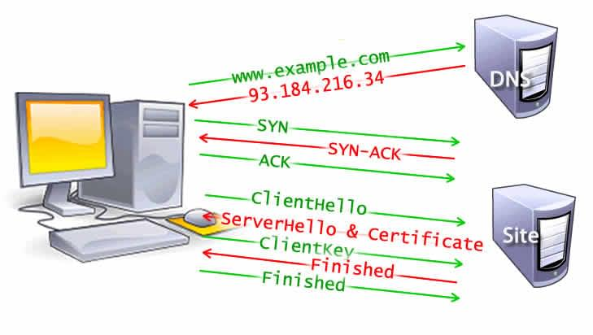
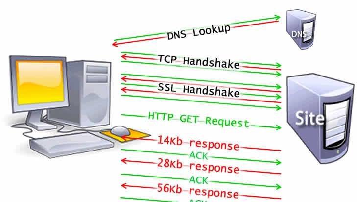
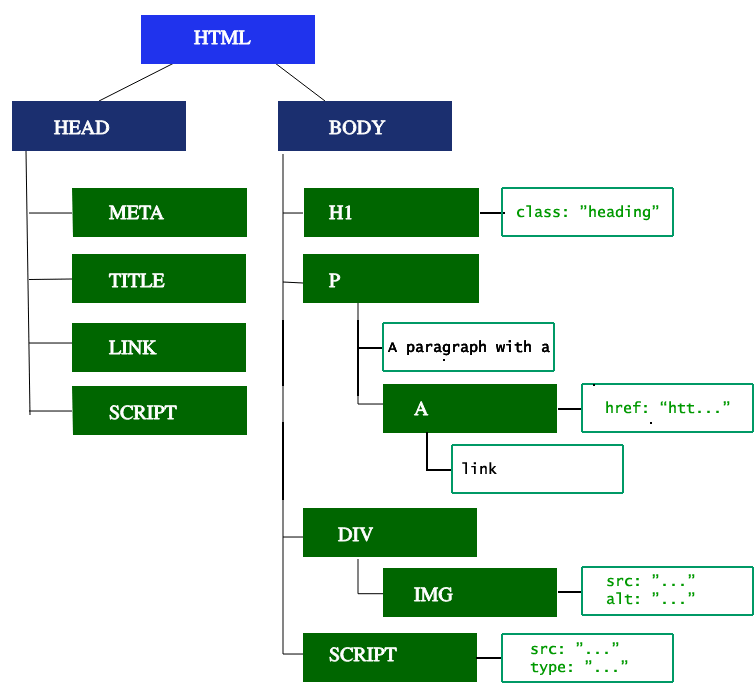
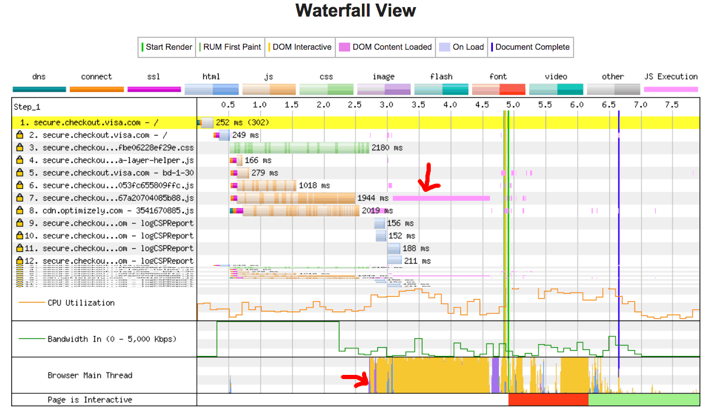

Users want web experiences with content that is fast to load and smooth to interact with. Therefore, a developer should strive to achieve these two goals.

To understand how to improve performance and perceived performance, it helps to understand how the browser works.

## Overview

Fast sites provide better user experiences. Users want and expect web experiences with content that is fast to load and smooth to interact with.

Two major issues in web performance are understanding issues having to do with latency and issues having to do with the fact that for the most part, browsers are single threaded.

Latency is our main threat to overcome to ensure a fast load. To be fast to load, the developers' goals include sending requested information as fast as possible, or at least seem super fast. Network latency is the time it takes to transmit bytes over-the-air to computers. Web performance is what we have to do to make the page load happen as quickly as possible.

For the most part, browsers are considered single threaded. For smooth interactions, the developer's goal is to ensure performant site interactions, from smooth scrolling to being responsive to touch. Render time is key, with ensuring the main thread can complete all the work we throw at it and still always be available to handle user interactions. Web performance can be improved by understanding the single-threaded nature of the browser and minimizing the main thread's responsibilities, where possible and appropriate, to ensure rendering is smooth and responses to interactions are immediate.

## Navigation

_Navigation_ is the first step in loading a web page. It occurs whenever a user requests a page by entering a URL into the address bar, clicking a link, submitting a form, as well as other actions.

One of the goals of web performance is to minimize the amount of time a navigation takes to complete. In ideal conditions, this usually doesn't take too long, but latency and bandwidth are foes which can cause delays.

### DNS Lookup

The first step of navigating to a web page is finding where the assets for that page are located. If you navigate to `https://example.com`, the HTML page is located on the server with IP address of `93.184.216.34`. If you've never visited this site, a DNS lookup must happen.

Your browser requests a DNS lookup, which is eventually fielded by a name server, which in turn responds with an IP address. After this initial request, the IP will likely be cached for a time, which speeds up subsequent requests by retrieving the IP address from the cache instead of contacting a name server again.

DNS lookups usually only need to be done once per hostname for a page load. However, DNS lookups must be done for each unique hostname the requested page references. If your fonts, images, scripts, ads, and metrics all have different hostnames, a DNS lookup will have to be made for each one.


This can be problematic for performance, particularly on mobile networks. When a user is on a mobile network, each DNS lookup has to go from the phone to the cell tower to reach an authoritative DNS server. The distance between a phone, a cell tower, and the name server can add significant latency.

### TCP Handshake

Once the IP address is known, the browser sets up a connection to the server via a {{glossary('TCP handshake','TCP three-way handshake')}}. This mechanism is designed so that two entities attempting to communicate—in this case the browser and web server—can negotiate the parameters of the network TCP socket connection before transmitting data, often over {{glossary('HTTPS')}}.

TCP's three way handshaking technique is often referred to as "SYN-SYN-ACK"—or more accurately SYN, SYN-ACK, ACK—because there are three messages transmitted by TCP to negotiate and start a TCP session between two computers. Yes, this means three more messages back and forth between each server, and the request has yet to be made.

### TLS Negotiation

For secure connections established over HTTPS, another "handshake" is required. This handshake, or rather the {{glossary('TLS')}} negotiation, determines which cipher will be used to encrypt the communication, verifies the server, and establishes that a secure connection is in place before beginning the actual transfer of data. This requires three more round trips to the server before the request for content is actually sent.



While making the connection secure adds time to the page load, a secure connection is worth the latency expense, as the data transmitted between the browser and the web server cannot be decrypted by a third party.

After the 8 round trips, the browser is finally able to make the request.

## Response

Once we have an established connection to a web server, the browser sends an initial [HTTP `GET` request](/en-US/docs/Web/HTTP/Methods) on behalf of the user, which for websites is most often an HTML file. Once the server receives the request, it will reply with relevant response headers and the contents of the HTML.

```html
<!DOCTYPE html>
<html lang="en-US">
 <head>
  <meta charset="UTF-8"/>
  <title>My simple page</title>
  <link rel="stylesheet" src="styles.css"/>
  <script src="myscript.js"></script>
</head>
<body>
  <h1 class="heading">My Page</h1>
  <p>A paragraph with a <a href="https://example.com/about">link</a></p>
  <div>
    
  </div>
  <script src="anotherscript.js"></script>
</body>
</html>
```

This response for this initial request contains the first byte of data received. {{glossary('Time to First Byte')}} (TTFB) is the time between when the user made the request—say by clicking on a link—and the receipt of this first packet of HTML. The first chunk of content is usually 14KB of data.

In our example above, the request is definitely less than 14KB, but the linked resources aren't requested until the browser encounters the links during parsing, described below.

### TCP Slow Start / 14KB rule

The first response packet will be 14KB. This is part of {{glossary('TCP slow start')}}, an algorithm which balances the speed of a network connection. Slow start gradually increases the amount of data transmitted until the network's maximum bandwidth can be determined.

In {{glossary('TCP slow start')}}, after receipt of the initial packet, the server doubles the size of the next packet to around 28KB. Subsequent packets increase in size until a predetermined threshold is reached, or congestion is experienced.



If you've ever heard of the 14KB rule for initial page load, TCP slow start is the reason why the initial response is 14KB, and why web performance optimization calls for focusing optimizations with this initial 14KB response in mind. TCP slow start gradually builds up transmission speeds appropriate for the network's capabilities to avoid congestion.

### Congestion control

As the server sends data in TCP packets, the user's client confirms delivery by returning acknowledgements, or ACKs. The connection has a limited capacity depending on hardware and network conditions. If the server sends too many packets too quickly, they will be dropped. Meaning, there will be no acknowledgement. The server registers this as missing ACKs. Congestion control algorithms use this flow of sent packets and ACKs to determine a send rate.

## Parsing

Once the browser receives the first chunk of data, it can begin parsing the information received. {{glossary('parse', 'Parsing')}} is the step the browser takes to turn the data it receives over the network into the {{glossary('DOM')}} and {{glossary('CSSOM')}}, which is used by the renderer to paint a page to the screen.

The DOM is the internal representation of the markup for the browser. The DOM is also exposed, and can be manipulated through various APIs in JavaScript.

Even if the request page's HTML is larger than the initial 14KB packet, the browser will begin parsing and attempting to render an experience based on the data it has. This is why it's important for web performance optimization to include everything the browser needs to start rendering a page, or at least a template of the page - the CSS and HTML needed for the first render — in the first 14 kilobytes. But before anything is rendered to the screen, the HTML, CSS, and JavaScript have to be parsed.

### Building the DOM tree

We describe five steps in the [critical rendering path](/en-US/docs/Web/Performance/Critical_rendering_path).

The first step is processing the HTML markup and building the DOM tree. HTML parsing involves [tokenization](/en-US/docs/Web/API/DOMTokenList) and tree construction. HTML tokens include start and end tags, as well as attribute names and values. If the document is well-formed, parsing it is straightforward and faster. The parser parses tokenized input into the document, building up the document tree.

The DOM tree describes the content of the document. The [`<html>`](/en-US/docs/Web/HTML/Element/html) element is the first tag and root node of the document tree. The tree reflects the relationships and hierarchies between different tags. Tags nested within other tags are child nodes. The greater the number of DOM nodes, the longer it takes to construct the DOM tree.



When the parser finds non-blocking resources, such as an image, the browser will request those resources and continue parsing. Parsing can continue when a CSS file is encountered, but `<script>` tags—particularly those without an [`async`](/en-US/docs/Web/JavaScript/Reference/Statements/async_function) or `defer` attribute—block rendering, and pause the parsing of HTML. Though the browser's preload scanner hastens this process, excessive scripts can still be a significant bottleneck.

### Preload scanner

While the browser builds the DOM tree, this process occupies the main thread. As this happens, the _preload scanner_ will parse through the content available and request high priority resources like CSS, JavaScript, and web fonts. Thanks to the preload scanner, we don't have to wait until the parser finds a reference to an external resource to request it. It will retrieve resources in the background so that by the time the main HTML parser reaches requested assets, they may possibly already be in flight, or have been downloaded. The optimizations the preload scanner provides reduce blockages.

```html
<link rel="stylesheet" src="styles.css"/>
<script src="myscript.js" async></script>

<script src="anotherscript.js" async></script>
```

In this example, while the main thread is parsing the HTML and CSS, the preload scanner will find the scripts and image, and start downloading them as well. To ensure the script doesn't block the process, add the `async` attribute, or the `defer` attribute if JavaScript parsing and execution order is important.

Waiting to obtain CSS doesn't block HTML parsing or downloading, but it does block JavaScript, because JavaScript is often used to query CSS properties' impact on elements.

### Building the CSSOM

The second step in the critical rendering path is processing CSS and building the CSSOM tree. The CSS object model is similar to the DOM. The DOM and CSSOM are both trees. They are independent data structures. The browser converts the CSS rules into a map of styles it can understand and work with. The browser goes through each rule set in the CSS, creating a tree of nodes with parent, child, and sibling relationships based on the CSS selectors.

As with HTML, the browser needs to convert the received CSS rules into something it can work with. Hence, it repeats the HTML-to-object process, but for the CSS.

The CSSOM tree includes styles from the user agent style sheet. The browser begins with the most general rule applicable to a node and recursively refines the computed styles by applying more specific rules. In other words, it cascades the property values.

Building the CSSOM is very, very fast and is not displayed in a unique color in current developer tools. Rather, the "Recalculate Style" in developer tools shows the total time it takes to parse CSS, construct the CSSOM tree, and recursively calculate computed styles. In terms of web performance optimization, there are lower hanging fruit, as the total time to create the CSSOM is generally less than the time it takes for one DNS lookup.

### Other Processes

#### JavaScript Compilation

While the CSS is being parsed and the CSSOM created, other assets, including JavaScript files, are downloading (thanks to the preload scanner). JavaScript is interpreted, compiled, parsed and executed. The scripts are parsed into abstract syntax trees. Some browser engines take the [Abstract Syntax Tree](https://en.wikipedia.org/wiki/Abstract_Syntax_Tree) and pass it into an interpreter, outputting bytecode which is executed on the main thread. This is known as JavaScript compilation.

#### Building the Accessibility Tree

The browser also builds an [accessibility](/en-US/docs/Learn/Accessibility) tree that assistive devices use to parse and interpret content. The accessibility object model (AOM) is like a semantic version of the DOM. The browser updates the accessibility tree when the DOM is updated. The accessibility tree is not modifiable by assistive technologies themselves.

Until the AOM is built, the content is not accessible to [screen readers](/en-US/docs/Web/Accessibility/ARIA/ARIA_Screen_Reader_Implementors_Guide).

## Render

Rendering steps include style, layout, paint and, in some cases, compositing. The CSSOM and DOM trees created in the parsing step are combined into a render tree which is then used to compute the layout of every visible element, which is then painted to the screen. In some cases, content can be promoted to their own layers and composited, improving performance by painting portions of the screen on the GPU instead of the CPU, freeing up the main thread.

### Style

The third step in the critical rendering path is combining the DOM and CSSOM into a render tree. The computed style tree, or render tree, construction starts with the root of the DOM tree, traversing each visible node.

Tags that aren't going to be displayed, like the [`<head>`](/en-US/docs/Web/HTML/Element/head) and its children and any nodes with `display: none`, such as the `script { display: none; }` you will find in user agent stylesheets, are not included in the render tree as they will not appear in the rendered output. Nodes with `visibility: hidden` applied are included in the render tree, as they do take up space. As we have not given any directives to override the user agent default, the `script` node in our code example above will not be included in the render tree.

Each visible node has its CSSOM rules applied to it. The render tree holds all the visible nodes with content and computed styles — matching up all the relevant styles to every visible node in the DOM tree, and determining, based on the [CSS cascade](/en-US/docs/Web/CSS/Cascade), what the computed styles are for each node.

### Layout

The fourth step in the critical rendering path is running layout on the render tree to compute the geometry of each node. _Layout_ is the process by which the width, height, and location of all the nodes in the render tree are determined, plus the determination of the size and position of each object on the page. _Reflow_ is any subsequent size and position determination of any part of the page or the entire document.

Once the render tree is built, layout commences. The render tree identified which nodes are displayed (even if invisible) along with their computed styles, but not the dimensions or location of each node. To determine the exact size and location of each object, the browser starts at the root of the render tree and traverses it.

On the web page, almost everything is a box. Different devices and different desktop preferences mean an unlimited number of differing viewport sizes. In this phase, taking the viewport size into consideration, the browser determines what the dimensions of all the different boxes are going to be on the screen. Taking the size of the viewport as its base, layout generally starts with the body, laying out the dimensions of all the body's descendants, with each element's box model properties, providing placeholder space for replaced elements it doesn't know the dimensions of, such as our image.

The first time the size and position of nodes are determined is called _layout_. Subsequent recalculations of node size and locations are called _reflows_. In our example, suppose the initial layout occurs before the image is returned. Since we didn't declare the size of our image, there will be a reflow once the image size is known.

### Paint

The last step in the critical rendering path is painting the individual nodes to the screen, the first occurrence of which is called the [first meaningful paint](/en-US/docs/Glossary/first_meaningful_paint). In the painting or rasterization phase, the browser converts each box calculated in the layout phase to actual pixels on the screen. Painting involves drawing every visual part of an element to the screen, including text, colors, borders, shadows, and replaced elements like buttons and images. The browser needs to do this super quickly.

To ensure smooth scrolling and animation, everything occupying the main thread, including calculating styles, along with reflow and paint, must take the browser less than 16.67ms to accomplish. At 2048 X 1536, the iPad has over 3,145,000 pixels to be painted to the screen. That is a lot of pixels that have to be painted very quickly. To ensure repainting can be done even faster than the initial paint, the drawing to the screen is generally broken down into several layers. If this occurs, then compositing is necessary.

Painting can break the elements in the layout tree into layers. Promoting content into layers on the GPU (instead of the main thread on the CPU) improves paint and repaint performance. There are specific properties and elements that instantiate a layer, including [`<video>`](/en-US/docs/Web/HTML/Element/video) and [`<canvas>`](/en-US/docs/Web/HTML/Element/canvas), and any element which has the CSS properties of [`opacity`](/en-US/docs/Web/CSS/opacity), a 3D [`transform`](/en-US/docs/Web/CSS/transform), [`will-change`](/en-US/docs/Web/CSS/will-change), and a few others. These nodes will be painted onto their own layer, along with their descendants, unless a descendant necessitates its own layer for one (or more) of the above reasons.

Layers do improve performance, but are expensive when it comes to memory management, so should not be overused as part of web performance optimization strategies.

### Compositing

When sections of the document are drawn in different layers, overlapping each other, compositing is necessary to ensure they are drawn to the screen in the right order and the content is rendered correctly.

As the page continues to load assets, reflows can happen (recall our example image that arrived late). A reflow sparks a repaint and a re-composite. Had we defined the size of our image, no reflow would have been necessary, and only the layer that needed to be repainted would be repainted, and composited if necessary. But we didn't include the image size! When the image is obtained from the server, the rendering process goes back to the layout steps and restarts from there.

## Interactivity

Once the main thread is done painting the page, you would think we would be "all set." That isn't necessarily the case. If the load includes JavaScript, that was correctly deferred, and only executed after the [`onload`](/en-US/docs/Web/API/Window/load_event) event fires, the main thread might be busy, and not available for scrolling, touch, and other interactions.

{{glossary('Time to Interactive')}} (TTI) is the measurement of how long it took from that first request which led to the DNS lookup and SSL connection to when the page is interactive — interactive being the point in time after the {{glossary('First Contentful Paint')}} when the page responds to user interactions within 50ms. If the main thread is occupied parsing, compiling, and executing JavaScript, it is not available and therefore not able to respond to user interactions in a timely (less than 50ms) fashion.

In our example, maybe the image loaded quickly, but perhaps the `anotherscript.js` file was 2MB and our user's network connection was slow. In this case the user would see the page super quickly, but wouldn't be able to scroll without jank until the script was downloaded, parsed and executed. That is not a good user experience. Avoid occupying the main thread, as demonstrated in this WebPageTest example:



In this example, the DOM content load process took over 1.5 seconds, and the main thread was fully occupied that entire time, unresponsive to click events or screen taps.

## See also

- [Web Performance](/en-US/docs/Web/Performance)
