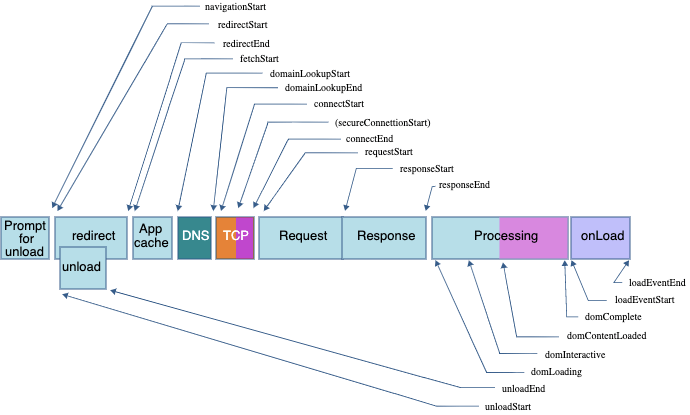
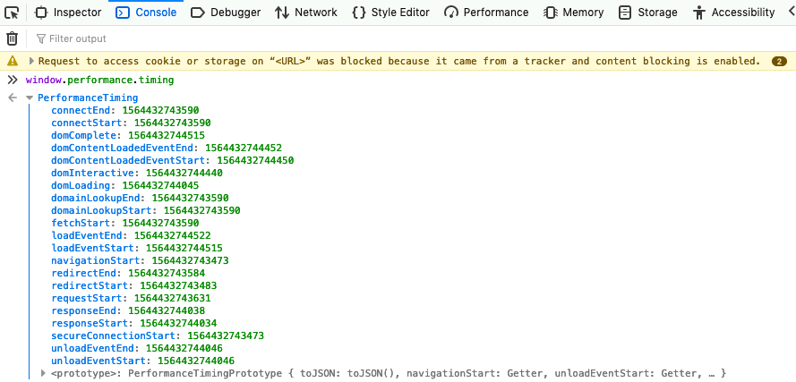
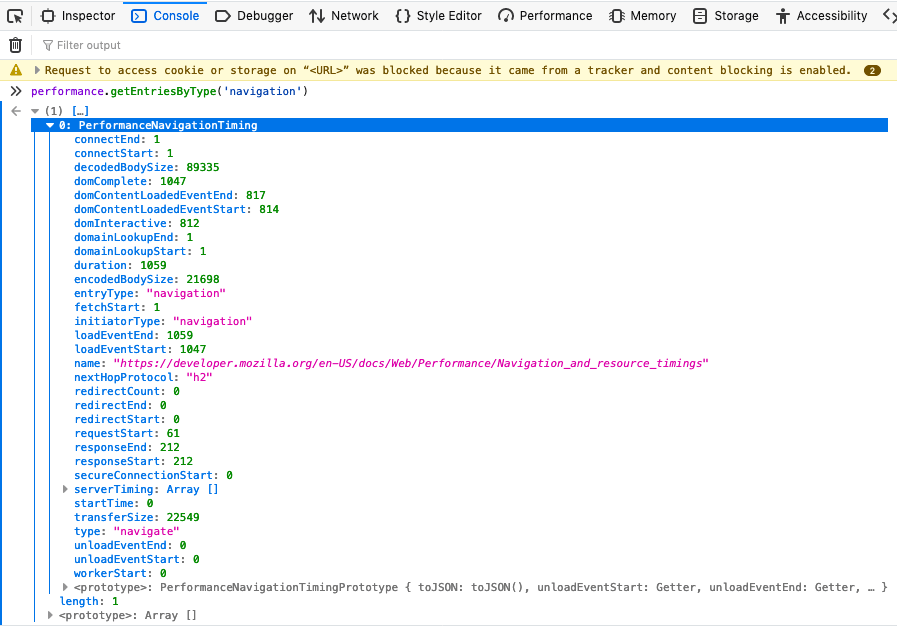
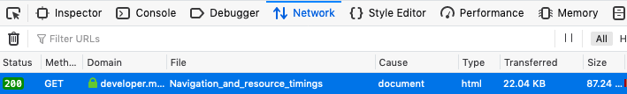

{{QuickLinksWithSubPages("Web/Performance")}}

**Navigation timings** are metrics measuring a browser's document navigation events. **Resource timings** are detailed network timing measurements regarding the loading of an application's resources. Both provide the same read-only properties, but navigation timing measures the main document's timings whereas the resource timing provides the times for all the assets or resources called in by that main document and the resources' requested resources.

The general performance timings below have been deprecated in favor of the Performance Entry API, which provides for marking and measuring times along the navigation and resource loading process. While deprecated, they are supported in all browsers.

## Performance Timings

The [performanceTiming API](/en-US/docs/Web/API/PerformanceTiming), a JavaScript API for measuring the loading performance of the requested page, is deprecated but supported in all browsers. It has been replaced with the [performanceNavigationTiming](/en-US/docs/Web/API/PerformanceNavigationTiming) API.

The performance timing API provided read only times, in milliseconds(ms), describing at what time each point in the page loading process was reached. As displayed in the image below, the navigation process goes from [`navigationStart`](/en-US/docs/Web/API/PerformanceTiming/navigationStart), [`unloadEventStart`](/en-US/docs/Web/API/PerformanceTiming/unloadEventStart), [`unloadEventEnd`](/en-US/docs/Web/API/PerformanceTiming/unloadEventEnd), [`redirectStart`](/en-US/docs/Web/API/PerformanceTiming/redirectStart), [`redirectEnd`](/en-US/docs/Web/API/PerformanceTiming/redirectEnd), [`fetchStart`](/en-US/docs/Web/API/PerformanceTiming/fetchStart), [`domainLookupStart`](/en-US/docs/Web/API/PerformanceTiming/domainLookupStart), [`domainLookupEnd`](/en-US/docs/Web/API/PerformanceTiming/domainLookupEnd), [`connectStart`](/en-US/docs/Web/API/PerformanceTiming/connectStart), [`connectEnd`](/en-US/docs/Web/API/PerformanceTiming/connectEnd), [`secureConnectionStart`](/en-US/docs/Web/API/PerformanceTiming/secureConnectionStart), [`requestStart`](/en-US/docs/Web/API/PerformanceTiming/requestStart), [`responseStart`](/en-US/docs/Web/API/PerformanceTiming/responseStart), [`responseEnd`](/en-US/docs/Web/API/PerformanceTiming/responseEnd), [`domLoading`](/en-US/docs/Web/API/PerformanceTiming/domLoading), [`domInteractive`](/en-US/docs/Web/API/PerformanceTiming/domInteractive), [`domContentLoadedEventStart`](/en-US/docs/Web/API/PerformanceTiming/domContentLoadedEventStart), [`domContentLoadedEventEnd`](/en-US/docs/Web/API/PerformanceTiming/domContentLoadedEventEnd), [`domComplete`](/en-US/docs/Web/API/PerformanceTiming/domComplete), [`loadEventStart`](/en-US/docs/Web/API/PerformanceTiming/loadEventStart), and [`loadEventEnd`](/en-US/docs/Web/API/PerformanceTiming/loadEventEnd).



With the metrics above, and a bit of math, we can calculate many important metrics like [time to first byte](/en-US/docs/Glossary/Time_to_first_byte), page load time, dns lookup, and whether the connection is secure.

To help measure the time it takes to complete all the steps, the Performance Timing API provides read only measurements of navigation timings. To view and capture our app's timing we enter:

```js
let time = window.performance.timing;
```

We can then use the results to measure how well our app is performing.



The order is:

<table>
  <thead>
    <tr>
      <th>Performance Timings</th>
      <th>Details</th>
    </tr>
  </thead>
  <tbody>
    <tr>
      <td>
        {{domxref("PerformanceTiming.navigationStart","navigationStart")}}
      </td>
      <td>
        When the prompt for unload terminates on the previous document in the
        same browsing context. If there is no previous document, this value will
        be the same as <code>PerformanceTiming.fetchStart</code>.
      </td>
    </tr>
    <tr>
      <td>
        {{domxref("PerformanceTiming.secureConnectionStart","secureConnectionStart")}}
      </td>
      <td>
        When the secure connection handshake starts. If no such connection is
        requested, it returns <code>0</code>.
      </td>
    </tr>
    <tr>
      <td>
        {{domxref("PerformanceTiming.redirectStart","redirectStart")}}
      </td>
      <td>
        When the first HTTP redirect starts. If there is no redirect, or if one
        of the redirects is not of the same origin, the value returned is
        <code>0</code>.
      </td>
    </tr>
    <tr>
      <td>
        {{domxref("PerformanceTiming.redirectEnd","redirectEnd")}}
      </td>
      <td>
        <p>
          When the last HTTP redirect is completed, that is when the last byte
          of the HTTP response has been received. If there is no redirect, or if
          one of the redirects is not of the same origin, the value returned is
          <code>0</code>.
        </p>
      </td>
    </tr>
    <tr>
      <td>
        {{domxref("PerformanceTiming.connectEnd","connectEnd")}}
      </td>
      <td>
        When the connection is opened network. If the transport layer reports an
        error and the connection establishment is started again, the last
        connection establishment end time is given. If a persistent connection
        is used, the value will be the same as
        <code>PerformanceTiming.fetchStart</code>. A connection is considered as
        opened when all secure connection handshake, or SOCKS authentication, is
        terminated.
      </td>
    </tr>
    <tr>
      <td>
        {{domxref("PerformanceTiming.connectStart","connectStart")}}
      </td>
      <td>
        When the request to open a connection is sent to the network. If the
        transport layer reports an error and the connection establishment is
        started again, the last connection establishment start time is given. If
        a persistent connection is used, the value will be the same as
        <code>PerformanceTiming.fetchStart</code>.
      </td>
    </tr>
    <tr>
      <td>
        {{domxref("PerformanceTiming.domainLookupEnd","domainLookupEnd")}}
      </td>
      <td>
        When the domain lookup is finished. If a persistent connection is used,
        or the information is stored in a cache or a local resource, the value
        will be the same as <code>PerformanceTiming.fetchStart</code>.
      </td>
    </tr>
    <tr>
      <td>
        {{domxref("PerformanceTiming.domainLookupStart","domainLookupStart")}}
      </td>
      <td>
        When the domain lookup starts. If a persistent connection is used, or
        the information is stored in a cache or a local resource, the value will
        be the same as <code>PerformanceTiming.fetchStart</code>.
      </td>
    </tr>
    <tr>
      <td>
        {{domxref("PerformanceTiming.fetchStart","fetchStart")}}
      </td>
      <td>
        When the browser is ready to fetch the document using an HTTP request.
        This moment is <em>before</em> the check to any application cache.
      </td>
    </tr>
    <tr>
      <td>
        {{domxref("PerformanceTiming.requestStart","requestStart")}}
      </td>
      <td>
        When the browser sent the request to obtain the actual document, from
        the server or from a cache. If the transport layer fails after the start
        of the request and the connection is reopened, this property will be set
        to the time corresponding to the new request.
      </td>
    </tr>
    <tr>
      <td>
        {{domxref("PerformanceTiming.responseStart","responseStart")}}
      </td>
      <td>
        When the browser received the first byte of the response, from the
        server from a cache, or from a local resource.
      </td>
    </tr>
    <tr>
      <td>
        {{domxref("PerformanceTiming.responseEnd","responseEnd")}}
      </td>
      <td>
        When the browser received the last byte of the response, or when the
        connection is closed if this happened first, from the server, the cache,
        or from a local resource.
      </td>
    </tr>
    <tr>
      <td>
        {{domxref("PerformanceTiming.domLoading","domLoading")}}
      </td>
      <td>
        When the parser started its work, that is when its
        {{domxref('Document.readyState')}} changes to
        <code>'loading'</code> and the corresponding
        {{DOMxRef("Document.readystatechange_event", "readystatechange")}}
        event is thrown.
      </td>
    </tr>
    <tr>
      <td>
        {{domxref("PerformanceTiming.unloadEventStart","unloadEventStart")}}
      </td>
      <td>
        When the {{DOMxRef("Window.unload_event", "unload")}}>
        event has been thrown, indicating the time at which the previous
        document in the window began to unload. If there is no previous
        document, or if the previous document or one of the needed redirects is
        not of the same origin, the value returned is <code>0</code>.
      </td>
    </tr>
    <tr>
      <td>
        {{domxref("PerformanceTiming.unloadEventEnd","unloadEventEnd")}}
      </td>
      <td>
        When the
        <code
          ><a href="/en-US/docs/Web/API/Window/unload_event">unload</a></code
        >
        event handler finishes. If there is no previous document, or if the
        previous document, or one of the needed redirects, is not of the same
        origin, the value returned is <code>0</code>.
      </td>
    </tr>
    <tr>
      <td>
        {{domxref("PerformanceTiming.domInteractive","domInteractive")}}
      </td>
      <td>
        When the parser finished its work on the main document, that is when its
        <a href="/en-US/docs/Web/API/Document/readyState"
          ><code>Document.readyState</code></a
        >
        changes to <code>'interactive'</code> and the corresponding
        <code
          ><a href="/en-US/docs/Web/API/Document/readystatechange_event"
            >readystatechange</a
          ></code
        >
        event is thrown.
      </td>
    </tr>
    <tr>
      <td>
        {{domxref("PerformanceTiming.domContentLoadedEventStart","domContentLoadedEventStart")}}
      </td>
      <td>
        Right before the parser sent the
        <code
          ><a href="/en-US/docs/Web/API/Document/DOMContentLoaded_event"
            >DOMContentLoaded</a
          ></code
        >
        event, that is right after all the scripts that need to be executed
        right after parsing have been executed.
      </td>
    </tr>
    <tr>
      <td>
        {{domxref("PerformanceTiming.domContentLoadedEventEnd","domContentLoadedEventEnd")}}
      </td>
      <td>
        Right after all the scripts that need to be executed as soon as
        possible, in order or not, have been executed.
      </td>
    </tr>
    <tr>
      <td>
        {{domxref("PerformanceTiming.domComplete","domComplete")}}
      </td>
      <td>
        When the parser finished its work on the main document, that is when its
        <a href="/en-US/docs/Web/API/Document/readyState"
          ><code>Document.readyState</code></a
        >
        changes to <code>'complete'</code> and the corresponding
        <code
          ><a href="/en-US/docs/Web/API/Document/readystatechange_event"
            >readystatechange</a
          ></code
        >
        event is thrown.
      </td>
    </tr>
    <tr>
      <td>
        {{domxref("PerformanceTiming.loadEventStart","loadEventStart")}}
      </td>
      <td>
        When the
        <code><a href="/en-US/docs/Web/API/Window/load_event">load</a></code>
        event was sent for the current document. If this event has not yet been
        sent, it returns <code>0.</code>
      </td>
    </tr>
    <tr>
      <td>
        {{domxref("PerformanceTiming.loadEventEnd","loadEventEnd")}}
      </td>
      <td>
        When the
        <code><a href="/en-US/docs/Web/API/Window/load_event">load</a></code>
        event handler terminated, that is when the load event is completed. If
        this event has not yet been sent, or is not yet completed, it returns
        <code>0.</code>
      </td>
    </tr>
  </tbody>
</table>

### Calculating timings

We can use these values to measure specific timings of interest:

```js
const dns = time.domainLookupEnd - time.domainLookupStart;
const tcp = time.connectEnd - time.connectStart;
const ssl = time.requestStart - time.secureConnectionStart;
```

### Time to first byte

[Time to First Byte](/en-US/docs/Glossary/Time_to_first_byte) is the time between the `navigationStart` (start of the navigation) and `responseStart`, (when the first byte of response data is received) available in the `performanceTiming` API:

```js
const ttfb = time.responseStart - time.navigationStart;
```

### Page load time

[Page load time](/en-US/docs/Glossary/Page_load_time) is the time between `navigationStart` and the start of when the load event is sent for the current document. They are only available in the performanceTiming API.

```js
let pageloadtime = time.loadEventStart - time.navigationStart;
```

### DNS lookup time

The DNS lookup time is the time between [`domainLookupStart`](/en-US/docs/Web/API/PerformanceResourceTiming/domainLookupStart) and [`domainLookupEnd`](/en-US/docs/Web/API/PerformanceResourceTiming/domainLookupEnd). These are both available in both the `performanceTiming` and `performanceNavigationTiming` APIs.

```js
const dns = time.domainLookupEnd - time.domainLookupStart;
```

### TCP

The time it takes for the [TCP](/en-US/docs/Glossary/TCP) handshake is the time between the connection start and connection end:

```js
const tcp = time.connectEnd - time.connectStart;
```

### SSL negotiation

[`secureConnectionStart`](/en-US/docs/Web/API/PerformanceResourceTiming/secureConnectionStart) will be `undefined` if not available, `0` if [HTTPS](/en-US/docs/Glossary/HTTPS) in not used, or a timestamp if available, and used. In other words, if a secure connection was used, `secureConnectionStart` will be [truthy](/en-US/docs/Glossary/Truthy), and the time between `secureConnectionStart` and `requestStart` will greater than 0.

```js
const ssl = time.requestStart - time.secureConnectionStart;
```

## Performance Entry API

The general performance timings above are deprecated but fully supported. We now have the {{domxref('PerformanceEntry', 'Performance Entry API')}}, which provides for marking and measuring times along the navigation and resource loading process. You can also create marks:

```js
performance.getEntriesByType("navigation").forEach((navigation) => {
  console.dir(navigation);
});

performance.getEntriesByType("resource").forEach((resource) => {
  console.dir(resource);
});

performance.getEntriesByType("mark").forEach((mark) => {
  console.dir(mark);
});

performance.getEntriesByType("measure").forEach((measure) => {
  console.dir(measure);
});

performance.getEntriesByType("paint").forEach((paint) => {
  console.dir(paint);
});

performance.getEntriesByType("frame").forEach((frame) => {
  console.dir(frame);
});
```

In supporting browsers, you can use `performance.getEntriesByType('paint')` to query the measure for `first-paint` and `first-contentful-paint`. We use `performance.getEntriesByType('navigation')` and `performance.getEntriesByType('resource')` to query the navigation and resource timings respectively.

## Navigation Timing

When a user requests a website or application, [to populate the browser](/en-US/docs/Web/Performance/How_browsers_work) the user agent goes through a series of steps, including a {{glossary('DNS')}} lookup, {{glossary('TCP handshake')}}, and SSL negotiation, before the user agent makes the actual request and the servers return the requested assets. The browser then parses the content received, builds the DOM, CSSOM, accessibility, and render trees, eventually rendering the page. Once the user agent stops parsing the document, the user agent sets the document readiness to _interactive_. If there are deferred scripts needing to be parsed, it will do so, then fire the [DOMContentLoaded](/en-US/docs/Web/API/Document/DOMContentLoaded_event), after which the readiness is set to _complete_. The Document can now handle post-load tasks, after which point the document is marked as completely loaded.

```js
const navigationTimings = performance.getEntriesByType("navigation");
```

The `performance.getEntriesByType('navigation')` a returns an array of [PerformanceEntry](/en-US/docs/Web/API/PerformanceEntry) objects for the _navigation_ _type_.



A lot can be garnered from these timing. In the above image, we see via the _name_ property that the file being timed is this document For the rest of this explanation, we use the following variable:

```js
const timing = performance.getEntriesByType("navigation")[0];
```

### Protocol

We can check the protocol used by querying:

```js
const protocol = timing.nextHopProtocol;
```

It returns the network protocol used to fetch the resource: in this case `h2` for `http/2`.

### Compression

To get the compression savings percentage, we divide the transferSize by the decodedBodySize, and subtract that from 100%. We see a savings of over 74%.

```js
const compressionSavings = 1 - timing.transferSize / timing.decodedBodySize;
```

We could have used

```js
const compressionSavings = 1 - timing.encodedBodySize / timing.decodedBodySize;
```

but using `transferSize` includes the overhead bytes.

For comparison, we can look at the network tab and see that we transferred 22.04KB for an uncompressed file size of 87.24KB.



If we do the math with these numbers, we get the same result: `1 - (22.04 / 87.24) = 0.747`. The navigation timings provide us a way to programmatically check transfer sizing and bandwidth savings.

Note that this is the size for this single document alone: for this resource alone, not for all the resources combined. However, the duration, load events and DOM related timings have to do with the entire navigation, not this single asset. Client-side web applications may seem faster than this one with transfer sizes under 10000 and decoded body sizes under 30000, but that doesn't mean JavaScript, CSS, or media assets aren't adding bloat. Checking compression ratios is important but ensure to also check duration and the time between when the DOMContentLoaded event ended and when the DOM is complete, as running JavaScript on the main thread for long periods of time can lead to a non-responsive user interface.

### Request time

The API doesn't provide every measurement you may desire. For example, how long did the request take? We can use measurements we do have, to get our answer.

To measure the response time, subtract the request start time from the response start time. The request start is the moment immediately before the user agent starts requesting the resource from the server, or from relevant application caches or from local resources. The response start is the time immediately after the user agent's HTTP parser receives the first byte of the response from relevant application caches, or from local resources or from the server, which happens after the request is received and processed.

```js
const request = timing.responseStart - timing.requestStart;
```

### Load event duration

By subtracting the timestamp from immediately before the load event of the current document is fired from the time when the load event of the current document is completed, you can measure the duration of the load event.

```js
const load = timing.loadEventEnd - timing.loadEventStart;
```

### DOMContentLoaded event

The DOMContentLoaded event duration is measured by subtracting the time value immediately before the user agent fires the DOMContentLoaded event from the time value immediately after the event completes. Keeping this at 50ms or faster helps ensure a responsive user interface.

```js
const DOMContentLoaded =
  timing.domContentLoadedEventEnd - timing.domContentLoadedEventStart;
```

### Duration

We are provided with the duration. The duration is the difference between the [PerformanceNavigationTiming.loadEventEnd](/en-US/docs/Web/API/PerformanceNavigationTiming/loadEventEnd) and [PerformanceEntry.startTime](/en-US/docs/Web/API/PerformanceEntry/startTime) properties.

The PerformanceNavigationTiming interface also provides information about what type of navigation you are measuring, returning `navigate`, `reload`, `back_forward` or `prerender`.

## Resource timing

Whereas navigation timing is for measuring the performance of the _main page_, generally the HTML file via which all the other assets are requested, resource timing measures timing for _individual resources_, the assets called in by the main page, and any assets that those resources request. Many of the measurements are similar: there is a DNS look up, TCP handshake and the secure connection start is done once per domain.


The main thing to look at for each resource.

## See also

- {{domxref("PerformanceNavigationTiming")}}
- {{domxref("PerformanceResourceTiming")}},
- {{domxref("PerformanceMark")}}
- {{domxref("PerformanceMeasure")}}
- {{domxref("PerformancePaintTiming")}}
