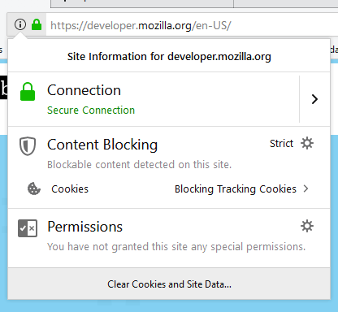
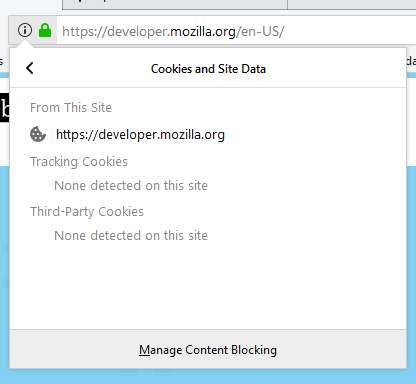

## What is tracking protection?

Firefox Desktop and Firefox for Android include built-in tracking protection. In Private Browsing windows (tabs, in Firefox for Android), Firefox will block content loaded from domains that track users across sites.

If blocked content is part of the page layout, users may notice layout issues where Firefox blocked these loads. Sometimes users won't notice at all, if the page grid works such that other page elements slide in to fill holes left by blocked elements.

When Firefox blocks content, it logs a message to the Web Console like this:

```
The resource at "http://some/url" was blocked because tracking protection is enabled.
```

Note that with Firefox for Android, you can access console output using the remote debugger.



Click the ⓘ symbol in the address bar to view information about the currently loaded page. The popup that appears will notify you when content has been blocked.  You will also be able to disable tracking protection entirely if you choose by accessing the tracking settings.

If tracking cookies were present, you would be able to view the list by clicking on "Blocking Tracking Cookies" in the above image to view the following popup:



You can click "Manage Content Blocking" to change the blocking settings:


## How does Firefox choose what to block?

Content is blocked based on the domain from which it is to be loaded.

Firefox ships with a list of sites which have been identified as engaging in cross-site tracking of users. When tracking protection is enabled, Firefox blocks content from sites in the list.

Sites that track users are most commonly third-party advertising and analytics sites.

## What does this mean for your website?

Most obviously, it means that when tracking protection is enabled:

- content served from third-party trackers will not be visible to users
- your site won't be able to use third-party advertising or analytics services that engage in tracking

More subtly, if other parts of your site depend on trackers being loaded, then these parts will also be broken when tracking protection is enabled. For example, if your site includes a callback that runs when content from a tracking site is loaded, then the callback will not execute.

For example, you should not use Google Analytics in the following way:

```html example-bad
<a href="http://www.example.com" onclick="trackLink('http://www.example.com', event);">
  Visit example.com
</a>

<script>
  function trackLink(url, event) {
    event.preventDefault();
    ga('send', 'event', 'outbound', 'click', url, {
      transport: 'beacon',
      hitCallback() {
        document.location = url;
      },
    });
  }
</script>
```

Instead, you should account for the case when Google Analytics is missing by checking to see if the ga object has initialized:

```html example-good
<a href="http://www.example.com" onclick="trackLink('http://www.example.com', event);">
  Visit example.com
</a>

<script>
  function trackLink(url, event) {
    event.preventDefault();
    if (window.ga && ga.loaded) {
      ga('send', 'event', 'outbound', 'click', url, {
        transport: 'beacon',
        hitCallback() {
          document.location = url;
        },
      });
    } else {
      document.location = url;
    }
  }
</script>
```

More information about this technique is available at [Google Analytics, Privacy, and Event Tracking](https://hacks.mozilla.org/2016/01/google-analytics-privacy-and-event-tracking/).

> **Note:** Depending on a third party in this way is not a good practice anyway, because then your site can be broken if the third party is slow or unavailable, or if the tracker has been blocked by an add-on.
