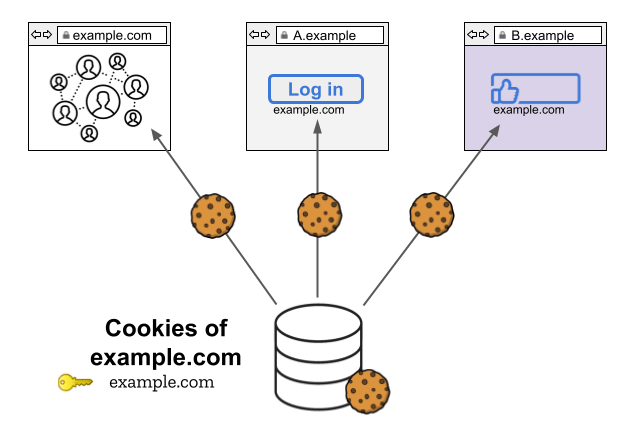

**State Partitioning** is a broad effort by Mozilla to rework how Firefox manages client-side state (i.e., data stored in the browser) to mitigate the ability of websites to abuse state for cross-site tracking, i.e. via [third-party cookies](/en-US/docs/Web/Privacy/Third-party_cookies).

This effort aims to achieve that by providing a partitioned storage location to every website a user visits. This article gives an overview of the mechanism, lists the affected APIs and explains how to debug affected sites.

State Partitioning is currently turned on by default in the Firefox Nightly
channel. A subset of the state partitioning efforts (namely [network partitioning](#network_partitioning)) has been enabled by default in the release channel
of Firefox since version 85.

## Motivation

### Cross-site tracking using shared state

Browsers traditionally key client-side state by the origin (or sometimes
registrable domain) of the location a resource was loaded from. For example,
the cookies, localStorage objects, and caches available to an iframe loaded
from `https://example.com/hello.html` will be keyed by
`example.com`. This is true regardless of whether the browser
is currently loading resources from that domain as a _first-party_
resources or as an embedded _third party_ resources. Trackers have taken
advantage of this cross-site state to store user identifiers and access them
across websites. The example below shows how `example.com` can use
its cross-site state (in this instance, cookies) to track a user across its
own site as well as `A.example` and `B.example`.



### Past approaches to blocking cross-site tracking

Firefox's past cookie policies attempt to mitigate tracking by blocking
access to some storage APIs (e.g., cookies and localStorage) for certain
domains under certain conditions. For example, our "block all third-party
cookies" policy will prevent all domains from accessing certain storage APIs
when loaded in a third-party context. Our current
[default cookie policy](/en-US/docs/Web/Privacy/Storage_Access_Policy) blocks access in a third-party context only for domains classified as
trackers.

## State partitioning

State Partitioning is a different approach to preventing cross-site tracking.
Rather than block access to certain stateful APIs in a third-party context,
Firefox provides embedded resources with a separate storage
bucket for every top-level website. More specifically, Firefox double-keys
all client-side state by the
_[origin](https://html.spec.whatwg.org/multipage/browsers.html#origin)_
of the resource being loaded and by the _top-level
[site](https://html.spec.whatwg.org/multipage/browsers.html#site)_.
In most instances, the top-level site is the scheme and {{Glossary("eTLD", "eTLD+1")}} of the top-level
page being visited by the user.

In the example below `example.com` is embedded in
`A.example` and `B.example`. However, since storage is
partitioned, there are three distinct storage buckets (instead of one). The
tracker can still access storage, but since every storage bucket is
additionally keyed under the top-level site, the data it has access to on A
will be different from the data on B. This will prevent a tracker from storing
an identifier in their cookies when visited directly and then retrieving that
identifier when embedded in other websites.


## Standardization

The [Privacy Community Group](https://privacycg.github.io/) has a Work Item for
[Client-Side Storage Partitioning](https://privacycg.github.io/storage-partitioning/). This serves as an overview of the
standardization efforts for storage partitioning in the individual standards
affected. We intend to align our state partitioning implementation with these
efforts as the Work Item is standardized.

### Status of partitioning in Firefox

- [**Network Partitioning**](#network_partitioning): Enabled by default for all users since Firefox 85.
- [**Dynamic Partitioning**](#dynamic_partitioning):
  - Since Firefox 86: Enabled for users that have
    ["Strict" privacy protections](https://support.mozilla.org/en-US/kb/enhanced-tracking-protection-firefox-desktop#w_strict-enhanced-tracking-protection) enabled.
  - Since Firefox 90: Enabled in private browsing.

## Static partitioning

### Storage partitioning

To prevent JavaScript-accessible storage APIs from being used for cross-site
tracking, accessible storage is partitioned by top-level site. This
mechanism means that, generally, a third-party embedded in one top-level site
cannot access data stored under another top-level site.

### Storage APIs

- [localStorage](/en-US/docs/Web/API/Window/localStorage)
- [sessionStorage](/en-US/docs/Web/API/Window/sessionStorage)
- [DOM Cache](/en-US/docs/Web/API/Cache)
- [IndexedDB](/en-US/docs/Web/API/IndexedDB_API)
- [Broadcast Channel](/en-US/docs/Web/API/BroadcastChannel)
- [Shared Workers](/en-US/docs/Web/API/SharedWorker)
- [Service Workers](/en-US/docs/Web/API/Service_Worker_API)

### Network partitioning

Networking-related APIs are not intended to be used for websites to store
data, but they can be
[abused](https://blog.mozilla.org/security/2021/01/26/supercookie-protections/)
for cross-site tracking. As such, the following network APIs and caches are
**permanently** partitioned by the top-level site.

> **Note:** Network Partitioning is permanent. Websites can't
> control or relax these restrictions.

### Network APIs

- [HTTP Cache](/en-US/docs/Web/HTTP/Caching)
- Image Cache
- Favicon Cache
- Connection Pooling
- Stylesheet Cache
- [DNS](/en-US/docs/Glossary/DNS)
- HTTP Authentication
- [Alt-Svc](/en-US/docs/Web/HTTP/Headers/Alt-Svc)
- Speculative Connections
- Fonts & Font Cache
- [HSTS](/en-US/docs/Web/HTTP/Headers/Strict-Transport-Security)
- OCSP
- Intermediate CA Cache
- TLS Client Certificates
- TLS Session Identifiers
- Prefetch
- Preconnect
- [CORS-preflight](/en-US/docs/Glossary/Preflight_request) Cache
- WebRTC deviceID

## Dynamic partitioning

Generally, if accessible storage is partitioned by top-level site, access to a third-parties unpartitioned cookies
can still be granted if the Storage Access API is supported:

- using the [Storage Access API](#storage_access_api).
- automatically, such as for third-parties providing federated login.

Details about automatic grants are provided in the
[Storage Access Heuristics](#storage_access_heuristics) section.

### Dynamically-partitioned APIs

- [Cookies](/en-US/docs/Web/API/Document/cookie)

### Storage access heuristics

To improve web compatibility, Firefox currently includes some heuristics to
grant unpartitioned access to cookies automatically to third parties that
receive user interaction. These heuristics are intended to allow some
third-party integrations that are common on the web to continue to function.

> **Warning:** Storage access heuristics are a transitional
> feature meant to prevent website breakage. They should not be relied upon
> for current and future web development.

#### Opener Heuristics

- When a partitioned third-party opens a pop-up window that has
  [opener access](/en-US/docs/Web/API/Window/opener) to the
  originating document, the third-party is granted storage access to its
  embedder for 30 days.
- When a first-party `a.example` opens a third-party pop-up
  `b.example`, `b.example` is granted
  third-party storage access to `a.example` for 30 days.

> **Note:** For third-parties which abuse these heuristic for
> tracking purposes, we may require user interaction with the popup before
> storage access is granted.

#### Redirect Heuristics

- If a site `b.example` redirects to `a.example`, then
  `b.example` receives storage access to its embedder
  `a.example` if both `a.example` and
  `b.example` have been visited and interacted with within the
  last 10 minutes. This storage access will be granted for 15 minutes.
- If a tracker `tracker.example` (as classified by the Enhanced
  Tracking Protection) redirects to a non-tracker
  `a.example` and `tracker.example` received user
  interaction as a first-party within the last 45 days,
  `tracker.example` is granted storage access to
  `a.example` for 15 minutes.

## Storage Access API

Third-party frames may use
[document.requestStorageAccess](/en-US/docs/Web/API/Document/requestStorageAccess) to request unpartitioned access to cookie through the
[Storage Access API](/en-US/docs/Web/API/Storage_Access_API). Once
granted, the requesting party will gain access to its entire first-party cookies (i.e., the cookies it would have access to if visited as a first-party).

> **Warning:** When storage access is granted there may still
> be references to the partitioned storage. However, sites shouldn't rely on
> being able to use partitioned and unpartitioned cookies at the same
> time.

## Debugging

We encourage site owners to test their sites, particularly those that rely on
third-party content integrations. There are several features in Firefox to
make testing easier.

### Logging

Here is an overview of the messages logged to the web console when interacting
with storage in a third-party context. In the following examples,
`a.example` is the top-level site which embeds the third-party frame
`b.example`.

| Reason                                                                                                                   | Console Message                                                                                                                                       |
| ------------------------------------------------------------------------------------------------------------------------ | ----------------------------------------------------------------------------------------------------------------------------------------------------- |
| Storage of a third-party frame is partitioned                                                                            | Partitioned cookie or storage access was provided to "b.example" because it is loaded in the third-party context and storage partitioning is enabled. |
| Access to unpartitioned cookies is granted through [Storage access heuristics](#storage_access_heuristics)               | Storage access automatically granted for First-Party isolation "b.example" on "a.example".                                                            |
| Access to unpartitioned cookies is granted via the [StorageAccessAPI](/en-US/docs/Web/API/Document/requestStorageAccess) | Storage access granted for origin "b.example" on "a.example".                                                                                         |

### Clear third-party storage-access

If a third-party iframe is granted storage access to the parent context,
Firefox sets a permission. To revoke access you can clear the permission via
the [Site Information Panel](https://support.mozilla.org/en-US/kb/site-information-panel) in the permissions section under "Cross-site Cookies".

### Test Preferences

> **Warning:** Make sure to set these preferences in a separate
> Firefox profile or reset them after testing.

#### Disable Web Compatibility Features

Setting `privacy.antitracking.enableWebcompat` to `false` will **disable** all
ETP and State Partitioning web-compatibility features. Disabling these features
can be useful when testing, to ensure your website is fully compatible with the
State Partitioning mechanism in Firefox, and it does not rely on temporary
heuristics.

Features disabled by the pref include:

- [Storage access heuristics](#storage_access_heuristics): Unpartitioned
  access to cookies can only be acquired via the Storage Access API.
- Automatic storage access grants:
  [document.requestStorageAccess](/en-US/docs/Web/API/Document/requestStorageAccess)
  will always prompt the user.
- [SmartBlock's "unblock on opt-in" feature](https://blog.mozilla.org/security/2021/07/13/smartblock-v2/), which
  will allow certain trackers when users interact with them.
- Any temporary [anti-tracking exceptions](https://wiki.mozilla.org/Security/Anti_tracking_policy#Temporary_Web_Compatibility_Interventions)
  granted to websites via the skip-listing mechanism.

#### Disable Heuristics

The following preferences can be used to disable individual storage access
heuristics via the
[config editor](https://support.mozilla.org/en-US/kb/about-config-editor-firefox):

- Enable / disable the [redirect heuristics](#redirect_heuristics):
  `privacy.restrict3rdpartystorage.heuristic.recently_visited`,
  `privacy.restrict3rdpartystorage.heuristic.redirect`
- Enable / disable the [window open heuristics](#opener_heuristics):
  `privacy.restrict3rdpartystorage.heuristic.window_open`,
  `privacy.restrict3rdpartystorage.heuristic.opened_window_after_interaction`

#### Disable Network Partitioning

Network partitioning can be disabled with the
`privacy.partition.network_state` pref.

#### Disable Dynamic State Partitioning

To disable dynamic storage partitioning for all sites you can use the
`network.cookie.cookieBehavior` pref:

| Value | Description                                                |
| ----- | ---------------------------------------------------------- |
| 5     | Reject (known) trackers and partition third-party storage. |
| 4     | Only reject trackers (Storage partitioning disabled).      |
| 0     | Allow all                                                  |

#### Exempt specific origins from partitioning

Dynamic State Partitioning can also be disabled for specific
origins with the `privacy.restrict3rdpartystorage.skip_list`
preference. This pref holds a comma separated list of origins to exempt.
The pref value should follow the following format
`first-party_origin_1,third-party_origin_1;first-party_origin_2,third-party_origin_2;...`.

For example, to disable partitioning for `tracker.example`
on `example.com` and for `social.example` on
`news.example`, you would set the pref to the following:

```plain
https://tracker.example,http://example.com;https://social.example,https://news.example
```

<section id="Quick_links">
{{ListSubpages("/en-US/docs/Web/Privacy", "2", "0", "0")}}
</section>
