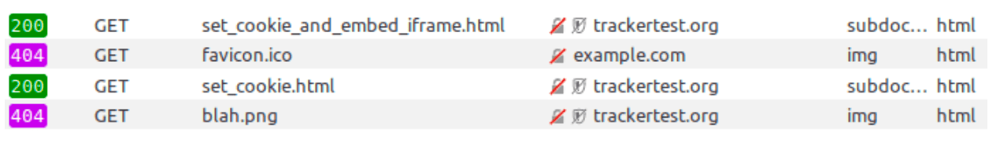

{{QuicklinksWithSubPages("Web/Privacy")}}

Firefox includes a new storage access policy that blocks cookies and other site data from third-party tracking resources. This policy is designed as an alternative to the older cookie policies, which have been available in Firefox for many years. This policy protects against cross-site tracking while minimizing the site breakage associated with traditional cookie blocking. This article explains how the policy works and how you can test it.

## Testing in Firefox

This cookie policy has been available in Firefox since version 63. This documentation describes the policy that we intend to ship to Firefox Release users, but may not match what is implemented in the current Release version of Firefox. That's because we document new aspects of the policy as soon as they land in [Firefox Nightly](https://www.mozilla.org/en-US/firefox/channel/desktop/#nightly), our pre-release channel. Firefox Nightly may also contain experimental features that we don't yet plan to ship to Release users; experimental features will not be included in this documentation, but may nevertheless impact the functionality of domains classified as trackers.

We recommend sites test with [Firefox Nightly](https://www.mozilla.org/en-US/firefox/channel/desktop/#nightly), as this includes the newest version of our protections. As described above, note that Nightly may include additional protections that end up getting removed or changed before they reach our Release users. We'll keep this page updated with the newest information as we strengthen our protections.

These protections are on by default in Nightly. The cookie policy can be enabled in other versions of Firefox through the [Content Blocking settings](https://support.mozilla.org/en-US/kb/content-blocking) (these steps will vary by version; the linked documentation includes a dropdown to select the appropriate Firefox version).

### Report Broken Sites

If you find a website broken as a result of this change, file a bug under the Tracking Protection component within the Firefox product on [Bugzilla](https://bugzilla.mozilla.org/enter_bug.cgi?assigned_to=nobody%40mozilla.org&blocked=1480137&bug_file_loc=http%3A%2F%2F&bug_ignored=0&bug_severity=normal&bug_status=NEW&cf_fx_iteration=---&cf_fx_points=---&cf_platform_rel=---&cf_status_firefox62=---&cf_status_firefox63=---&cf_status_firefox64=---&cf_status_firefox_esr60=---&cf_status_geckoview62=---&cf_tracking_firefox62=---&cf_tracking_firefox63=---&cf_tracking_firefox64=---&cf_tracking_firefox_esr60=---&cf_tracking_firefox_relnote=---&cf_tracking_geckoview62=---&component=Tracking%20Protection&contenttypemethod=list&contenttypeselection=text%2Fplain&defined_groups=1&flag_type-203=X&flag_type-37=X&flag_type-41=X&flag_type-5=X&flag_type-607=X&flag_type-721=X&flag_type-737=X&flag_type-748=X&flag_type-787=X&flag_type-799=X&flag_type-800=X&flag_type-803=X&flag_type-835=X&flag_type-846=X&flag_type-855=X&flag_type-864=X&flag_type-914=X&flag_type-916=X&flag_type-929=X&flag_type-930=X&flag_type-933=X&form_name=enter_bug&maketemplate=Remember%20values%20as%20bookmarkable%20template&op_sys=Unspecified&priority=--&product=Firefox&rep_platform=Unspecified&target_milestone=---&version=unspecified). Alternatively you can report broken sites directly in Firefox by clicking "Report a Problem" in the Content Blocking section of the [Control Center](https://support.mozilla.org/en-US/kb/site-information-panel) (this shortcut may not be available in all versions of Firefox).

## Tracking protection explained

How does Firefox determine which resources are tracking resources?

Firefox uses the Tracking Protection list to determine which resources are tracking resources. The Tracking Protection list is [maintained by Disconnect](https://github.com/disconnectme/disconnect-tracking-protection/issues). When the list is applied in Firefox, we make two important changes:

- First, we only use the "Basic Protection" version of the list, which [excludes some categories of trackers](https://github.com/mozilla-services/shavar-prod-lists#disconnect-blacklistjson). In the future, we may expand our protections to use the "Strict Protection" version of the list.
- Second, Firefox uses an additional "[entity list](https://github.com/mozilla-services/shavar-prod-lists/blob/master/disconnect-entitylist.json)", which prevents [domains from being classified as trackers when they are loaded on a top-level site owned by the same organization](https://github.com/mozilla-services/shavar-prod-lists#disconnect-entitylistjson).

Firefox uses the built-in [Tracking Protection](https://support.mozilla.org/en-US/kb/what-happened-tracking-protection) URL classifier to determine which resources match the tracking protection list. Domains are matched against the list in accordance with the [SafeBrowsing v4 specification](https://developers.google.com/safe-browsing/v4/urls-hashing#suffixprefix-expressions). Specifically, we check the exact hostname of the resource against the list, as well as the last four hostnames formed by starting with the last five components and successively removing the leading component. Consider the following examples:

| Hostname on the list | Hostname of resource   | Matched |
| -------------------- | ---------------------- | ------- |
| `example.com`        | `example.com`          | Yes     |
| `example.com`        | `a.b.example.com`      | Yes     |
| `blah.example.com`   | `example.com`          | No      |
| `a.b.example.com`    | `c.d.example.com`      | No      |
| `blah.example.com`   | `foo.blah.example.com` | Yes     |

## What does the storage access policy block?

The storage access policy blocks resources identified as trackers from accessing their cookies and other site storage when they are loaded in a third-party context. This prevents those resources from retrieving tracking identifiers stored in cookies or site storage and using them to identify users across visits to multiple first parties. Specifically, Firefox does this by imposing the following restrictions:

Cookies:

- Block {{httpheader("Cookie")}} request headers and ignore {{httpheader("Set-Cookie")}} response headers.
- Return an empty string for calls to {{domxref("Document.cookie")}} and ignore requests to set cookies via `Document.cookie`.

DOM Storage:

- [localStorage](/en-US/docs/Web/API/Web_Storage_API): [`Window.localStorage`](/en-US/docs/Web/API/Window/localStorage): read and write attempts throw a `SecurityError` exception. Prior to Firefox 70: [`Window.localStorage`](/en-US/docs/Web/API/Window/localStorage) is `null`. Thus, attempts to read and write using this object will throw a `TypeError` exception.
- [sessionStorage](/en-US/docs/Web/API/Web_Storage_API): read and write attempts are permitted.
- [IndexedDB](/en-US/docs/Web/API/IndexedDB_API): attempting to access the IndexedDB factory object throws a `SecurityError` exception.

Messaging and Workers:

- [Broadcast Channel](/en-US/docs/Web/API/Broadcast_Channel_API): attempts to create a new {{domxref("BroadcastChannel")}} will throw a `SecurityError` exception.
- [Shared Worker](/en-US/docs/Web/API/Web_Workers_API): attempts to create a new {{domxref("SharedWorker")}} will throw a `SecurityError` exception.
- [Service Worker](/en-US/docs/Web/API/Service_Worker_API): attempts to create a new {{domxref("ServiceWorker")}} will throw a `SecurityError` exception.

DOM Cache:

- Calls to {{domxref("CacheStorage")}} will always reject with a `SecurityError`.

Browser caches:

- The [HTTP cache](/en-US/docs/Web/HTTP/Caching), the Image cache, and the [Alternative Services (Alt-Svc) cache](/en-US/docs/Web/HTTP/Headers/Alt-Svc) are all partitioned for tracking resources, such that each top-level origin will have a separate partition and tracking resources on different top-level origins will be cached separate from each other.

Network connections:

- [TLS sessions](https://wiki.mozilla.org/Security/Server_Side_TLS#Session_Resumption) will not be resumed using a session ticket when an HTTPS connection is made to an embedded third-party resource that is classified as a tracker.
- [HTTP connection reuse](/en-US/docs/Web/HTTP/Connection_management_in_HTTP_1.x#persistent_connections) by domains classified as trackers is limited to requests that occur under the same top-level origin. For example, a request for content from `tracker.example` on `news.example` will not reuse an HTTP connection with a request for content from `tracker.example` on `shopping.example` or with requests that occur when `tracker.example` is visited directly (i.e., as a first party).

HTTP Referrers

- The default [Referrer Policy](/en-US/docs/Web/HTTP/Headers/Referrer-Policy) for third-party resources classified as trackers is set to `strict-origin-when-cross-origin`.

### What is not blocked by the policy?

1. This policy does not currently restrict third-party storage access for resources that are not classified as tracking resources. We may choose to apply additional restrictions to third-party storage access in the future.
2. The restrictions applied by the policy will not prevent third-party scripts classified as tracking resources from accessing storage in the main context of the page. These scripts can continue to use storage scoped to the top-level origin.
3. Origins classified as trackers will have access to their own storage when they are loaded in a first-party context.
4. Cross-origin resources loaded from the same {{Glossary("eTLD", "eTLD+1")}} as the top-level context will still have access to their storage.
5. Origins normally classified as trackers will [not be blocked if the top-level page origin is determined to be from the same organization as them](https://github.com/mozilla-services/shavar-prod-lists#entity-list).

## Storage access grants

In order to improve web compatibility and permit third-party integrations that require storage access, Firefox will grant storage access scoped to the first party for a particular third-party origin as described in this section. Currently, Firefox includes some web compatibility heuristics that grant storage access to third-party resources classified as trackers when a user interacts with those third parties. We do this when we expect that not granting access would cause the web page to break. We also support an initial implementation of the [Storage Access API](/en-US/docs/Web/API/Storage_Access_API), through which embedded {{htmlelement("iframe")}}s can request storage access by calling {{domxref("Document.requestStorageAccess()")}}. Although both of these approaches provide the same level of storage access, we recommend third parties switch to using the Storage Access API in order to guarantee their access to storage.

### Automatic storage access upon interaction

In order to improve web compatibility, Firefox currently includes some heuristics to grant storage access automatically to third parties that receive user interaction. These heuristics are intended to allow some third-party integrations that are common on the web to continue to function. They are intended to be temporary and will be removed in a future version of Firefox. They should not be relied upon for current and future web development.

Third-party storage access may be granted to resources that have been classified as tracking resources when a user gesture triggers a pop-up window that has [opener access](/en-US/docs/Web/API/Window/opener) to the originating document. When that occurs, there are three possible ways a third-party origin can be granted access:

- The origin of the resource that is initially loaded in the pop-up window is granted storage access on the opener document if that origin has received user interaction as a first party within the past 30 days.
- After the initial resource is loaded in the pop-up window, the window may go through a series of redirects to other hosts. If a user interacts with the pop-up window following a redirect, the origin of the content loaded in the pop-up window is given storage access on the opener document.
- When there is a top-level redirect from a tracking origin to a non-tracking origin, the tracking origin receives short-lived storage access on the non-tracking origin and any other non-tracking origins that appear further down the redirect chain (i.e., if the load continues to redirect). The tracking origin must have received user interaction as a first party within the past 30 days, and the storage access permission expires after 15 minutes.

### Scope of storage access

When storage access is granted, it is scoped to the site of the opener document or subdomains of that origin. Access that is granted on the subdomain of an origin does extend to the top-level origin. As an example, if a resource from `tracker.example` is granted storage access on `foo.example.com`, then `tracker.example` will be able to access its cookies on `bar.foo.example.com` and on `example.com`.

When storage access is granted to `tracker.example` on `example.com`, all resources loaded from `tracker.example` on any top-level document loaded from `example.com` are immediately given storage access. This includes all resources loaded in the main context of the page, embedded `<iframe>`s, and resources loaded within embedded `<iframe>`s. Storage access is not extended to other resources loaded on `example.com` (e.g. `other-tracker.example`), nor to other first parties on which `tracker.example` is embedded (e.g. `example.org`).

Storage access grants extend into the first level of nested contexts, but no further. This means that `<iframe>`s embedded in the main context of the page and loaded from a domain classified as a tracker will have full access to all storage locations accessible through JavaScript. Similarly, requests for resources loaded in `<iframe>`s embedded in the main context of the page will have access to HTTP cookies. However, further nested contexts, including but not limited to those from the origin classified as a tracker, will not be granted storage access.

Consider the following embedding scenarios on a top-level page loaded from `example.com` on which `tracker.example` has been granted storage access.

| Embedding                                                                                                                               | tracker.example resource storage access |
| --------------------------------------------------------------------------------------------------------------------------------------- | --------------------------------------- |
| An image is loaded from `tracker.example` and embedded in the main context of `example.com`.                                            | HTTP: Yes JS: N/A                       |
| `example.com` embeds an `<iframe>` from `example.org`. That `<iframe>` goes on to load an image from `tracker.example`.                 | HTTP: Yes JS: N/A                       |
| `example.com` embeds an `<iframe>` from `example.org`. That `<iframe>` goes on to embed an `<iframe>` from `tracker.example`.           | HTTP: Yes JS: No                        |
| `example.com` embeds an `<iframe>` from `tracker.example`.                                                                              | HTTP: Yes JS: Yes                       |
| `example.com` embeds an `<iframe>` from `example.com` (same origin). The nested `<iframe>` embeds an `<iframe>` from `tracker.example`. | HTTP: Yes JS: No                        |

### Storage access expiration

The storage access grant expires after 30 days. Domains classified as tracking resources may be granted third-party storage access on multiple first parties, and the storage permission for each party expires independently. The above heuristics will also serve to extend the lifetime of a third-party storage permission on origins that have already been granted access. Each time the heuristic is activated, or a success call to the Storage Access API is made, the pre-existing storage access expiration will be extended by 30 days, counting from the time the previous access was granted.

Please note that in the future we expect to make changes to how long storage access will remain valid for. As mentioned before, the way to know that you will be able to use storage as a third-party going forward will be using the Storage Access API.

## Debugging

We encourage site owners to test their sites, particularly those that rely on third-party content integrations. We've added several new features to Firefox to make testing easier.

### Developer Tools notifications

The [Network Monitor](https://firefox-source-docs.mozilla.org/devtools-user/network_monitor/index.html) in Firefox Developer Tools now includes an indicator for all resource requests that have been classified as tracking resources. This indicator is shown as a shield icon in the domain column. In the sample image below, `trackertest.org` is classified as a tracking resource, while the request to example.com is not.

### Adding custom domains to the Tracking Protection list

Curious how things will work if a third-party domain on your site were classified as a tracker? We've added a preference that allows you to add custom domains to the Tracking Protection URL classifier. To do so:

1. Type `about:config` in your address bar. If you are presented with a page that warns you "This may void your warranty!", click "I accept the risk!"
2. Search for the preference name "urlclassifier.trackingAnnotationTable.testEntries".
3. If the preference already exists, edit the preference value.
4. If the preference does not exist, click "String" and then "+" to create a new preference.
5. For the preference value enter comma separated origins that you'd like to have classified as trackers. E.g. "example.net,example.org".

> **Warning:** Be sure to remove these entries after you have finished testing.

## FAQ

This cookie policy has the potential to lead to site breakage, but has been designed to allow common third-party integrations to continue to work while preventing cross-site tracking. In this section we describe the functionality you can expect in different integration scenarios.

### Will this storage access policy block ads from displaying on my website?

No — this feature only restricts access to cookies and site data that can be used to track users across websites. Blocking tracking identifiers does not prevent the display of advertisements.

### I use a third-party analytics service that is classified as a tracker. Will I still receive analytics data?

This depends on how the third-party analytics service is implemented. Third-party analytics providers will no longer be able to user their third-party storage to collect data. This means that providers using cookies which are scoped to their third-party domain, or local storage and other site data stored under their origin, will no longer have access to those identifiers across other websites.

If these services are embedded into the main context of the page, they can continue to use first-party cookies and site storage to track users across page visits on that specific first-party domain.

### I use third-party services for social login, like, and share button integration. Will my users still be able to make use of these services?

This depends on how the social integration is implemented. We expect that many of the popular social integrations will continue to function as they do under Firefox's current cookie policy with some minor differences in the user experience.

A social content provider that is classified as a tracker will not have access to their third-party cookies when the user first visits a new first party. Thus, the user may appear logged out to the service despite being logged in when they visit the provider's website directly. Depending on the type of integration, the user may have to take some action to interact with the social content provider before the provider is given access to their cookies. For example:

- For social login, the user may have to click a login button on the first party.
- For social like or share buttons, the user will have to first interact with the button in a logged-out state. Once they do, many social content providers will prompt them to log in.

After these interactions, the provider will receive third-party storage access if they prompt the user in a way that is captured by the storage access activation heuristics described above. These providers should consider switching to explicitly request storage access through the Storage Access API as soon as possible. An [initial implementation of this API](https://bugzil.la/1469714) is currently available in Nightly.

### I use third-party pixels and other tools to measure the effectiveness of my ad campaigns. Will I still be able to measure the conversion rate of my ads?

This depends on how the third party has implemented the measurement tool, but generally ad conversion measurement will be more difficult. Consider the following examples:

1. You run an ad on a social media website that is seen several times by a user, but never clicked. That user later visits your website, which includes a conversion tracking tag from the same social media website. This type of conversion is often referred to as a "view-through conversion." Since the social media website does not have access to their third-party storage, they will not recognize the user as the same user that saw the advertisements on their website and the conversion will not be tracked. We expect that most view-through conversion tracking techniques will no longer work, including those offered by display networks.
2. You run an ad on a display network or social media website that is clicked by a user. That user lands on your website, which includes a conversion tracking tag from the same website that displayed your ad. This type of conversion is often referred to as a "click-through conversion." Since the social media site or display network will not have access to their third-party storage, they will not recognize the user as the same user that saw the advertisements on their website and the conversion will not be tracked. We expect that this version of click-through conversion will no longer work.
3. You run an ad that appears on a social media website. A user clicks on your advertisement and is taken to a landing page that contains a conversion tracking tag from the third-party network. On the social media website, the network annotates the advertisement landing page URL with a query parameter that signals that the visit was the result of a click on an advertisement. On your website, the display network's tag checks the URL query parameters and saves any ad tracking parameters to first-party storage. If a user later completes a conversion event, the network's tag checks first-party storage to determine which click (or clicks) was responsible for the visit. We expect that click-through conversion implemented in this way will continue to work.
