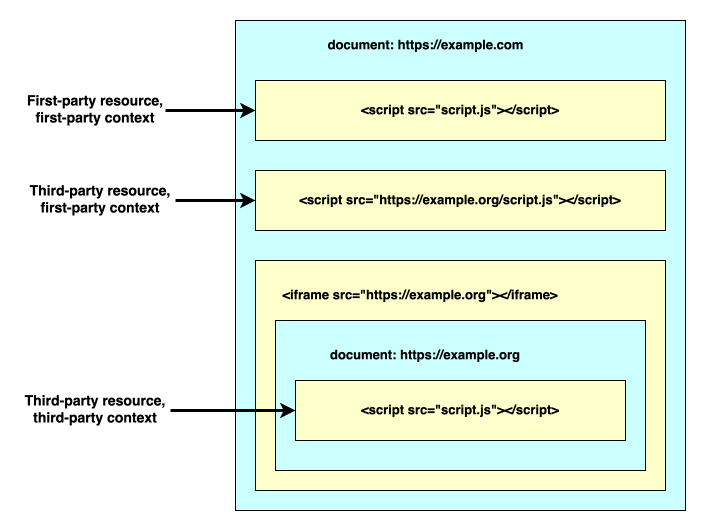
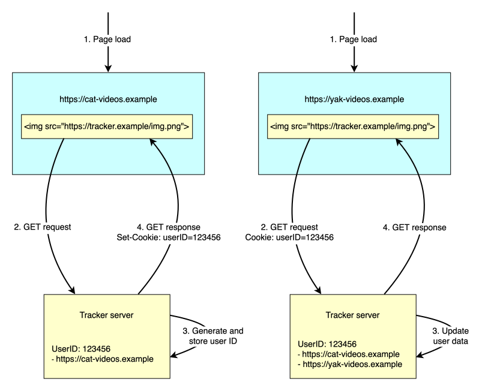
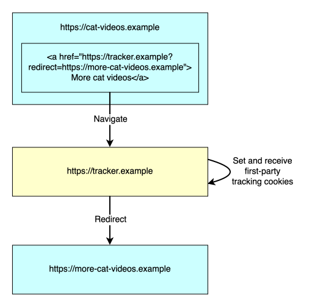

**Tracking** is the practice of collecting and correlating information about a user's activities across multiple websites. This enables the tracker to build a profile of the user, which may include, or enable the tracker to deduce, a great deal of personal information about them.

## First and third parties

The concept of tracking involves making a distinction between _first-party_ and _third-party_ resources. When a user visits a website, the browser's address bar displays the name of the {{glossary("site")}}, and the site's content itself confirms to the user who they are interacting with. Any resources served by this site, including documents, scripts, stylesheets, images, and so on, are first-party resources. Any other resources are third-party resources: they come from a different site, that the user might not have the intention of interacting with, and of whose existence the user might well be unaware.

> [!NOTE]
> When browsers define and implement policies around tracking, they need a {{glossary("site", "precise technical definition of a \"site\"")}}, and we will use that definition in this guide.
>
> Usually, this technical definition maps onto the user's conception of a site, but it doesn't always. For example, `example.co.uk` and `example.ca` are different sites, but a user might think of them as the same site, expecting that when they share information with one, they share it with both. Since a user's expectations are a basic concept in privacy, browsers sometimes have to make allowances for cases like this.

Common examples of third party resources are:

- Subresources such as scripts or images that are loaded into the first party's document, for example using {{htmlelement("script")}} or {{htmlelement("img")}} tags, but that are served from a different site. In this case, the third-party resource is loaded into the first party's context.

- Resources that are loaded into a separate document which is served from a different site and embedded in the first party's document inside an {{htmlelement("iframe")}}. In this case, the third-party resource is loaded into its own context, which is isolated from the first party according to the rules of the [same-origin policy](/en-US/docs/Web/Security/Defenses/Same-origin_policy).



Because trackers collect a user's activity across the sites that the user visits, then they generally operate as third parties: specifically, the client side of the tracker is a resource embedded in first-party pages that the user visits.

This makes tracking especially problematic for privacy, because it violates the principle of _transparency_: that the user should be aware of how their personal data is shared, and with whom. Because the user is directly interacting with the first party, it's more reasonable to assume that they intend to share any data that they share with that party. But typically the involvement of a third party is not apparent to the user, and so the fact that it may be collecting data about them is also not apparent.

## Tracking techniques

In this section we'll look at the main methods that websites use to track users.

We've split the methods into two categories:

- Methods that use web platform storage APIs to store the client-side state that the tracker uses to identify users.

- All other methods, including other more covert storage techniques and fingerprinting. These methods are collectively referred to as _covert tracking_, and are generally seen as more harmful to privacy, because they are harder for users and browsers to control.

### Stateful tracking using storage APIs

In this technique, the tracker stores an identifier for the user in the client, and sends the identifier to the tracker's server whenever the user visits a page that embeds the tracker. This enables the tracker to maintain a list of pages that the user visits.

Trackers can use various different client-side storage APIs to store identifiers, such as [local storage](/en-US/docs/Web/API/Web_Storage_API) or [IndexedDB](/en-US/docs/Web/API/IndexedDB_API). Most often, though, trackers use [cookies](/en-US/docs/Web/HTTP/Guides/Cookies).

For trackers, a major advantage of cookies is that the identifier can be set by the server in the response to an HTTP request, and any stored identifiers are always sent to the server in the request. This means that the client side of a tracker can be implemented only using HTML elements, with no active scripting needed.

To use cookies, a tracker implements something like the following process:

1. The target pages embed a third-party resource served by the tracker. For example, this might be an image or an {{htmlelement("iframe")}} containing an advertisement.
2. When the user loads one of the target pages, the browser makes a request to the tracker's server for the third-party resource. If the request doesn't already contain any cookies, the tracker's server generates an identifier for the user and sets it as a cookie in the response.
3. The next time this user loads one of the target pages, the browser again makes a request to the tracker's server for the third-party resource. The request contains the cookie that the server previously set: the server now knows that the same user (or at least, the same browser) visited both pages.



In this situation, the cookies that are exchanged are associated with a different site from the main page. The main page, whose URL is shown in the address bar, is the site that the user intends to visit, but the cookies are associated with the tracker's site. Cookies with this property are called _third-party cookies_, and much of the effort browsers put into preventing tracking involves blocking or restricting the use of third-party cookies.

### Covert tracking

_Covert tracking_, sometimes called _unsanctioned tracking_, is tracking that uses any technique other than storage APIs.

Any form of web tracking is usually harmful to privacy. However it is easier for users, browsers, and browser extensions to have some control over tracking that uses storage APIs, than tracking that uses more covert methods.

For example:

- The browser's developer tools can show users the cookies that the browser has stored.
- Users have the ability to clear cookies.
- Browsers and browser extensions have the ability to clear cookies automatically based on the user's preferences.

Even if users don't take advantage of these tools, privacy researchers and advocates can use them to identify and highlight tracking. This helps the development of tools and regulations that can help protect the privacy of all users.

Covert tracking is more harmful because by its nature it is hidden from user visibility and control.

See the W3C's [Unsanctioned Web Tracking](https://www.w3.org/2001/tag/doc/unsanctioned-tracking/) for more details.

In the rest of this section we will describe some covert tracking techniques.

#### Covert stateful tracking

This is a variant of stateful tracking in which trackers don't use client-side storage APIs to store identifiers, but instead store identifiers in parts of the web platform that are not intended for general storage.

For example, in {{glossary("HSTS", "HTTP Strict Transport Security (HSTS)")}}, a website informs the browser that it should always use [HTTPS](/en-US/docs/Web/Security/Defenses/Transport_Layer_Security) for connections, even if the scheme in the URL is HTTP. This gives a single domain the ability to store one bit of information: by registering a number of domains and forcing the browser to load resources from them, the tracker can encode a complete identifier. See [Protecting Against HSTS Abuse](https://webkit.org/blog/8146/protecting-against-hsts-abuse/) for more details of this technique.

These stored identifiers are sometimes called "supercookies", because they will not be cleared when the browser clears cookies: that is the attraction of them for trackers.

#### Fingerprinting

Fingerprinting is like stateful tracking, except that the identifier — the fingerprint — is not stored by the tracker, but is derived by collecting and combining distinguishing features of the user's environment. Elements of a fingerprint might include, for example:

- The browser version
- The user's timezone and preferred language
- The set of video or audio codecs that are available on the system
- The fonts installed on the system
- The computer's display size and resolution

A website can retrieve information like this by executing JavaScript and CSS on the device, and by combining this data can often derive a unique fingerprint for a browser.

#### Navigational tracking

Navigational tracking is the practice of using a navigation to transmit an identifier for a user from the linking site to the destination, typically by "decorating" the link with the identifier:

```html
<a href="https://cat-videos.example/resource?userId=123456">More cats!</a>
```

Navigational tracking is a little different from the other methods we've looked at, because the data is not shared with an invisible third party: it's passed from one first party site to another.

#### Bounce tracking

Bounce tracking, also known as redirect tracking, is a variant of navigational tracking in which the link goes to the tracker, instead of the expected destination. The tracker can then set and receive its cookies, before immediately redirecting the browser to the destination that the user expected. This may happen so quickly that the user doesn't even notice.



For trackers, the advantage of bounce tracking is that it works even if the browser has blocked or restricted third-party cookies. Because the browser has navigated to the tracker, the tracker is (temporarily) considered to be a first party, so is allowed to set and receive cookies even if third-party cookies are blocked.

## Legitimate uses for tracking

## Anti-tracking techniques

## Anti-tracking policies in browsers

## See also
