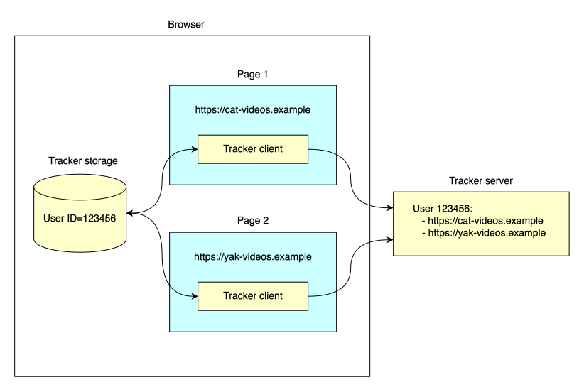
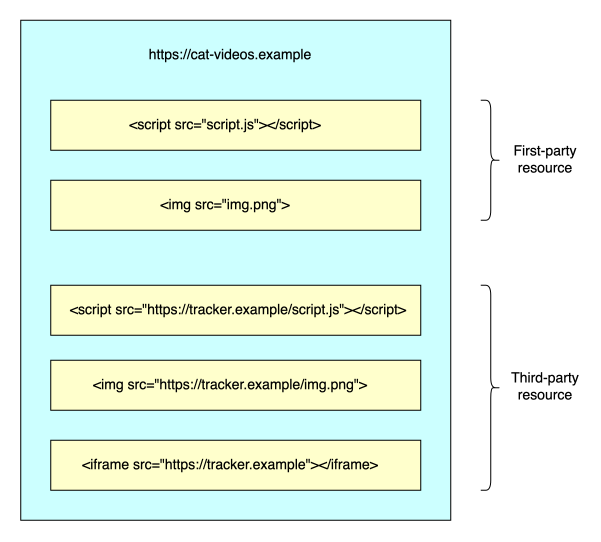
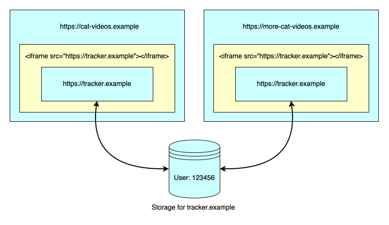
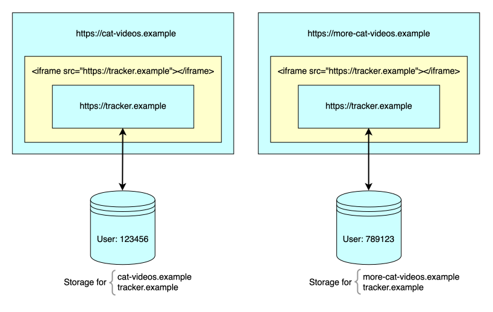

**Tracking** is the practice of collecting and correlating information about a user's activities across multiple websites. This enables the tracker to build a profile of the user, which may include, or enable the tracker to deduce, a great deal of personal information about them.

The motivation for tracking is that the record of a user's browsing history is valuable, especially to the advertising industry, as it enables them to serve ads that are highly targeted to a person's interests. However, tracking is one of the most significant web privacy problems, and as a result, browsers and browser extensions have attempted to prevent websites from tracking users.

In this guide we'll describe the main techniques that are used to track users, and the mechanisms that browsers have adopted to protect users from trackers.

## Tracker architecture

The tracker's goal is to assemble a record of sites that the user has visited, and potentially other information about their browsing activities.

Typically (but [not always](#navigational_tracking)), a tracker's architecture consists of a server, which maintains the information about tracked users, and a client component, which is embedded in a large number of web pages belonging to sites that the user might visit.

The tracker generally has a good reason to encourage other sites to embed its client: for example, the tracker might operate a social media site, and might provide small client-side components that other sites can embed, that enable users to share the embedding page on their social media profile.

When the user loads a page that embeds the client, the client is able to communicate with the server, and the server can record the fact that the user has visited this page.

The embedded client has a way to identify the browser in which it's loaded: most often, it does this by storing an identifier in the browser's client-side storage. Whenever the user loads a page that embeds the client, the client communicates with the server, which adds the page to the list of pages associated with this user.



This architecture has a couple of properties that are worth exploring in a little more detail:

- The tracker client is a [_third-party resource_](#first_and_third_parties) that's embedded in pages that the user visits.
- The tracker client is able to access its own [storage location](#client-side_storage) on the user's device.

## First and third parties

When a user visits a website, the browser's address bar displays the name of the {{glossary("site")}}, and the site's content itself confirms to the user who they are interacting with. Any resources served by this site, including documents, scripts, stylesheets, images, and so on, are _first-party resources_. Any other resources are _third-party resources_: they come from a different site, that the user might not have the intention of interacting with, and of whose existence the user might well be unaware.

Common examples of third party resources are:

- Subresources such as scripts or images that are loaded into the first party's document, for example using {{htmlelement("script")}} or {{htmlelement("img")}} tags, but that are served from a different site.

- A separate document, along with its own subresources, which is served from a different site and embedded in the first party's document inside an {{htmlelement("iframe")}}. In this case, the third-party document is loaded into its own context, which is isolated from the first party according to the rules of the [same-origin policy](/en-US/docs/Web/Security/Defenses/Same-origin_policy).



This makes tracking especially problematic for privacy, because it violates the principle of _transparency_: that the user should be aware of how their personal data is shared, and with whom. Because the user is directly interacting with the first party, it's more reasonable to assume that they intend to share any data that they share with that party. But typically the involvement of a third party is not apparent to the user, and so the fact that it may be collecting data about them is also not apparent.

## Client-side storage

We've seen that trackers often store an identifier for the user in the browser, and send the identifier to the tracker's server whenever the user visits a page that embeds the tracker. This enables the tracker to maintain a list of pages that the user visits. This type of tracking is sometimes called _stateful_ tracking.

We can distinguish two sorts of stateful tracking:

- Those that use client-side storage APIs, such as [local storage](/en-US/docs/Web/API/Web_Storage_API), [IndexedDB](/en-US/docs/Web/API/IndexedDB_API), or [cookies](/en-US/docs/Web/HTTP/Guides/Cookies).

- Those that use other features of the web platform that are not generally intended for general-purpose storage, such as the browser's HTTP cache. In this guide, we will call this _covert stateful tracking_.

### Tracking using client-side storage APIs

Trackers can use various different client-side storage APIs to store identifiers, such as [local storage](/en-US/docs/Web/API/Web_Storage_API) or [IndexedDB](/en-US/docs/Web/API/IndexedDB_API). Most often, though, trackers use [cookies](/en-US/docs/Web/HTTP/Guides/Cookies).

For trackers, a major advantage of cookies is that the identifier can be set by the server in the response to an HTTP request, and any stored identifiers are always sent to the server in the request. This means that the client side of a tracker can be implemented only using HTML elements, with no active scripting needed.

To use cookies, a tracker implements something like the following process:

1. The target pages embed a third-party resource served by the tracker. For example, this might be an image or an {{htmlelement("iframe")}} containing an advertisement.
2. When the user loads one of the target pages, the browser makes a request to the tracker's server for the third-party resource. If the request doesn't already contain any cookies, the tracker's server generates an identifier for the user and sets it as a cookie in the response.
3. The next time this user loads one of the target pages, the browser again makes a request to the tracker's server for the third-party resource. The request contains the cookie that the server previously set: the server now knows that the same user (or at least, the same browser profile) visited both pages.


In this situation, the cookies that are exchanged are associated with a different site from the main page. The main page, whose URL is shown in the address bar, is the site that the user intends to visit, but the cookies are associated with the tracker's site. Cookies with this property are called _third-party cookies_, and much of the effort browsers put into preventing tracking involves blocking or restricting the use of third-party cookies.

### Covert stateful tracking

This is a variant of stateful tracking in which trackers don't use client-side storage APIs to store identifiers, but instead store identifiers in parts of the web platform that are not intended for general storage.

For example: in {{glossary("HSTS", "HTTP Strict Transport Security (HSTS)")}}, a website informs the browser that it should always use [HTTPS](/en-US/docs/Web/Security/Defenses/Transport_Layer_Security) for connections, even if the scheme in the URL is HTTP. This gives a single domain the ability to store one bit of information: by registering a number of domains and forcing the browser to load resources from them, the tracker can encode a complete identifier. See [Protecting Against HSTS Abuse](https://webkit.org/blog/8146/protecting-against-hsts-abuse/) for more details of this technique.

These stored identifiers are sometimes called "supercookies", because they will not be cleared when the browser clears cookies: that is the attraction of them for trackers.

### Fingerprinting

Fingerprinting is like covert stateful tracking, except that the identifier — the fingerprint — is not stored by the tracker, but is derived by collecting and combining distinguishing features of the user's environment. Elements of a fingerprint might include, for example:

- The browser version
- The user's timezone and preferred language
- The set of video or audio codecs that are available on the system
- The fonts installed on the system
- The computer's display size and resolution

The tracker can retrieve these elements by executing JavaScript and CSS on the device. It can then combine the elements to create a fingerprint, which is often enough to uniquely identify a single browser.

## Navigational tracking

Navigational tracking is the practice of using a navigation to transmit an identifier for a user from the linking site to the destination, typically by "decorating" the link with the identifier:

```html
<a href="https://cat-videos.example/resource?userId=123456">More cats!</a>
```

Navigational tracking is a little different from the other methods we've looked at: it doesn't necessarily use an embedded third-party resource, and the data is not always shared with an invisible third party: it may be passed from one first party site to another.

### Bounce tracking

Bounce tracking, also known as redirect tracking, is a variant of navigational tracking in which the link goes to the tracker, instead of the expected destination. The tracker can then set and receive its cookies, before immediately redirecting the browser to the destination that the user expected. This may happen so quickly that the user doesn't even notice.


For trackers, the advantage of bounce tracking is that it works even if the browser has blocked or restricted third-party cookies. Because the browser has navigated to the tracker, the tracker is (temporarily) considered to be a first party, so is allowed to set and receive cookies even if third-party cookies are blocked.

## Covert tracking

Privacy researchers consider _covert tracking_ to consist of all forms of tracking except [those that use web platform storage APIs](#tracking_using_client-side_storage_apis). This includes [covert stateful tracking](#covert_stateful_tracking), [fingerprinting](#fingerprinting), and [navigational tracking](#navigational_tracking).

Any form of web tracking is usually harmful to privacy. However it is easier for users, browsers, and browser extensions to have some control over tracking that uses storage APIs, than tracking that uses more covert methods.

For example:

- The browser's developer tools can show users the cookies that the browser has stored.
- Users have the ability to clear cookies.
- Browsers and browser extensions have the ability to clear cookies automatically based on the user's preferences.

Even if users don't take advantage of these tools, privacy researchers and advocates can use them to identify and highlight tracking. This helps the development of tools and regulations that can help protect the privacy of all users.

Covert tracking is more harmful because by its nature it is hidden from user visibility and control.

See the W3C's [Unsanctioned Web Tracking](https://www.w3.org/2001/tag/doc/unsanctioned-tracking/) for more details.

## Anti-tracking

Because tracking represents such a significant privacy violation, browsers and browser extensions have designed and implemented a number of techniques to prevent websites from tracking users. In this section we'll outline the general techniques, and in the next section we'll look at the specific policies implemented by browsers.

First, though, we'll explore some of the reasons that browsers can't just disable the techniques used by trackers.

> [!NOTE]
> In this section we'll refer to anti-tracking measures taken by _browsers_, but browser extensions are an important part of the anti-tracking landscape, and they also use many of the techniques described here.
>
> In fact, especially in mainstream browsers, extensions can be more effective at blocking trackers, because they are able to make more aggressive decisions about what to block.

### Challenges of anti-tracking

In this section we'll describe two considerations that make it impractical for browsers to just disable the techniques used by trackers. First, there are legitimate uses for these techniques, and second, disabling tracking can easily break websites.

#### Legitimate uses for tracking techniques

There are legitimate uses for the techniques that are used in tracking, and it can be hard for the browser to determine whether a particular usage is legitimate or not.

For example, when we talk about cross-site tracking, we use a {{glossary("site", "specific definition of \"site\"")}}. But there are situations in which users might consider two servers to represent the same entity, when they are technically different sites. This could be the case when a single organization has different sites in different countries, such as `example.co.uk` and `example.ca`. In a situation like this the user might expect that their login status or preferences would persist across both sites, and to do that, the sites have to implement cross-site tracking.

Another situation in which sites have to exchange state is [federated login](/en-US/docs/Web/Security/Authentication/Federated_identity), in which the website that the user is trying to sign into needs to coordinate with the {{glossary("identity provider")}}, and [implementations of this often rely on third-party cookies](/en-US/docs/Web/Security/Authentication/Federated_identity#third-party_cookies).

#### Anti-tracking and site reliability

Even if a site is tracking users, using the techniques described above, the proper functioning of the site may depend on the tracker being allowed to work. For example, the site's main may assume that the tracker is present, and break if it isn't. If the tracker is completely blocked, then the site won't work properly.

In cases like this, browsers sometimes have to decide sometimes whether the harm caused by allowing the tracker is greater than the benefit that the website provides. This is part of the reason that browsers provide user-configurable levels of anti-tracking, so users can choose a trade-off based on their own values.

### Anti-tracking techniques

In this section we'll give an overview of the main defenses that browsers deploy against tracking. Browsers typically use some combination of these techniques, and will apply different techniques in different situations and configurations (for example, if the user has private browsing enabled).

#### Tracker lists

A tracker list is a list of domains that are known to host trackers. Trackers may be classified according to the purpose of the tracking and/or the techniques they use. When processing requests for resources, browsers consult the list and decide whether to block the resource load entirely or to limit its capabilities.

The advantages of using tracker lists are that:

- They enable a browser to discriminate between trackers and websites that use tracking techniques for legitimate purposes. This allows the browser to use more aggressive measures against the tracker.
- They enable a browser to restrict trackers without needing to identify specific techniques.

The main disadvantage is that they need constant maintenance. Several major browsers use the lists maintained by [Disconnect](https://disconnect.me/trackerprotection).

#### Blocking known trackers

Once a browser has identified a resource as a tracker, it may choose to block the load entirely. This is the safest option from the point of view of privacy, but increases the chance that the embedding website will break, either because the tracker's content is an important part of the website or because the website's own code assumes that the tracker will be present.

For this reason, completely blocking trackers is often not the default behavior, but may be a response that the user can configure.

#### Blocking storage APIs

As a less drastic measure, browsers may allow the resource to load but prevent it from reading or writing any storage on the device, including cookies, local storage, IndexedDB, or any caches. This should be effective against any tracking that depends on [storing identifiers using web storage APIs](#client-side_storage).

#### Partitioned storage

A less aggressive alternative to blocking storage API access is _partitioned storage_.

Recall that an embedded third-party tracker can store and retrieve the user's identifier when it is embedded in different websites, because access to its storage area is determined only by its own {{glossary("origin")}}. That is, a tracker from `tracker.com` can access the same storage whether it is embedded in `example.co.uk` or `example.ca`.



Partitioned storage makes access to a particular storage area dependent not only on the embedded resource's origin, but also on the origin of the top-level document. That means that a tracker from `tracker.com` will access a different storage area, depending on the page in which it is embedded. This in turn means that the tracker can't correlate these two instances.



This is also referred to as _double-keying_: the storage for the embedded content is keyed (accessed) on the combination of the embedded content's origin and that of the top-level document.

Partitioned storage applies not only to [web platform storage APIs](#tracking_using_client-side_storage_apis) such as cookies, {{domxref("Window.localStorage", "local storage")}} or [IndexedDB](/en-US/docs/Web/API/IndexedDB_API), but also to any other method that a tracker could use to persist state, including those that we classified as [covert stateful tracking](#covert_stateful_tracking), such as HSTS status or the HTTP cache. This would mean that, for example, a tracker embedded in one page would not see the same set of HSTS statuses, or cached HTTP resources, as the same tracker embedded in another page.

See [Client-Side Storage Partitioning](https://privacycg.github.io/storage-partitioning/) for more details, including a list of all the known browser state that should be affected by storage partitioning.

#### Bounce tracking defenses

We've seen that [Bounce tracking](#bounce_tracking), or redirect tracking, enables a tracker to act as a first party when writing to or reading from storage. In this way the tracker can evade restrictions on embedded content.

The [Navigational Tracking Mitigations](https://privacycg.github.io/nav-tracking-mitigations/) specification describes one defense against bounce tracking. In this method:

- The browser flags sites through which a navigation was redirected.
- Periodically, the browser will check whether the user has directly interacted with flagged sites during a given time period. The time period is configurable, but the specification suggests that 45 days is appropriate. Interaction includes, for example, clicking buttons or providing input.
- If a user has not interacted with a flagged site in the defined time period, then the browser deletes the site's storage.

This defense is generally only applied when third-party cookies are blocked, or third-party storage is partitioned. The rationale for this is that bounce tracking is specifically a technique for evading restrictions on third-party storage, so if third-party storage is not restricted, there is no motivation for trackers to use it.

#### Anti-fingerprinting

To defend against fingerprinting, browsers try to minimize the amount of distinguishing information that they make available to websites. This is sometimes called the _fingerprinting surface_.

To reduce the fingerprinting surface, browser APIs that can be used for fingerprinting are intentionally implemented so as to return less precise information. For example, the {{domxref("Navigator/hardwareConcurrency", "navigator.hardwareConcurrency")}} property returns the number of logical processors available to the browser. Rather than report the actual number, browsers may always report the same value, or always report one of two possible values.

Coarsening the results in this way makes the APIs less useful, so combating fingerprinting is often a tradeoff between utility and privacy. Partly for this reason, browsers often offer different levels of fingerprinting protection, enabling users to make their own tradeoff here. For example, in more privacy-conscious configurations a browser might always return the same value for the current time zone or locale, and modifications like this can have a significant impact on the reliability of websites.

Defending against fingerprinting takes place both within individual browser vendors and in the web standards process. Standards developers are expected to consider the privacy implications of new Web APIs and factor defenses into their design. See [Mitigating Browser Fingerprinting in Web Specifications](https://www.w3.org/TR/fingerprinting-guidance/) to learn much more about this.

### Relaxing restrictions

In [Challenges of anti-tracking](#challenges_of_anti-tracking), we saw that restricting the use of tracking techniques too strictly can prevent legitimate use cases for them, and can also harm site reliability.

We'll finish this survey of anti-tracking techniques by looking at two methods browsers have for _relaxing_ the restrictions that they impose on websites, in an attempt to avoid these problems.

#### Heuristic approaches

In these techniques, browsers identify patterns in which the user is actively involved in an interaction involving a third party, and in particular, that suggest that the interaction serves one of the [legitimate uses for tracking techniques](#legitimate_uses_for_tracking_techniques), such as federated login. When the browser identifies a pattern like this, it might relax the restrictions on storage that it otherwise imposes on third-party content.

#### Storage Access API

The [Storage Access API](/en-US/docs/Web/API/Storage_Access_API) enables a script to request [unpartitioned](#partitioned_storage) storage access, by calling the {{domxref("Document.requestStorageAccess()")}} API.

This API requires the caller to have [transient activation](/en-US/docs/Web/Security/Defenses/User_activation#transient_activation). In the API's implementation, the browser may decide whether to grant access by asking the user, but may also apply its own rules, including indications that the third party is participating in federated login and any custom rules that grant or deny unpartitioned storage access.

## See also
