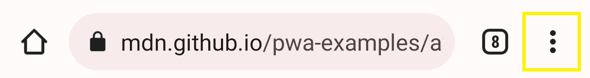
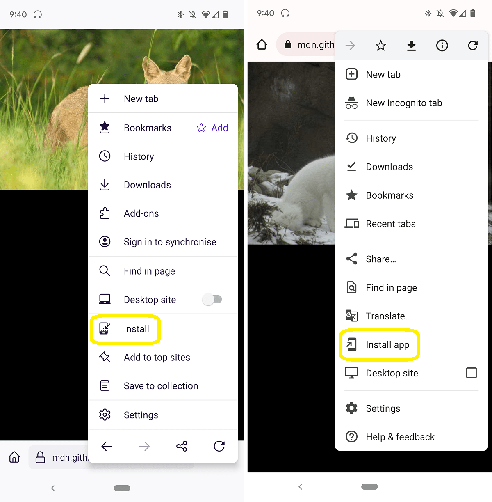
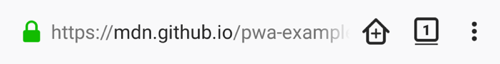
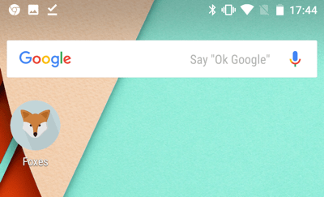
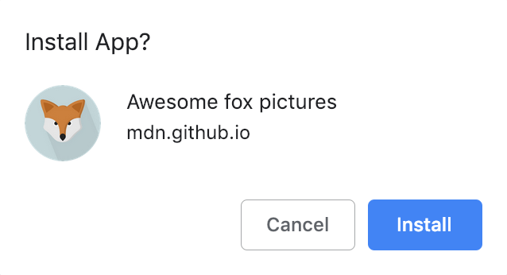
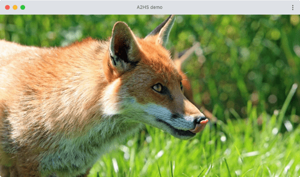

Add to Home screen (or A2HS for short) is a feature available in modern browsers that allows a user to "install" a web app, i.e. add a shortcut to their Home screen representing their favorite web app (or site) so they can subsequently access it with a single tap. This guide explains how A2HS is used, and what you need to do as a developer to allow your users to take advantage of it.

## Why A2HS?

A2HS is thought to be part of the [Progressive Web App](/en-US/docs/Web/Progressive_web_apps) philosophy — giving web apps the same user experience advantages as native apps so they can compete in today's ecosystem wars. Part of this is the simple gesture of accessing an app by tapping its icon on your Home screen, and then having it appear neatly in its own window. A2HS makes this possible.

## What browsers support A2HS?

A2HS is supported in all mobile browsers, except iOS webview. It's also supported in some Chromium desktop browsers.

Firefox has had mobile support [since v58](/en-US/docs/Mozilla/Firefox/Releases/58#other).

See [caniuse.com](https://caniuse.com/#feat=web-app-manifest) for exact details.

## How do you use it?

We've written a very simple example web site ([see our demo live](https://mdn.github.io/pwa-examples/a2hs/), and also [see the source code](https://github.com/mdn/pwa-examples/tree/master/a2hs)) that doesn't do much, but was developed with the necessary code to allow it to be added to a Home screen, as well as a service worker to enable it to be used offline. The example displays a series of fox pictures.

If you have either Firefox for Android or Chrome for Android available, use it to navigate to our [demo](https://mdn.github.io/pwa-examples/a2hs/) (the URL bar appears on the top in Chrome and at the bottom in Firefox).



Open the menu next to the URL bar.
Depending on whether you're using Chrome or Android you'll see a menu option "Install" or "Install App".
This is the "Add to Home screen" option displayed for any site that has the necessary features in place.



> **Note:** On older browser versions you may see a "home" icon with a plus (+) icon inside it.
> This does the same thing!
>
> 

Selecting the option will start the process of adding the application to the home screen.

This process may differ slightly depending on the browser, mobile device operating system, and even the device.
For example, Firefox on Android on a Google Pixel 3 will display the Pixel launcher.


> **Note:** You can find out a lot more about Chrome install banners from the article [How to provide your own in-app install experience](https://web.dev/customize-install/).

Regardless of which browser you are using, when you choose to add the app to your Home screen, you'll see it appear along with a short title, in the same way that native apps do.



Tapping this icon opens it up, but as a fullscreen app, you'll no longer see the browser UI around it.

## How do you make an app A2HS-ready?

To enable your app to be added to a Home screen, it needs the following:

- To be served over HTTPs — the web is increasingly being moved in a more secure direction, and many modern web technologies (A2HS included) will work only on secure contexts.
- To have a manifest file with the correct fields filled in, linked from the HTML head.
- To have an appropriate icon available for displaying on the Home screen.
- Chrome additionally requires the app to have a service worker registered (e.g., so it can function when offline).

### Manifest

The web manifest is written in standard JSON format and should be placed somewhere inside your app directory (in the root is probably best) with the name `somefilename.webmanifest` (we've chosen `manifest.webmanifest`). It contains multiple fields that define certain information about the web app and how it should behave.

> **Note:** The `.webmanifest` extension is specified in the [Media type registration](https://w3c.github.io/manifest/#media-type-registration) section of the specification, but generally browsers will support manifests with other appropriate extensions, e.g. `.json`.

The fields needed for A2HS are as follows:

- `background_color`: Specifies a background color to be used in some app contexts. The most relevant one to A2HS is the splash screen displayed when the app icon on the Home screen is tapped and it first starts to load (this currently appears only when apps have been added to the Home screen by Chrome).
- `display`: Specifies how the app should be displayed. To make it feel like a distinct app (and not just a web page), you should choose a value such as `fullscreen` (no UI is shown at all) or `standalone` (very similar, but system-level UI elements such as the status bar might be visible).
- `icons`: Specifies icons for the browser to use when representing the app in different places (such as on the task switcher, or more important, the Home screen). We've included only one in our demo.
- `name`/`short_name`: These fields provide an app name to be displayed when representing the app in different places. `name` provides the full app name, and `short_name` provides a shortened name to be used when there is insufficient space to display the full name. You are advised to provide both if your app's name is particularly long.
- `start_url`: Provides a path to the asset that should be loaded when the added-to-Home screen app is launched. Note that this has to be a relative URL pointing to the site index, relative to the URL of the manifest. Also, be aware that Chrome requires this before it will display the install banner, whereas Firefox doesn't require it for showing the home-with-a-plus icon.

The manifest for our sample app looks like this:

```json
{
  "background_color": "purple",
  "description": "Shows random fox pictures. Hey, at least it isn't cats.",
  "display": "fullscreen",
  "icons": [
    {
      "src": "icon/fox-icon.png",
      "sizes": "192x192",
      "type": "image/png"
    }
  ],
  "name": "Awesome fox pictures",
  "short_name": "Foxes",
  "start_url": "/pwa-examples/a2hs/index.html"
}
```

### Appropriate icon

As shown in the above manifest listing, we are including a 192 x 192 px icon for use in our app. You can include more sizes if you want; Android will choose the most appropriate size for each different use case. You could also decide to include different types of icons so devices can use the best one they are able to (e.g., Chrome already supports the WebP format).

Note that the `type` member in each icon's object specifies the icon's mimetype, so the browser can quickly read what type the icon is, and then ignore it and move to a different icon if it doesn't support it.

In terms of how to design the icon, you should follow the same best practices you'd follow for any Android icon (see the [Google Play icon design specifications](https://developer.android.com/distribute/google-play/resources/icon-design-specifications)).

### Link the HTML to the manifest

To finish setting up your manifest, you need to reference it from the HTML of your application's home page:

```html
<link rel="manifest" href="manifest.webmanifest">
```

Browsers that support A2HS will know where to look for your manifest once this is in place.

## What does A2HS not give you?

Bear in mind that when you add an app to your Home screen, it just makes the app easily accessible — it doesn't download the app's assets and data to your device and make the app available offline, or anything like that. To make your app work offline, you have to use the [Service Worker API](/en-US/docs/Web/API/Service_Worker_API) to handle storing the assets offline, and if required, [Web storage](/en-US/docs/Web/API/Web_Storage_API) or [IndexedDB](/en-US/docs/Web/API/IndexedDB_API) to store its data.

In our example app, we've just used a service worker to store all necessary files. The service worker is registered against the site with the final code block in the [`index.js`](https://github.com/mdn/pwa-examples/blob/master/a2hs/index.js) file. We then cache all the site's assets using the [Cache API](/en-US/docs/Web/API/Cache), and serve them from the cache instead of the network using the code in the [sw.js](https://github.com/mdn/pwa-examples/blob/master/a2hs/sw.js) file.

## A2HS on desktop

While originally intended to improve user experience on mobile OSes, there is movement to make PWAs installable on desktop platforms too.

> **Note:** At the time of writing, the functionality described below was only supported in newer versions of Chrome — by default on Windows, and behind the `#enable-desktop-pwas` flag on macOS.

### Adding an install button

To make our PWA installable on desktop, we first added a button to our document to allow users to do the installation — this isn't made available automatically on desktop apps, and the installation needs to be triggered by a user gesture:

```html
<button class="add-button">Add to home screen</button>
```

We then gave it some simple styling:

```css
.add-button {
  position: absolute;
  top: 1px;
  left: 1px;
}
```

### JavaScript for handling the install

At the bottom of our [`index.js` file](https://github.com/mdn/pwa-examples/blob/master/a2hs/index.js), we added some JavaScript to handle the installation. First of all, we declare a `deferredPrompt` variable (which we'll explain later on), get a reference to our install button, and set it to `display: none` initially:

```js
let deferredPrompt;
const addBtn = document.querySelector('.add-button');
addBtn.style.display = 'none';
```

We hide the button initially because the PWA will not be available for install until it follows the A2HS criteria. When this happens, supporting browsers will fire a `beforeinstallprompt` event. We can then use a handler like the one below to handle the installation:

```js
window.addEventListener('beforeinstallprompt', (e) => {
  // Prevent Chrome 67 and earlier from automatically showing the prompt
  e.preventDefault();
  // Stash the event so it can be triggered later.
  deferredPrompt = e;
  // Update UI to notify the user they can add to home screen
  addBtn.style.display = 'block';

  addBtn.addEventListener('click', (e) => {
    // hide our user interface that shows our A2HS button
    addBtn.style.display = 'none';
    // Show the prompt
    deferredPrompt.prompt();
    // Wait for the user to respond to the prompt
    deferredPrompt.userChoice.then((choiceResult) => {
        if (choiceResult.outcome === 'accepted') {
          console.log('User accepted the A2HS prompt');
        } else {
          console.log('User dismissed the A2HS prompt');
        }
        deferredPrompt = null;
      });
  });
});
```

So here we:

- Call {{domxref("Event.preventDefault()")}} to stop Chrome 67 and earlier from calling the install prompt automatically (this behavior changed in Chrome 68).
- Store the event object in the `deferredPrompt` variable so it can be used later on to perform the actual installation.
- Set the button to `display: block` so it appears in the UI for the user to click.
- Set a `click` handler for the button.

The click handler contains the following steps:

- Hide the button again with `display: none` — it is no longer needed once the app is installed.
- Use the `prompt()` method available on the `beforeinstallprompt` event object (stored in `deferredPrompt`) to trigger showing the install prompt.
- Respond to the user's interaction with the prompt using the `userChoice` property, again available on the `beforeinstallprompt` event object.
- Set `deferredPrompt` to null since it is no longer needed.

So when the button is clicked, the install prompt appears.



If the user selects _Install_, the app is installed (available as standalone desktop app), and the Install button no longer shows (the `onbeforeinstallprompt` event no longer fires if the app is already installed). When you open the app, it will appear in its own window:



If the user selects _Cancel_, the state of the app goes back to how it was before the button was clicked.

> **Note:** The code for this section was mostly taken from [How to provide your own in-app install experience](https://web.dev/customize-install/) by Pete LePage.

## See also

- [Progressive web apps](/en-US/docs/Web/Progressive_web_apps)
- [Service Worker API](/en-US/docs/Web/API/Service_Worker_API)
- [Web manifest reference](/en-US/docs/Web/Manifest)

{{QuickLinksWithSubpages("/en-US/docs/Web/Progressive_web_apps/")}}
