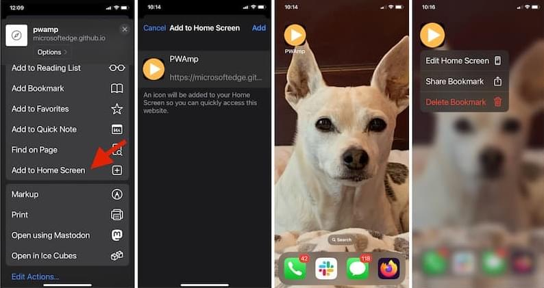
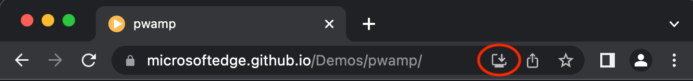
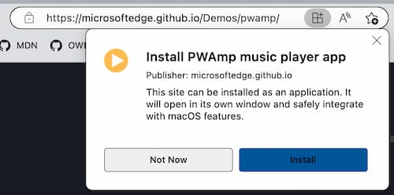
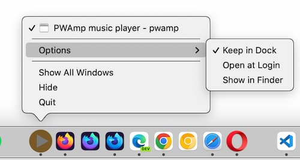
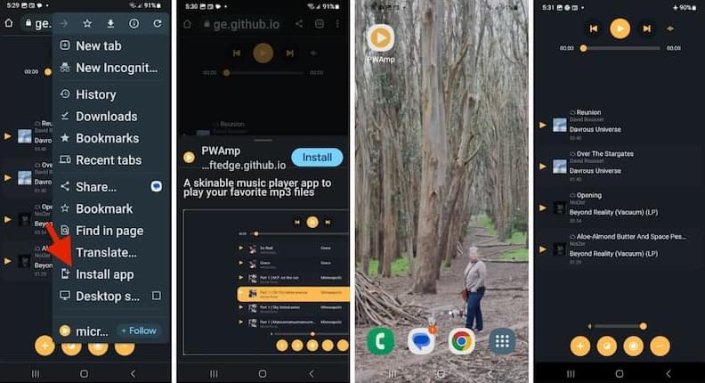
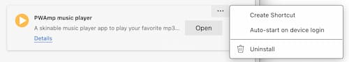

{{PWASidebar}}

This guide covers how users can install and uninstall PWAs on their devices. If you want to learn about making a web app installable as a PWA, see [Making PWAs installable](/en-US/docs/Web/Progressive_web_apps/Guides/Making_PWAs_installable) instead.

## History of web app installation

Browsers have always enabled saving shortcuts to websites, known as "bookmarking." These are just links to websites.

Some operating systems (OS) have enhanced bookmarking capabilities, enabling saving bookmarks to common places, such as the home screen or taskbar, with an icon launching the site in the OS's default browser. For many websites, this is also just a link to the site. If the site is a [Progressive Web Applications (PWA)](/en-US/docs/Web/Progressive_web_apps), saving to home screen installs the PWA on the user's device, fully integrating it into the operating systems like native applications on most devices. Just like PWAs can be installed, they can also be uninstalled.

We'll first cover the precursors — saving links to websites.

### Bookmarking websites

All browsers have add-to-favorites bookmark functionality. A bookmark, or favorite, is a clickable shortcut for a web page. Bookmarks enable quick access to websites without the user having to enter a URL or otherwise search for content. Bookmarking is especially useful for long URLs and accessing frequently visited content that is not the site's homepage.

All browsers enable users to view and manage their bookmarks, including renaming and deleting favorites. By default, the bookmark's display includes the text content of the bookmarked page's {{HTMLElement("title")}} element along with an icon consisting of the site's [favicon](/en-US/docs/Glossary/Favicon).

Browsers enable saving, editing, moving, deleting, and otherwise managing bookmarks. The UI for bookmark management differs by browser.

### Add to home screen

Smartphones, starting with the iPhone in 2007, added "save to home screen" functionality. For regular (non-PWA) websites, this feature is similar to bookmarks, but instead of adding the favicon and title of the page to the bookmarks menu — a browser feature — favoriting in this manner [adds an icon](/en-US/docs/Learn/HTML/Introduction_to_HTML/The_head_metadata_in_HTML#adding_custom_icons_to_your_site) to the OS's home screen.

Adding a non-PWA site to the home screen does not install the website on the device. Rather, it adds the developer-defined icon to the home screen, that, when clicked, opens the bookmarked link in the default browser.

If the site added to the home screen is a PWA, the PWA will be installed on the device.

Deleting the icon from the home screen removes the bookmark. The deletion confirmation provides information as to whether deleting the icon deletes a bookmark or entire application.

## Installing and uninstalling PWAs

While installing a PWA only takes a couple of clicks, depending on the web application features, the result of installing a PWA usually goes well beyond creating a link to a page on the Internet; installing a PWA more deeply integrates the web application on the user's device.

Depending on the PWA, device, and features of the operating system and browser, installing a PWA may enable native-like features, such as giving the app its own standalone window or registering it as a file handler. This also means uninstalling a PWA, which also only requires a couple of clicks, does more than just removing the PWA's icon.

### Installing PWAs

The UI for installing a PWA from the web varies from one browser to another, and from one platform to another.

The user interface for installing PWAs differs by device and OS combination. The "Add to homes screen" user interface installs the PWA on Safari on iOS. Other browsers, including Chrome for Android, include the app installation command in the browser setting menu. In Chrome and Edge on desktop, when the user navigates to the page, if the page is a PWA and the PWA is not currently installed by the browser, an installation icon will be visible in the URL bar:

When the user selects the icon, the browser displays a prompt asking if they want to install the PWA, and if they accept, the PWA is installed.

Once installed, the PWA will behave like other applications that are installed on the OS. For example, on macOS, the icon will appear in the dock, and will have the same icon options as other applications:

On most desktop browsers, the install prompt is in the URL bar. On mobile, the install prompt is generally found in the menu of browser options. No matter the browser or OS, the installation needs to be confirmed.

Once installed, the PWA behaves just like other installed applications: clicking on the application icon opens the PWA, even when the user is offline.

Installation is supported on all modern desktop and mobile devices. Whether the PWA can be installed by the browser on the operating system differs by browser/operating system combination. Most browsers support installing PWAs on all operating systems—Chrome OS, MacOS, Windows, Android, Linux, etc.—directly or when an extension is installed.

Firefox requires a [PWA extension](https://addons.mozilla.org/en-US/firefox/addon/pwas-for-firefox/).

Apple is unique when it comes to PWAs: PWAs can be installed on macOS from any browser **except** Safari. The opposite is true for iOS versions before 16.4, where PWAs could **only** be installed in Safari. PWAs can be installed on iOS/iPadOS 16.4 or later from any supporting browser.

When an installed PWA is launched, it can be displayed in its own standalone window (without the full browser UI) but it still effectively runs in a browser window, even if the usual browser UI elements, such as the address bar or back button, aren't visible. The application will be found where the OS saves other applications, within a folder specific to the browser.

PWAs installed by a browser remain specific to this browser. This means that the browser that was used to install a PWA is the one used to run that PWA. It also means that you can install the same PWA from a different browser and that the two apps will behave as two different instances and will not share any data.

The browser used to install the PWA will know the PWA is installed, but other browsers will not have access to the installed status. For example, if you install a PWA using MS Edge, Edge will prompt you to open the PWA when you visit the site while Chrome will continue to prompt you to install the application. If you install the PWA using Chrome as well, you will have two copies of the PWA. When multiple instances of a PWA are open, data is not shared between instances installed from different browsers.

When you tap the web app's icon, it opens up in the browser environment that installed the PWA, generally without the browser's UI around it, though that depends on the way the developer configured the [web app manifest](/en-US/docs/Web/Manifest). Similarly, the method used to uninstall the PWA depends on the browser that was used to install it.

### Uninstalling

On most mobile operating systems, uninstalling a PWA is accomplished in the same way as uninstalling other applications. On some mobile operating systems, PWAs appear in the same control panel where applications downloaded from app stores are managed and can be uninstalled there.

On iOS, PWAs installed from Safari are listed and searchable from the "App Library" screen, but are not listed along with other installed applications under "Settings". On iOS, long tapping an icon surfaces the delete bookmark UI; removing the icon from the home screen deletes the PWA.

In some desktop operating systems, uninstalling a PWA can be done directly in opened PWA. To uninstall, open the PWA. In the top right corner of the opened app, there will be an icon that must be expanded to see more tools. Depending on the browser used to install the PWA, there will either be a link to uninstall the PWA, or a settings link that opens the browser's settings page with an uninstall link. Either click on the uninstall option in the drop-down menu, if there, or navigate to the app settings in a browser tab and click uninstall.

Selecting app setting from the opened drop-down menu in Edge, opened the MS Edge browser `edge://apps` tab. There we are provided a list of installed applications with options for each, including `🗑️ Uninstall`. Confirm the uninstall. That's it!

In Edge, the installed PWAs are listed and can be managed by visiting [`edge://apps`](https://blogs.windows.com/msedgedev/2022/05/18/find-and-manage-your-installed-apps-and-sites/) in your Edge browser. In Chrome, the list of Google Apps and installed PWAs are viewable and managed by visiting `chrome://apps` in your Chrome browser.

## See also

- [Using PWAs in Chrome: computer and Android](https://support.google.com/chrome/answer/9658361)
- [Install, manage, or uninstall apps in Microsoft Edge](https://support.microsoft.com/en-us/topic/install-manage-or-uninstall-apps-in-microsoft-edge-0c156575-a94a-45e4-a54f-3a84846f6113)
