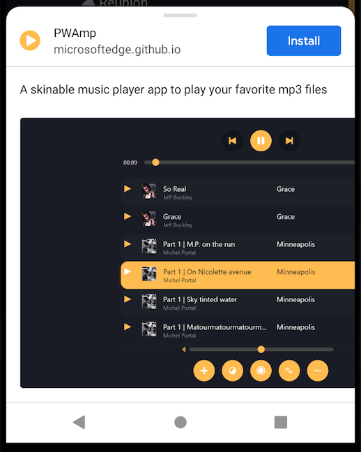

{{PWASidebar}}

One of the defining aspects of a PWA is that it can be promoted by the browser for installation on the device. Once installed, a PWA appears to users as a platform-specific app, a permanent feature of their device which they can launch directly from the operating system like any other app.

We can summarize this as follows:

- Supporting browsers promote the PWA to the user for installation on the device.
- The PWA can be installed like a platform-specific app, and can customize the install process.
- Once installed, the PWA gets an app icon on the device, alongside platform-specific apps.
- Once installed, the PWA can be launched as a standalone app, rather than a website in a browser.

We'll discuss each of these features in this guide. First, though, we'll discuss the requirements that a web app must meet for it to be promoted for installation.

## Installability

For a web app to be promoted for installation by a supporting browser, it needs to meet some technical requirements. We can consider these the minimum requirements for a web app to be a PWA.

> [!NOTE]
> While not a requirement for a PWA to be installable, many PWAs use [service workers](/en-US/docs/Web/API/Service_Worker_API) to provide an offline experience.
> See the [CycleTracker: Service workers](/en-US/docs/Web/Progressive_web_apps/Tutorials/CycleTracker/Service_workers) tutorial for more information.

### The web app manifest

A web app manifest is a JSON file that tells the browser how the PWA should appear and behave on the device. For a web app to be a PWA it must be installable, and for it to be installable it must include a manifest.

The manifest is included using a {{HTMLElement("link")}} element in the app's HTML:

```html
<!doctype html>
<html lang="en">
  <head>
    <link rel="manifest" href="manifest.json" />
    <!-- ... -->
  </head>
  <body></body>
</html>
```

If the PWA has more than one page, every page must reference the manifest in this way.

The manifest contains a single JSON object containing a collection of members, each of which defines some aspect of the PWA's appearance or behavior. Here's a rather minimal manifest, containing just two members: `"name"` and `"icons"`.

```json
{
  "name": "My PWA",
  "icons": [
    {
      "src": "icons/512.png",
      "type": "image/png",
      "sizes": "512x512"
    }
  ]
}
```

#### Required manifest members

Chromium-based browsers, including Google Chrome, Samsung Internet, and Microsoft Edge, require that the manifest includes the following members:

- [`name`](/en-US/docs/Web/Manifest/Reference/name) or [`short_name`](/en-US/docs/Web/Manifest/Reference/short_name)
- [`icons`](/en-US/docs/Web/Manifest/Reference/icons) must contain a 192px and a 512px icon
- [`start_url`](/en-US/docs/Web/Manifest/Reference/start_url)
- [`display`](/en-US/docs/Web/Manifest/Reference/display) and/or [`display_override`](/en-US/docs/Web/Manifest/Reference/display_override)
- [`prefer_related_applications`](/en-US/docs/Web/Manifest/Reference/prefer_related_applications) must be `false` or not present

For a full description of every member, see the [Web app manifest](/en-US/docs/Web/Manifest) reference documentation.

### HTTPS, localhost, or loopback are required

For a PWA to be installable it must be served using the `https` protocol, or from a local development environment using `localhost` or `127.0.0.1` — with or without a port number.

This is a more stringent requirement than [secure context](/en-US/docs/Web/Security/Secure_Contexts), which considers resources loaded from `file://` URLs to be secure.

## Installation from an app store

Users expect to find apps in the app store for their platform, like the Google Play Store or the Apple App Store.

If your app meets the installability prerequisites, you can package it and distribute it through app stores. The process is specific to each app store:

- [How to publish a PWA to the Google Play Store](https://chromeos.dev/en/publish/pwa-in-play)
- [How to publish a PWA to the Microsoft Store](https://learn.microsoft.com/en-us/microsoft-edge/progressive-web-apps-chromium/how-to/microsoft-store)
- [How to publish a PWA to the Meta Quest Store](https://developers.meta.com/horizon/documentation/web/pwa-submit-app/)

The [PWABuilder](https://docs.pwabuilder.com/#/builder/quick-start) is a tool to simplify the process of packaging and publishing a PWA for various app stores. It supports the Google Play Store, Microsoft Store, Meta Quest Store, and iOS App Store.

If you have added your app to the app store, users can install it from there, just like a platform-specific app.

## Installation from the web

When a supporting browser determines that a web app meets the installability criteria described earlier, it will promote the app to the user for installation. The user will be offered the chance to install the app. This means you can distribute your PWA as a website, making it discoverable through web search, and also distribute it in app stores, so users can find it there.

This is a great example of the way PWAs can offer you the best of both worlds. It's also a good example of how progressive enhancement works with PWAs: if a user encounters your PWA on the web, using a browser that can't install it, they can use it just like a normal website.

The UI for installing a PWA from the web varies from one browser to another, and from one platform to another. For example, a browser might include an "Install" icon in the URL bar when the user navigates to the page:


When the user selects the icon, the browser displays a prompt asking if they want to install the PWA, and if they accept, the PWA is installed.

The prompt displays the name and icon for the PWA, taken from the [`name`](/en-US/docs/Web/Manifest/Reference/name) and [`icons`](/en-US/docs/Web/Manifest/Reference/icons) manifest members.

### Browser support

Support for PWA installation promotion from the web varies by browser and by platform.

On desktop:

- Chromium browsers support installing PWAs that have a manifest file on all supported desktop operating systems.
- Firefox and Safari do not support installing PWAs using a manifest file.

On mobile:

- On Android, Firefox, Chrome, Edge, Opera, and Samsung Internet Browser all support installing PWAs.
- On iOS 16.3 and earlier, PWAs can only be installed with Safari.
- On iOS 16.4 and later, PWAs can be installed from the Share menu in Safari, Chrome, Edge, Firefox, and Orion.

### Installing sites as apps

Chrome for desktop and Android, Safari for desktop, and Edge for desktop also support users installing any website as an app, whether or not it has a manifest file, and without regard to the installability criteria for the manifest file.
The benefit of using a manifest file is that the browser will actively promote the site for installation when it is visited, and developers can customize installation behavior.

### Triggering the install prompt

A PWA can provide its own in-page UI for the user to open the install prompt, instead of relying on the UI provided by the browser by default. This enables a PWA to provide some context and a reason for the user to install the PWA, and can help make the install user flow easier to discover.

This technique relies on the [`beforeinstallprompt`](/en-US/docs/Web/API/Window/beforeinstallprompt_event) event, which is fired on the global [`Window`](/en-US/docs/Web/API/Window) object as soon as the browser has determined that the PWA is installable. This event has a [`prompt()`](/en-US/docs/Web/API/BeforeInstallPromptEvent/prompt) method that shows the install prompt. So a PWA can:

- add its own "Install" button
- listen for the `beforeinstallprompt` event
- cancel the event's default behavior by calling [`preventDefault()`](/en-US/docs/Web/API/Event/preventDefault)
- in the event handler for its own "Install" button, call [`prompt()`](/en-US/docs/Web/API/BeforeInstallPromptEvent/prompt).

This is not supported on iOS.

### Customizing the installation prompt

By default, the install prompt contains the name and icon for the PWA. If you provide values for the [`description`](/en-US/docs/Web/Manifest/Reference/description) and [`screenshots`](/en-US/docs/Web/Manifest/Reference/screenshots) manifest members, then, on Android only, these values will be shown in the install prompt, giving the user extra context and motivation to install the PWA.

The screenshot below shows what the install prompt for the [PWAmp demo](https://github.com/MicrosoftEdge/Demos/tree/main/pwamp) looks like on Google Chrome, running on Android:



## Launching the app

Once the PWA is installed, its icon is shown on the device alongside any other apps that the user has installed, and clicking the icon launches the app.

You can use the [`display`](/en-US/docs/Web/Manifest/Reference/display) manifest member to control the _display mode_: that is, how the PWA appears when it is launched. In particular:

- `"standalone"` indicates that the PWA should look and feel like a platform-specific application, with no browser UI elements
- `"browser"` indicates that the PWA should be opened as a new browser tab or window, just like a normal website.

If the browser does not support a given display mode, `display` will fall back to a supported display mode according to a predefined sequence. The [`display_override`](/en-US/docs/Web/Manifest/Reference/display_override) enables you to redefine the fallback sequence.
