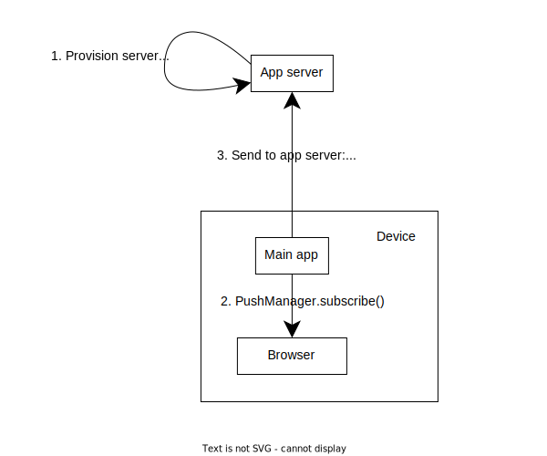
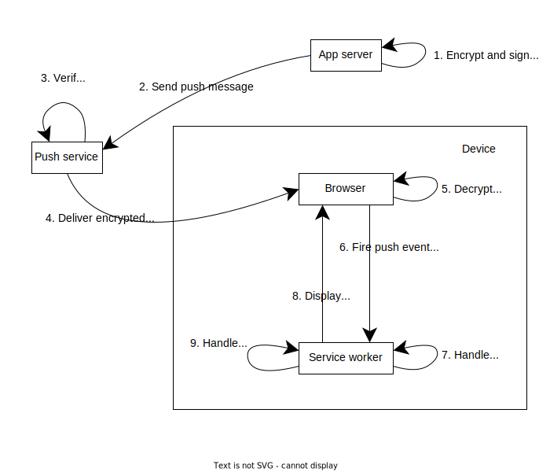

{{PWASidebar}}

Usually, websites are very dependent on both reliable network connectivity and on the user having their pages open in a browser. Without network connectivity, most websites are just unusable, and if the user does not have the site open in a browser tab, most websites are unable to do anything.

However, consider the following scenarios:

- A music app enables the user to stream music while online, but can download tracks in the background and then continue to play while the user is offline.
- The user composes a long email, presses "Send", and then loses network connectivity. The device sends the email in the background, as soon as the network is available again.
- The user's chat app receives a message from one of their contacts, and although the app is not open, it displays a badge on the app icon to let the user know they have a new message.

These are the kinds of features that users expect from installed apps. In this guide, we'll introduce a set of technologies that enable a PWA to:

- Provide a good user experience even when the device has intermittent network connectivity
- Update its state when the app is not running
- Notify the user about important events that have happened while the app was not running

The technologies introduced in this guide are:

- [Service Worker API](/en-US/docs/Web/API/Service_Worker_API)
- [Background Synchronization API](/en-US/docs/Web/API/Background_Synchronization_API)
- [Background Fetch API](/en-US/docs/Web/API/Background_Fetch_API)
- [Periodic Background Synchronization API](/en-US/docs/Web/API/Web_Periodic_Background_Synchronization_API)
- [Push API](/en-US/docs/Web/API/Push_API)
- [Notifications API](/en-US/docs/Web/API/Notifications_API)

## Websites and workers

The foundation of all the technologies we'll discuss in this guide is the _service worker_. In this section we'll provide a little background about workers and how they change the architecture of a web app.

Normally, an entire website runs in a single thread. This includes the website's own JavaScript, and all the work to render the website's UI. One consequence of this is that if your JavaScript runs some long-running operation, the website's main UI is blocked, and the website appears unresponsive to the user.

A [service worker](/en-US/docs/Web/API/Service_Worker_API) is a specific type of [web worker](/en-US/docs/Web/API/Web_Workers_API) that's used to implement PWAs. Like all web workers, a service worker runs in a separate thread to the main JavaScript code. The main code creates the worker, passing in a URL to the worker's script. The worker and the main code can't directly access each other's state, but can communicate by sending each other messages. Workers can be used to run computationally expensive tasks in the background: because they run in a separate thread, the main JavaScript code in the app, that implements the app's UI, can stay responsive to the user.

So a PWA always has a high level architecture split between:

- The _main app_, with the HTML, CSS, and the part of the JavaScript that implements the app's UI (by handling user events, for example)
- The _service worker_, which handles offline and background tasks

In this guide, when we show code samples, we'll indicate which part of the app the code belongs in with a comment like `// main.js` or `// service-worker.js`.

## Offline operation

Offline operation allows a PWA to provide a good user experience even when the device does not have network connectivity. This is enabled by adding a service worker to an app.

A service worker _controls_ some or all of the app's pages. When the service worker is installed, it can fetch the resources from the server for the pages it controls (including pages, styles, scripts, and images, for example) and add them to a local cache. The {{domxref("Cache")}} interface is used to add resources to the cache. `Cache` instances are accessible through the {{domxref("caches")}} property in the service worker global scope.

Then whenever the app requests a resource (for example, because the user opened the app or clicked an internal link), the browser fires an event called {{domxref("ServiceWorkerGlobalScope.fetch_event", "fetch")}} in the service worker's global scope. By listening for this event, the service worker can intercept the request.

The event handler for the `fetch` event is passed a {{domxref("FetchEvent")}} object, which:

- Provides access to the request as a {{domxref("Request")}} instance
- Provides a {{domxref("FetchEvent.respondWith", "respondWith()")}} method to send a response to the request.

One way a service worker can handle requests is a "cache-first" strategy. In this strategy:

1. If the requested resource exists in the cache, get the resource from the cache and return the resource to the app.
2. If the requested resource does not exist in the cache, try to fetch the resource from the network.
   1. If the resource could be fetched, add the resource to the cache for next time, and return the resource to the app.
   2. If the resource could not be fetched, return some default fallback resource.

The following code sample shows an implementation of this:

```js
// service-worker.js

const putInCache = async (request, response) => {
  const cache = await caches.open("v1");
  await cache.put(request, response);
};

const cacheFirst = async ({ request, fallbackUrl }) => {
  // First try to get the resource from the cache.
  const responseFromCache = await caches.match(request);
  if (responseFromCache) {
    return responseFromCache;
  }

  // If the response was not found in the cache,
  // try to get the resource from the network.
  try {
    const responseFromNetwork = await fetch(request);
    // If the network request succeeded, clone the response:
    // - put one copy in the cache, for the next time
    // - return the original to the app
    // Cloning is needed because a response can only be consumed once.
    putInCache(request, responseFromNetwork.clone());
    return responseFromNetwork;
  } catch (error) {
    // If the network request failed,
    // get the fallback response from the cache.
    const fallbackResponse = await caches.match(fallbackUrl);
    if (fallbackResponse) {
      return fallbackResponse;
    }
    // When even the fallback response is not available,
    // there is nothing we can do, but we must always
    // return a Response object.
    return new Response("Network error happened", {
      status: 408,
      headers: { "Content-Type": "text/plain" },
    });
  }
};

self.addEventListener("fetch", (event) => {
  event.respondWith(
    cacheFirst({
      request: event.request,
      fallbackUrl: "/fallback.html",
    }),
  );
});
```

This means that in many situations, the web app will function well even if network connectivity is intermittent. From the point of view of the main app code, it is completely transparent: the app just makes network requests and gets responses. Also, because the service worker is in a separate thread, the main app code can stay responsive to user input while resources are fetched and cached.

> **Note:** The strategy described here is just one way a service worker could implement caching. Specifically, in a cache first strategy, we check the cache first before the network, meaning that we are more likely to return a quick response without incurring a network cost, but are more likely to return a stale response.
>
> An alternative would be a _network first_ strategy, in which we try to fetch the resource from the server first, and fall back to the cache if the device is offline.
>
> The optimal caching strategy is dependent on the particular web app and how it is used.

For much more detail about setting up service workers and using them to add offline functionality, see our [guide to using service workers](/en-US/docs/Web/API/Service_Worker_API/Using_Service_Workers).

## Background operation

While offline operations are the most common use for service workers, they also enable a PWA to operate even while the main app is closed. This is possible because the service worker can run while the main app is not running.

This doesn't mean service workers run all the time: browsers may stop service workers when they think it is appropriate. For example, if a service worker has been inactive for a while, it will be stopped. However, the browser will restart the service worker when an event has happened that it needs to take care of. This enables a PWA to implement background operations in the following way:

- In the main app, register a request for the service worker to perform some operation
- At the appropriate time, the service worker will be restarted if necessary, and an event will fire in the service worker's scope
- The service worker will perform the operation

In the next sections, we'll discuss a few different features that use this pattern to enable a PWA to work while the main app isn't open.

## Background sync

Suppose a user composes an email and presses "Send". In a traditional website, they must keep the tab open until the app has sent the email: if they close the tab, or the device loses connectivity, then the message will not be sent. Background sync, defined in the [Background Synchronization API](/en-US/docs/Web/API/Background_Synchronization_API), is the solution to this problem for PWAs.

Background sync enables the app to ask its service worker to perform a task on its behalf. As soon as the device has network connectivity, the browser will restart the service worker, if necessary, and fire an event named [`sync`](/en-US/docs/Web/API/ServiceWorkerGlobalScope/sync_event) in the service worker's scope. The service worker can then attempt to execute the task. If the task can't be completed, then the browser may retry a limited number of times by firing the event again.

### Registering a sync event

To ask the service worker to perform a task, the main app can access {{domxref("ServiceWorkerContainer/ready", "navigator.serviceWorker.ready")}}, which resolves with a {{domxref("ServiceWorkerRegistration")}} object. The app then calls {{domxref("SyncManager/register", "sync.register()")}} on the `ServiceWorkerRegistration` object, like this:

```js
// main.js

async function registerSync() {
  const swRegistration = await navigator.serviceWorker.ready;
  swRegistration.sync.register("send-message");
}
```

Note that the app passes a name for the task: `"send-message"` in this case.

### Handling a sync event

As soon as the device has network connectivity, the `sync` event fires in the service worker scope. The service worker checks the name of the task and runs the appropriate function, `sendMessage()` in this case:

```js
// service-worker.js

self.addEventListener("sync", (event) => {
  if (event.tag == "send-message") {
    event.waitUntil(sendMessage());
  }
});
```

Note that we pass the result of the `sendMessage()` function into the event's {{domxref("ExtendableEvent/waitUntil", "waitUntil()")}} method. The `waitUntil()` method takes a {{jsxref("Promise")}} as a parameter and asks the browser not to stop the service worker until the promise has settled. This is also how the browser knows whether the operation succeeded or not: if the promise rejects, then the browser may retry by firing the `sync` event again.

The `waitUntil()` method is not a guarantee that the browser will not stop the service worker: if the operation takes too long, the service worker will be stopped anyway. If this happens, then the operation is aborted, and next time a `sync` event is fired, then the handler runs again from the start - it does not resume from where it left off.

How long is "too long" is browser-specific. For Chrome, the service worker is likely to be closed if:

- It has been idle for 30 seconds
- It has been running synchronous JavaScript for 30 seconds
- The promise passed to `waitUntil()` has taken more than 5 minutes to settle

## Background fetch

Background sync is useful for relatively short background operations, but as we just saw: if a service worker doesn't finish handling a sync event in a relatively short time, the browser will stop the service worker. This is an intentional measure to conserve battery life and protect the user's privacy by minimizing the time for which the user's IP address is exposed to the server while the app is in the background.

This makes background sync unsuitable for longer operations - downloading a movie, for example. For this scenario, you need the [Background Fetch API](/en-US/docs/Web/API/Background_Fetch_API). With background fetch, network requests can be performed while both the main app UI and the service worker are closed.

With background fetch:

- The request is initiated from the main app UI
- Whether or not the main app is open, the browser displays a persistent UI element that notifies the user about the ongoing request, and enables them to cancel it or check its progress
- When the request is completed with success or failure, or the user has asked to check the request's progress, then the browser starts the service worker (if necessary) and fires the appropriate event in the service worker's scope.

### Making a background fetch request

A background fetch request is initiated in the main app code, by calling {{domxref("BackgroundFetchManager/fetch", "backgroundFetch.fetch()")}} on the `ServiceWorkerRegistration` object, like this:

```js
// main.js

async function requestBackgroundFetch(movieData) {
  const swRegistration = await navigator.serviceWorker.ready;
  const fetchRegistration = await swRegistration.backgroundFetch.fetch(
    "download-movie",
    ["/my-movie-part-1.webm", "/my-movie-part-2.webm"],
    {
      icons: movieIcons,
      title: "Downloading my movie",
      downloadTotal: 60 * 1024 * 1024,
    },
  );
  //...
}
```

We're passing three arguments into `backgroundFetch.fetch()`:

1. An identifier for this fetch request
2. An array of {{domxref("Request")}} objects or URLs. A single background fetch request can include multiple network requests.
3. An object containing data for the UI that the browser uses to show the existence and progress of the request.

The `backgroundFetch.fetch()` call returns a {{jsxref("Promise")}} that resolves to a {{domxref("BackgroundFetchRegistration")}} object. This enables the main app to update its own UI as the request progresses. However, if the main app is closed, the fetch will continue in the background.

The browser will display a persistent UI element reminding the user that the request is ongoing, giving them the chance to find out more about the request and cancel it if they wish. The UI will include an icon and title taken from the `icons` and `title` arguments, and uses `downloadTotal` as an estimate of the total download size, to show the request's progress.

### Handling request outcomes

When the fetch has finished with success or failure, or the user has clicked the progress UI, then the browser starts the app's service worker, if necessary, and fires an event in the service worker's scope. The following events can be fired:

- `backgroundfetchsuccess`: all requests were successful
- `backgroundfetchfail`: at least one request failed
- `backgroundfetchabort`: the fetch was canceled by the user or by the main app
- `backgroundfetchclick`: the user clicked on the progress UI element that the browser is showing

#### Retrieving response data

In the handlers for the `backgroundfetchsuccess`, `backgroundfetchfail`, and `backgroundfetchabort` events, the service worker can retrieve the request and response data.

To get the response, the event handler accesses the event's {{domxref("BackgroundFetchEvent/registration", "registration")}} property. This is a {{domxref("BackgroundFetchRegistration")}} object, which has {{domxref("BackgroundFetchRegistration/matchAll", "matchAll()")}} and {{domxref("BackgroundFetchRegistration/match", "match()")}} methods that return {{domxref("BackgroundFetchRecord")}} objects matching the given URL (or, in the case of `matchAll()` all records if no URL is given).

Each `BackgroundFetchRecord` has a {{domxref("BackgroundFetchRecord/responseReady", "responseReady")}} property that is a `Promise` which resolves with the {{domxref("Response")}}, once the response is available.

So to access response data, the handler could do something like:

```js
// service-worker.js

self.addEventListener("backgroundfetchsuccess", (event) => {
  const registration = event.registration;

  event.waitUntil(async () => {
    const registration = event.registration;
    const records = await registration.matchAll();
    const responsePromises = records.map(
      async (record) => await record.responseReady,
    );

    const responses = Promise.all(responsePromises);
    // do something with the responses
  });
});
```

Since the response data won't be available after the handler exits, the handler should store the data (for example, in the {{domxref("Cache")}}) if the app still wants it.

#### Updating the browser's UI

The event object passed into `backgroundfetchsuccess` and `backgroundfetchfail` also has an {{domxref("BackgroundFetchUpdateUIEvent/updateUI", "updateUI()")}} method, which can be used to update the UI that the browser shows to keep the user informed about the fetch operation. With `updateUI()`, the handler can update the UI element's title and icon:

```js
// service-worker.js

self.addEventListener("backgroundfetchsuccess", (event) => {
  // retrieve and store response data
  // ...

  event.updateUI({ title: "Finished your download!" });
});

self.addEventListener("backgroundfetchfail", (event) => {
  event.updateUI({ title: "Could not complete download" });
});
```

#### Responding to user interaction

The `backgroundfetchclick` event is fired when the user has clicked on the UI element that the browser shows while the fetch is ongoing.

The expected response here is to open a window giving the user more information about the fetch operation, which can be done from the service worker using {{domxref("Clients/openWindow", "clients.openWindow()")}}. For example:

```js
// service-worker.js

self.addEventListener("backgroundfetchclick", (event) => {
  const registration = event.registration;

  if (registration.result === "success") {
    clients.openWindow("/play-movie");
  } else {
    clients.openWindow("/movie-download-progress");
  }
});
```

## Periodic background sync

The [Periodic Background Synchronization API](/en-US/docs/Web/API/Web_Periodic_Background_Synchronization_API) enables a PWA to periodically update its data in the background, while the main app is closed.

This can greatly improve the offline experience offered by a PWA. Consider an app that depends on reasonably fresh content, like a news app. If the device is offline when the user opens the app, then even with service worker-based caching the stories will only be as fresh as the last time the app was opened. With periodic background sync, the app could have refreshed its stories in the background, when the device had connectivity, and so could be able to show relatively fresh content to the user.

This takes advantage of the fact that on a mobile device especially, connectivity is not poor so much as _intermittent_: by taking advantage of the times that the device has connectivity, the app can smooth over the connectivity gaps.

### Registering a periodic sync event

The code for registering a periodic sync event follows the same pattern as that for [registering a sync event](#registering_a_sync_event). The {{domxref("ServiceWorkerRegistration")}} has a {{domxref("ServiceWorkerRegistration.periodicSync", "periodicSync")}} property, which has a {{domxref("PeriodicSyncManager/register", "register()")}} method taking the name of the periodic sync as a parameter.

However, `periodicSync.register()` takes an extra argument, which is an object with a `minInterval` property. This represents the minimum interval, in milliseconds, between synchronization attempts:

```js
// main.js

async function registerPeriodicSync() {
  const swRegistration = await navigator.serviceWorker.ready;
  swRegistration.periodicSync.register("update-news", {
    // try to update every 24 hours
    minInterval: 24 * 60 * 60 * 1000,
  });
}
```

### Handling a periodic sync event

Although the PWA asks for a particular interval in the `register()` call, it's up to the browser how often to generate periodic sync events. Apps that users open and interact with often will be more likely to receive periodic sync events, and will receive them more often, than apps which the user rarely or never interacts with.

When the browser has decided to generate a periodic sync event, the pattern is the following: it starts the service worker, if necessary, and fires a {{domxref("ServiceWorkerGlobalScope.periodicsync_event", "periodicSync")}} event in the service worker's global scope.

The service worker's event handler checks the name of the event, and calls the appropriate function inside the event's {{domxref("ExtendableEvent/waitUntil", "waitUntil()")}} method:

```js
// service-worker.js

self.addEventListener("periodicsync", (event) => {
  if (event.tag === "update-news") {
    event.waitUntil(updateNews());
  }
});
```

Inside `updateNews()`, the service worker can fetch and cache the latest stories. The `updateNews()` function should complete relatively quickly: if the service worker takes too long updating its content, the browser will stop it.

### Unregistering a periodic sync

When the PWA no longer needs periodic background updates, (for example, because the user has switched them off in the app's settings) then the PWA should ask the browser to stop generating periodic sync events, by calling the {{domxref("PeriodicSyncManager/unregister", "unregister()")}} method of {{domxref("serviceWorkerRegistration.periodicSync", "periodicSync")}}:

```js
// main.js

async function registerPeriodicSync() {
  const swRegistration = await navigator.serviceWorker.ready;
  swRegistration.periodicSync.unregister("update-news");
}
```

## Push

The [Push API](/en-US/docs/Web/API/Push_API) enables a PWA to receive messages pushed from the server, whether the app is running or not. When the message is received by the device, the app's service worker is started and handles the message, and a [notification](/en-US/docs/Web/API/Notifications_API) is shown to the user. The specification allows for "silent push" in which no notification is shown, but no browsers support this, because of privacy concerns (for example, that push could then be used to track a user's location).

Displaying a notification to the user distracts them from whatever they were doing and has the potential to be very annoying, so use push messages with care. In general, they are suitable for situations in which you need to alert the user about something, and can't wait until the next time they open your app.

A common use case for push notifications is chat apps: when the user receives a message from one of their contacts, it is delivered as a push message and the app shows a notification.

Push messages are not sent directly from the app server to the device. Instead, your app server sends messages to a push service, from which the device can retrieve them and deliver them to the app.

This also means that messages from your server to the push service need to be {{Glossary("Encryption", "encrypted")}} (so the push service can't read them) and {{Glossary("Signature/Security", "signed")}} (so the push service knows that the messages are really from your server, and not from someone impersonating your server).

The push service is operated by the browser vendor or by a third party, and the app server communicates with it using the [HTTP Push](https://datatracker.ietf.org/doc/html/rfc8030) protocol. The app server can use a third-party library such as [web-push](https://github.com/web-push-libs/web-push) to take care of the protocol details.

### Subscribing to push messages

The pattern for subscribing to push messages looks like this:



1. As a prerequisite, the app server needs to be provisioned with a {{Glossary("Public-key_cryptography", "public/private key pair")}}, so it can sign push messages. Signing messages needs to follow the [VAPID](https://datatracker.ietf.org/doc/html/draft-thomson-webpush-vapid-02) specification.

2. On the device, the app uses the {{domxref("PushManager.subscribe()")}} method to subscribe to messages from the server. The `subscribe()` method:

   - Takes the app server's public key as an argument: this is what the push service will use to verify the signature on messages from the app server.

   - Returns a `Promise` that resolves to a {{domxref("PushSubscription")}} object. This object includes:

     - The [endpoint](/en-US/docs/Web/API/PushSubscription/endpoint) for the push service: this is how the app server knows where to send push messages.
     - The [public encryption key](/en-US/docs/Web/API/PushSubscription/getKey) that your server will use to encrypt messages to the push service.

3. The app sends the endpoint and public encryption key to your server (for example, using {{domxref("fetch()")}}).

After this, the app server is able to start sending push messages.

### Sending, delivering, and handling push messages

When an event happens on the server that the server wants the app to handle, the server can send messages, and the sequence of steps is like this:



1. The app server signs the message using its private signing key and encrypts the message using the public encryption key for the push service. The app server can use a library such as [web-push](https://github.com/web-push-libs/web-push) to simplify this.
2. The app server sends the message to the endpoint for the push service, using the [HTTP Push](https://datatracker.ietf.org/doc/html/rfc8030) protocol, and again optionally using a library, like web-push.
3. The push service checks the signature on the message, and if the signature is valid, the push service queues the message for delivery.
4. When the device has network connectivity, the push service delivers the encrypted message to the browser.
5. When the browser receives the encrypted message, it decrypts the message.
6. The browser starts the service worker if necessary, and fires an event called {{domxref("ServiceWorkerGlobalScope.push_event", "push")}} in the service worker's global scope. The event handler is passed a {{domxref("PushEvent")}} object, which contains the message data.
7. In its event handler, the service worker does any processing of the message. As usual, the event handler calls `event.waitUntil()` to ask the browser to keep the service worker running.
8. In its event handler, the service worker creates a notification using {{domxref("ServiceWorkerRegistration/showNotification", "registration.showNotification()")}}.
9. If the user clicks the notification or closes it, the {{domxref("ServiceWorkerGlobalScope.notificationclick_event", "notificationclick")}} and {{domxref("ServiceWorkerGlobalScope.notificationclose_event", "notificationclose")}}, respectively, are fired in the service worker's global scope. These enable the app to handle the user's response to the notification.

## Permissions and restrictions

Browsers have to find a balance in which they can provide powerful APIs to web developers while protecting users from malicious, exploitative, or poorly-written websites. One of the main protections they offer is that users can close the website's pages, and it's then not active on their device any more. The APIs described in this article tend to violate that assurance, so browsers have to take extra steps to help ensure that users are aware of this, and that the APIs are used in ways that align with the interests of users.

In this section we'll outline these steps. Several of these APIs require explicit [user permission](/en-US/docs/Web/API/Permissions_API), and various other restrictions and design choices to help protect users.

- The Background Sync API does not need an explicit user permission, but issuing a background sync request may only be made while the main app is open, and browsers limit the number of retries and the length of time background sync operations can take.

- The Background Fetch API requires the `"background-fetch"` user permission, and the browser displays the ongoing progress of the fetch operation, enabling the user to cancel it.

- The Periodic Background Sync API requires the `"periodic-background-sync"` user permission, and browsers should allow users to disable periodic background sync completely. Also, browsers may tie the frequency of sync events to the extent to which the user chooses to interact with the app: so an app that the user rarely uses may receive few events (or even no events at all).

- The Push API requires the `"push"` user permission, and all browsers require push events to be user visible, meaning that they generate a user-visible notification.

## See also

### Reference

- [Service Worker API](/en-US/docs/Web/API/Service_Worker_API)
- [Background Synchronization API](/en-US/docs/Web/API/Background_Synchronization_API)
- [Background Fetch API](/en-US/docs/Web/API/Background_Fetch_API)
- [Periodic Background Synchronization API](/en-US/docs/Web/API/Web_Periodic_Background_Synchronization_API)
- [Push API](/en-US/docs/Web/API/Push_API)
- [Notifications API](/en-US/docs/Web/API/Notifications_API)

### Guides

- [Introducing Background Sync](https://developer.chrome.com/blog/background-sync/) on web.dev (2017)
- [Introducing Background Fetch](https://developer.chrome.com/blog/background-fetch/) on web.dev (2022)
- [The Periodic Background Sync API](https://developer.chrome.com/articles/periodic-background-sync/) on web.dev (2020)
- [Notifications](https://web.dev/notifications/) on web.dev
- [PWA with offline streaming](https://web.dev/pwa-with-offline-streaming/) on web.dev (2021)
