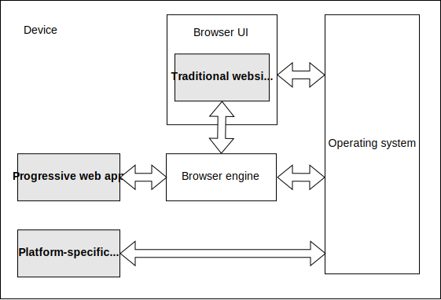

{{PWASidebar}}

A progressive web app (PWA) is an app that's built using web platform technologies, but that provides a user experience like that of a platform-specific app.

## Platform-specific apps

_Platform-specific apps_ are developed for a specific operating system (OS) and/or class of device, like an iOS or Android device, generally using an SDK provided by the platform vendor. They are usually distributed using the vendor's app store, where the user can find and install them, and they subsequently seem to the user like a permanent extra feature of their device, expanding its capabilities in some way.

The benefits of platform-specific apps include:

- **Easy for users to access**: They get their own icon on the device, making it easy for users to find and open them.
- **Offline and background operation**: They are able to operate when the user is not interacting with them and when the device is offline. This, for example, enables a chat app to receive messages when it is not open, and display a notification to the user. It also enables a news app to update in the background so it can show fresh content even if the device is offline.
- **Dedicated UI**: They can implement their own distinctive, immersive UI.
- **OS integration**: They can be integrated into the host OS: for example, a messaging app can register as a share target, enabling users to select an image in the photo app and send it using the messaging app. They can also access device features such as the camera, GPS or accelerometer.
- **App store integration**: They are distributed using the app store, giving users a single place to find them and a consistent way to decide whether they want to install them.

## Traditional websites

Traditionally, websites are less like "something the user has" and more like "somewhere the user visits". Typically, a website: does not have a presence on the user's device when the user is not accessing it, can only be accessed by the user opening the browser and navigating to the site, and is highly dependent on network connectivity.

However, websites have some benefits over platform-specific apps, including:

- **Single codebase**: Because the web is inherently cross-platform, a website can run on different operating systems and device classes from a single codebase.
- **Distribution via the web**: The web is a great distribution platform. Websites are indexed by search engines, and can be shared and accessed just using URLs. A website can be distributed with no need to sign up to any vendor's app store.

## Progressive web apps

Progressive web apps combine the best features of traditional websites and platform-specific apps.

PWAs have the benefits of websites, including:

- PWAs are developed using standard web platform technologies, so they can run on multiple operating systems and device classes from a single codebase.
- PWAs can be accessed directly from the web.

PWAs also have many of the benefits of platform-specific apps, including:

- [**PWAs can be installed on the device**](/en-US/docs/Web/Progressive_web_apps/Guides/Making_PWAs_installable). This means:

  - The PWA can be installed from platform's app store or installed directly from the web.
  - The PWA can be installed like a platform-specific app, and can customize the install process.
  - Once installed, the PWA gets an app icon on the device, alongside platform-specific apps.
  - Once installed, the PWA can be launched as a standalone app, rather than a website in a browser.

- [**PWAs can operate in the background and offline**](/en-US/docs/Web/Progressive_web_apps/Guides/Offline_and_background_operation): a typical website is only active while the page is loaded in the browser. A PWA can:

  - Work while the device does not have network connectivity.
  - Update content in the background.
  - Respond to [push messages](/en-US/docs/Web/API/Push_API) from the server.
  - Display notifications using the OS [notifications](/en-US/docs/Web/API/Notifications_API) system.

- PWAs can [use the whole screen](/en-US/docs/Web/Progressive_web_apps/How_to/Create_a_standalone_app), rather than running in the browser UI.
- PWAs can be integrated into the device, registering as share targets and sources, and accessing device features.
- PWAs can be distributed in app stores, as well as openly via the web.

### PWAs and the browser

When you visit a website in the browser, it's visually apparent that the website is "running in the browser". The browser UI provides a visible frame around the website, including UI features like back/forward buttons and a title for the page. The Web APIs your website calls are implemented by the browser engine.

PWAs typically look like platform-specific apps － they are usually displayed without the browser UI around them － but they are, as a matter of technology, still websites. This means they need a browser engine, like the ones in Chrome or Firefox, to manage and run them. With a platform-specific app, the platform OS manages the app, providing the environment in which it runs. With a PWA, a browser engine performs this background role, just like it does for normal websites.

In our documentation for PWAs, we sometimes refer to the browser playing this background role. We might say, for example, "The browser starts a PWA's service worker when a push notification is received." Here, the browser's activity is entirely in the background. From the PWA's point of view, it might as well be the operating system that started it. For some systems, such as Chromebooks, there may not even be a distinction between "the browser" and "the operating system."

### Technical features of PWAs

Because PWAs are websites, they have the same basic features as any other website: at least one HTML page, which very probably loads some CSS and JavaScript. Like a normal website, the JavaScript loaded by the page has a global {{domxref("Window")}} object and can access all the Web APIs that are available through that object.

Beyond that, a PWA has some additional features:

- A [web app manifest](/en-US/docs/Web/Manifest) file, which, at a minimum, provides information that the browser needs to install the PWA, such as the app name and icon.
- Optionally, a [service worker](/en-US/docs/Web/API/Service_Worker_API) to provide an offline experience.

#### Web app manifest

A PWA must have a web app manifest, and the [manifest must include enough information for the browser to install the PWA](/en-US/docs/Web/Progressive_web_apps/Guides/Making_PWAs_installable#the_web_app_manifest).

The manifest can define many other aspects of the PWA's appearance, such as [theme color](/en-US/docs/Web/Manifest/theme_color) and [background color](/en-US/docs/Web/Manifest/background_color), and its behavior, including its ability to [act as a share target](/en-US/docs/Web/Manifest/share_target) for data from other apps or to [handle particular file types](/en-US/docs/Web/Manifest/file_handlers).

#### Service worker

Although a PWA does not need a service worker to be installed, service workers are often used with PWAs in order to provide at least a minimal offline experience.

Service workers encourage an architecture in which the app's pages - that is, the traditional part of a website - implement the user interface, and the service worker implements a backend which can support [offline and background operation](/en-US/docs/Web/Progressive_web_apps/Guides/Offline_and_background_operation), making the PWA behave more like an app than a website. This is because service workers can be started by the browser in the background when they are needed (for example, to handle a push notification).

### PWAs and single-page apps

Traditionally a website is built as a collection of interlinked pages. When the user clicks a link from one page in the site to another page in the same site, the browser loads the new page as a completely new entity, including the HTML and the subresources that the HTML loads, like CSS and JavaScript. In a {{Glossary("SPA", "single-page app")}}, the site consists of a single HTML page, and when the user clicks internal links, this is handled by JavaScript fetching new content from the server and updating the relevant parts of the page.

Single-page apps can provide a user experience that is closer to platform-specific apps, so PWAs are often implemented as single-page apps. In particular, single-page apps make it easier to achieve a seamless user interface, in which the user is presented with a single, consistent page, and only the relevant parts of the page are updated as the user interacts with the app.

However, PWAs don't have to be single-page apps, and single-page apps don't have to be PWAs.

### Progressive enhancement

While {{Glossary("Progressive Enhancement", "progressive enhancement")}} is a desirable attribute for most websites, it is especially important for PWAs, which expect to run on a wide range of devices and often use advanced Web APIs which may not be supported by all browsers.

One basic component of progressive enhancement is that, if the user visits your PWA on the web by entering its URL in a browser, the user can interact with the app like a normal website. But if the browser can install it, the user will be prompted to install it and the app will appear as a new feature on their device.

PWAs should perform feature detection for advanced APIs and provide acceptable fallback experiences.

For example, the [Background Sync API](/en-US/docs/Web/API/Background_Synchronization_API) enables a PWA to ask a service worker to make a network request as soon as the device has connectivity. A classic use case for this is messaging. Suppose the user composes a message, but when the user tries to send the message, the device is offline. The Background Sync API enables the device to send the message in the background once the device is connected. On a device that does not support Background Sync, the app should let the user know the message could not be sent, giving them the chance to try again later.
