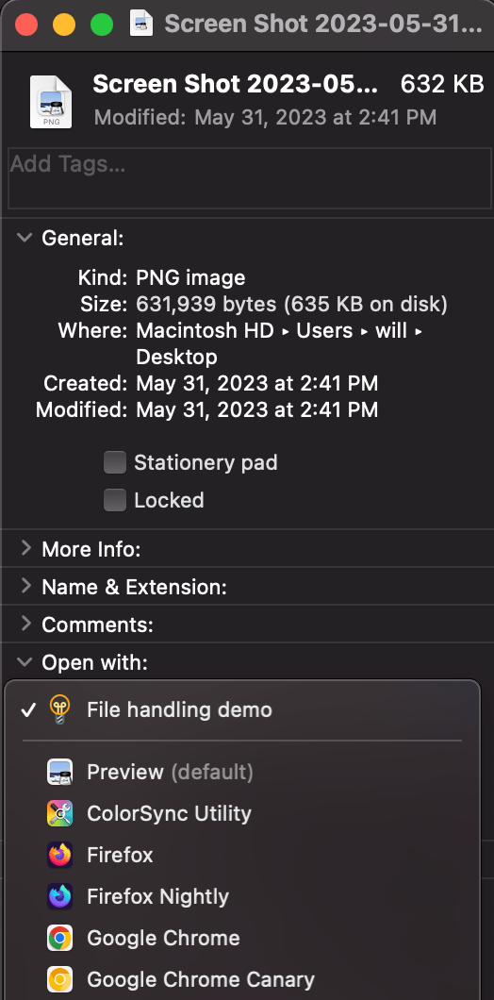
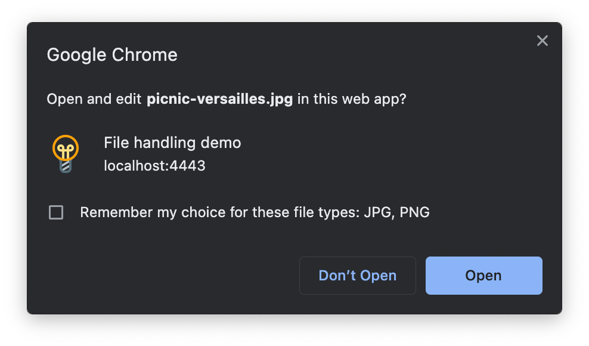

{{PWASidebar}}

On a device, files are usually associated with apps, so when the user opens the file, the operating system launches the appropriate app and passes the file to it. For example, HTML files are often opened in a web browser, text files in a text editor, and videos in a video player.

Progressive Web Apps can participate in this feature, so when the user clicks on files of specific types, the PWA may be launched to handle it.

There are two parts to adding support for file handling:

- Declare support for certain file types using the [`file_handlers`](/en-US/docs/Web/Manifest/file_handlers) web app manifest member.
- Handling files using the {{domxref("LaunchQueue")}} interface.

> **Note:** At present this feature is only available on Chromium-based browsers, and only on desktop operating systems.

## Declaring support for file types

To declare support for particular file types, include the [`file_handlers`](/en-US/docs/Web/Manifest/file_handlers) member in your [manifest file](/en-US/docs/Web/Manifest).

The `file_handlers` member is an array of file handler objects. Each file handler object has two mandatory properties, `action` and `accept`.

- The `accept` property contains {{Glossary("MIME_Type", "MIME types")}} and associated file extensions for files that the handler knows how to handle.
- The `action` property is a URL to which the PWA will navigate when the user opens the file. This page must be in the PWA's scope.

The manifest file below includes a `file_handlers` member with a single handler, which can handle {{Glossary("JPEG")}} and {{Glossary("PNG")}} files, and will navigate to the PWA's root page when the user clicks one of these files.

```json
{
  "name": "File handling demo",
  "icons": [
    {
      "src": "icons/lightbulb.png",
      "sizes": "512x512",
      "type": "image/png"
    }
  ],
  "start_url": "/",
  "display": "standalone",
  "file_handlers": [
    {
      "action": "/",
      "accept": {
        "image/jpeg": [".jpg", ".jpeg"],
        "image/png": [".png"]
      }
    }
  ]
}
```

With this manifest, once the PWA is installed, it may be opened when the user opens files of these types.

More than one app can usually open files of any given type, so the operating system usually provides a feature enabling the user to choose which app to use to open a file, and to set a default handler. For example, on macOS, the user can right-click a file, select "Get Info", and configure the default handler in the resulting dialog:



## Asking permission

The first time the browser is about to launch your PWA to handle one or more files that the user opened, it will ask the user to confirm that they want to use your PWA to open it. For example, the Chrome dialog looks like this:



## Handling the files

When the browser launches your PWA and navigates to the page you specified in the `action` property of the `file_handlers` manifest member, you'll need to run some code to handle the file. This code will run in the page that was specified in the `action` property.

The key interface here is {{domxref("LaunchQueue")}}, which is available as a property of the global {{domxref("Window")}} object.

The `LaunchQueue` interface has a single method, {{domxref("LaunchQueue/setConsumer", "setConsumer()")}}, which takes as an argument a callback function which will be called when the browser has launched the PWA with one or more files to handle.

The callback is passed a {{domxref("LaunchParams")}} object, which includes a {{domxref("LaunchParams/files", "files")}} property containing an array of {{domxref("FileSystemHandle")}} objects, each of which represents one of the files that the user opened.

For example, the code below reads the files and assigns their contents to {{HTMLElement("img")}} elements, which it adds to the page:

```js
const imageContainer = document.querySelector("#container");

if ("launchQueue" in window) {
  launchQueue.setConsumer(async (launchParams) => {
    for (const file of launchParams.files) {
      const img = document.createElement("img");
      img.src = URL.createObjectURL(await file.getFile());
      imageContainer.appendChild(img);
    }
  });
}
```

Note that the code checks that `launchQueue` exists before using it, to ensure the app behaves gracefully in browsers that don't support the API.

## See also

- [`file_handlers`](/en-US/docs/Web/Manifest/file_handlers) manifest member
- {{domxref("LaunchQueue")}} interface
- [File System Access API](/en-US/docs/Web/API/File_System_Access_API)
- [File API](/en-US/docs/Web/API/File_API)
- [Let installed web applications be file handlers](https://developer.chrome.com/articles/file-handling/) on web.dev (2022)
- [Handle files in Progressive Web Apps](https://learn.microsoft.com/en-us/microsoft-edge/progressive-web-apps-chromium/how-to/handle-files) on learn.microsoft.com (2023)
