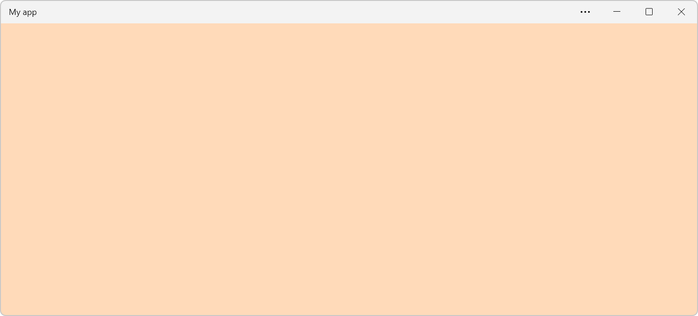
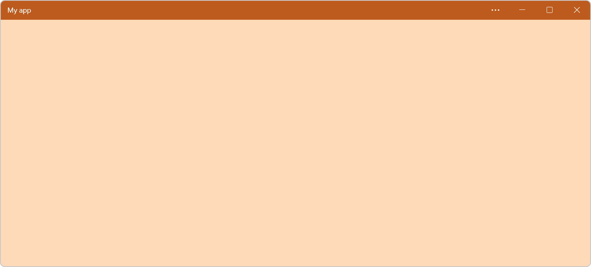

{{PWASidebar}}

When building [Progressive Web Apps (PWAs)](/en-US/docs/Web/Progressive_web_apps), it's important to not only consider the appearance of your app's content, but also the way the app appears on the user's device once the app is installed.

One way to customize the window in which your app appears is by using the [`theme_color`](/en-US/docs/Web/Manifest/Reference/theme_color) and [`background_color`](/en-US/docs/Web/Manifest/Reference/background_color) [web app manifest](/en-US/docs/Web/Manifest) members.

By defining the `theme_color` and `background_color` members in your PWA manifest, you can create a more polished experience for your users. These small details can help make your PWA feel more like an OS-native app, and more familiar to your users.

## Customize the app window background color

The [`background_color`](/en-US/docs/Web/Manifest/Reference/background_color) manifest member defines the color that appears in the application window before your app's stylesheets have loaded.

Because this color appears before your stylesheets have loaded, set its value to the same color value as the `background-color` CSS property in your application's stylesheet. This will ensure a smooth visual transition between launching the web application and loading its content.

The value can be any valid CSS [`<color>`](/en-US/docs/Web/CSS/color_value). In this web app manifest file example, the application's background color is set to the [named color](/en-US/docs/Web/CSS/named-color) `peachpuff`. :

```json
{
  "name": "My app",
  "start_url": "/",
  "icons": [
    {
      "src": "icon.webp",
      "sizes": "256x256",
      "type": "image/webp"
    }
  ],
  "display": "standalone",
  "background_color": "peachpuff"
}
```

The application also loads a stylesheet that applies the same color to the background of the body element:

```css
body {
  background-color: peachpuff;
}
```

The following screenshot shows the above code in action. The PWA that uses this code is installed on Windows, and the screenshot shows what the application window looks like before the content of the app has loaded:



## Define a theme color

The [`theme_color`](/en-US/docs/Web/Manifest/Reference/theme_color) member in your PWA manifest defines the default color of operating system and browser UI elements used in the application.

Different devices, operating systems, and browsers apply the `theme_color` member differently. For example:

- On mobile devices, the theme color is applied to the status bar.
- On desktop operating systems, the theme color is used to customize the title bar of your [standalone app window](/en-US/docs/Web/Progressive_web_apps/How_to/Create_a_standalone_app).

Choose a `theme_color` that complements the overall design and branding of your PWA and works well across a variety of devices and platforms to ensure a consistent user experience.

As with `background_color`, any [`<color>`](/en-US/docs/Web/CSS/color_value) value is valid. In this web app manifest file example, the `theme_color` is set to the `rgb(255 218 185)`, the [RGB](/en-US/docs/Web/CSS/color_value/rgb) equivalent of `peachpuff`:

```json
{
  "name": "My app",
  "start_url": "/",
  "icons": [
    {
      "src": "icon.webp",
      "sizes": "48x48",
      "type": "image/webp"
    }
  ],
  "display": "standalone",
  "background_color": "peachpuff",
  "theme_color": "rgb(255 218 185)"
}
```

The following screenshot shows the above code in action when the app is installed on Windows, where the `theme_color` manifest member is used as the color of the title bar:



### Relationship with the `theme-color` meta element value

The [`theme-color`](/en-US/docs/Web/HTML/Element/meta/name/theme-color) value for the [`name`](/en-US/docs/Web/HTML/Element/meta/name) attribute of the {{htmlelement("meta")}} HTML element can be used to define a theme color per webpage. This is different from the `theme_color` manifest member which you define only once, globally, for your app.

If both are set, the `theme-color` meta element value overrides the `theme_color` manifest member. This lets you define a global color for your app and override it on specific pages.

Note that on some browsers, like Safari on macOS and Chrome on Android, the `theme-color` meta element value is used to style the browser UI too.

## See also

- [Web App Manifests](/en-US/docs/Web/Manifest).
- [Meta Theme Color and Trickery on css-tricks.com](https://css-tricks.com/meta-theme-color-and-trickery/) (2021)
- [Recommended fields on web.dev](https://web.dev/learn/pwa/web-app-manifest#recommended_fields)
