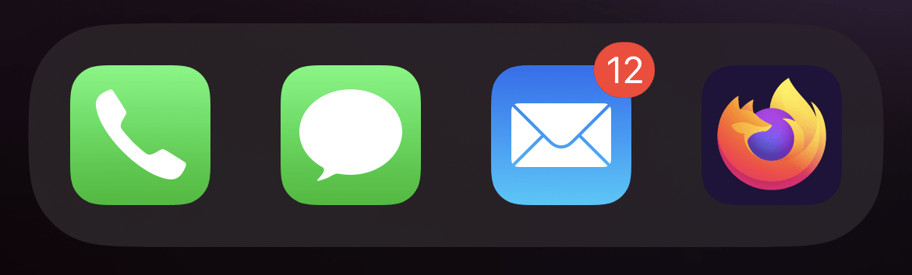

Applications native to mobile and desktop operating systems can display badges on top of their app icons to inform users that new content is available. For example, an email client application can display the total number of unread messages in a badge and update this number even if the app is not running.

Here is an example showing the Mail application on an iOS device with a badge in its top right corner:



[Progressive Web Apps](/en-US/docs/Web/Progressive_web_apps) (PWAs) can display and update badges on their app icons too.

Displaying and updating a badge is done by using the [Badging API](/en-US/docs/Web/API/Badging_API). You can call this API from the app's [service worker](/en-US/docs/Web/API/Service_Worker_API/Using_Service_Workers), to display or update the badge even when the app is not running.

## Support for badges

App badges are only supported when a PWA is installed on its host operating system. Badges appear on the app icon which only exists after the app has been installed.

> **Note:** This article focuses on the {{domxref("Navigator.setAppBadge()")}} and {{domxref("Navigator.clearAppBadge()")}} methods from the Badging API and ignores the `Navigator.setClientBadge` and `Navigator.clearClientBadge`. Although these methods are defined in the [Badging API specification](https://w3c.github.io/badging/) too, they are for displaying badges on documents, not on application icons.

### Desktop support

On desktop operating systems, badges are only supported on Windows and macOS, and only when the PWA is installed from Chrome or Edge. While the Badging API is supported on Chromium-based browsers on Linux, badges are not displayed on this operating system.

Safari and Firefox on desktop do not support the Badging API and do not support installing PWAs.

### Mobile support

On mobile operating systems, badges are supported on Chromium-based browsers running on Android.

## Badge best practices

Before learning how to use badges, consider these best practices to ensure your app uses badges in the most effective and useful way for your users.

### Check for support

To ensure the Badging API is [supported](#support-for-badges) in the user's browser and operating system, to prevent throwing a JavaScript error, check for support before using the API:

```javascript
if (navigator.setAppBadge) {
  // The API is supported, use it.
} else {
  // The API is not supported, don't use it.
}
```

Do not rely solely on badges to inform users about the availability of new content. Browsers that support the Badging API may be installed on operating systems that do not support displaying a badge. For example, while Chrome supports the Badging API, badges will not appear on installed application icons on Linux.

### Use badges sparingly

Like notifications, badges can be a very effective way to re-engage users with your app when used sparingly. Make sure to use badges to only signal new content that's important for your users to know about.

### Update badges in real-time

Make sure to update your application badge in real-time. This means updating the badge count to reflect how many new items are actually left for the user to consume, and clearing the app badge when there are no new items.

For example, if an email client app receives new messages in the background, it should update its badge to display the right number of unread messages in the inbox, potentially filtering out messages from other folders such as a spam folder. It's possible to [update badges in the background](#updating-the-badge-in-the-background) by using the `navigator.setAppBadge()` method from a service worker.

Once the user launches the app and starts reading messages, the email client app should update its badge accordingly by calling `navigator.setAppBadge()` with the new unread messages count, or by calling `navigator.clearAppBadge()` when there are no unread messages.

### Highlight new content in the app

When your app receives new content and adds a badge on the app icon, make sure to highlight that new content for users when they launch the app.

For example, if an email client app displays the unread messages count on the app icon badge, then those messages should be bolded or highlighted in some way when the app is opened.

## Displaying and updating the badge

To display a badge on your PWA's app icon that shows a number of unread messages, use the {{domxref("Navigator.setAppBadge()")}} method:

```javascript
// Check for support first.
if (navigator.setAppBadge) {
  // Display the number of unread messages.
  navigator.setAppBadge(numberOfUnreadMessages);
}
```

You can also display an empty badge using the same method by omitting the count parameter, or setting it to `0`:

```javascript
// Check for support first.
if (navigator.setAppBadge) {
  // Just display the badge, with no number in it.
  navigator.setAppBadge();
}
```

To remove the badge on the app icon, use the {{domxref("Navigator.clearAppBadge()")}} method:

```javascript
// Check for support first.
if (navigator.clearAppBadge) {
  // Remove the badge on the app icon.
  navigator.clearAppBadge();
}
```

## Updating the badge in the background

Badges can be useful to re-engage users with your app when they're not already using the app. This means that your app must be able to update its badge even when it's not running.

PWAs can use the following mechanisms to update in the background and display, update, or hide their badges:

- [Push API](/en-US/docs/Web/API/Push_API)
  - : PWAs can use this API to receive messages from a server even when the app is not running.
- [Background Synchronization API](/en-US/docs/Web/API/Background_Synchronization_API)
  - : PWAs can use this API to run code in the background when a stable network connection is detected.
- [Web Periodic Background Synchronization API](/en-US/docs/Web/API/Web_Periodic_Background_Synchronization_API)
  - : PWAs can use this API to run code in the background at periodic intervals of time.

Here is a service worker code example showing how to listen to a server's Push messages and update the app badge to reflect an unread messages count:

```javascript
// Listen to "push" events in the service worker.
self.addEventListener("push", (event) => {
  // Extract the unread count from the push message data.
  const message = event.data.json();
  const unreadCount = message.unreadCount;

  // Set or clear the badge.
  if (navigator.setAppBadge) {
    if (unreadCount && unreadCount > 0) {
      navigator.setAppBadge(unreadCount);
    } else {
      navigator.clearAppBadge();
    }
  }
});
```

## See also

- [How to create an app badge](https://web.dev/patterns/advanced-apps/badges/)
- [Re-engage users with badges, notifications, and push messages](https://learn.microsoft.com/microsoft-edge/progressive-web-apps-chromium/how-to/notifications-badges)
- [Codelab: Build a push notification server](https://web.dev/push-notifications-server-codelab/)
